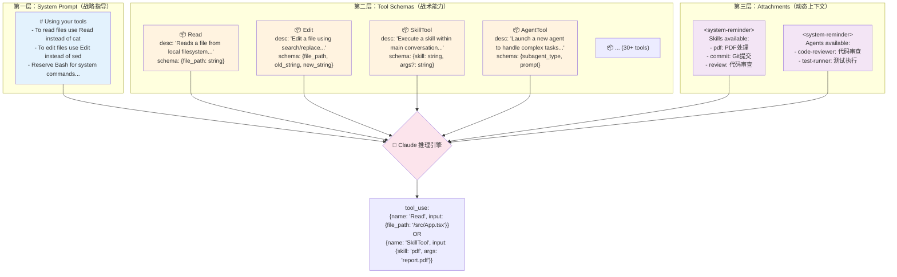
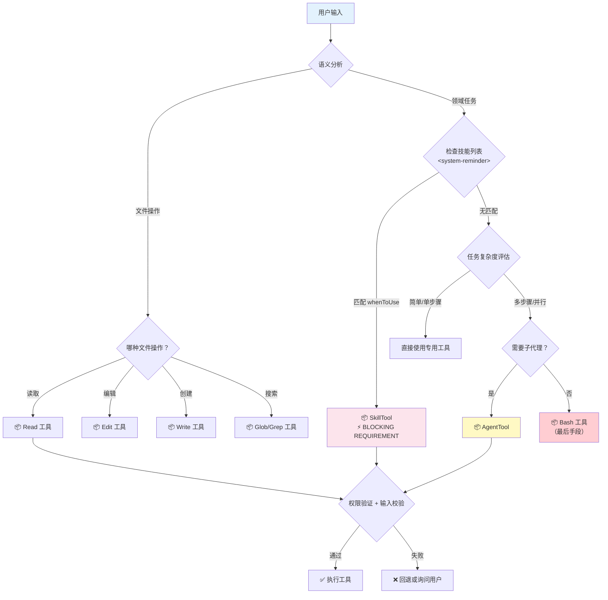
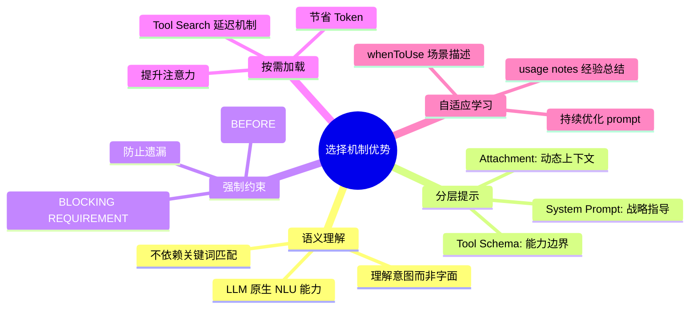
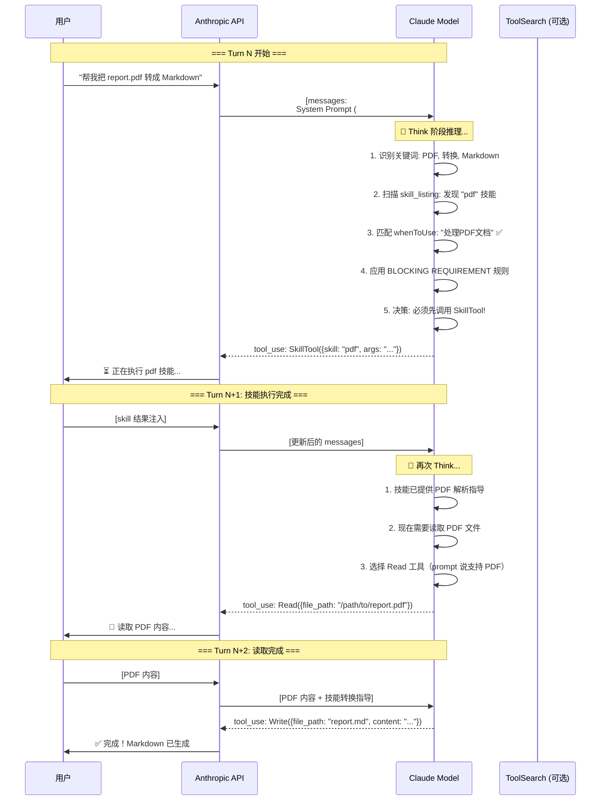

# 🧠 Think 阶段的工具/技能选择机制深度剖析

## 🎯 核心答案：这不是"过滤"，而是**多层级语义匹配与推理**

> **Claude 并不执行传统的"过滤算法"，而是通过精心设计的多层提示工程（Prompt Engineering），让模型自身在 Think 阶段基于语义理解做出智能选择决策。**

---

## 📐 一、整体架构：三层信息注入模型



---

## 🔧 二、工具（Tool）选择机制详解

### 2.1 工具的"双重身份"

每个工具在 API 中以 **两个关键字段** 呈现给模型：

| 字段              | 来源            | 作用                       | 示例                              |
| ----------------- | --------------- | -------------------------- | --------------------------------- |
| **`name`**        | `tool.name`     | 唯一标识符                 | `"Read"`, `"Bash"`, `"SkillTool"` |
| **`description`** | `tool.prompt()` | **详细使用指导**（关键！） | 见下方示例                        |

### 2.2 关键发现：`description` = `prompt()` 而非简短描述！

**代码位置**：[api.ts 第 169-178 行](file:///Users/ray/workspaces/ai-ecosystem/cludecode/utils/api.ts#L169-L178)

```typescript
base = {
  name: tool.name,
  description: await tool.prompt({  // 🔑 使用 prompt() 而非 description()！
    getToolPermissionContext: options.getToolPermissionContext,
    tools: options.tools,
    agents: options.agents,
    allowedAgentTypes: options.allowedAgentTypes,
  }),
  input_schema,  // JSON Schema 参数定义
}
```

**这意味着什么？**

模型的工具选择基于的是 **完整的、详细的 prompt 文本**，而非一句话描述！

### 2.3 实例对比：FileReadTool

#### ❌ 如果只用 `description()`
```json
{
  "name": "Read",
  "description": "Read a file from the local filesystem.",
  "input_schema": {
    "type": "object",
    "properties": {
      "file_path": {"type": "string"},
      "offset": {"type": "number"},
      "limit": {"type": "number"}
    }
  }
}
```
→ 信息量太少，模型难以判断何时该用！

#### ✅ 实际使用 `prompt()` 
```json
{
  "name": "Read",
  "description": "Reads a file from the local filesystem. You can access any file directly by using this tool.\n\nUsage:\n- The file_path parameter must be an absolute path, not a relative path\n- By default, it reads up to 2000 lines starting from the beginning of the file\n- You can optionally specify a line offset and limit (especially handy for long files)\n- Results are returned using cat -n format, with line numbers starting at 1\n- This tool allows Claude Code to read images (eg PNG, JPG, etc). When reading an image file the contents are presented visually as Claude Code is a multimodal LLM.\n- This tool can read PDF files (.pdf). For large PDFs (more than 10 pages), you MUST provide the pages parameter...\n- This tool can only read files, not directories. To read a directory, use an ls command via the Bash tool.\n- You will regularly be asked to read screenshots. If the user provides a path to a screenshot, ALWAYS use this tool...",
  "input_schema": {...}
}
```
→ **丰富的语义信息让模型能精准判断！**

### 2.4 System Prompt 中的"工具使用宪法"

**位置**：[prompts.ts 第 291-313 行](file:///Users/ray/workspaces/ai-ecosystem/cludecode/constants/prompts.ts#L291-L313)

```markdown
# Using your tools

Do NOT use the Bash tool to run commands when a relevant dedicated tool is provided. Using dedicated tools allows the user to better understand and review your work. This is CRITICAL to assisting the user:
- To read files use Read instead of cat, head, tail, or sed
- To edit files use Edit instead of sed or awk
- To create files use Write instead of cat with heredoc or echo redirection
- To search for files use Glob instead of find or ls
- To search the content of files, use Grep instead of grep or rg
- Reserve using the Bash tool exclusively for system commands and terminal operations that require shell execution...

You can call multiple tools in a single response. If you intend to call multiple tools and there are no dependencies between them, make all independent tool calls in parallel...
```

**这段提示的作用**：
1. ✅ **优先级规则**：专用工具 > Bash 通用工具
2. ✅ **场景映射**：读文件 → Read，编辑 → Edit，搜索 → Glob/Grep
3. ✅ **并行策略**：鼓励同时调用多个独立工具

---

## 🎯 三、技能（Skill）选择机制详解

### 3.1 技能的"四维识别特征"

每个技能通过四个字段向模型传递语义信号：

| 字段               | 示例                      | 作用                   |
| ------------------ | ------------------------- | ---------------------- |
| **`name`**         | `"pdf"`, `"commit"`       | 短标识符，用于精确匹配 |
| **`description`**  | `"PDF 文档处理工具"`      | 功能概述               |
| **`whenToUse`**    | *"当需要处理 PDF 文档时"* | **核心！场景触发条件** |
| **`argumentHint`** | `"[文件路径]"`            | 参数格式提示           |

### 3.2 技能列表的呈现方式

**位置**：[attachments.ts 第 2732-2737 行](file:///Users/ray/workspaces/ai-ecosystem/cludecode/utils/messages.ts#L3728-L3738) → [SkillTool/prompt.ts](file:///Users/ray/workspaces/ai-ecosystem/cludecode/tools/SkillTool/prompt.ts#L173-L195)

最终注入给模型的内容：

```xml
<system-reminder>
The following skills are available for use with the Skill tool:

- pdf: PDF 文档处理 - 当用户需要处理、分析或转换PDF文档时 (当需要处理PDF文档时)
- commit: Git 提交助手 - 创建符合规范的git提交 (当需要提交代码时)
- review: PR 代码审查 - 全面审查Pull Request (当需要审查PR时)
- test: 测试运行器 - 执行测试并报告结果 (当写完代码后运行测试时)
- refactor: 代码重构 - 安全地重构代码结构 (当需要重构代码时)
...
</system-reminder>
```

### 3.3 SkillTool 自身的 Prompt：强制性匹配指令

**位置**：[SkillTool/prompt.ts 第 173-196 行](file:///Users/ray/workspaces/ai-ecosystem/cludecode/tools/SkillTool/prompt.ts#L173-L196)

```typescript
export const getPrompt = memoize(async () => {
  return `Execute a skill within the main conversation

When users ask you to perform tasks, check if any of the available skills match. 
Skills provide specialized capabilities and domain knowledge.

When users reference a "slash command" or "/<something>" (e.g., "/commit", "/review-pr"), 
they are referring to a skill. Use this tool to invoke it.

How to invoke:
- Use this tool with the skill name and optional arguments
- Examples:
  - \`skill: "pdf"\` - invoke the pdf skill
  - \`skill: "commit", args: "-m 'Fix bug'"\` - invoke with arguments

Important:
- Available skills are listed in system-reminder messages in the conversation
- When a skill matches the user's request, this is a BLOCKING REQUIREMENT: 
  invoke the relevant Skill tool BEFORE generating any other response about the task
- NEVER mention a skill without actually calling this tool
- Do not invoke a skill that is already running
- Do not use this tool for built-in CLI commands (like /help, /clear, etc.)
`
})
```

**关键指令解析**：

| 指令                                       | 强度   | 作用                       |
| ------------------------------------------ | ------ | -------------------------- |
| **`check if any skills match`**            | 建议   | 触发匹配检查               |
| **`BLOCKING REQUIREMENT`**                 | ⚡ 强制 | 匹配时必须先调用，不能跳过 |
| **`BEFORE generating any other response`** | ⚡ 时序 | 必须在其他动作之前         |
| **`NEVER mention without calling`**        | 禁止   | 防止"虚假推荐"             |

---

## 🧠 四、模型的实际推理过程（思维模拟）

### 场景：用户输入 *"帮我把这个 PR 的 PDF 报告转成 Markdown"*
        
            
toolName: Write
            
status: success
          
            
filePath: /Users/ray/workspaces/ai-ecosystem/mindx-doc/docs/think-process-simulation.md
          
changes: undefined
          
---

## ⚡ 五、高级特性：Tool Search（延迟加载）机制

### 5.1 问题背景

当 MCP 工具很多时，把所有工具的完整 schema 都发给模型会：
- **消耗大量 tokens**（每个 MCP 工具可能有 2-5KB 的 schema）
- **超出 context window 限制**
- **降低模型注意力**（太多选择导致决策质量下降）

### 5.2 解决方案：Deferred Tools（延迟加载工具）

**核心思想**：常用工具立即加载，不常用的工具只发送名称，需要时再按需获取 schema。

```mermaid
graph LR
    subgraph Immediate["立即可用 (Turn 0)"]
        I1["Read ✅"]
        I2["Write ✅"]
        I3["Edit ✅"]
        I4["Bash ✅"]
        I5["SkillTool ✅"]
        I6["AgentTool ✅"]
        I7["ToolSearch ✅"]  <!-- 用于加载延迟工具 -->
    end
    
    subgraph Deferred["延迟加载 (按需获取)"]
        D1["mcp__slack__send_message ❌"]
        D2["mcp__jira__create_ticket ❌"]
        D3["mcp__github__create_pr ❌"]
        D4["custom_plugin_tool ❌"]
    end
    
    Immediate --> API["发送给 Claude API"]
    Deferred --> NameOnly["只发送名称列表"]
    NameOnly --> Model{"模型判断需要时"}
    Model -->|"调用 ToolSearch"| TS["ToolSearch 工具"]
    TS -->|"<functions> 返回完整 schema"| Model
    Model -->|"现在可以调用"| D1
    
    style I1 fill:#c8e6c9
    style I7 fill:#fff9c4
    style D1 fill:#ffcdd2
```

### 5.3 实现细节

**判断是否延迟**：[ToolSearchTool/prompt.ts 第 62-108 行](file:///Users/ray/workspaces/ai-ecosystem/cludecode/tools/ToolSearchTool/prompt.ts#L62-L108)

```typescript
export function isDeferredTool(tool: Tool): boolean {
  // 永远不延迟的工具
  if (tool.alwaysLoad === true) return false
  
  // MCP 工具总是延迟（工作流特定）
  if (tool.isMcp === true) return true
  
  // ToolSearch 自身不能延迟
  if (tool.name === TOOL_SEARCH_TOOL_NAME) return false
  
  // AgentTool 在 fork 模式下不能延迟
  if (feature('FORK_SUBAGENT') && tool.name === AGENT_TOOL_NAME) {
    return !isForkSubagentEnabled()
  }
  
  // 其他工具根据 shouldDefer 标记决定
  return tool.shouldDefer === true
}
```

**API 发送格式差异**：

```json
// 立即可用的工具 - 完整 schema
{
  "name": "Read",
  "description": "Reads a file from the local filesystem...",
  "input_schema": {
    "type": "object",
    "properties": {
      "file_path": {"type": "string"},
      "offset": {"type": "number"}
    }
  }
}

// 延迟加载的工具 - 只有名称
{
  "name": "mcp__slack__send_message",
  "description": "",
  "input_schema": {"type": "object", "properties": {}},
  "defer_loading": true  // 🔑 关键标记！
}
```

### 5.4 ToolSearch 的使用流程

当模型需要使用延迟工具时：

```xml
<!-- 用户请求：帮我在 Slack 发送消息 -->

<!-- 模型思考：我需要 Slack 工具，但它的 schema 是延迟的 -->
<function_call>
<invoke name="ToolSearch">
<parameter name="query">select:mcp__slack__send_message</parameter>
</invoke>
</function_call>

<!-- API 返回 -->
<function>
{"name":"mcp__slack__send_message","description":"Send a message to a Slack channel","parameters":{"type":"object","properties":{"channel":{"type":"string"},"message":{"type":"string"}}}}
</function>

<!-- 现在模型有了完整 schema，可以正常调用 -->
<function_call>
<invoke name="mcp__slack__send_message">
<parameter name="channel">#general</parameter>
<parameter name="message>Hello from Claude!</parameter>
</invoke>
</function_call>
```

---

## 🎯 六、选择机制的"优先级链"

### 6.1 完整决策树



### 6.2 具体示例矩阵

| 用户输入            | 主要触发词 | 首选工具                                              | 备选方案           | 原因           |
| ------------------- | ---------- | ----------------------------------------------------- | ------------------ | -------------- |
| *"看看 App.tsx"*    | 文件路径   | `Read`                                                | 无                 | 直接读取       |
| *"把 foo 改成 bar"* | 修改内容   | `Edit`                                                | 无                 | 文本替换       |
| *"提交这些改动"*    | Git 操作   | `SkillTool("commit")`                                 | `Bash(git commit)` | 技能更专业     |
| *"审查这个 PR"*     | PR 审查    | `SkillTool("review")` 或 `AgentTool("code-reviewer")` | 取决于复杂度       | 多步骤任务     |
| *"运行测试"*        | 测试       | `SkillTool("test")` 或 `Bash(npm test)`               | 看项目配置         | 可能有专用技能 |
| *"发消息到 Slack"*  | Slack      | `ToolSearch` → `mcp__slack*`                          | 延迟加载           | MCP 工具       |
| *"重构这个模块"*    | 重构       | `SkillTool("refactor")`                               | `AgentTool`        | 复杂多步骤     |
| *"帮我写个函数"*    | 编码       | 直接编码                                              | 可能用 `AgentTool` | 视复杂度       |

---

## 📊 七、为什么这种设计有效？

### 7.1 对比：传统 RAG vs Claude Code 方式

| 维度           | 传统 RAG 系统         | Claude Code 的方式                 |
| -------------- | --------------------- | ---------------------------------- |
| **选择算法**   | 向量相似度 + 规则引擎 | LLM 原生语义理解                   |
| **信息来源**   | 外部知识库检索        | 内嵌在 System Prompt / Tool Schema |
| **灵活性**     | 需要预定义规则        | 自然语言理解，适应性强             |
| **可解释性**   | 黑箱匹配分数          | 推理过程可见（thinking block）     |
| **上下文感知** | 有限                  | 完整对话历史 + 动态 attachments    |

### 7.2 设计优势总结



---

## 🔄 八、完整数据流：从用户输入到工具调用



---

## 💡 九、关键洞察与最佳实践

### 9.1 对于开发者：如何让工具/技能更容易被选中？

#### **工具（Tool）设计要点**

```typescript
// ✅ 好的 prompt() 设计
async prompt() {
  return `
用途简述（一句话）

详细使用场景（when to use）：
- 场景1: 具体描述
- 场景2: 具体描述

何时不用此工具（when NOT to use）：
- 不适合的情况1
- 不适合的情况2

参数说明：
- param1: 详细解释何时用什么值
- param2: 约束条件

使用示例：
- 示例1: 典型用法
- 示例2: 边界情况

与其他工具的关系：
- 与 XX 工具配合使用
- 优先于此工具而非 YY 工具的场景
`
}
```

#### **技能（Skill）设计要点**

```markdown
---
description: 一句话功能概述
when_to_use: |
  精确的使用场景描述，包含：
  - 触发关键词（用户可能说的词）
  - 适用条件（前置条件）
  - 典型用例（3-5个例子）
argument_hint: "[可选参数格式]"
---
```

### 9.2 对于用户：如何让 Claude 更准确地选择？

| 技巧             | 示例                             | 效果               |
| ---------------- | -------------------------------- | ------------------ |
| **明确提及格式** | *"转成 **Markdown** 格式"*       | 触发 Write 工具    |
| **使用领域术语** | *"**提交** 这些改动"*            | 触发 commit 技能   |
| **指定输出位置** | *"写入 **src/report.md**"*       | 明确 Write 路径    |
| **说明复杂度**   | *"这是一个**复杂的多步骤**任务"* | 触发 AgentTool     |
| **引用斜杠命令** | *"运行 **/test**"*               | 直接触发 SkillTool |

---

## 🎯 十、最终答案

### 回答你的问题

> **Claude 在 Think 过程中是如何过滤/选择工具和技能的？**

**答案：这不是传统的"过滤"，而是基于三层信息的语义推理过程**：

1. **第一层 - System Prompt（战略层）**  
   → 定义了工具使用的"宪法"：优先级、场景映射、并行策略

2. **第二层 - Tool Schema（战术层）**  
   → 每个 `prompt()` 方法提供的**详细使用指南**（不是一句话描述！）告诉模型：
   - 这个工具能做什么
   - 什么时候该用它
   - 什么时候不该用它
   - 参数怎么填

3. **第三层 - Attachment（动态上下文层）**  
   → `<system-reminder>` 注入的技能列表包含：
   - `name`: 快速标识
   - `description`: 功能概述
   - `whenToUse`: **精确的场景触发条件**

**模型的决策过程**：
- 基于 LLM 原生的自然语言理解能力
- 在 Think 阶段综合分析三层信息
- 结合用户输入的语义进行匹配
- 应用强制规则（如 BLOCKING REQUIREMENT）
- 输出最优的工具/技能调用序列

**这种设计的精妙之处**：
- ✅ **无需显式的分类器/路由器** - LLM 本身就是最好的分类器
- ✅ **无需维护匹配规则** - 自然语言描述即规则
- ✅ **自适应新工具/技能** - 只需添加新的 prompt/description
- ✅ **可解释性强** - thinking block 展示推理过程

如果你还想深入了解：
1. **如何调试和监控模型的工具选择过程？**
2. **Tool Search 延迟加载的性能影响？**
3. **如何自定义工具选择的优先级策略？**

请告诉我！🚀