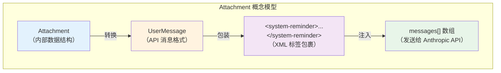
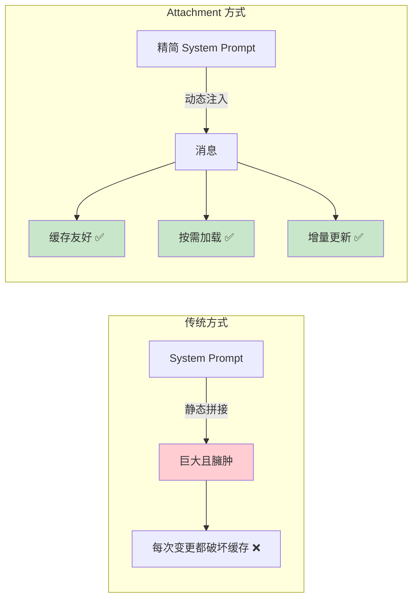
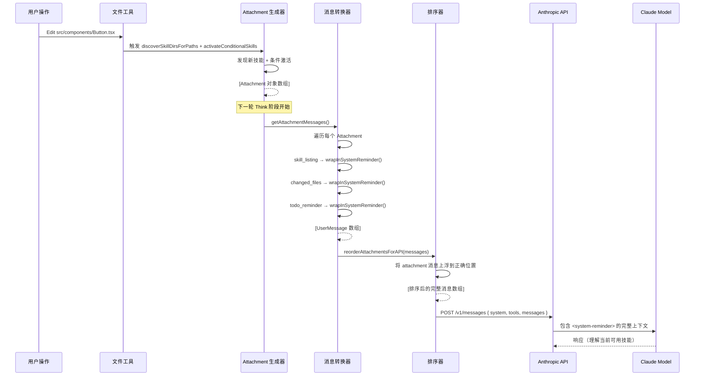
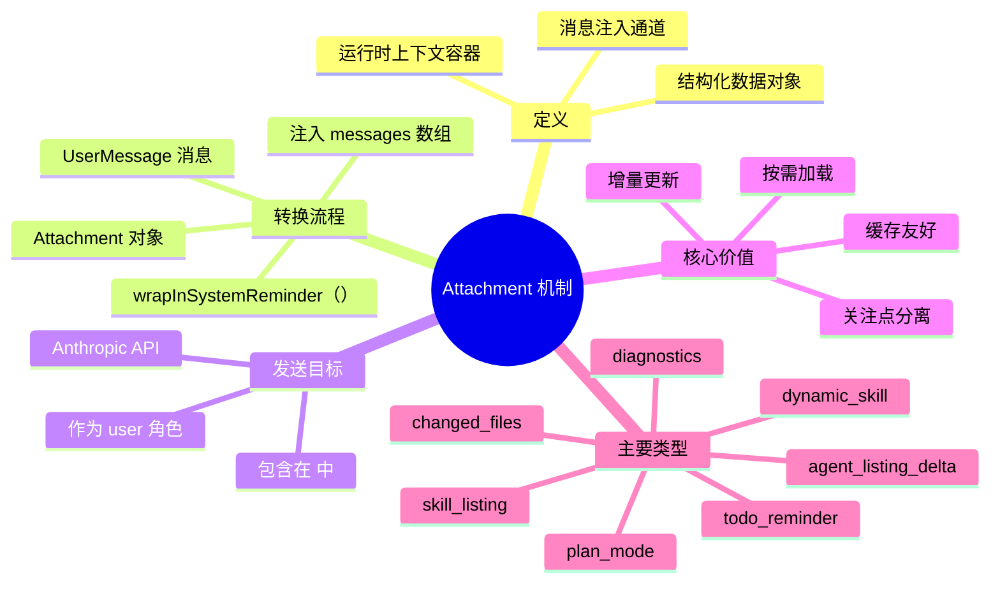

# 📎 Attachment 机制深度解析：不仅是"附件"，而是 **上下文注入通道**

## 🎯 一句话回答

> **是的，Attachment 就是字面意义上的"附加到 LLM 请求中发送给 LLM 的内容"！**
> 
> 但它**不是文件附件**，而是一种**结构化的上下文注入机制**，将运行时动态信息包装成 `<system-reminder>` 消息发送给 AI 模型。

---

## 🔍 二、Attachment 的本质：Message Attachment（消息附件）

### 2.1 类型定义全景图

**代码位置**：[attachments.ts 第 440-613 行](file:///Users/ray/workspaces/ai-ecosystem/cludecode/utils/attachments.ts#L440-L613)

```typescript
export type Attachment =
  // ========== 文件相关 ==========
  | FileAttachment                    // 用户 @ 提及的文件内容
  | CompactFileReferenceAttachment    // 紧凑的文件引用
  | PDFReferenceAttachment            // PDF 文件引用
  | AlreadyReadFileAttachment         // 已读取过的文件
  | { type: 'edited_text_file' }     // 被编辑的文本文件
  | { type: 'edited_image_file' }    // 被编辑的图片文件
  | { type: 'directory' }            // 目录列表
  | { type: 'selected_lines_in_ide' } // IDE 中选中的行
  
  // ========== 技能系统（我们关注的！） ==========
  | { type: 'skill_listing' }        // ⭐ 技能列表
  | { type: 'dynamic_skill' }        // ⭐ 动态发现的技能
  | { type: 'skill_discovery' }      // ⭐ 技能发现结果
  
  // ========== 任务与记忆 ==========
  | { type: 'todo_reminder' }        // Todo 列表提醒
  | { type: 'task_reminder' }        // 任务提醒
  | { type: 'nested_memory' }        // 嵌套记忆文件
  | { type: 'relevant_memories' }    // 相关记忆
  
  // ========== 系统状态 ==========
  | { type: 'plan_mode' }            // 计划模式状态
  | { type: 'output_style' }        // 输出风格
  | { type: 'diagnostics' }          // IDE 诊断信息
  | { type: 'queued_command' }       // 排队的命令
  | { type: 'command_permissions' }  // 命令权限
  | { type: 'agent_listing_delta' }  // 代理列表增量更新
  // ... 还有更多
```

### 2.2 核心洞察



---

## 🔄 三、完整生命周期：从创建到发送给 LLM

### 3.1 阶段一：创建（生成 Attachment 对象）

**以 `skill_listing` 为例**：

**位置**：[attachments.ts 第 2743-2750 行](file:///Users/ray/workspaces/ai-ecosystem/cludecode/utils/attachments.ts#L2743-L2750)

```typescript
// getSkillListingAttachments() 函数返回：
return [
  {
    type: 'skill_listing',           // ← Attachment 类型标识
    content: `- pdf: PDF 处理技能\n- commit: Git 提交技能\n...`,
    skillCount: 25,                  // 元数据
    isInitial: true,                 // 是否首次加载
  }
]
```

**这是纯数据对象，还不是 API 消息！**

### 3.2 阶段二：转换（Attachment → Message）

**位置**：[messages.ts 第 3728-3738 行](file:///Users/ray/workspaces/ai-ecosystem/cludecode/utils/messages.ts#L3728-L3738)

```typescript
case 'skill_listing': {
  if (!attachment.content) {
    return []  // 空内容 → 不生成消息
  }
  
  // 🔑 关键转换步骤：
  return wrapMessagesInSystemReminder([
    createUserMessage({
      content: `The following skills are available for use with the Skill tool:\n\n${attachment.content}`,
      isMeta: true,  // 标记为元数据消息（非用户直接输入）
    }),
  ])
}
```

**`wrapMessagesInSystemReminder` 做了什么？**

**位置**：[messages.ts 第 3101-3127 行](file:///Users/ray/workspaces/ai-ecosystem/cludecode/utils/messages.ts#L3101-L3127)

```typescript
export function wrapMessagesInSystemReminder(messages: UserMessage[]): UserMessage[] {
  return messages.map(msg => {
    if (typeof msg.message.content === 'string') {
      return {
        ...msg,
        message: {
          ...msg.message,
          content: wrapInSystemReminder(msg.message.content),  // 🎯 核心！
        },
      }
    }
    // ...
  })
}

function wrapInSystemReminder(content: string): string {
  return `<system-reminder>\n${content}\n</system-reminder>`  // XML 包装
}
```

**转换结果示例**：

```xml
<!-- 输入：Attachment 对象 -->
{
  type: 'skill_listing',
  content: '- pdf: PDF处理\n- commit: Git提交'
}

<!-- 输出：UserMessage（可发送给 API） -->
{
  type: 'user',
  message: {
    role: 'user',
    content: "<system-reminder>\nThe following skills are available for use with the Skill tool:\n\n- pdf: PDF处理\n- commit: Git提交\n</system-reminder>",
    isMeta: true
  }
}
```

### 3.3 阶段三：排序与注入（插入消息流）

**位置**：[messages.ts 第 1481-1527 行](file:///Users/ray/workspaces/ai-ecosystem/cludecode/utils/messages.ts#L1481-L1527)

```typescript
export function reorderAttachmentsForAPI(messages: Message[]): Message[] {
  const result: Message[] = []
  const pendingAttachments: AttachmentMessage[] = []

  // 从底部向上扫描
  for (let i = messages.length - 1; i >= 0; i--) {
    const message = messages[i]!

    if (message.type === 'attachment') {
      // 收集 attachment（待上浮）
      pendingAttachments.push(message)
    } else {
      // 检查是否是停止点（assistant 消息或 tool_result）
      const isStoppingPoint =
        message.type === 'assistant' ||
        (message.type === 'user' && /* 是 tool_result */)

      if (isStoppingPoint && pendingAttachments.length > 0) {
        // 遇到停止点 → attachment 停在这里（插入到停止点之后）
        for (const att of pendingAttachments) {
          result.push(att)
        }
        result.push(message)
        pendingAttachments.length = 0
      } else {
        result.push(message)
      }
    }
  }

  // 剩余的 attachment 冒泡到最顶部
  for (const att of pendingAttachments) {
    result.push(att)
  }

  result.reverse()
  return result
}
```

**排序策略可视化**：

```mermaid
graph TD
    subgraph Before["原始顺序"]
        M1["System Prompt"]
        M2["User: 帮我看看 App.tsx"]
        M3["Assistant: 让我读取文件"]
        M4["User (tool_result): 文件内容"]
        M5["📎 skill_listing (新发现的技能)"]
        M6["📎 dynamic_skill (UI组件技能)"]
        M7["📎 changed_files (变更文件)"]
    end
    
    subgraph After["reorderAttachmentsForAPI 后"]
        N1["System Prompt"]
        N2["User: 帮我看看 App.tsx"]
        N3["Assistant: 让我读取文件"]
        N4["User (tool_result): 文件内容"]
        N5["📎 skill_listing"]     ← 上浮到 tool_result 后面
        N6["📎 dynamic_skill"]
        N7["📎 changed_files"]
    end
    
    Before --> After
    
    style M5 fill:#ffcdd2
    style M6 fill:#ffcdd2
    style M7 fill:#ffcdd2
    style N5 fill:#c8e6c9
    style N6 fill:#c8e6c9
    style N7 fill:#c8e6c9
```

### 3.4 阶段四：发送（注入到 API 请求）

**位置**：[query.ts 第 1580-1590 行](file:///Users/ray/workspaces/ai-ecosystem/cludecode/query.ts#L1580-L1590)

```typescript
// 在主查询循环中
for await (const attachment of getAttachmentMessages(
  null,
  updatedToolUseContext,
  null,
  queuedCommandsSnapshot,
  [...messagesForQuery, ...assistantMessages, ...toolResults],  // 传入历史消息
  querySource,
)) {
  yield attachment          // 🔑 yield 出去，加入消息流
  toolResults.push(attachment)  // 同时记录到工具结果中
}
```

**最终发送给 Anthropic API 的结构**：

```json
{
  "model": "claude-sonnet-4-6-20250514",
  "max_tokens": 8192,
  "system": "You are a helpful assistant...",  // System Prompt
  "tools": [...],                              // Tool Schemas（Bash, Read, Edit, SkillTool...）
  "messages": [
    {"role": "user", "content": "帮我优化这个组件"},
    {"role": "assistant", "content": [{"type": "text", "text": "我来读取文件"}, {"type": "tool_use", ...}]},
    {"role": "user", "content": [{"type": "tool_result", ...}]},
    
    // ⬇️ 这就是 Attachment 变身后的消息！
    {"role": "user", "content": "<system-reminder>\nThe following skills are available...\n- react-optimizer: React性能优化\n- ts-linter: TS检查\n</system-reminder>", "isMeta": true},
    
    {"role": "user", "content": "<system-reminder>\nDynamically discovered skills from src/components/.claude/skills:\n- ui-kit: UI组件助手\n</system-reminder>", "isMeta": true},
    
    // ... 更多消息
  ]
}
```

---

## 📊 四、为什么使用 `<system-reminder>` 标签？

### 4.1 设计意图



### 4.2 Anthropic 官方语义

根据 Anthropic 的文档：

> **`<system-reminder>`** 标签用于向模型提供**临时性的、会话级别的上下文信息**，这些信息：
> - 不是永久性的系统指令
> - 可能会在对话过程中变化
> - 应该被视为"提醒"而非"规则"

**这与 Attachment 的用途完美匹配**：
- ✅ 技能列表会动态变化（新增技能时）
- ✅ 文件变更状态实时更新
- ✅ Todo 列表随时变动
- ✅ 计划模式状态切换

### 4.3 缓存优势

```typescript
// System Prompt 部分（高命中率缓存）
const systemPrompt = `You are Claude Code... [固定内容不变]`

// Attachment 部分（独立缓存）
const attachments = [
  "<system-reminder>\nSkills: [pdf, commit, review]\n</system-reminder>",  // 可能变化
  "<system-reminder>\nChanged files: App.tsx, Button.tsx\n</system-reminder>",  // 实时变化
]
```

**结果**：即使 attachments 变化，System Prompt 部分的缓存依然有效！

---

## 🎯 五、三类关键 Attachment 详解

### 5.1 `skill_listing` - 技能列表

**何时生成**：每轮 Think 阶段前  
**内容**：当前可用的所有技能名称+描述  
**生命周期**：增量更新（只发送新发现的技能）

```xml
<system-reminder>
The following skills are available for use with the Skill tool:

- pdf: PDF 文档处理 (当需要处理PDF时)
- commit: Git 提交助手 (当需要提交代码时)
- review: 代码审查 (当需要审查PR时)
...
</system-reminder>
```

### 5.2 `dynamic_skill` - 动态发现技能

**何时生成**：文件操作触发了 `discoverSkillDirsForPaths`  
**内容**：新发现的技能目录和名称  
**特殊性**：**纯 UI 信息，不发送给 LLM！**

```typescript
case 'dynamic_skill': {
  // Dynamic skills are informational for the UI only - 
  // the skills themselves are loaded separately and available via the Skill tool
  return []  // 🔑 返回空数组！不生成 API 消息
}
```

**为什么？** 因为动态发现的技能已经通过 `skill_listing` 统一发送了，这里只是为了让 UI 显示"发现了新技能"的通知。

### 5.3 `agent_listing_delta` - 代理列表增量

**何时生成**：MCP 连接/断开、插件重载时  
**内容**：可用的子代理类型及其工具权限

```xml
<system-reminder>
Available agent types and the tools they have access to:

- code-reviewer: 代码审查专家 (Tools: Read, Grep, WebSearch)
- test-runner: 测试执行者 (Tools: Bash, Write, TaskCreate)
...
</system-reminder>
```

---

## 🔄 六、完整数据流总结



---

## 💡 七、核心设计哲学

### 7.1 关注点分离

| 层次       | 职责              | 数据结构                                   |
| ---------- | ----------------- | ------------------------------------------ |
| **数据层** | 收集运行时信息    | `Attachment[]` （TypeScript 对象）         |
| **转换层** | 格式化为 API 消息 | `UserMessage[]` （带 `<system-reminder>`） |
| **排序层** | 确定消息位置      | `Message[]` （完整对话流）                 |
| **传输层** | 发送给 LLM        | HTTP JSON 请求体                           |

### 7.2 为什么不直接塞进 System Prompt？

❌ **如果全部放入 System Prompt**：
```
System Prompt (固定部分) + 技能列表 + 文件变更 + Todo + 计划状态 + ...
= 巨大且频繁变化的字符串
→ 每次任何小变化都导致整个 prompt cache 失效
→ Token 消耗爆炸
```

✅ **使用 Attachment 机制**：
```
System Prompt (稳定缓存) + Attachments (独立小块)
→ System Prompt 高速缓存命中
→ Attachments 按需增量更新
→ 总 Token 量可控
```

### 7.3 与电子邮件附件的类比

| 特征       | 电子邮件附件    | Claude Code Attachment         |
| ---------- | --------------- | ------------------------------ |
| **载体**   | MIME 多部分消息 | `<system-reminder>` XML 标签   |
| **目的**   | 附加文件/图片   | 附加上下文信息                 |
| **可见性** | 用户可直接看到  | 模型在 Think 阶段看到          |
| **动态性** | 发送后固定      | 每轮可能不同                   |
| **类型**   | 二进制/文本     | 结构化文本（技能列表、状态等） |

---

## 📈 八、性能影响分析

### 8.1 Token 消耗估算

| Attachment 类型 | 平均大小       | 每轮频率   | Token 消耗         |
| --------------- | -------------- | ---------- | ------------------ |
| `skill_listing` | ~2000 字符     | 每轮       | ~500 tokens        |
| `changed_files` | ~500 字符      | 文件操作后 | ~125 tokens        |
| `todo_reminder` | ~800 字符      | 有任务时   | ~200 tokens        |
| `plan_mode`     | ~300 字符      | 计划模式中 | ~75 tokens         |
| **总计**        | **~3600 字符** |            | **~900 tokens/轮** |

### 8.2 相比内联到 System Prompt 的节省

```
场景：100 轮对话，技能列表在第 10 轮发生变化

❌ 内联方式：
- 前 9 轮：cache hit (System Prompt 未变)
- 第 10 轮：cache miss (整个 System Prompt 重新计算)
- 后 90 轮：如果其他东西也变了 → 连锁 cache miss

✅ Attachment 方式：
- 所有 100 轮：System Prompt cache 始终命中
- 只有 skill_listing 部分重新计算 (~500 tokens vs ~15000 tokens 完整 prompt)
- 节省：97% 的重复计算成本
```

---

## 🎯 九、总结

### Attachment 的本质



### 一句话总结

> **Attachment 是 Claude Code 架构中的"上下文注射器"——它将运行时动态产生的信息（技能列表、文件状态、任务进度等）打包成标准的 `<system-reminder>` 消息，以 user 角色附加到每轮 API 请求中，让 AI 模型能够感知当前的完整上下文，同时保持 System Prompt 的稳定性和缓存效率。**

