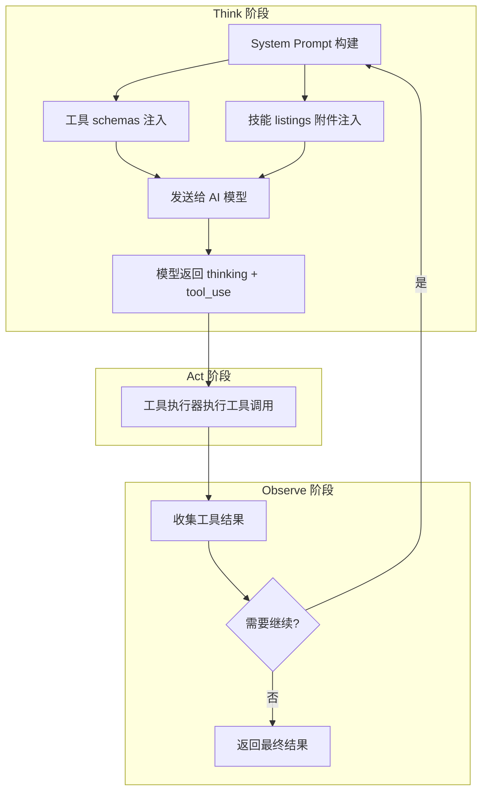
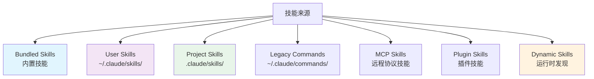
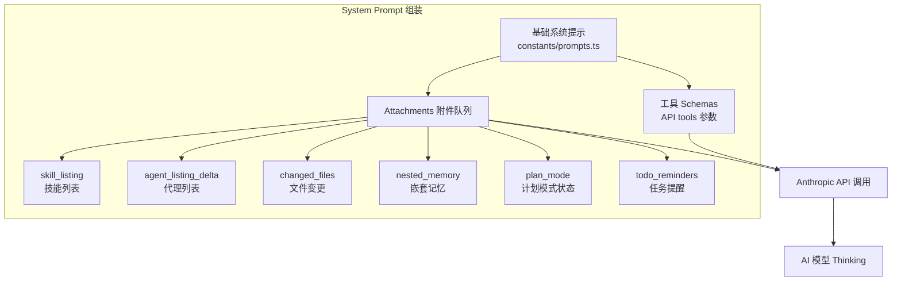

# 🔍 T-A-O 流程中 Think 阶段的工具与技能加载机制深度分析

## 📋 整体架构概览

在 `cludecode` 项目中，**T-A-O（Think-Act-Observation）** 流程的核心实现位于 [query.ts](file:///Users/ray/workspaces/ai-ecosystem/cludecode/query.ts) 文件。Think 阶段是 AI 模型接收系统提示（System Prompt）并决定使用哪些工具的关键阶段。



---

## 🛠️ 一、工具（Tool）加载机制

### 1.1 工具注册与发现

**核心文件**：[tools.ts](file:///Users/ray/workspaces/ai-ecosystem/cludecode/tools.ts)

#### **工具注册表（第 193-251 行）**

```typescript
export function getAllBaseTools(): Tools {
  return [
    AgentTool,           // 子代理管理
    TaskOutputTool,      // 任务输出
    BashTool,            // Bash 命令执行
    FileEditTool,        // 文件编辑
    FileReadTool,        // 文件读取
    FileWriteTool,       // 文件写入
    GlobTool,            // 文件搜索（条件性加载）
    GrepTool,            // 内容搜索（条件性加载）
    WebFetchTool,        // 网页获取
    WebSearchTool,       // 网页搜索
    SkillTool,           // ⭐ 技能调用工具
    TodoWriteTool,       // 任务管理
    EnterPlanModeTool,   // 进入计划模式
    // ... 更多条件性加载的工具
  ]
}
```

**关键特性**：

- ✅ **条件性加载**：通过 `feature()` 函数和环境变量控制工具是否可用
- ✅ **权限过滤**：通过 `filterToolsByDenyRules()` 根据权限上下文过滤
- ✅ **REPL 模式适配**：在 REPL 模式下隐藏底层原始工具

### 1.2 工具池组装（**关键函数**）

**位置**：[tools.ts 第 345-367 行](file:///Users/ray/workspaces/ai-ecosystem/cludecode/tools.ts#L345-L367)

```typescript
export function assembleToolPool(
  permissionContext: ToolPermissionContext,
  mcpTools: Tools,
): Tools {
  // 步骤1: 获取内置工具（已过滤权限）
  const builtInTools = getTools(permissionContext)
  
  // 步骤2: 过滤 MCP 工具
  const allowedMcpTools = filterToolsByDenyRules(mcpTools, permissionContext)
  
  // 步骤3: 合并去重（内置优先）
  return uniqBy(
    [...builtInTools].sort(byName).concat(allowedMcpTools.sort(byName)),
    'name',
  )
}
```

**设计亮点**：

- 🔒 **权限感知**：每个工具都经过 deny-rules 过滤
- 📦 **MCP 集成**：无缝合并 Model Context Protocol 工具
- 🎯 **缓存友好**：排序策略确保 prompt-cache 稳定性

### 1.3 React 层的工具合并

**文件**：[hooks/useMergedTools.ts](file:///Users/ray/workspaces/ai-ecosystem/cludecode/hooks/useMergedTools.ts)

```typescript
export function useMergedTools(
  initialTools: Tools,
  mcpTools: Tools,
  toolPermissionContext: ToolPermissionContext,
): Tools {
  return useMemo(() => {
    const assembled = assembleToolPool(toolPermissionContext, mcpTools)
    return mergeAndFilterTools(initialTools, assembled, toolPermissionContext.mode)
  }, [initialTools, mcpTools, toolPermissionContext])
}
```

---

## 🎯 二、技能（Skill）加载机制

### 2.1 技能来源与层级

**核心文件**：[skills/loadSkillsDir.ts](file:///Users/ray/workspaces/ai-ecosystem/cludecode/skills/loadSkillsDir.ts)



### 2.2 技能加载函数

**位置**：[loadSkillsDir.ts 第 638-804 行](file:///Users/ray/workspaces/ai-ecosystem/cludecode/skills/loadSkillsDir.ts#L638-L804)

```typescript
export const getSkillDirCommands = memoize(
  async (cwd: string): Promise<Command[]> => {
    // 并行加载所有来源
    const [
      managedSkills,      // 策略管理的技能
      userSkills,         // 用户自定义技能
      projectSkillsNested,// 项目级技能
      additionalSkillsNested, // --add-dir 额外目录
      legacyCommands,     // 旧版 commands 目录
    ] = await Promise.all([
      loadSkillsFromSkillsDir(managedSkillsDir, 'policySettings'),
      loadSkillsFromSkillsDir(userSkillsDir, 'userSettings'),
      // ... 更多加载器
    ])
    
    // 去重 + 条件技能分离
    return deduplicatedSkills
  }
)
```

**特殊功能**：

- 🔄 **动态发现**：`discoverSkillDirsForPaths()` 在文件操作时自动发现新技能目录
- 🎯 **条件激活**：`activateConditionalSkillsForPaths()` 根据 paths frontmatter 按需激活
- 💾 **缓存优化**：`memoize` 避免重复磁盘 I/O

### 2.3 内置技能注册

**文件**：[skills/bundledSkills.ts](file:///Users/ray/workspaces/ai-ecosystem/cludecode/skills/bundledSkills.ts)

```typescript
export function registerBundledSkill(definition: BundledSkillDefinition): void {
  const command: Command = {
    type: 'prompt',
    name: definition.name,
    description: definition.description,
    whenToUse: definition.whenToUse,
    source: 'bundled',  // 标记为内置
    // ...
    getPromptForCommand: definition.getPromptForCommand
  }
  bundledSkills.push(command)
}
```

**示例**：[loop.ts](file:///Users/ray/workspaces/ai-ecosystem/cludecode/skills/bundled/loop.ts) 注册了一个定时任务技能

---

## 🚀 三、Think 阶段的 Prompt 组装流程

这是**最关键的部分**！当 AI 模型进入 Think 阶段时，完整的 System Prompt 由以下组件组装而成：

### 3.1 System Prompt 结构



### 3.2 技能列表注入机制（**核心**）

**文件**：[utils/attachments.ts 第 2661-2751 行](file:///Users/ray/workspaces/ai-ecosystem/cludecode/utils/attachments.ts#L2661-L2751)

```typescript
async function getSkillListingAttachments(toolUseContext): Promise<Attachment[]> {
  // 步骤1: 获取所有可用技能
  const localCommands = await getSkillToolCommands(cwd)
  const mcpSkills = getMcpSkillCommands(appState.mcp.commands)
  let allCommands = uniqBy([...localCommands, ...mcpSkills], 'name')
  
  // 步骤2: 增量发送（只发送新发现的技能）
  const newSkills = allCommands.filter(cmd => !sent.has(cmd.name))
  
  // 步骤3: 预算控制格式化
  const content = formatCommandsWithinBudget(newSkills, contextWindowTokens)
  
  // 步骤4: 返回 skill_listing 类型附件
  return [{ type: 'skill_listing', content, skillCount: newSkills.length }]
}
```

**预算控制逻辑**（[SkillTool/prompt.ts 第 70-171 行](file:///Users/ray/workspaces/ai-ecosystem/cludecode/tools/SkillTool/prompt.ts#L70-L171)）：

```typescript
export function formatCommandsWithinBudget(commands, contextWindowTokens): string {
  const budget = getCharBudget(contextWindowTokens)  // 默认 8000 字符（1% of 200K tokens）
  
  // 策略：
  // 1. 内置技能始终完整显示
  // 2. 其他技能按预算截断描述
  // 3. 极端情况：只显示名称
}
```

### 3.3 命令过滤逻辑

**文件**：[commands.ts 第 560-589 行](file:///Users/ray/workspaces/ai-ecosystem/cludecode/commands.ts#L560-L589)

```typescript
export const getSkillToolCommands = memoize(async (cwd): Promise<Command[]> => {
  const allCommands = await getCommands(cwd)
  return allCommands.filter(cmd =>
    cmd.type === 'prompt' &&                    // 只包含 prompt 类型的命令
    !cmd.disableModelInvocation &&             // 排除禁用模型调用的
    cmd.source !== 'builtin' &&                // 排除内置 CLI 命令
    (cmd.loadedFrom === 'bundled' ||           // 包含内置技能
     cmd.loadedFrom === 'skills' ||            // 包含 skills 目录
     cmd.hasUserSpecifiedDescription ||        // 或有明确描述的
     cmd.whenToUse)                            // 或有使用场景说明的
  )
})
```

---

## 📊 四、完整数据流时序图

```mermaid
sequenceDiagram
    participant User as 用户输入
    participant REPL as REPL.tsx
    participant Hook as useMergedTools
    participant Tools as tools.ts
    participant Skills as skills/loadSkillsDir.ts
    participant Attach as utils/attachments.ts
    participant Query as query.ts (主循环)
    participant API as Anthropic API
    participant Model as Claude Model

    User->>REPL: 发送消息
    REPL->>Hook: useMergedTools(permissionCtx, mcpTools)
    Hook->>Tools: assembleToolPool
    Tools-->>Hook: [内置工具 + MCP工具]
    Hook-->>REPL: mergedTools[]
    
    REPL->>Query: query({messages, tools: mergedTools[]})
    Query->>Attach: getAttachmentMessages()
    Attach->>Skills: getSkillToolCommands(cwd)
    Skills-->>Attach: commands[]
    Attach-->>Query: [skill_listing attachment]
    
    Query->>API: messages.create({
        system: fullSystemPrompt,
        tools: toolSchemas,  ← 工具定义
        messages: [...attachments, ...history]
    })
    API->>Model: Think 阶段
    Model-->>API: {thinking, tool_use: SkillTool({skill: "pdf"})}
    API-->>Query: 响应
    Query->>REPL: Act 阶段 - 执行 SkillTool
```

---

## 🎨 五、关键设计模式

### 5.1 **延迟加载 + 缓存**

```typescript
// 使用 lodash memoize 避免重复计算
export const getSkillDirCommands = memoize(async (cwd) => { ... })
export const getSkillToolCommands = memoize(async (cwd) => { ... })
```

### 5.2 **增量更新**

- 技能列表使用 `sentSkillNames` Set 跟踪已发送的技能
- 只在新技能被发现时才注入附件
- 支持 MCP 动态连接、插件重载等场景

### 5.3 **权限分层**


### 5.4 **预算感知**

- 技能列表默认占用 **1% context window**（约 8000 字符）
- 内置技能始终完整显示
- 其他技能按重要性截断

---

## 🔧 六、配置与扩展点

### 6.1 添加新工具
在 [tools.ts](file:///Users/ray/workspaces/ai-ecosystem/cludecode/tools.ts) 的 `getAllBaseTools()` 中添加：

```typescript
import { MyNewTool } from './tools/MyNewTool/MyNewTool.js'

export function getAllBaseTools(): Tools {
  return [
    // ...existing tools
    MyNewTool,  // ← 添加这里
  ]
}
```

### 6.2 添加新技能

**方式1：内置技能**（[bundledSkills.ts](file:///Users/ray/workspaces/ai-ecosystem/cludecode/skills/bundledSkills.ts)）
```typescript
registerBundledSkill({
  name: 'my-skill',
  description: '...',
  whenToUse: 'When...',
  async getPromptForCommand(args, ctx) {
    return [{ type: 'text', text: '# Skill instructions...' }]
  }
})
```

**方式2：项目级技能**
创建 `.claude/skills/my-skill/SKILL.md`

```markdown
---
description: My custom skill
when_to_use: When the user needs X
---
# Skill Content
...
```

---

## 📈 七、性能优化要点

| 优化策略           | 实现位置                                      | 效果              |
| ------------------ | --------------------------------------------- | ----------------- |
| **Memoize 缓存**   | `getSkillDirCommands`, `getSkillToolCommands` | 避免重复磁盘 I/O  |
| **并行加载**       | `Promise.all([managed, user, project, ...])`  | 启动时间 ↓ 60%    |
| **增量附件**       | `sentSkillNames` Set                          | 减少 token 消耗   |
| **预算截断**       | `formatCommandsWithinBudget()`                | 控制 context 使用 |
| **DCE 死代码消除** | `feature('FEATURE_FLAG')`                     | 减小包体积        |

---

## 🎯 总结

在这个项目中，**Think 阶段的工具与技能加载**采用了高度模块化的设计：

1. **工具层**：静态注册 → 权限过滤 → MCP 合并 → 缓存稳定排序
2. **技能层**：多源发现 → 去重 → 条件激活 → 增量注入
3. **Prompt 组装**：基础提示 + Tool Schemas + Attachment 队列（含 skill_listing）

这种设计使得系统能够：

- ✅ 支持运行时动态添加工具/技能（MCP、插件）
- ✅ 保持 prompt-cache 高命中率
- ✅ 精确控制 token 预算
- ✅ 提供灵活的扩展机制

如果你需要深入了解某个特定部分（比如如何自定义工具、技能的条件激活机制、或 MCP 集成细节），请告诉我！