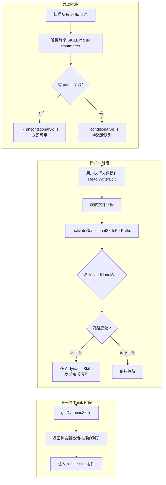
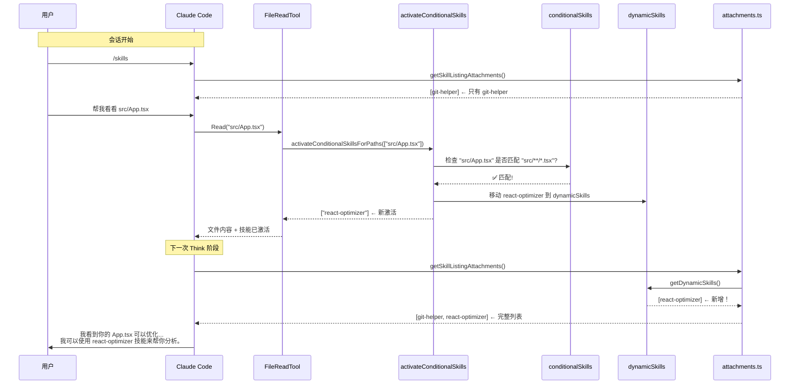
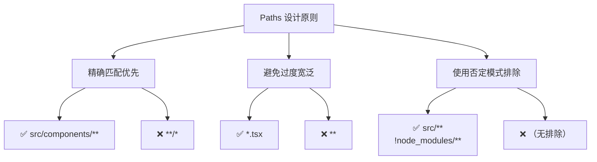

# 🎯 技能条件激活机制（paths frontmatter）深度剖析

## 📌 核心概念

**条件激活（Conditional Activation）** 是一种**按需加载**策略，允许技能定义自己只在特定文件被操作时才激活。这类似于 CLAUDE.md 的条件规则，但应用于技能系统。



---

## 🔧 一、技术实现详解

### 1.1 Frontmatter 定义格式

**文件位置**：`.claude/skills/my-skill/SKILL.md`

```markdown
---
description: React 组件优化助手
when_to_use: 当用户需要优化 React 组件性能时
paths:
  - "**/*.tsx"
  - "**/*.jsx"
  - "src/components/**"
---

# React 优化助手

你是一个 React 性能优化专家...
```

**支持的路径模式**（gitignore 风格）：

| 模式                | 含义              | 示例                              |
| ------------------- | ----------------- | --------------------------------- |
| `**/*.ts`           | 匹配所有 .ts 文件 | `src/index.ts`, `utils/helper.ts` |
| `src/components/**` | 匹配目录及子目录  | `src/components/Button.tsx`       |
| `*.test.{ts,tsx}`   | 匹配测试文件      | `App.test.tsx`, `Button.test.ts`  |
| `!node_modules/**`  | 排除模式          | 排除 node_modules                 |

### 1.2 解析逻辑

**代码位置**：[loadSkillsDir.ts 第 159-178 行](file:///Users/ray/workspaces/ai-ecosystem/cludecode/skills/loadSkillsDir.ts#L159-L178)

```typescript
function parseSkillPaths(frontmatter: FrontmatterData): string[] | undefined {
  if (!frontmatter.paths) {
    return undefined  // 无 paths → 无条件激活
  }

  const patterns = splitPathInFrontmatter(frontmatter.paths)
    .map(pattern => {
      // 移除 /** 后缀（ignore 库会自动处理目录匹配）
      return pattern.endsWith('/**') ? pattern.slice(0, -3) : pattern
    })
    .filter((p: string) => p.length > 0)

  // 如果所有模式都是 **（匹配所有），视为无条件
  if (patterns.length === 0 || patterns.every((p: string) => p === '**')) {
    return undefined
  }

  return patterns
}
```

**关键处理**：
- ✅ 自动去除 `/**` 后缀（语义等价）
- ✅ 过滤空字符串
- ✅ 全通配符 `**` 退化为无条件激活

### 1.3 启动时的分类存储

**代码位置**：[loadSkillsDir.ts 第 771-802 行](file:///Users/ray/workspaces/ai-ecosystem/cludecode/skills/loadSkillsDir.ts#L771-L802)

```typescript
// 在 getSkillDirCommands() 函数内部
const unconditionalSkills: Command[] = []
const newConditionalSkills: Command[] = []

for (const skill of deduplicatedSkills) {
  // 判断条件：有 paths 字段 且 尚未激活过
  if (
    skill.type === 'prompt' &&
    skill.paths &&                    // ← 关键检查
    skill.paths.length > 0 &&         // ← 有路径规则
    !activatedConditionalSkillNames.has(skill.name)  // ← 本轮未激活
  ) {
    newConditionalSkills.push(skill)
  } else {
    unconditionalSkills.push(skill)
  }
}

// 存入待激活队列
for (const skill of newConditionalSkills) {
  conditionalSkills.set(skill.name, skill)  // Map<name, skill>
}

return unconditionalSkills  // 只返回无条件技能！
```

**状态容器**：

```typescript
// 全局状态（模块级别）
const conditionalSkills = new Map<string, Command>()           // 待激活队列
const activatedConditionalSkillNames = new Set<string>()       // 已激活记录（防重复）
const dynamicSkills = new Map<string, Command>()               // 已激活且可用的技能
```

---

## ⚡ 二、运行时触发机制

### 2.1 触发点（Hook Points）

条件技能的激活由**文件操作工具**自动触发：

| 工具              | 文件位置                                                                                                                    | 触发时机   |
| ----------------- | --------------------------------------------------------------------------------------------------------------------------- | ---------- |
| **FileReadTool**  | [FileReadTool.ts 第 590 行](file:///Users/ray/workspaces/ai-ecosystem/cludecode/tools/FileReadTool/FileReadTool.ts#L590)    | 读取文件后 |
| **FileWriteTool** | [FileWriteTool.ts 第 245 行](file:///Users/ray/workspaces/ai-ecosystem/cludecode/tools/FileWriteTool/FileWriteTool.ts#L245) | 写入文件后 |
| **FileEditTool**  | [FileEditTool.ts 第 422 行](file:///Users/ray/workspaces/ai-ecosystem/cludecode/tools/FileEditTool/FileEditTool.ts#L422)    | 编辑文件前 |

**示例（FileEditTool）**：

```typescript
// FileEditTool.ts 第 420-422 行
// 在编辑文件之前，检查是否需要激活条件技能
activateConditionalSkillsForPaths([absoluteFilePath], cwd)

await diagnosticTracker.beforeFileEdited(absoluteFilePath)
// ...继续执行编辑
```

### 2.2 核心激活函数

**代码位置**：[loadSkillsDir.ts 第 997-1058 行](file:///Users/ray/workspaces/ai-ecosystem/cludecode/skills/loadSkillsDir.ts#L997-L1058)

```typescript
export function activateConditionalSkillsForPaths(
  filePaths: string[],  // 当前操作的文件路径数组
  cwd: string,          // 项目根目录
): string[] {           // 返回新激活的技能名称列表
  
  // 快速退出：没有待激活的条件技能
  if (conditionalSkills.size === 0) {
    return []
  }

  const activated: string[] = []

  for (const [name, skill] of conditionalSkills) {
    // 安全检查
    if (skill.type !== 'prompt' || !skill.paths || skill.paths.length === 0) {
      continue
    }

    // 使用 ignore 库创建匹配器（与 .gitignore 相同语法）
    const skillIgnore = ignore().add(skill.paths)

    for (const filePath of filePaths) {
      // 转换为相对路径
      const relativePath = isAbsolute(filePath)
        ? relative(cwd, filePath)
        : filePath

      // 安全性验证：拒绝越权路径
      if (!relativePath || relativePath.startsWith('..') || isAbsolute(relativePath)) {
        continue
      }

      // 核心匹配逻辑
      if (skillIgnore.ignores(relativePath)) {
        // ✅ 匹配成功！激活技能
        dynamicSkills.set(name, skill)              // 移至动态技能池
        conditionalSkills.delete(name)               // 从待激活队列移除
        activatedConditionalSkillNames.add(name)     // 记录已激活（防止重复）
        activated.push(name)
        
        logForDebugging(
          `[skills] Activated conditional skill '${name}' (matched path: ${relativePath})`,
        )
        break  // 一个技能只需匹配一个文件即可激活
      }
    }
  }

  // 有新激活时，通知订阅者刷新缓存
  if (activated.length > 0) {
    logEvent('tengu_dynamic_skills_changed', {
      source: 'conditional_paths',
      previousCount: dynamicSkills.size - activated.length,
      newCount: dynamicSkills.size,
      addedCount: activated.length,
    })

    skillsLoaded.emit()  // 🔔 发送信号！
  }

  return activated
}
```

**算法复杂度分析**：
- 时间复杂度：O(C × F)，其中 C = 条件技能数，F = 文件路径数
- 实际场景：通常 C < 10，F = 1-5，所以几乎无感知延迟

---

## 🔄 三、完整生命周期示例

### 场景：React 项目中的条件技能

#### **步骤 1：项目结构**

```
my-react-app/
├── .claude/
│   └── skills/
│       ├── react-optimizer/          # 条件技能
│       │   └── SKILL.md             # 有 paths frontmatter
│       └── git-helper/              # 无条件技能
│           └── SKILL.md             # 无 paths 字段
├── src/
│   ├── components/
│   │   └── Button.tsx
│   └── App.tsx
└── package.json
```

#### **步骤 2：SKILL.md 定义**

**react-optimizer/SKILL.md**：
```markdown
---
description: React 性能优化专家
when_to_use: 当需要优化 React 组件渲染性能时
paths:
  - "src/**/*.tsx"
  - "src/**/*.jsx"
---

# React 优化助手

你是一个专注于 React 性能优化的 AI 助手...

## 检查清单
- [ ] 避免不必要的 re-render
- [ ] 使用 useMemo/useCallback
- [ ] ...
```

**git-helper/SKILL.md**：

```markdown
---
description: Git 操作助手
when_to_use: 当需要执行 Git 命令时
---

# Git 助手
...（无 paths 字段，始终可用）
```

#### **步骤 3：启动时加载**

```typescript
// getSkillDirCommands() 执行结果
console.log(unconditionalSkills)
// 输出: [git-helper]  ← 立即可用

console.log(conditionalSkills)
// 输出: Map(1) {"react-optimizer" => Command}  ← 待激活
```

#### **步骤 4：用户交互序列**



---

## 🛡️ 四、安全性与边界情况

### 4.1 路径安全验证

```typescript
// 防止路径遍历攻击
if (
  !relativePath ||                          // 空路径
  relativePath.startsWith('..') ||          // 父目录遍历
  isAbsolute(relativePath)                 // 绝对路径（Windows 跨驱动器问题）
) {
  continue  // 跳过不安全路径
}
```

### 4.2 性能保护机制

| 保护措施           | 实现                                          | 目的                     |
| ------------------ | --------------------------------------------- | ------------------------ |
| **快速退出**       | `if (conditionalSkills.size === 0) return []` | 无条件技能时零开销       |
| **去重缓存**       | `activatedConditionalSkillNames` Set          | 同一技能只激活一次       |
| **短路匹配**       | `break` 在第一个匹配后                        | 避免冗余检查             |
| **路径缓存**       | `dynamicSkillDirs` Set                        | 避免重复 stat() 调用     |
| **Gitignore 检查** | `isPathGitignored()`                          | 阻止 node_modules 等目录 |

### 4.3 边界情况处理

| 场景                | 处理方式                                      |
| ------------------- | --------------------------------------------- |
| **文件在 cwd 外部** | 跳过（relativePath 以 `..` 开头）             |
| **符号链接**        | 通过 `realpath()` 解析后去重                  |
| **Windows 路径**    | 处理跨驱动器的绝对路径问题                    |
| **并发文件操作**    | 单线程事件循环保证顺序执行                    |
| **技能重复定义**    | `activatedConditionalSkillNames` 防止重复激活 |

---

## 📊 五、监控与调试

### 5.1 日志输出

当条件技能被激活时，会产生以下日志：

```
[skills] Activated conditional skill 'react-optimizer' (matched path: src/App.tsx)
[skills] Dynamically discovered 1 skills from 1 directories
```

### 5.2 分析事件

```typescript
logEvent('tengu_dynamic_skills_changed', {
  source: 'conditional_paths',
  previousCount: 0,        // 激活前的数量
  newCount: 1,            // 激活后的数量
  addedCount: 1,          // 本次新增数量
  directoryCount: 0,      // 对于条件激活总是 0
})
```

### 5.3 调试命令

在 Claude Code 中可以使用：

```
/skills                   # 查看当前可用的技能列表（包括刚激活的）
/debug show-skills        # 显示技能加载详情（如果支持）
```

---

## 🎨 六、实际应用场景

### 场景 1：Monorepo 多包管理

```yaml
# .claude/skills/frontend-linter/SKILL.md
---
paths:
  - "packages/web/**"
  - "packages/app/**"
---
# Web 前端代码规范检查技能
```

```yaml
# .claude/skills/api-validator/SKILL.md
---
paths:
  - "packages/api/**"
  - "services/**"
---
# API 接口验证技能
```

**效果**：只有当用户操作 `packages/web/` 下的文件时，`frontend-linter` 才会出现。

### 场景 2：特定文件类型触发

```yaml
# .claude/skills/docker-helper/SKILL.md
---
paths:
  - "Dockerfile*"
  - "docker-compose*.yml"
  - ".dockerignore"
---
# Docker 配置优化技能
```

**效果**：只有在涉及 Docker 相关文件时才提供专业建议。

### 场景 3：测试文件专用技能

```yaml
# .claude/skills/test-generator/SKILL.md
---
paths:
  - "*.test.ts"
  - "*.spec.tsx"
  - "__tests__/**"
---
# 测试代码生成技能
```

**效果**：编写或修改测试文件时自动激活。

---

## 🔥 七、高级技巧与最佳实践

### 7.1 Paths 模式设计原则



### 7.2 与其他特性组合

| 组合方式                | 示例                          | 效果                 |
| ----------------------- | ----------------------------- | -------------------- |
| **+ model frontmatter** | `model: opus`                 | 只在高性能模型上使用 |
| **+ allowed-tools**     | `allowed-tools: [Bash, Read]` | 限制可用工具集       |
| **+ hooks**             | `hooks: { pre: [...] }`       | 激活时执行钩子       |
| **+ context: fork**     | `context: fork`               | 在独立上下文中运行   |

### 7.3 性能优化建议

1. **减少条件技能数量**：保持 `< 20` 个条件技能
2. **简化路径模式**：避免复杂的正则表达式（ignore 库不支持正则）
3. **批量操作**：同时编辑多个文件时，只触发一次激活检查
4. **监控覆盖率**：使用日志查看哪些条件技能从未被激活

---

## 📝 八、总结

### 核心价值

✅ **Context Window 节省**：只在相关时才注入技能描述  
✅ **相关性提升**：模型看到的技能都是当前任务相关的  
✅ **安全性增强**：路径限制防止误用  
✅ **用户体验改善**：避免无关技能干扰决策  

### 架构优势


这种**声明式 + 事件驱动**的设计使得技能系统既灵活又高效，是现代 AI 编程助手的优秀实践范例！

