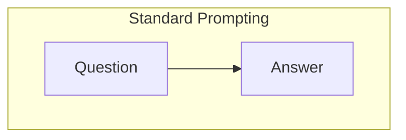
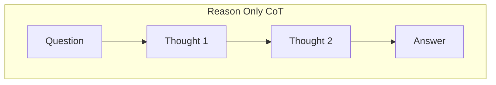
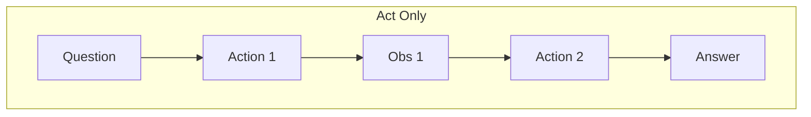
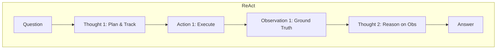

# 技术演进：从推理到行动

要深刻理解 ReAct 的价值，必须回顾大语言模型在解决复杂任务时的技术演进路径。这主要涉及三大阶段：直接提示（Standard Prompting）、思维链推理（Chain of Thought, CoT）以及代理行动（Agentic Acting）。

## 直接提示 (Standard Prompting)

在 GPT-3 等模型早期，最常见的用法是 Standard Prompting（也称为 Input-Output Prompting）。用户提供问题，模型直接输出答案。

*   **模式:** `Input -> Output`
*   **局限性:** 对于需要多步逻辑的复杂问题（如数学计算、多跳问答），模型由于缺乏中间的“思考空间”，很容易一步算错，导致最终结果完全错误。

## 思维链推理 (Chain of Thought, CoT)

Wei 等人[1] 提出了 CoT 范式，这是 LLM 推理能力的重大突破。CoT 要求模型在给出最终答案之前，先输出一系列中间推理步骤。

*   **模式:** `Input -> Reasoning Trace (Thoughts) -> Output`
*   **优势:** 极大地提升了模型在算术推理、常识推理等任务上的表现。它赋予了模型分解问题的能力。
*   **核心缺陷 (封闭系统问题):** CoT 是一个“黑盒内的白盒”。模型的推理完全依赖于其预训练时记住的内部知识（Internal Knowledge）。当面对它不知道的事实、或者知识已经过时时，CoT 不仅无法解决问题，反而会因为“一本正经地胡说八道”而产生严重的**幻觉（Hallucination）** 和**错误级联（Error Cascade）**。

例如，如果你问 2021 年训练的模型：“谁是 2022 年世界杯冠军？”。通过 CoT，它可能会生成一段完美的推理逻辑，但得出一个完全错误或捏造的结论。

## 仅行动范式 (Acting-Only / Tool Use)

为了解决闭源系统的问题，研究者开始让模型使用外部工具（如计算器、搜索引擎）。早期的工具调用（如 WebGPT[2]）主要侧重于预测动作（Actions）。

*   **模式:** `Input -> Action -> Observation -> Action -> Observation -> ... -> Output`
*   **局限性:** 虽然解决了信息更新的问题，但单纯的预测动作缺乏**状态保持（State Tracking）** 和**高层规划（High-level Planning）**。如果任务需要经历较长的步骤，模型很容易“忘记”最初的目的，陷入无限循环的无效搜索中。

## ReAct：两者的完美融合

ReAct [3] 敏锐地发现了上述两种范式的互补性。CoT 擅长内部逻辑规划，但缺乏获取外部信息的能力；Acting-Only 擅长获取外部信息，但缺乏内部逻辑规划。

ReAct 将它们结合，形成了一个增强的学习闭环：

1.  **Reasoning 辅助 Acting:** 思维链用于决定调用什么工具、传入什么参数，以及何时结束任务。
2.  **Acting 辅助 Reasoning:** 外部工具返回的真实观察结果（Observation），为下一步的思维链提供了坚实的现实基础，彻底打破了幻觉的温床。

### 范式对比图（概念）

通过这种演进，LLM 从一个单纯的“文本生成器”和“被动的知识库”，正式跨入了一个可以主动探索世界的**自主智能体（Autonomous Agent）**的门槛。

## 参考文献
[1] Wei, J. et al. (2022). Chain-of-Thought Prompting Elicits Reasoning in Large Language Models. *NeurIPS*.
[2] Nakano, R., Hilton, J., Balaji, S., Wu, J., Ouyang, L., Kim, C., ... & Schulman, J. (2021). WebGPT: Browser-assisted question-answering with human feedback. *arXiv preprint arXiv:2112.09332*.
[3] Yao, S. et al. (2022). ReAct: Synergizing Reasoning and Acting in Language Models. *ICLR 2023*.
