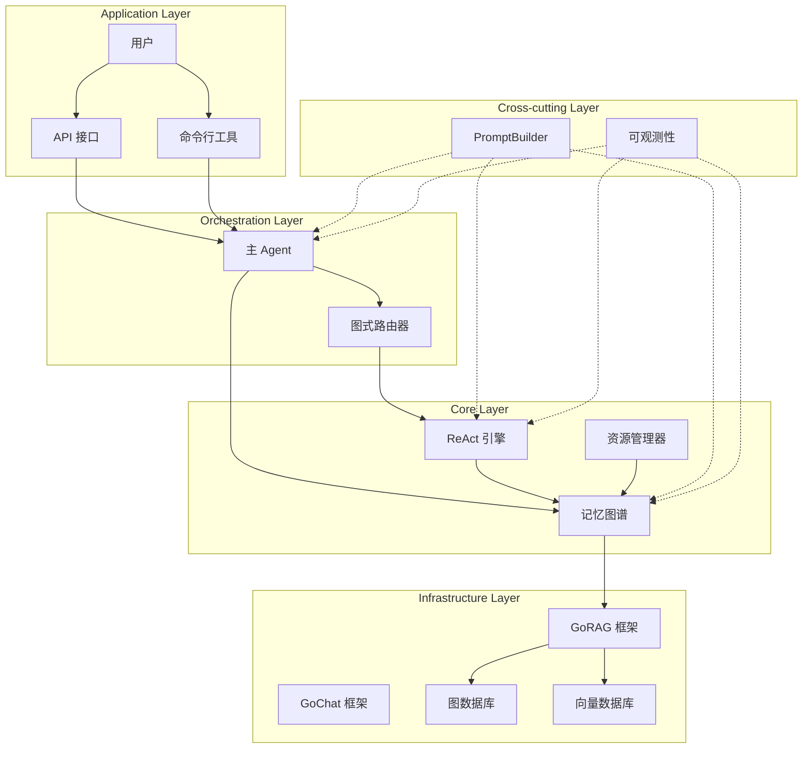
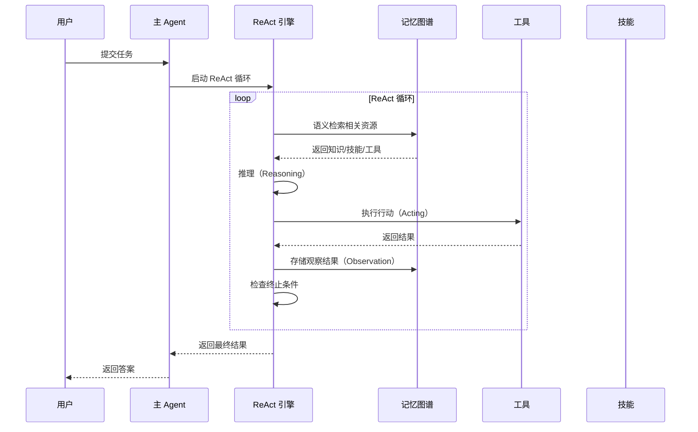
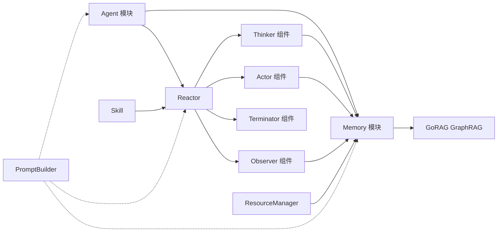
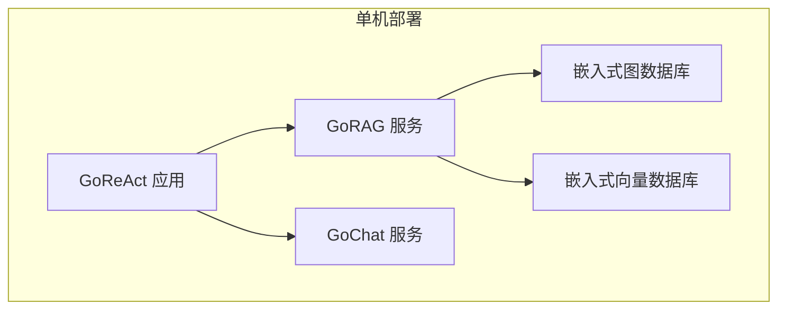

# GoReAct 总体架构设计

## 1. 架构概述

GoReAct 是一个基于 Go 语言开发的智能体编排框架，采用中心化调度模式（Orchestration），由一个主 Agent 协调多个子 Agent 的运行，实现复杂任务的完成。框架的核心创新在于"记忆图谱"（Memory Graph）技术和"资源化"（Resourceization）理念。

### 1.1 设计原则

- **资源化原则**：将智能体、模型、技能、工具都视为资源，具有可定义、可发现、可优化、可组合的特性
- **渐进式披露**：Agent 无需知道系统中所有资源，通过 Memory 的语义检索自动发现所需资源
- **图驱动架构**：记忆图谱和工作流都基于图数据库实现，支持复杂的关系查询和路径优化
- **ReAct 循环**：采用推理-行动-观察的循环机制，实现智能体的自主决策和自我修正

### 1.2 核心特性

1. **自进化能力**：通过记忆图谱存储所有交互历史和知识，支持智能体的持续学习和优化
2. **语义化资源发现**：Agent 需要什么资源只需通过语义化搜索从记忆中查出
3. **图式路由**：将 Skill 转化为图结构，实现灵活的工作流编排
4. **多 Agent 协作**：支持多个专业领域 Agent 的协同工作

## 2. 系统架构

### 2.1 架构层次

> **横切关注点**：
> - **PromptBuilder**：横跨所有核心模块，通过正向引导和反向抑制控制模型行为
> - **可观测性**：以探针式组件横跨所有模块，实现全链路监控、Token 用量统计和结构化日志追踪

### 2.2 核心组件

#### 2.2.1 Agent（智能体）

**职责**：
- 与用户交互的入口
- 定义智能体的专业领域
- 与特定模型的组合
- 内置 ReAct 流程进行思考、执行与自省

**关键特性**：
- 支持多模态交互
- 可动态创建和销毁
- 支持角色扮演和专业领域定制

#### 2.2.2 Memory（记忆）

**职责**：
- 存储智能体的思考结果
- 存储历史交互记录
- 存储所有资源（Agent、Model、Skill、Tool 等）
- 支持智能体进行自省和学习

**关键特性**：
- 基于 GoRAG 的 GraphRAG 实现记忆图谱
- 支持语义检索和关系查询
- **资源发现**：Agent 需要什么资源只需通过语义化搜索从记忆中查出
- **资源索引**：通过 `Load(Resource)` 方法将 ResourceManager 中的资源索引到 GraphRAG
- 支持记忆的持久化和恢复

#### 2.2.3 ResourceManager（资源管理器）

**职责**：
- 静态资源的统一注册场所
- 持有贫血对象：Tools, Skills, Agents, Models, DocumentPath

**关键特性**：
- 所有资源对象都是贫血对象，只持有共享数据
- 每个资源实现 `core.Node` 接口，都是 GraphDB 中的节点
- Skill 是目录结构，包含 SKILL.md 和可选的 scripts、references、assets
- 开发人员无需关注 Memory 如何索引资源

#### 2.2.3 Tool（工具）

**职责**：
- 执行智能体的任务
- 调用外部 API
- 处理数据

**关键特性**：
- 统一的工具接口
- 支持工具的动态注册和发现
- 支持工具的安全执行和错误处理

#### 2.2.4 Skill（技能）

**职责**：
- 通过 Markdown 定义技能的元数据和指令
- 组织脚本、文档、模板等资源文件

**关键特性**：
- **目录结构**：SKILL.md + scripts/ + references/ + assets/
- **渐进式披露**：元数据 → 指令 → 资源，按需加载
- **声明式定义**：指令写给 Agent 看，不是代码接口
- **资源化**：由 ResourceManager 注册，由 Memory 索引

#### 2.2.5 PromptBuilder（提示词构建器）

**职责**：
- **正向引导**: 定义 Agent 的角色、工具列表和输出格式
- **反向抑制**: 通过反向提示词约束模型行为边界
- **RAG 注入**: 从 Memory 检索相关知识并注入 Prompt
- 提供高质量 Few-shot 示例激发 ReAct 潜能
- 动态构建适应不同场景的 Prompt
- 管理上下文窗口限制

**关键特性**：
- **模板约束**: 通过严格的格式约束引导模型输出
- **实例引导**: 通过 Few-shot 示例展示推理过程
- **反向抑制**: 通过反向提示词组阻止不期望的行为
- **知识增强**: 通过 RAG 注入扩展模型知识边界
- **动态适配**: 根据任务阶段和权限动态调整
- **零微调实现**: 无需重新预训练或微调即可实现 ReAct 行为

> **核心理念**：通过"正向引导+反向抑制+RAG 增强+实例引导"的范式，将非结构化的自然语言模型转化为能够执行确定性工作流的推理机。

## 3. 数据流设计

### 3.1 主要数据流

## 4. 模块依赖关系

### 4.1 模块依赖图

### 4.2 接口依赖

| 模块            | 依赖接口                             | 提供接口        |
| --------------- | ------------------------------------ | --------------- |
| Agent           | Engine, Memory                       | Agent           |
| Reactor         | Thinker, Actor, Observer, Terminator | Reactor         |
| Memory          | GoRAG, ResourceManager               | Memory          |
| ResourceManager | core.Node                            | ResourceManager |
| PromptBuilder   | Memory                               | Prompt          |

### 4.3 命名约定

#### 标识符规范

GoReAct 中的数据实体根据是否需要被 Memory 索引，采用不同的标识符命名规则：

| 分类                                   | 标识符字段      | 说明                                       | 示例                                  |
| -------------------------------------- | --------------- | ------------------------------------------ | ------------------------------------- |
| **资源节点**（实现 `core.Node`）       | `Name() string` | 由 Memory 索引，使用 `Name` 作为唯一标识   | Agent、Tool、Skill、Model             |
| **运行时节点**（实现 `core.Node`）     | `Name() string` | 由 Memory 存储和检索，使用 `Name` 作为标识 | Session、Reflection、Trajectory、Plan |
| **内部数据结构**（不实现 `core.Node`） | `ID string`     | 不进入 Memory，使用 `ID` 作为内部标识      | SubTask、PendingQuestion、Edge        |

**规则**：
- 所有实现 `core.Node` 接口的类型，统一使用 `Name() string` 作为唯一标识方法
- 纯内部数据结构（不需要被 Memory 索引）使用 `ID string` 字段
- 不混用 `Name` 和 `ID`——一个类型只使用其中之一

## 5. 技术选型

### 5.1 核心技术栈

- **语言**: Go 1.24+
- **LLM 框架**: GoChat - 提供统一的 LLM 接口
- **RAG 框架**: GoRAG - 提供 NativeRAG 与 GraphRAG 功能
- **图数据库**: 通过 GoRAG 支持，支持多种图数据库
- **向量数据库**: 通过 GoRAG 支持，支持多种向量数据库

### 5.2 设计模式

- **工厂模式**: 用于创建 Agent、Tool、Skill 等对象
- **策略模式**: 用于不同的推理策略和执行策略
- **观察者模式**: 用于事件通知和状态监控
- **装饰器模式**: 用于增强工具和技能的功能
- **管道模式**: 用于 ReAct 循环的步骤化处理

## 6. 扩展性设计

### 6.1 插件化架构

GoReAct 采用插件化架构设计，支持：

- **自定义 Agent**: 通过实现 Agent 接口创建自定义 Agent
- **自定义 Tool**: 通过实现 Tool 接口创建自定义工具
- **自定义 Skill**: 通过编写 Markdown 文件定义技能
- **自定义 Model**: 通过 GoChat 框架支持多种 LLM

### 6.2 水平扩展与分布式一致性

- **Agent 池**: 支持创建多个相同类型的 Agent 实例，通过负载均衡器分发任务。
- **负载均衡**: 支持任务在多个 Agent 之间分配，并结合能力匹配度打分。
- **共享记忆与事件总线 (Memory Event Bus)**: 在分布式部署下，当某个 Agent 实例通过进化（Evolution）生成了新的 Skill 或 Tool 并写入底层共享存储时，通过事件总线（Event Bus）广播 `ResourceUpdated` 事件。其他 Agent 实例的 Memory 模块监听到事件后，触发增量索引更新（Reload），确保整个集群的认知一致性。

## 7. 安全性设计

### 7.1 资源隔离

- **工具权限**: 工具执行需要权限验证
- **数据加密**: 敏感数据在存储和传输过程中加密

### 7.2 访问控制

- **API 密钥管理**: 外部 API 调用需要密钥验证
- **审计日志**: 记录所有关键操作的审计日志

## 8. 性能优化

### 8.1 缓存策略

- **记忆缓存**: 缓存频繁访问的记忆节点
- **结果缓存**: 缓存工具执行结果

### 8.2 并发处理

- **异步执行**: 工具调用和外部 API 采用异步执行
- **并发推理**: 支持多个推理任务并发执行
- **流式输出**: 支持 LLM 的流式输出，减少响应延迟

## 9. 可观测性

GoReAct 内置可观测性模块，以探针式组件横跨所有核心模块：

### 9.1 日志系统

- **结构化日志**: 使用 zap 等结构化日志框架
- **日志级别**: 支持 DEBUG、INFO、WARN、ERROR 等级别
- **日志聚合**: 支持日志的集中收集和分析

### 9.2 指标监控

- **性能指标**: 记录推理时间、工具执行时间等
- **资源指标**: 记录内存使用、CPU 使用等
- **业务指标**: 记录任务完成率、错误率等

### 9.3 链路追踪

- **分布式追踪**: 支持跨服务的链路追踪
- **调用链**: 记录完整的调用链路
- **性能分析**: 支持性能瓶颈分析

### 9.4 Token 用量统计

- **精确统计**: 精确记录 LLM 输入/输出 Token 消耗
- **成本分析**: 支持按 Agent、按时间段的成本统计
- **详细报告**: 可导出详细用量报告供分析

> **详细设计**：见 [可观测性模块设计文档](core-modules/observability-module.md)

## 10. 部署架构

## 11. 总结

GoReAct 的总体架构设计体现了以下核心思想：

1. **资源化理念**：将所有能力抽象为资源，实现统一的存储和检索
2. **图驱动架构**：基于图数据库的记忆图谱和工作流，支持复杂的关系查询和路径优化
3. **简化的资源管理**：ResourceManager 只持有贫血对象，Memory 通过 `Load()` 方法一次性索引所有资源
4. **语义化资源发现**：Agent 需要什么资源只需通过语义化搜索从 Memory 中查出
5. **ReAct 循环**：通过推理-行动-观察的循环机制，实现智能体的自主决策和自我修正
6. **PromptBuilder**：横跨所有核心模块，通过正向引导、反向抑制和 RAG 注入实现零微调的 ReAct 行为
7. **插件化设计**：支持灵活的扩展和定制，满足不同场景的需求
8. **高性能和高可用**：通过缓存、并发等技术，确保系统的高性能和高可用

这种架构设计为 GoReAct 提供了强大的扩展能力和灵活性，能够支持从简单到复杂的各种智能体应用场景。

## 12. 术语表

本节统一 GoReAct 框架中的核心术语，确保文档和代码中的概念一致性。

### 12.1 核心概念

| 中文术语 | 英文术语 | 说明 |
|----------|----------|------|
| 记忆图谱 | Memory Graph | Memory 中存储的所有节点和关系的总称，是智能体的知识存储结构 |
| 图增强检索 | GraphRAG | GoRAG 框架提供的图增强 RAG 模式，结合图数据库和向量检索 |
| 资源管理器 | ResourceManager | 静态资源的统一注册场所，持有 Agent、Tool、Skill、Model 等贫血对象 |
| 资源化 | Resourceization | 将智能体、模型、技能、工具都视为资源的设计理念 |
| 访问器 | Accessor | 操作特定类型 Memory 节点的接口，如 SessionAccessor、SkillAccessor |
| 贫血对象 | Anemic Object | 只持有数据、不包含业务逻辑的对象，由 ResourceManager 持有 |

### 12.2 模块术语

| 中文术语 | 英文术语 | 说明 |
|----------|----------|------|
| 智能体 | Agent | 与用户交互的入口，定义专业领域和模型组合 |
| ReAct 引擎 | Reactor | 实现推理-行动-观察循环的核心引擎 |
| 编排器 | Orchestrator | 协调多个 Agent 协作的组件 |
| 规划器 | Planner | 生成执行计划的组件 |
| 思考器 | Thinker | 进行推理决策的组件 |
| 行动器 | Actor | 执行具体行动的组件 |
| 观察器 | Observer | 观察行动结果的组件 |
| 反思器 | Reflector | 进行自我反思的组件 |
| 终止器 | Terminator | 判断循环终止条件的组件 |

### 12.3 数据结构术语

| 中文术语 | 英文术语 | 说明 |
|----------|----------|------|
| 会话 | Session | 一次完整的交互过程，包含输入、输出和中间状态 |
| 轨迹 | Trajectory | 完整的执行路径，包含所有 Thought、Action、Observation |
| 反思 | Reflection | 任务失败后的自我反思结果 |
| 计划 | Plan | 执行前的全局规划，包含多个步骤 |
| 思考 | Thought | 推理过程中的思考内容 |
| 行动 | Action | 具体的执行动作 |
| 观察 | Observation | 行动执行后的观察结果 |

### 12.4 技术术语

| 中文术语 | 英文术语 | 说明 |
|----------|----------|------|
| 提示词 | Prompt | 发送给 LLM 的完整输入，包含系统提示、上下文、问题等 |
| 正向引导 | Positive Prompting | 通过正向提示词引导模型产生期望行为 |
| 反向抑制 | Negative Prompting | 通过反向提示词约束模型行为边界 |
| 少样本学习 | Few-shot Learning | 通过少量示例引导模型学习 |
| 语义检索 | Semantic Search | 基于向量相似度的检索方式 |
| 白名单 | Whitelist | 预授权的工具调用列表 |
| 探针 | Probe | 嵌入各模块的可观测性组件 |

### 12.5 术语使用规范

1. **统一使用中文术语**：在中文文档中优先使用中文术语，首次出现时可标注英文
2. **代码中使用英文**：代码中的变量、函数、类型命名统一使用英文术语
3. **避免混用**：同一概念在文档中应使用统一的术语，避免同义词混用
4. **示例**：
   - ✅ 正确：Memory 通过 GraphRAG 实现记忆图谱
   - ❌ 错误：Memory 通过 GraphRAG 实现 Memory Graph（混用）

