# 行动器模块设计

## 1. 模块概述

行动器（Actor）是 ReAct 循环中的执行组件，负责将思考器生成的行动意图转化为实际执行。它管理工具调用、技能执行和子代理委托，是连接推理与实际操作的桥梁。

### 1.1 核心职责

- **行动验证**：验证行动的合法性和安全性
- **工具执行**：调用工具并返回结果
- **技能执行**：加载和执行技能，支持编译缓存
- **子代理委托**：将任务委托给子代理执行

### 1.2 设计原则

- **安全优先**：根据安全等级控制执行权限
- **缓存优化**：优先使用 Skill 编译缓存
- **错误隔离**：隔离执行错误，防止级联失败
- **可观测性**：记录详细的执行日志

## 2. 接口设计

### 2.1 核心接口

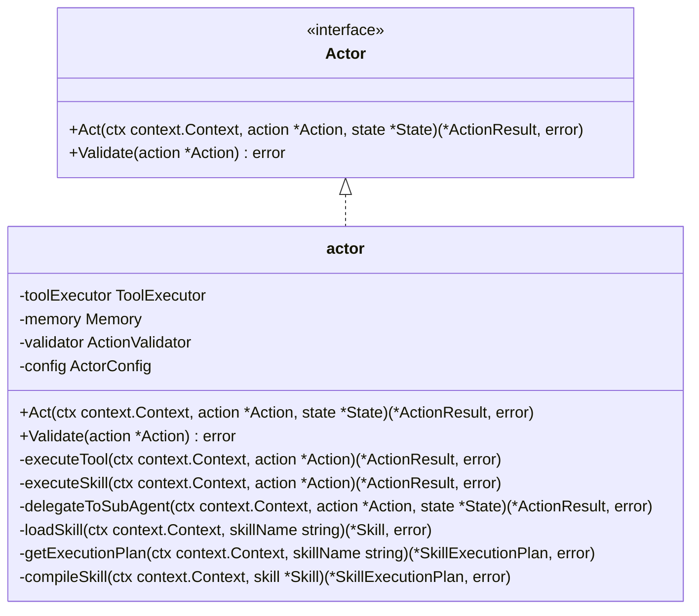

### 2.2 Action 结构

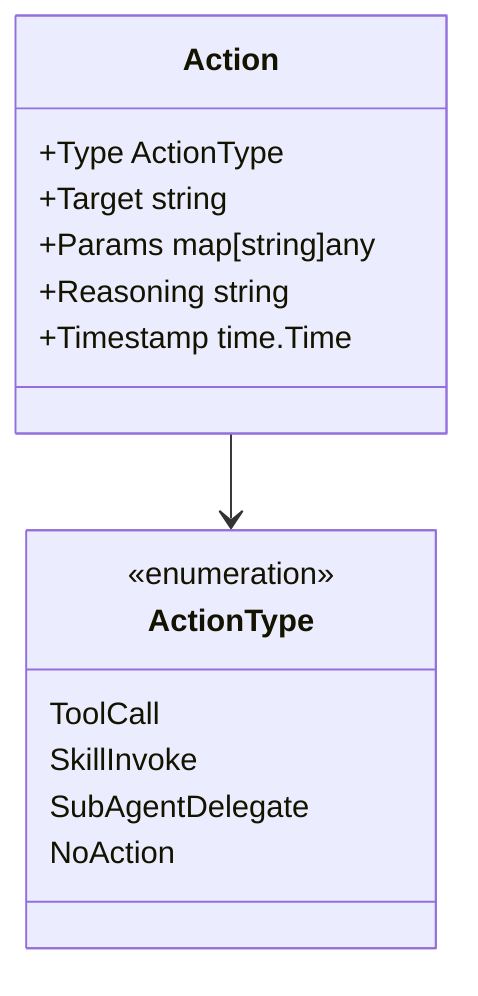

**Action 字段说明**：

| 字段 | 类型 | 说明 |
|------|------|------|
| Type | ActionType | 行动类型 |
| Target | string | 目标名称（工具名/技能名/子代理名） |
| Params | map[string]any | 行动参数 |
| Reasoning | string | 选择此行动的原因 |
| Timestamp | time.Time | 行动时间戳 |

### 2.3 ActionResult 结构

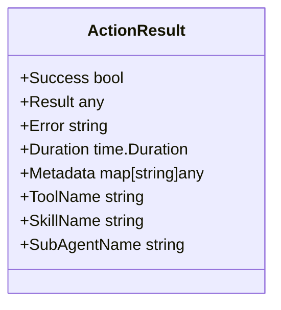

**ActionResult 字段说明**：

| 字段 | 类型 | 说明 |
|------|------|------|
| Success | bool | 执行是否成功 |
| Result | any | 执行结果 |
| Error | string | 错误信息（如果失败） |
| Duration | time.Duration | 执行耗时 |
| Metadata | map[string]any | 额外元数据 |
| ToolName | string | 执行的工具名（如果是工具调用） |
| SkillName | string | 执行的技能名（如果是技能调用） |
| SubAgentName | string | 委托的子代理名（如果是委托） |

### 2.4 ActorConfig 配置

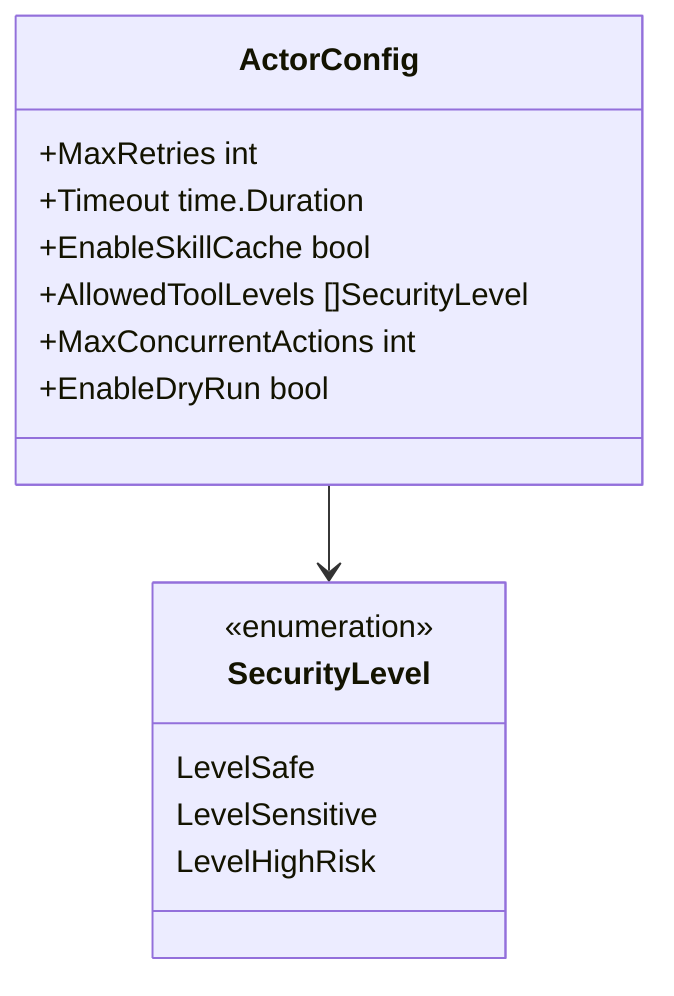

| 配置项 | 说明 | 默认值 |
|--------|------|--------|
| MaxRetries | 最大重试次数 | 3 |
| Timeout | 执行超时时间 | 30s |
| EnableSkillCache | 是否启用技能缓存 | true |
| AllowedToolLevels | 允许的工具安全等级 | [Safe, Sensitive] |
| MaxConcurrentActions | 最大并发行动数 | 5 |
| EnableDryRun | 是否启用试运行模式 | false |

## 3. 执行流程设计

### 3.1 完整执行流程

```mermaid
sequenceDiagram
    participant Engine as 引擎
    participant Actor as 行动器
    participant Validator as 验证器
    participant Executor as 执行器
    participant Memory as 记忆

    Engine->>Actor: Act(ctx, action, state)
    
    Actor->>Validator: Validate(action)
    Validator->>Validator: 检查行动类型
    Validator->>Validator: 检查目标存在性
    Validator->>Validator: 检查参数合法性
    Validator->>Validator: 检查安全等级
    Validator-->>Actor: 验证结果
    
    alt 验证失败
        Actor-->>Engine: 返回验证错误
    end
    
    Actor->>Actor: 路由到执行器
    
    alt 工具调用
        Actor->>Executor: executeTool(action)
    else 技能调用
        Actor->>Executor: executeSkill(action)
    else 子代理委托
        Actor->>Executor: delegateToSubAgent(action, state)
    end
    
    Executor-->>Actor: 返回 ActionResult
    Actor-->>Engine: 返回 ActionResult
```

### 3.2 行动路由策略

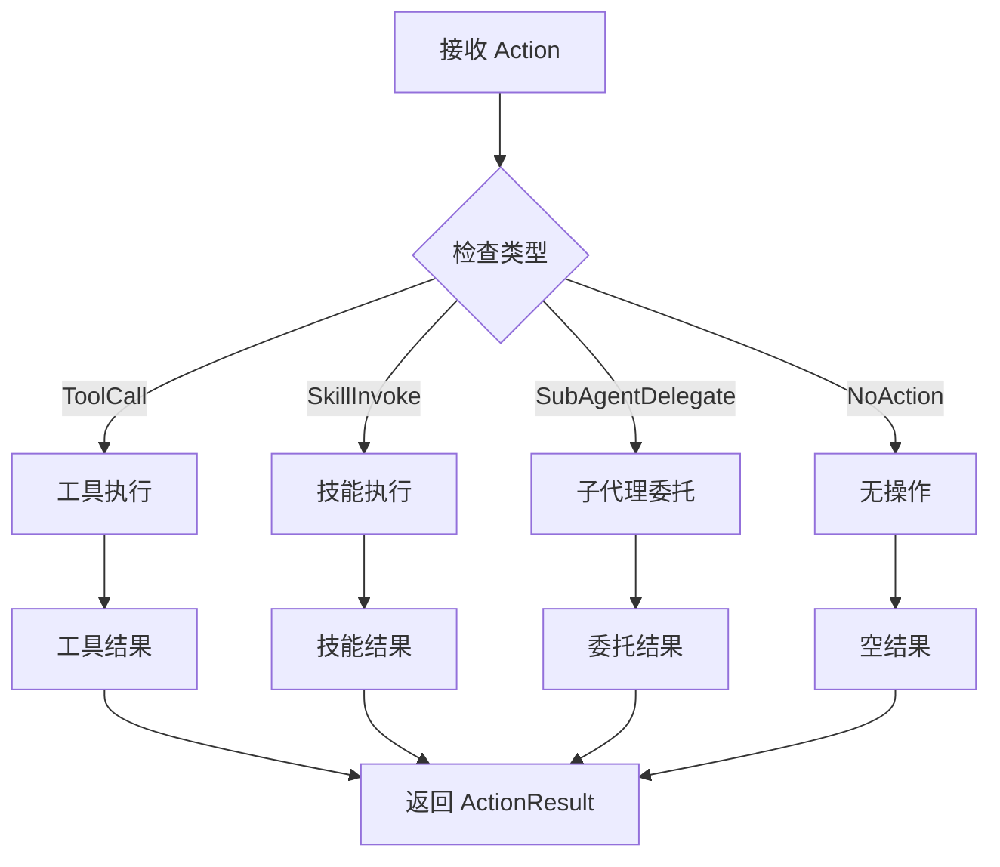

## 4. 工具执行

### 4.1 工具执行流程

```mermaid
sequenceDiagram
    participant Actor as 行动器
    participant Memory as 记忆
    participant Tool as 工具
    participant Executor as 执行器

    Actor->>Memory: GetNode(toolName, Tool)
    Memory-->>Actor: 返回 Tool 实例
    
    Actor->>Actor: 检查安全等级
    
    alt 安全等级不允许
        Actor-->>Actor: 返回权限错误
    end
    
    Actor->>Executor: Execute(tool, params)
    Executor->>Tool: Run(ctx, params)
    Tool-->>Executor: 返回结果
    Executor-->>Actor: 返回 ActionResult
```

### 4.2 安全等级控制

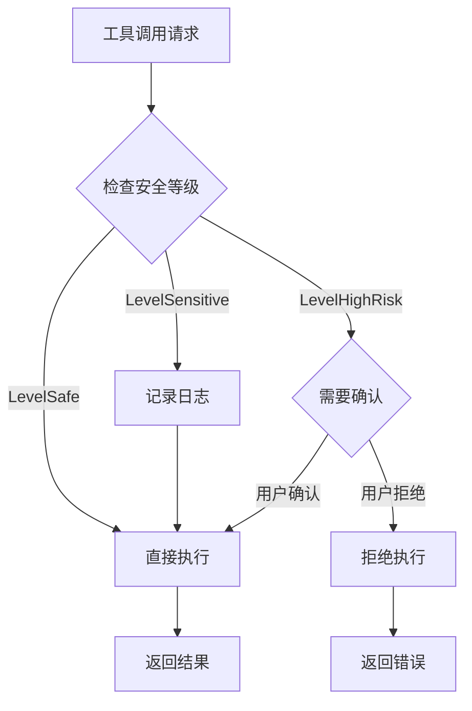

### 4.3 工具执行器接口

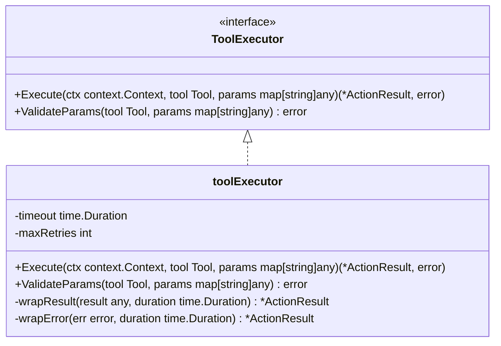

## 5. 技能执行

### 5.1 技能执行流程（带缓存）

```mermaid
sequenceDiagram
    participant Actor as 行动器
    participant Memory as 记忆
    participant Skill as 技能
    participant Plan as 执行计划
    participant Tools as 工具集

    Actor->>Memory: GetNode(skillName, SkillExecutionPlan)
    
    alt 缓存命中
        Memory-->>Actor: 返回 SkillExecutionPlan
        Actor->>Actor: 按步骤执行参数化节点
        
        loop 每个步骤
            Actor->>Tools: 执行工具
            Tools-->>Actor: 返回结果
        end
    else 缓存未命中
        Actor->>Memory: GetNode(skillName, Skill)
        Memory-->>Actor: 返回 Skill
        
        Actor->>Actor: compileSkill(skill)
        Actor->>Actor: 解析为参数化执行步骤
        Actor->>Memory: Store(SkillExecutionPlan)
        Memory-->>Actor: 存储成功
        
        Actor->>Actor: 按步骤执行
    end
    
    Actor-->>Actor: 返回 ActionResult
```

### 5.2 SkillExecutionPlan 结构

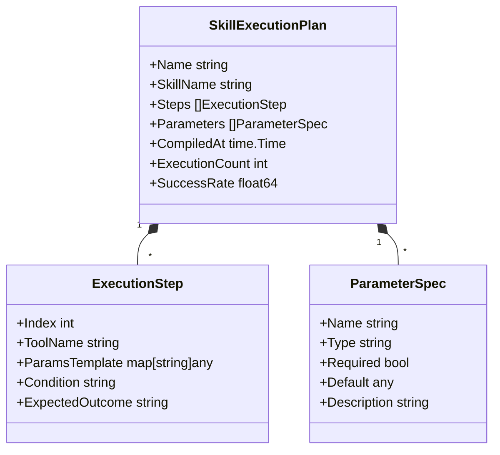

### 5.3 参数化执行与运行时上下文解析 (Runtime Context Resolver)

在执行编译后的 SkillExecutionPlan 时，计划中往往包含类似 `{{.target_file}}` 的参数模板。Actor 需要通过 **运行时上下文解析器 (Runtime Context Resolver)** 将对话意图转换为具体的执行参数（Slot Filling）。

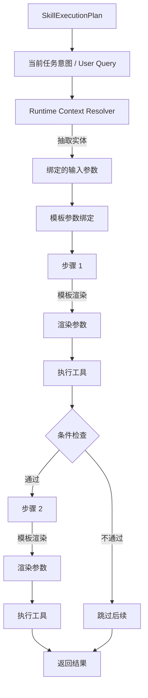

**解析逻辑说明**：
当 Thinker 决定调用某个 Skill 时，它仅仅给出了调用意图（如 `Invoke[code-review]`）。Actor 在加载 `SkillExecutionPlan` 后，调用 `Runtime Context Resolver`（通常是一个小型的、专门用于提取参数的 LLM prompt 或基于之前 Thinker 提取的 Entities），将当前记忆中的状态（State）映射为参数字典，填补 `ParamsTemplate` 中的空缺。如果缺少必要参数，Actor 也会拦截执行并触发请求用户提供信息的流程。

**参数模板示例**：

```json
{
  "steps": [
    {
      "index": 0,
      "tool": "glob",
      "params_template": {
        "pattern": "{{.file_pattern | default \"**/*.go\"}}"
      },
      "expected_outcome": "获取目标文件列表"
    },
    {
      "index": 1,
      "tool": "read",
      "params_template": {
        "file_path": "{{.steps[0].result.files[0]}}"
      },
      "condition": "{{.steps[0].result.files | len > 0}}"
    }
  ]
}
```

### 5.4 编译缓存更新

```mermaid
sequenceDiagram
    participant Actor as 行动器
    participant Memory as 记忆

    Actor->>Actor: 执行技能完成
    
    Actor->>Memory: UpdateExecutionStats(skillName, success)
    Memory->>Memory: 更新执行次数
    Memory->>Memory: 更新成功率
    
    alt 成功率下降
        Memory->>Memory: 标记需要重新编译
    end
```

## 6. 子代理委托

### 6.1 委托流程

```mermaid
sequenceDiagram
    participant Actor as 行动器
    participant Memory as 记忆
    participant SubAgent as 子代理
    participant Reactor as Reactor

    Actor->>Memory: GetNode(subAgentName, Agent)
    Memory-->>Actor: 返回 Agent 配置
    
    Actor->>SubAgent: 创建子代理实例
    Actor->>Reactor: NewEngine(subAgent, memory, tools)
    
    Actor->>Reactor: Execute(ctx, input)
    Reactor->>Reactor: 执行 ReAct 循环
    Reactor-->>Actor: 返回结果
    
    Actor->>Actor: 包装为 ActionResult
```

### 6.2 委托上下文传递

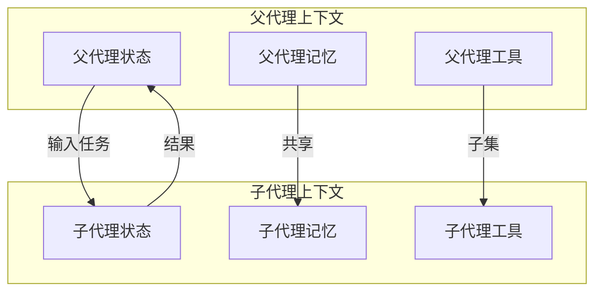

### 6.3 委托限制

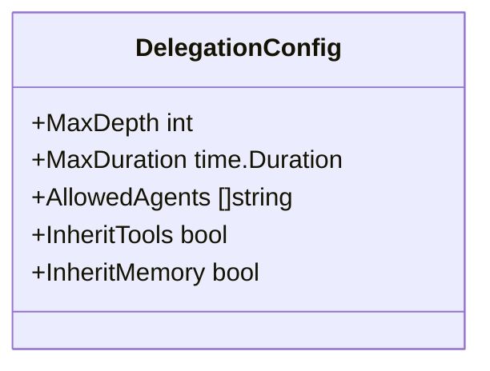

| 配置项 | 说明 | 默认值 |
|--------|------|--------|
| MaxDepth | 最大委托深度 | 3 |
| MaxDuration | 最大执行时间 | 5m |
| AllowedAgents | 允许委托的代理列表 | 空（允许所有） |
| InheritTools | 是否继承父代理工具 | true |
| InheritMemory | 是否继承父代理记忆 | true |

## 7. 行动验证

### 7.1 验证器接口

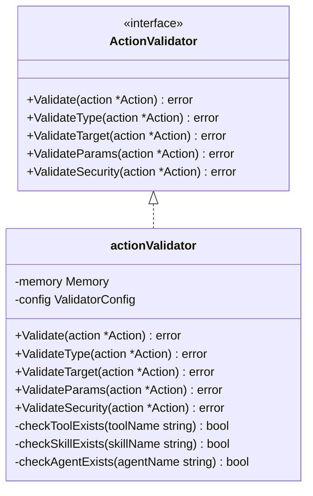

### 7.2 验证流程

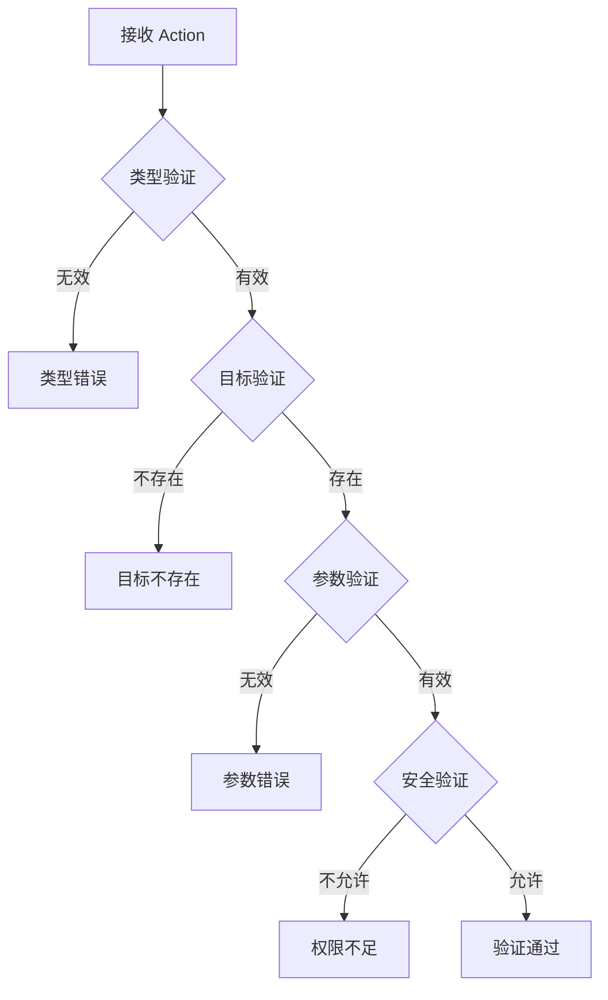

### 7.3 参数验证规则

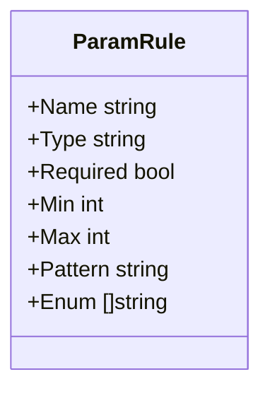

| 规则 | 说明 |
|------|------|
| Type | 参数类型（string, int, bool, array, object） |
| Required | 是否必填 |
| Min/Max | 数值/数组长度范围 |
| Pattern | 字符串正则模式 |
| Enum | 枚举值列表 |

## 8. 错误处理

### 8.1 错误类型

| 错误类型 | 说明 | 处理策略 |
|---------|------|---------|
| ValidationError | 验证失败 | 直接返回错误 |
| ToolNotFoundError | 工具不存在 | 返回错误，建议替代方案 |
| SkillNotFoundError | 技能不存在 | 返回错误，建议替代方案 |
| PermissionDeniedError | 权限不足 | 返回错误，记录日志 |
| TimeoutError | 执行超时 | 重试或返回错误 |
| ExecutionError | 执行失败 | 重试或返回错误 |

### 8.2 重试机制

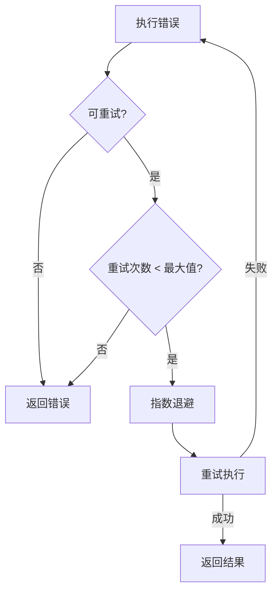

### 8.3 错误恢复

```mermaid
sequenceDiagram
    participant Actor as 行动器
    participant Engine as 引擎

    Actor->>Actor: 执行失败
    
    alt 可恢复错误
        Actor->>Actor: 尝试替代方案
        Actor->>Engine: 返回替代结果
    else 不可恢复错误
        Actor->>Engine: 返回详细错误信息
        Engine->>Engine: 触发反思或终止
    end
```

## 9. 与其他模块的关系

### 9.1 与 Reactor 的关系

```mermaid
graph LR
    subgraph Reactor[Reactor 引擎]
        Engine[Engine]
        Thinker[Thinker]
        Actor[Actor]
        Observer[Observer]
    end
    
    Thinker --> |Action| Engine
    Engine --> |Action| Actor
    Actor --> |ActionResult| Engine
    Engine --> |ActionResult| Observer
```

### 9.2 与 Memory 的关系

```mermaid
sequenceDiagram
    participant Actor as 行动器
    participant Memory as 记忆模块

    Actor->>Memory: GetNode(toolName, Tool)
    Memory-->>Actor: 返回 Tool 实例
    
    Actor->>Memory: GetNode(skillName, Skill)
    Memory-->>Actor: 返回 Skill 实例
    
    Actor->>Memory: GetNode(skillName, SkillExecutionPlan)
    Memory-->>Actor: 返回编译缓存
    
    Actor->>Memory: Store(SkillExecutionPlan)
    Memory-->>Actor: 存储成功
```

### 9.3 与 Tool 模块的关系

```mermaid
graph TB
    subgraph Actor[行动器]
        Executor[执行器]
        Validator[验证器]
    end
    
    subgraph ToolModule[工具模块]
        Tool[Tool 接口]
        Bash[Bash]
        Read[Read]
        Write[Write]
    end
    
    Executor --> Tool
    Validator --> Tool
    
    Tool <|.. Bash
    Tool <|.. Read
    Tool <|.. Write
```

## 10. 监控与可观测性

### 10.1 关键指标

| 指标 | 说明 |
|------|------|
| act_duration_ms | 行动执行耗时 |
| tool_execution_count | 工具执行次数 |
| skill_execution_count | 技能执行次数 |
| delegation_count | 委托次数 |
| cache_hit_rate | 缓存命中率 |
| error_rate | 错误率 |
| retry_count | 重试次数 |

### 10.2 日志记录

```
[Actor] session=session-001 step=5 action=tool_call target=bash duration=150ms success=true
[Actor] session=session-001 step=6 action=skill_invoke target=code-review cache_hit=true duration=2500ms
[Actor] session=session-001 step=7 action=delegate target=code-analyzer duration=5000ms
[Actor] session=session-001 step=8 error=TimeoutError tool=bash retry=1
```

## 11. 总结

行动器是 ReAct 循环的"手"，负责：
- 验证和执行各类行动
- 管理工具调用和技能执行
- 支持子代理委托
- 实现技能编译缓存优化

通过安全等级控制和完善的错误处理，行动器确保执行过程的安全性和可靠性。
