# Agent 模块设计

## 1. 模块概述

Agent（智能体）是 GoReAct 框架的**入口层**，是一个轻量级的配置单元。Agent 定义了"我是谁、我用什么"，然后将执行委托给 Reactor 引擎。

> **核心理念**：Agent 不做事，Agent 只定义。真正干活的是 Reactor。

### 1.1 正确的定位

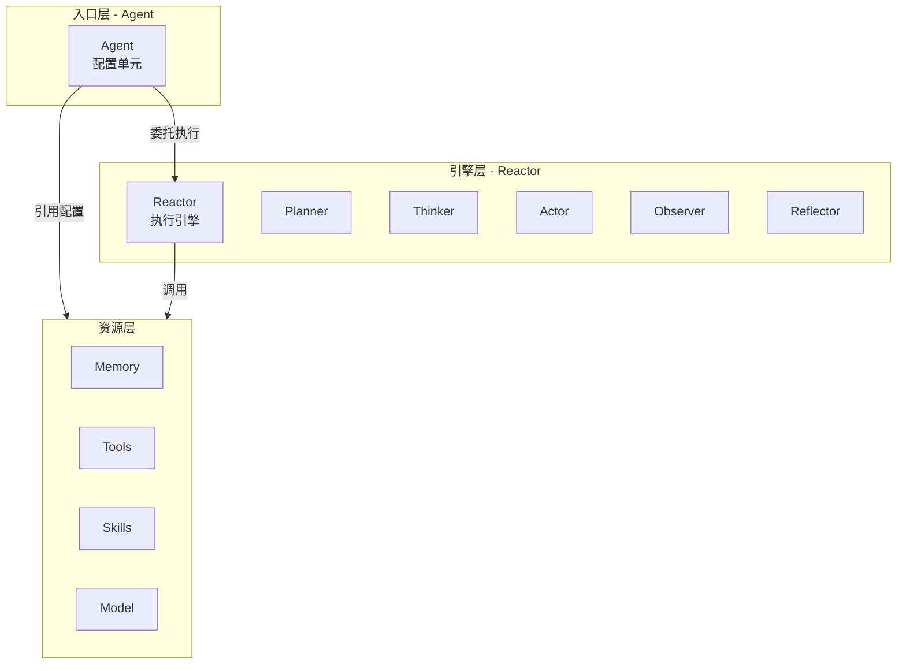

### 1.2 核心职责

- **身份定义**: 定义智能体的名称、领域、描述
- **资源配置**: 引用所需的模型、工具、技能
- **入口代理**: 作为用户与系统交互的入口
- **委托执行**: 将任务委托给 Reactor 执行

### 1.3 设计原则

- **轻量级**: Agent 只是一个配置容器，不包含执行逻辑
- **委托模式**: 所有执行逻辑委托给 Reactor
- **无状态设计**: Agent 不持有运行时状态，状态由 Reactor 管理
- **组合优于继承**: 通过组合资源配置，而非继承行为

## 2. Agent 是什么

### 2.1 Agent 不是什么

| 错误认知             | 正确认知                                 |
| -------------------- | ---------------------------------------- |
| Agent 是执行引擎     | Reactor 是执行引擎，Agent 是配置         |
| Agent 管理资源       | ResourceManager 管理资源，Agent 只是引用 |
| Agent 有生命周期     | Reactor 有执行状态，Agent 是无状态的     |
| Agent 负责调度       | Reactor 负责调度，Agent 只是入口         |
| Agent 有复杂的状态机 | Agent 是简单的配置结构                   |

### 2.2 Agent 是什么

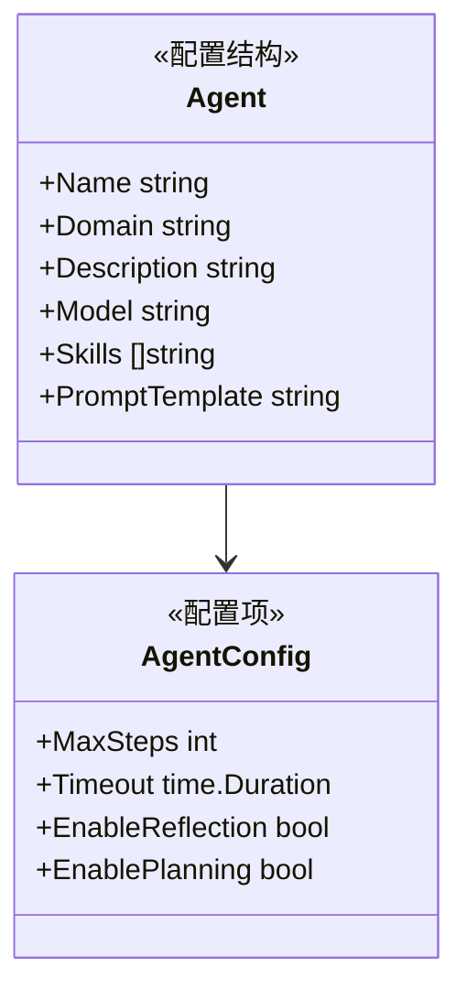

**Agent 本质上是一个配置清单**：

- 我是谁：名称、领域、描述
- 我用什么模型：Model
- 我掌握什么技能：Skills
- 我的职能是什么：PromptTemplate

## 3. 简化的接口设计

### 3.1 Agent 接口

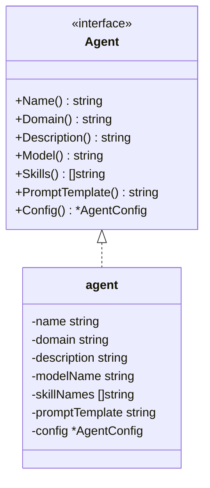

### 3.2 AgentConfig 配置

```go
type AgentConfig struct {
    MaxSteps         int           // 最大执行步数
    Timeout          time.Duration // 超时时间
    EnableReflection bool          // 是否启用反思
    EnablePlanning   bool          // 是否启用规划
    MaxRetries       int           // 最大重试次数
}
```

### 3.3 执行入口

Agent 提供唯一的交互入口 `Ask` 方法，开启整个思考过程：

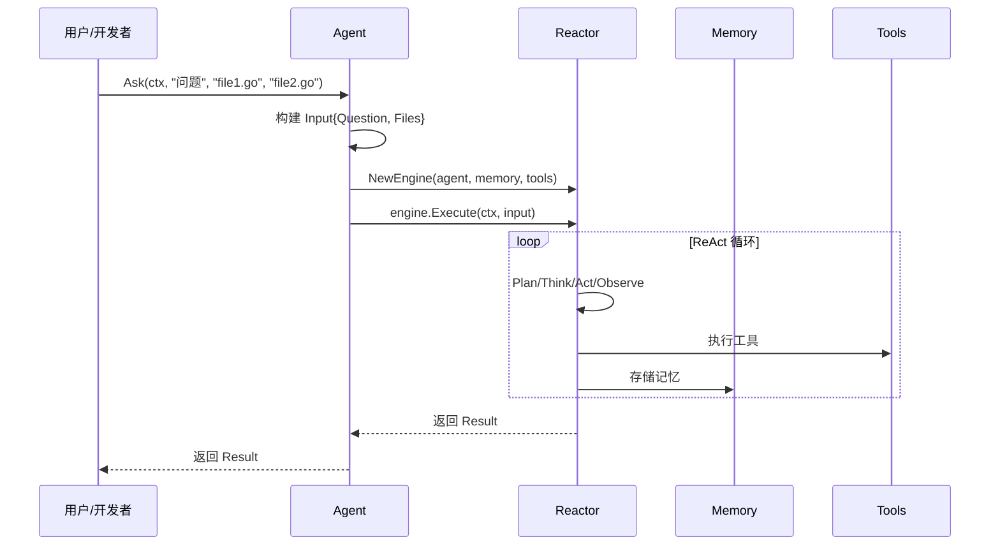

### 3.4 Ask 方法设计

```go
type Agent interface {
    Name() string
    Domain() string
    Description() string
    Model() string
    Skills() []string
    PromptTemplate() string
    Config() *AgentConfig
    
    // 同步调用
    Ask(ctx context.Context, question string, files ...string) (*Result, error)
    Resume(ctx context.Context, sessionName string, answer string) (*Result, error)
    
    // 流式调用：返回一个 Channel，实时传输 ThoughtEvent, ToolCallEvent, OutputEvent 等
    AskStream(ctx context.Context, question string, files ...string) (<-chan any, error)
    ResumeStream(ctx context.Context, sessionName string, answer string) (<-chan any, error)
}

type Input struct {
    Question string
    Files    []string
    Context  map[string]any
}

type Result struct {
    Answer          string
    Confidence      float64
    Status          Status
    SessionName     string
    PendingQuestion *PendingQuestion
    Trajectory      *Trajectory
    Reflections     []*Reflection
    TokenUsage      *TokenUsage
}

type Status int

const (
    StatusCompleted Status = iota
    StatusPending
    StatusFailed
)

type PendingQuestion struct {
    ID            string
    Type          QuestionType
    Question      string
    Options       []string
    DefaultAnswer string
    Context       map[string]any
}

type QuestionType int

const (
    QuestionAuthorization QuestionType = iota
    QuestionConfirmation
    QuestionClarification
    QuestionCustomInput
)
```

**Ask 方法参数说明**：

| 参数     | 类型            | 说明                           |
| -------- | --------------- | ------------------------------ |
| ctx      | context.Context | 上下文控制                     |
| question | string          | 用户的问题                     |
| files    | ...string       | 可选的文件路径，用于上下文注入 |

**Resume 方法参数说明**：

| 参数        | 类型            | 说明             |
| ----------- | --------------- | ---------------- |
| ctx         | context.Context | 上下文控制       |
| sessionName | string          | 会话标识         |
| answer      | string          | 用户对问题的回答 |

**Ask 方法返回值**：

| 字段            | 类型             | 说明                   |
| --------------- | ---------------- | ---------------------- |
| Answer          | string           | 最终答案               |
| Confidence      | float64          | 答案置信度             |
| Status          | Status           | 执行状态               |
| SessionName     | string           | 会话标识（用于恢复）   |
| PendingQuestion | *PendingQuestion | 待回答的问题（暂停时） |
| Trajectory      | *Trajectory      | 完整执行轨迹           |
| Reflections     | []*Reflection    | 执行过程中的反思       |
| TokenUsage      | *TokenUsage      | Token 使用统计         |

### 3.5 使用示例

**基本使用**：

```go
agent := goreact.GetAgent("code-reviewer")

result, err := agent.Ask(ctx, 
    "请审查这段代码的安全性",
    "main.go",
    "handler.go",
)

fmt.Println(result.Answer)
fmt.Printf("Token 使用: 输入=%d, 输出=%d\n", 
    result.TokenUsage.InputTokens,
    result.TokenUsage.OutputTokens,
)
```

**暂停-恢复使用**：

```go
agent := goreact.GetAgent("file-manager")

result, err := agent.Ask(ctx, "请删除 temp 目录下的所有文件")
if err != nil {
    panic(err)
}

if result.Status == goreact.StatusPending {
    fmt.Printf("需要确认: %s\n", result.PendingQuestion.Question)
    fmt.Printf("选项: %v\n", result.PendingQuestion.Options)
    
    answer := getUserInput()
    
    result, err = agent.Resume(ctx, result.SessionName, answer)
    if err != nil {
        panic(err)
    }
}

fmt.Println(result.Answer)
```

## 4. 与其他模块的关系

### 4.1 与 Reactor 的关系

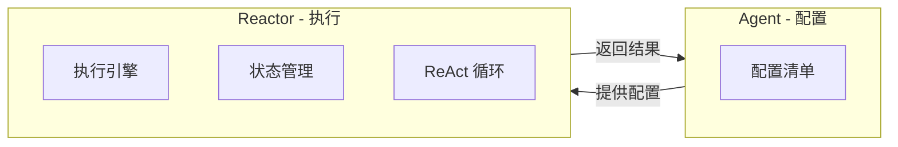

**关系说明**：

- Agent 提供：身份信息、资源配置、执行参数
- Reactor 提供：执行引擎、状态管理、循环控制
- Agent 不持有 Reactor 实例，每次执行时创建

### 4.2 与 ResourceManager 的关系

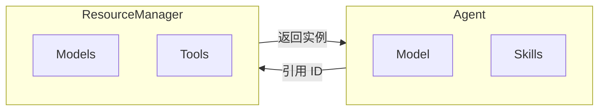

**关系说明**：

- Agent 只持有资源引用，不持有资源实例
- ResourceManager 负责资源的注册和管理
- 执行时通过 ResourceManager 解析资源

### 4.3 与 Memory 的关系

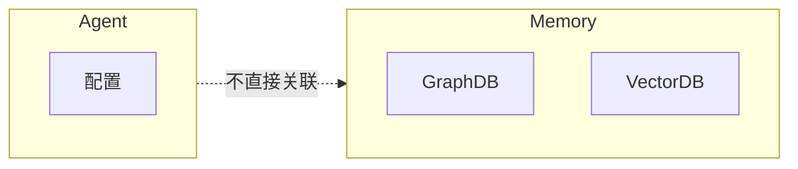

**关系说明**：

- Agent 不直接持有 Memory
- Memory 由 Reactor 在执行时使用
- Memory 存储会话、反思、计划等

## 5. Agent 定义示例

### 5.1 YAML 定义

```yaml
name: Code Review Agent
domain: code-review
description: 专业的代码审查智能体，能够分析代码质量、发现潜在问题
model: gpt-4
skills:
  - code-analysis
  - best-practices
prompt_template: |
  你是一个专业的代码审查助手。
  请仔细分析代码，指出潜在问题和改进建议。
config:
  max_steps: 20
  timeout: 5m
  enable_reflection: true
  enable_planning: true
```

## 6. Agent 注册与发现

### 6.1 简化的注册中心

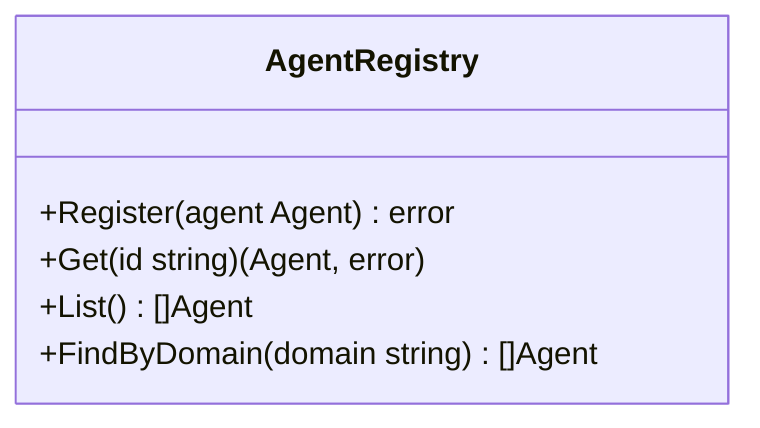

**简化说明**：

- 只保留基本的注册和查询功能
- 不需要健康检查、能力发现等复杂功能
- Agent 是无状态的，不需要生命周期管理

### 6.2 发现机制

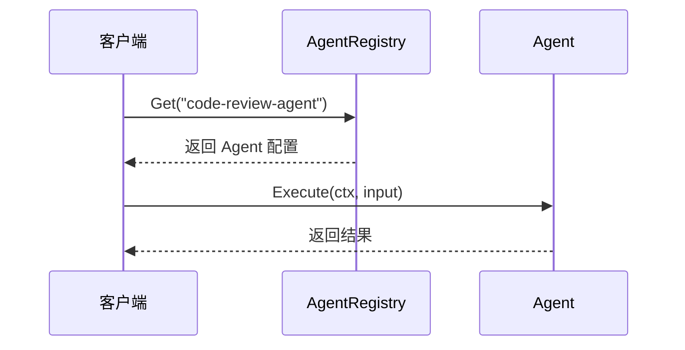

## 7. 多 Agent 协作

### 7.1 协作模式

多 Agent 协作通过 **Reactor 的 SubAgent 机制** 实现，而不是 Agent 层面的 Master-Worker：

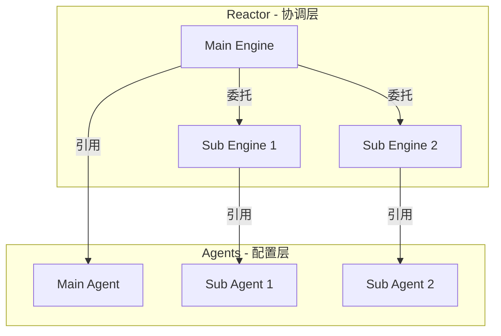

### 7.2 协作流程

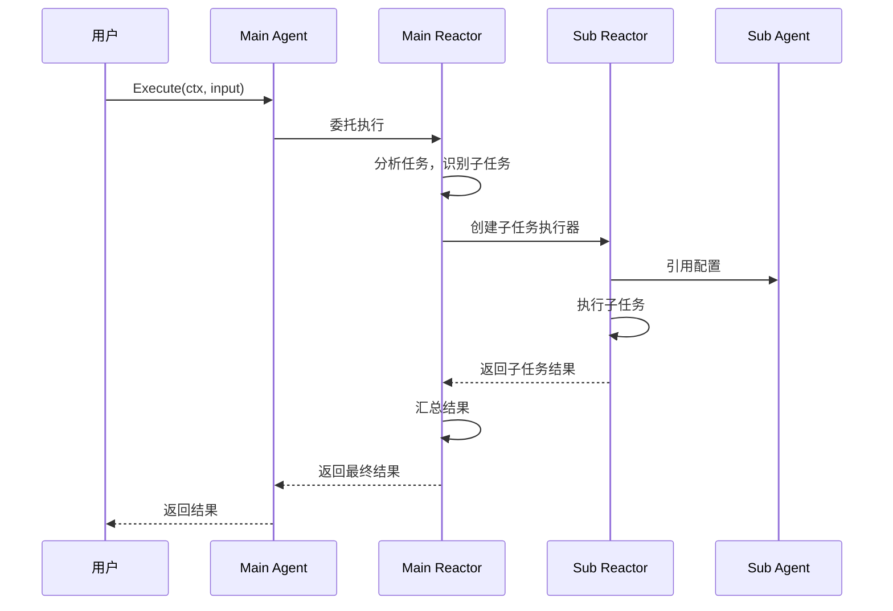

**关键点**：

- Agent 只是配置，不负责协调
- Reactor 负责任务分解和协调
- 通过 Reactor 的 SubAgent 能力实现协作

## 8. 错误处理

### 8.1 错误来源

Agent 层面的错误只有两种：

1. **配置错误**: Agent 配置不完整或无效
2. **资源引用错误**: 引用的资源不存在

### 8.2 执行错误

执行过程中的错误由 Reactor 处理：

- 工具执行失败
- 模型调用失败
- 超时
- 重试

Agent 不参与错误处理逻辑。

## 9. 配置选项

| 配置项           | 说明         | 默认值 |
| ---------------- | ------------ | ------ |
| MaxSteps         | 最大执行步数 | 10     |
| Timeout          | 超时时间     | 30s    |
| EnableReflection | 是否启用反思 | true   |
| EnablePlanning   | 是否启用规划 | true   |
| MaxRetries       | 最大重试次数 | 3      |

## 10. 总结

### 10.1 设计对比

| 方面       | 旧设计                                    | 新设计             |
| ---------- | ----------------------------------------- | ------------------ |
| 定位       | 执行引擎                                  | 配置单元           |
| 职责       | 执行、调度、资源管理                      | 身份定义、资源配置 |
| 状态       | 有状态、生命周期                          | 无状态、简单配置   |
| 复杂度     | 高（Master/Worker/Registry/Factory/Pool） | 低（配置 + 委托）  |
| 与 Reactor | Agent 内置 Reactor                        | Agent 委托 Reactor |

### 10.2 核心理念

1. **Agent 不做事，Agent 只定义**
   - Agent 是配置清单，不是执行引擎
   - 执行逻辑全部委托给 Reactor
2. **无状态设计**
   - Agent 不持有运行时状态
   - 状态由 Reactor 在执行时管理
3. **单一职责**
   - Agent 只负责"我是谁、我用什么"
   - 不涉及调度、协调、生命周期管理
4. **组合优于继承**
   - 通过组合资源配置定义 Agent
   - 不通过继承定义行为

### 10.3 与其他模块的协作

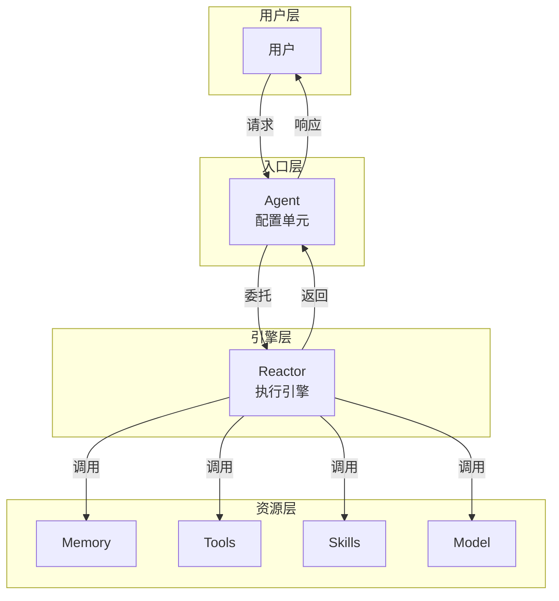

这种设计使得 Agent 模块保持极简，符合"不求多，只求实用"的理念，同时与 Reactor、Memory、Tool 等模块职责清晰、边界分明。
