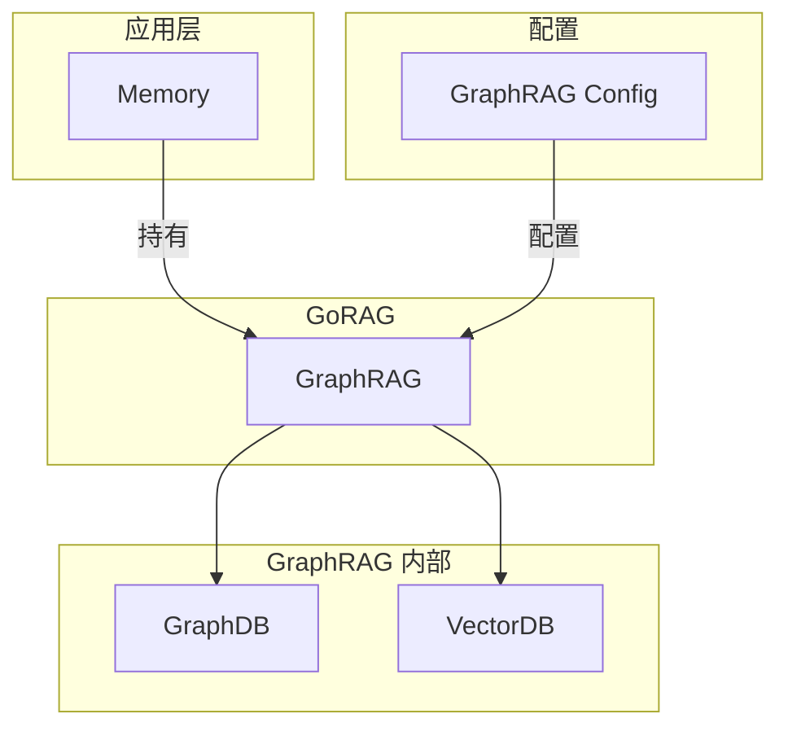

# 配置与存储后端

> **相关文档**: [Memory 模块概述](memory-module.md) | [接口设计](memory-interfaces.md)

本文档详细描述 Memory 模块的配置方式。Memory 通过 GraphRAG 进行所有存储操作，配置实际上是传给 GraphRAG。

## 1. 架构关系



**关键点**：
- Memory 不直接配置存储，而是配置 GraphRAG
- 存储后端的选择和配置由 GraphRAG 管理
- Memory 只关心 GraphRAG 提供的接口

## 2. 配置方式

### 2.1 代码配置

```go
import (
    "github.com/DotNetAge/gorag/pkg/pattern"
    "github.com/DotNetAge/goreact/pkg/memory"
)

func main() {
    // 创建 GraphRAG 实例
    graphRAG, err := pattern.GraphRAG("goreact-memory",
        // 多模态嵌入模型（自动下载）
        pattern.WithCLIP("clip-vit-base-patch32"),
        
        // 图数据库（可选，默认使用本地存储）
        pattern.WithNeoGraph("bolt://localhost:7687", "neo4j", "password", "neo4j"),
        
        // 向量存储（可选，默认使用本地存储）
        pattern.WithMilvus("goreact_memory", "localhost:19530", 512),
    )
    
    // 创建 Memory
    mem := memory.NewMemory(graphRAG,
        memory.WithSessionConfig(sessionConfig),
        memory.WithEvolutionConfig(evolutionConfig),
    )
}
```

### 2.2 YAML 配置

```yaml
memory:
  # GraphRAG 配置
  graph_rag:
    name: "goreact-memory"
    embedding: "clip-vit-base-patch32"
    
    # 图数据库配置
    graph:
      type: neo4j
      uri: "bolt://localhost:7687"
      database: "goreact"
      username: "neo4j"
      password: "${NEO4J_PASSWORD}"
    
    # 向量存储配置
    vector:
      type: milvus
      address: "localhost:19530"
      collection: "goreact_memory"
      dimension: 768
  
  # Memory 子模块配置
  session:
    max_history_turns: 10
    context_window: 4000
    enable_auto_save: true
    
  evolution:
    enabled: true
    trigger: on_session_end
    skill_threshold: 2
    tool_threshold: 3
    
  reflection:
    enabled: true
    min_score_threshold: 0.6
    retention_days: 30
    
  plan:
    enable_reuse: true
    similarity_threshold: 0.7
    
  short_term_memory:
    enabled: true
    max_items: 50
    importance_threshold: 0.7
```

## 3. GraphRAG 配置选项

### 3.1 嵌入模型

| 选项                  | 说明               | 示例                                |
| --------------------- | ------------------ | ----------------------------------- |
| `WithCLIP(modelName)` | 多模态 CLIP 模型   | `WithCLIP("clip-vit-base-patch32")` |
| `WithBGE(modelName)`  | 中文 BGE 模型      | `WithBGE("bge-small-zh-v1.5")`      |
| `WithBERT(modelName)` | 英文 Sentence-BERT | `WithBERT("all-MiniLM-L6-v2")`      |

**可用模型**：

| 模型                    | 类型 | 维度 | 说明         |
| ----------------------- | ---- | ---- | ------------ |
| `clip-vit-base-patch32` | CLIP | 512  | 多模态嵌入   |
| `bge-small-zh-v1.5`     | BGE  | 512  | 中文小模型   |
| `bge-base-zh-v1.5`      | BGE  | 768  | 中文基础模型 |
| `all-MiniLM-L6-v2`      | BERT | 384  | 英文小模型   |

### 3.2 图数据库

| 选项                                | 说明             |
| ----------------------------------- | ---------------- |
| `WithNeoGraph(uri, user, pass, db)` | Neo4j 图数据库   |
| `WithMemGraph(uri)`                 | Memgraph 内存图  |
| 默认                                | 本地 BoltDB 存储 |

**Neo4j 配置示例**：

```go
pattern.WithNeoGraph(
    "bolt://localhost:7687",  // URI
    "neo4j",                  // 用户名
    "password",               // 密码
    "goreact",                // 数据库名
)
```

### 3.3 向量存储

| 选项                                | 说明               |
| ----------------------------------- | ------------------ |
| `WithMilvus(collection, addr, dim)` | Milvus 向量存储    |
| `WithQdrant(collection, addr)`      | Qdrant 向量存储    |
| 默认                                | 本地 GoVector 存储 |

**Milvus 配置示例**：

```go
pattern.WithMilvus(
    "goreact_memory",    // Collection 名称
    "localhost:19530",   // 地址
    1536,                // 向量维度
)
```

## 4. Memory 子模块配置

### 4.1 SessionConfig

```go
type SessionConfig struct {
    MaxHistoryTurns  int           // 最大历史轮数，默认 10
    ContextWindow    int           // 上下文窗口大小，默认 4000
    EnableAutoSave   bool          // 启用自动保存，默认 true
    SaveInterval     time.Duration // 保存间隔，默认 30s
}
```

### 4.2 EvolutionConfig

```go
type EvolutionConfig struct {
    Enabled         bool              // 启用进化，默认 true
    Trigger         EvolutionTrigger  // 触发时机
    SkillThreshold  int               // Skill 生成阈值，默认 2
    ToolThreshold   int               // Tool 生成阈值，默认 3
}

type EvolutionTrigger string

const (
    TriggerOnSessionEnd EvolutionTrigger = "on_session_end"
    TriggerOnSchedule   EvolutionTrigger = "on_schedule"
    TriggerManual       EvolutionTrigger = "manual"
)
```

### 4.3 ReflectionConfig

```go
type ReflectionConfig struct {
    Enabled            bool    // 启用反思，默认 true
    MinScoreThreshold  float64 // 最低质量分数，默认 0.6
    MaxPerDay          int     // 每日最大反思数，默认 100
    RetentionDays      int     // 保留天数，默认 30
}
```

### 4.4 PlanConfig

```go
type PlanConfig struct {
    EnableReuse        bool    // 启用计划复用，默认 true
    SimilarityThreshold float64 // 相似度阈值，默认 0.7
    MaxSteps           int     // 最大步骤数，默认 20
    RetentionDays      int     // 保留天数，默认 90
}
```

### 4.5 ShortTermMemoryConfig

```go
type ShortTermMemoryConfig struct {
    Enabled              bool    // 启用短期记忆，默认 true
    MaxItems             int     // 最大记忆项数，默认 50
    ImportanceThreshold  float64 // 重要性阈值，默认 0.7
    EnableAutoExtraction bool    // 启用自动提取，默认 true
}
```

## 5. 配置加载

### 5.1 从文件加载

```go
import (
    "github.com/DotNetAge/goreact/pkg/config"
    "github.com/DotNetAge/goreact/pkg/memory"
)

func main() {
    // 加载配置文件
    cfg, err := config.Load("config.yaml")
    if err != nil {
        panic(err)
    }
    
    // 创建 Memory
    mem, err := memory.NewFromConfig(cfg.Memory)
    if err != nil {
        panic(err)
    }
}
```

### 5.2 配置验证

```go
// 验证配置
if err := cfg.Memory.Validate(); err != nil {
    panic(err)
}
```

## 6. 环境变量

支持通过环境变量配置敏感信息：

```yaml
memory:
  graph_rag:
    graph:
      password: "${NEO4J_PASSWORD}"
```

**常用环境变量**：

| 变量名           | 说明           |
| ---------------- | -------------- |
| `NEO4J_PASSWORD` | Neo4j 密码     |
| `NEO4J_URI`      | Neo4j 连接地址 |
| `MILVUS_ADDRESS` | Milvus 地址    |

## 7. 配置最佳实践

### 7.1 开发环境

```go
// 开发环境：使用本地存储
graphRAG, _ := pattern.GraphRAG("dev-memory",
    pattern.WithCLIP("clip-vit-base-patch32"),
    // 使用默认本地存储，无需额外配置
)

memory := memory.NewMemory(graphRAG)
```

### 7.2 生产环境

```go
// 生产环境：使用 Neo4j + Milvus
graphRAG, _ := pattern.GraphRAG("prod-memory",
    pattern.WithCLIP("clip-vit-base-patch32"),
    pattern.WithNeoGraph(
        os.Getenv("NEO4J_URI"),
        os.Getenv("NEO4J_USER"),
        os.Getenv("NEO4J_PASSWORD"),
        "goreact",
    ),
    pattern.WithMilvus(
        "goreact_memory",
        os.Getenv("MILVUS_ADDRESS"),
        512,
    ),
)

memory := memory.NewMemory(graphRAG,
    memory.WithSessionConfig(memory.SessionConfig{
        MaxHistoryTurns: 20,
        ContextWindow:   8000,
    }),
)
```

### 7.3 配置建议

| 场景 | 嵌入模型              | 图数据库   | 向量存储    |
| ---- | --------------------- | ---------- | ----------- |
| 开发 | clip-vit-base-patch32 | 本地存储   | 本地存储    |
| 测试 | clip-vit-base-patch32 | Neo4j      | Milvus      |
| 生产 | clip-vit-base-patch32 | Neo4j 集群 | Milvus 集群 |
