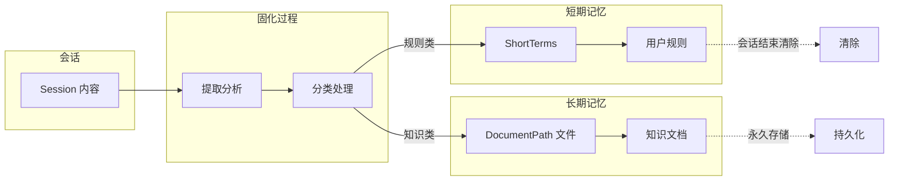
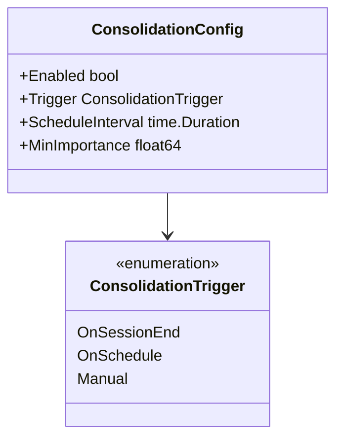
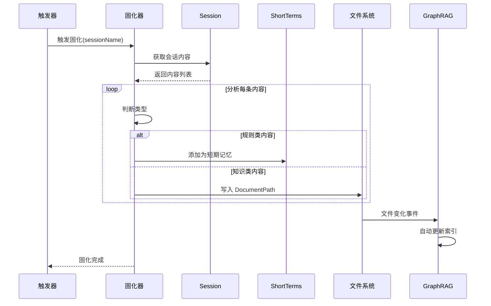
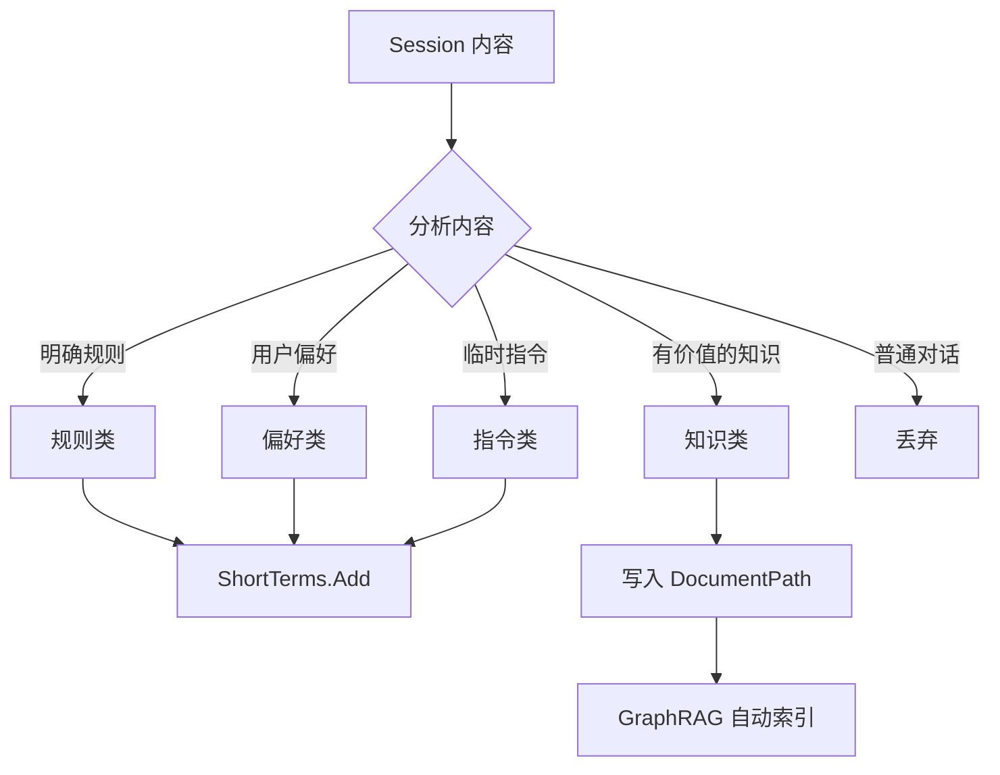
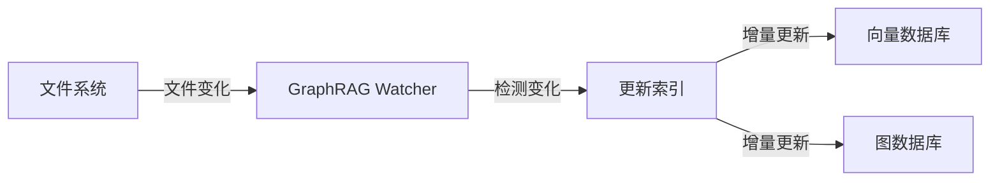

# 记忆固化

> **相关文档**: [Memory 模块概述](memory-module.md) | [短期记忆](memory-short-term.md) | [会话管理](memory-session.md)

记忆固化（Memory Consolidation）是将 Session 中的内容提取为短期记忆或长期记忆的过程：
- Session 内容 → 短期记忆（用户定义的规则）
- Session 内容 → 长期记忆（DocumentPath 下的文件）

**重要说明**：长期记忆不需要通过接口访问，直接操作 DocumentPath 下的文件即可，GraphRAG 会自动同步索引。

## 1. 固化概述



**固化方向**：

| 目标     | 来源               | 说明                                |
| -------- | ------------------ | ----------------------------------- |
| 短期记忆 | Session 提取的规则 | 用户定义的规则、偏好、指令          |
| 长期记忆 | Session 提取的知识 | 有价值的知识文档，写入 DocumentPath |

## 2. 固化触发机制



**触发方式说明**：

| 触发方式     | 说明                   |
| ------------ | ---------------------- |
| OnSessionEnd | 会话结束时自动触发     |
| OnSchedule   | 定时触发（如每天凌晨） |
| Manual       | 手动触发               |

## 3. 固化流程



## 4. 内容分类

固化器分析 Session 内容并分类处理：



**分类规则**：

| 类型     | 判断标准                   | 处理方式          |
| -------- | -------------------------- | ----------------- |
| 规则类   | 包含"必须"、"禁止"等指令词 | 转为 ShortTerm    |
| 偏好类   | 表达用户倾向、习惯         | 转为 ShortTerm    |
| 指令类   | 明确的行为指导             | 转为 ShortTerm    |
| 知识类   | 有价值的可复用信息         | 写入 DocumentPath |
| 普通对话 | 日常交互内容               | 丢弃              |

## 5. 短期记忆固化

将 Session 内容提取为用户定义的规则：

```go
consolidator := NewConsolidator(memory)

// 会话结束时固化
func OnSessionEnd(sessionName string) {
    // 分析会话内容，提取规则
    rules := consolidator.ExtractRules(ctx, sessionName)
    
    // 添加为短期记忆
    for _, rule := range rules {
        memory.ShortTerms().Add(ctx, sessionName, &MemoryItem{
            Type:    rule.Type,   // Rule/Preference/Instruction/Constraint
            Content: rule.Content,
        })
    }
}
```

## 6. 长期记忆固化

将 Session 内容写入 DocumentPath 文件：

```go
consolidator := NewConsolidator(memory, resourceManager.DocumentPath)

// 固化知识到长期记忆
func ConsolidateKnowledge(sessionName string) {
    // 分析会话内容，提取知识
    knowledge := consolidator.ExtractKnowledge(ctx, sessionName)
    
    for _, item := range knowledge {
        // 写入 DocumentPath
        path := filepath.Join(
            resourceManager.DocumentPath,
            "knowledge",
            fmt.Sprintf("%s.md", item.Title),
        )
        os.WriteFile(path, []byte(item.Content), 0644)
        
        // GraphRAG 自动监听文件变化并更新索引
    }
}
```

**GraphRAG 自动同步**：



GraphRAG 会自动监听 DocumentPath 目录的文件变化，无需手动调用索引接口。

## 7. 配置文件结构

长期记忆文件在 DocumentPath 下的组织方式：

```
DocumentPath/
├── knowledge/              # 固化知识存储目录
│   ├── sessions/          # 按会话整理
│   │   ├── 2024-01/
│   │   │   ├── session-001.md
│   │   │   └── session-002.md
│   │   └── 2024-02/
│   │       └── session-003.md
│   └── extracted/         # 提取的独立知识
│       ├── topic-a.md
│       └── topic-b.md
├── guides/                 # 指南文档
└── references/            # 参考资料
```

## 8. 最佳实践

### 8.1 规则提取

```go
// 识别规则类内容
func isRuleContent(content string) bool {
    ruleKeywords := []string{"必须", "禁止", "要记住", "不要", "记住"}
    for _, kw := range ruleKeywords {
        if strings.Contains(content, kw) {
            return true
        }
    }
    return false
}
```

### 8.2 知识提取

```go
// 识别知识类内容
func isKnowledgeContent(content string) bool {
    // 包含技术概念、解决方案、步骤说明等
    knowledgeIndicators := []string{"如何", "解决", "步骤", "方法", "原因"}
    for _, ind := range knowledgeIndicators {
        if strings.Contains(content, ind) {
            return true
        }
    }
    return false
}
```

### 8.3 文件命名

```go
// 生成有意义的文件名
func generateFileName(content string, sessionName string) string {
    // 提取标题或使用会话名
    title := extractTitle(content)
    if title == "" {
        title = sessionName
    }
    slug := strings.ToLower(strings.ReplaceAll(title, " ", "-"))
    return fmt.Sprintf("%s.md", slug[:min(len(slug), 50)])
}
```
