# 进化功能

> **相关文档**: [Memory 模块概述](memory-module.md) | [节点类型定义](memory-nodes.md) | [接口设计](memory-interfaces.md)

进化（Evolution）是 Memory 的核心能力，使系统能够从会话内容中自主学习，生成短期记忆、Skill 和 Tool，实现从经验积累到能力进化的闭环。

## 1. 进化概述

进化功能通过分析已完成的会话内容，自动识别可复用的知识模式，并通过相应的访问器存储：

- **短期记忆** → `ShortTerms()` 访问器
- **Skill** → `Skills()` 访问器
- **Tool** → `Tools()` 访问器

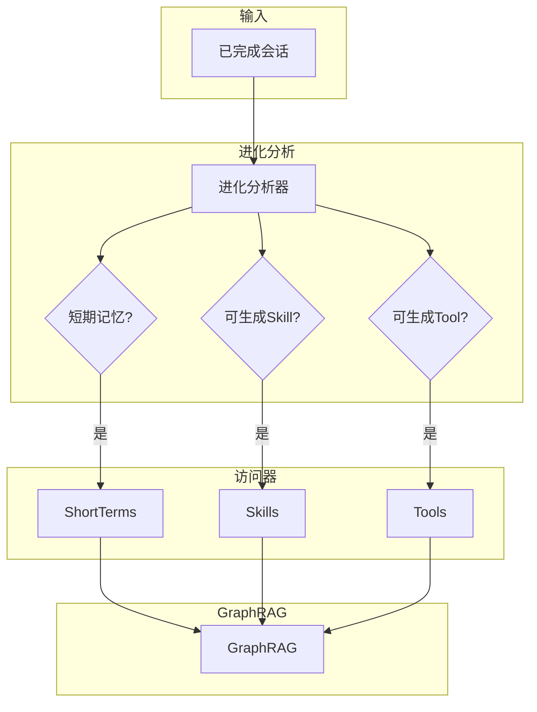

### 1.1 进化三要素

| 要素     | 说明                           | 访问器       | 触发条件             |
| -------- | ------------------------------ | ------------ | -------------------- |
| 短期记忆 | 从会话中提取重要信息           | ShortTerms() | 内容重要性 > 阈值    |
| Skill    | 将重复模式封装为可复用流程     | Skills()     | 相似操作出现 >= 2 次 |
| Tool     | 将简单重复任务自动化为代码工具 | Tools()      | 相同操作出现 >= 3 次 |

## 2. 进化器接口

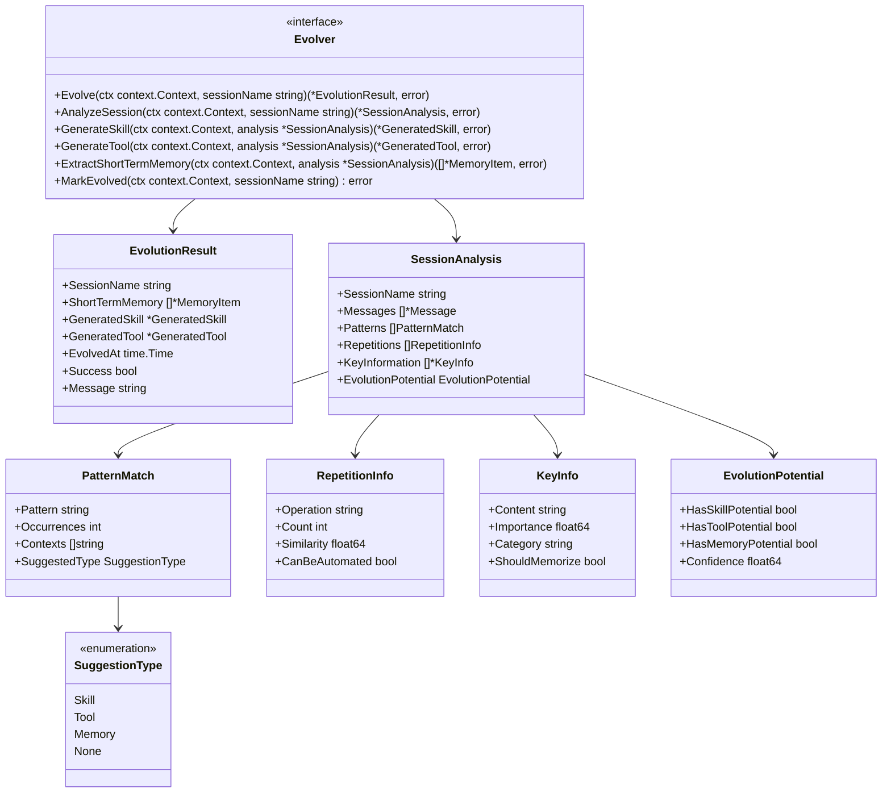

## 3. 进化流程

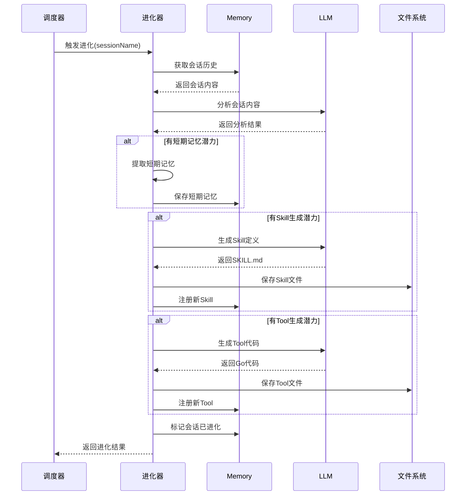

## 4. Skill 自动生成

当检测到会话中存在可复用的操作模式时，自动生成 Skill：

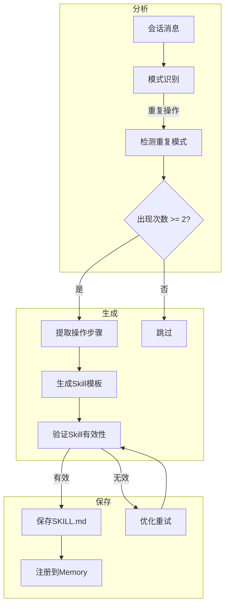

### 4.1 GeneratedSkill 与 Skill 的区别

**GeneratedSkill/GeneratedTool** 是进化流程中的**临时数据结构**，用于描述"如何生成"一个新资源；而 **Skill/Tool** 是 Memory 中的**持久化节点**，描述"已存在"的资源。

```mermaid
flowchart TB
    subgraph 进化流程
        A[会话分析] --> B[GeneratedSkill/GeneratedTool]
        B --> |临时数据结构<br/>描述"如何生成"| C[保存文件]
        C --> |持久化| D[SKILL.md / .py / .sh]
    end
    
    subgraph 加载流程
        D --> E[Memory.Load]
        E --> F[Skill/Tool 节点]
        F --> |长期存储<br/>运行时元数据| G[GraphRAG]
    end
    
    B -.-> |进化完成后消失| H((内存))
    F --> I[后续会话可用]
```

| 特性         | GeneratedSkill/GeneratedTool   | Skill/Tool 节点                    |
| ------------ | ------------------------------ | ---------------------------------- |
| **性质**     | 进化流程中的临时数据结构       | Memory 中的持久化节点              |
| **生命周期** | 进化过程中短暂存在             | 长期存储在 GraphRAG 中             |
| **用途**     | 描述"如何生成"一个新资源       | 描述"已存在"的资源                 |
| **存储位置** | 内存中，进化完成后消失         | GraphRAG 图谱中                    |
| **创建方式** | Evolver 分析会话后生成         | Memory.Load() 加载静态文件         |
| **包含信息** | 生成元数据（来源会话、时间等） | 运行时元数据（调用次数、成功率等） |

### 4.2 GeneratedSkill 结构

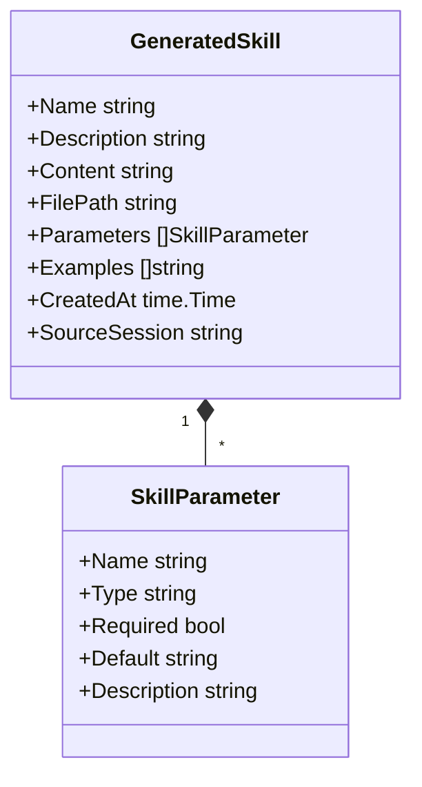

### 4.3 Skill 生成示例

```markdown
# 数据分析报告生成

## 描述
根据用户提供的原始数据，自动生成结构化的分析报告。

## 参数
- data_source: 数据来源路径（必需）
- report_type: 报告类型（可选，默认：summary）
- output_format: 输出格式（可选，默认：markdown）

## 步骤
1. 读取并验证数据源
2. 执行数据分析
3. 生成可视化图表
4. 输出结构化报告

## 示例
用户：帮我分析 sales.csv 生成一份销售报告
系统：[执行 Skill] 生成报告...
```

## 5. Tool 自动生成

当检测到简单重复的代码操作时，自动生成 Tool。生成的工具可以是 Python 脚本或 CLI 命令，通过 Bash 包装执行：

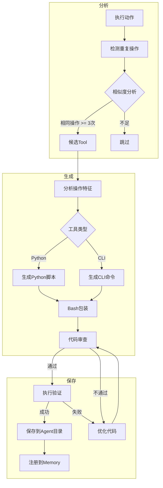

### 5.1 GeneratedTool 结构

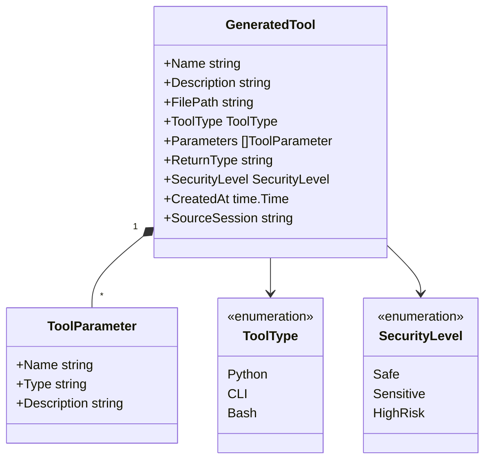

### 5.2 Python Tool 示例

```python
#!/usr/bin/env python3
# Auto-generated tool: format_json
# Description: 格式化JSON字符串
# Source: session-2024-01-15-001

import json
import sys

def format_json(raw_json: str, indent: str = "  ") -> dict:
    """
    格式化JSON字符串
    
    Args:
        raw_json: 原始JSON字符串
        indent: 缩进字符，默认为两个空格
    
    Returns:
        包含格式化结果的字典
    """
    try:
        obj = json.loads(raw_json)
        formatted = json.dumps(obj, indent=indent, ensure_ascii=False)
        return {
            "formatted": formatted,
            "success": True
        }
    except json.JSONDecodeError as e:
        return {
            "formatted": "",
            "success": False,
            "error": str(e)
        }

if __name__ == "__main__":
    import argparse
    parser = argparse.ArgumentParser()
    parser.add_argument("--raw-json", required=True)
    parser.add_argument("--indent", default="  ")
    args = parser.parse_args()
    
    result = format_json(args.raw_json, args.indent)
    print(json.dumps(result))
```

**Bash 包装执行**：

```bash
#!/bin/bash
# Wrapper for format_json tool

TOOL_PATH="./tools/format_json.py"
RAW_JSON="$1"
INDENT="${2:-  }"

python3 "$TOOL_PATH" --raw-json "$RAW_JSON" --indent "$INDENT"
```

### 5.3 CLI Tool 示例

```bash
#!/bin/bash
# Auto-generated tool: convert_image
# Description: 图片格式转换
# Source: session-2024-01-15-002

INPUT_FILE="$1"
OUTPUT_FORMAT="${2:-png}"
OUTPUT_FILE="${3:-${INPUT_FILE%.*}.${OUTPUT_FORMAT}}"

# 使用 ImageMagick 进行转换
convert "$INPUT_FILE" "$OUTPUT_FILE"

if [ $? -eq 0 ]; then
    echo "{\"success\": true, \"output\": \"$OUTPUT_FILE\"}"
else
    echo "{\"success\": false, \"error\": \"Conversion failed\"}"
fi
```

## 6. 进化配置

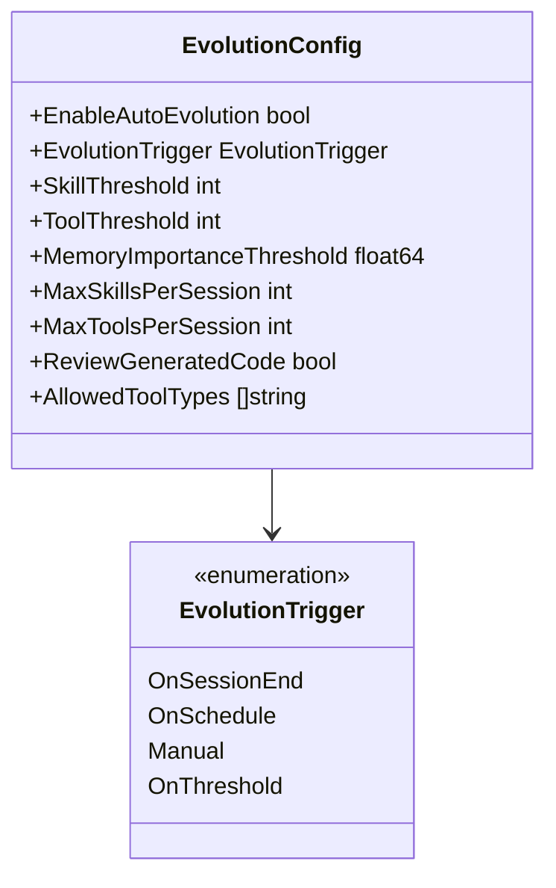

**配置说明**：

| 配置项                    | 默认值       | 说明                       |
| ------------------------- | ------------ | -------------------------- |
| EnableAutoEvolution       | true         | 是否启用自动进化           |
| EvolutionTrigger          | OnSessionEnd | 进化触发时机               |
| SkillThreshold            | 2            | 生成Skill的重复次数阈值    |
| ToolThreshold             | 3            | 生成Tool的重复次数阈值     |
| MemoryImportanceThreshold | 0.7          | 短期记忆重要性阈值         |
| MaxSkillsPerSession       | 1            | 每会话最大生成Skill数      |
| MaxToolsPerSession        | 1            | 每会话最大生成Tool数       |
| ReviewGeneratedCode       | true         | 是否需要人工审核生成的代码 |

## 7. 进化状态追踪

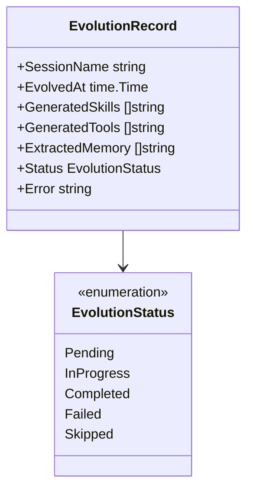

**会话进化标记**：

| 字段            | 说明           |
| --------------- | -------------- |
| Evolved         | 会话是否已进化 |
| EvolvedAt       | 进化时间       |
| EvolutionRecord | 进化记录引用   |

## 8. 进化服务接口

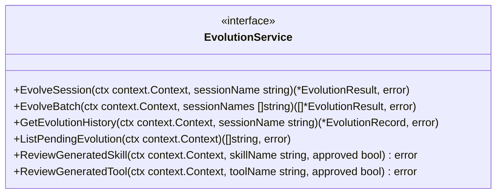

**方法说明**：

| 方法                 | 说明               |
| -------------------- | ------------------ |
| EvolveSession        | 对单个会话执行进化 |
| EvolveBatch          | 批量进化多个会话   |
| GetEvolutionHistory  | 获取会话的进化历史 |
| ListPendingEvolution | 列出待进化的会话   |
| ReviewGeneratedSkill | 审核生成的Skill    |
| ReviewGeneratedTool  | 审核生成的Tool     |

## 9. 安全审核机制

自动进化生成的资源（Skill、Tool）可能包含不安全的模式或错误的逻辑，必须经过审核后才能正式投入使用。

### 9.1 资源生命周期状态

所有进化产物在生成后不会立即注册为正式资源，而是先进入"草稿"状态：

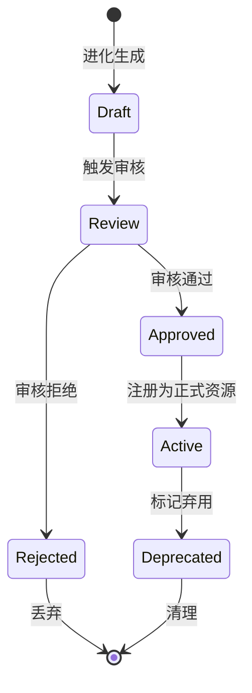

| 状态       | 说明                                         |
| ---------- | -------------------------------------------- |
| Draft      | 刚生成，尚未审核，不可被 Agent 使用          |
| Review     | 正在审核中                                   |
| Approved   | 审核通过，等待注册                           |
| Rejected   | 审核未通过，附带拒绝原因                     |
| Active     | 已注册为正式资源，可被 Agent 发现和使用       |
| Deprecated | 标记弃用，不再被新任务使用                   |

### 9.2 审核策略

```go
type ReviewPolicy int

const (
    // 自动审核：通过规则引擎自动判断，适用于简单的短期记忆
    ReviewAutomatic ReviewPolicy = iota
    // 人工审核：需要开发者/管理员确认，适用于 Skill 和 Tool
    ReviewManual
    // 混合审核：先自动检查，通过后再人工确认
    ReviewHybrid
)
```

| 资源类型 | 默认审核策略 | 说明                                       |
| -------- | ------------ | ------------------------------------------ |
| 短期记忆 | 自动审核     | 风险较低，规则引擎检查后自动激活           |
| Skill    | 混合审核     | 自动检查格式和安全规则后，提交人工确认     |
| Tool     | 人工审核     | 涉及代码执行，必须由开发者确认后才能激活   |

### 9.3 自动安全检查规则

自动审核阶段会对进化产物执行以下安全检查：

| 检查项           | 说明                                              | 适用资源   |
| ---------------- | ------------------------------------------------- | ---------- |
| 敏感命令检测     | 检查是否包含 `rm -rf`、`DROP TABLE` 等危险模式    | Skill/Tool |
| 权限范围检查     | 检查 allowed-tools 是否超出当前 Agent 权限        | Skill      |
| 代码注入扫描     | 检查模板参数是否存在注入风险                      | Skill/Tool |
| 外部依赖检查     | 检查是否引用未注册的工具或资源                    | Skill      |
| 重复检测         | 检查是否与已有资源功能重叠                        | Skill/Tool |

### 9.4 沙箱验证

对于通过自动安全检查的 Skill 和 Tool，系统会在沙箱环境中执行试运行：

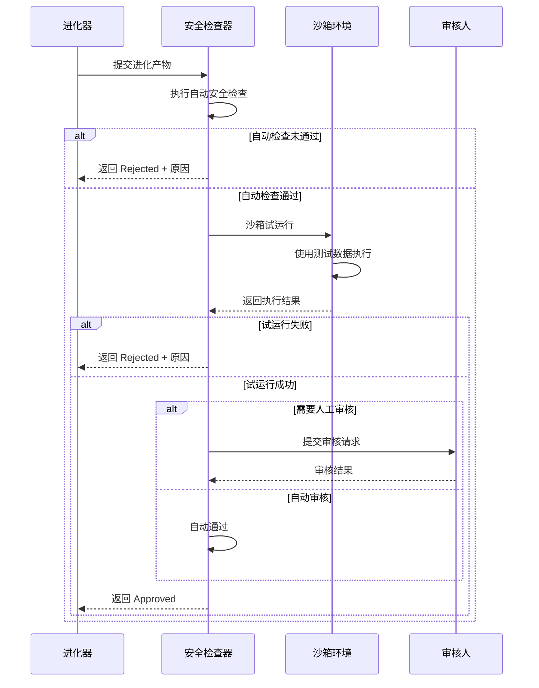

## 10. 进化与现有机制的关系

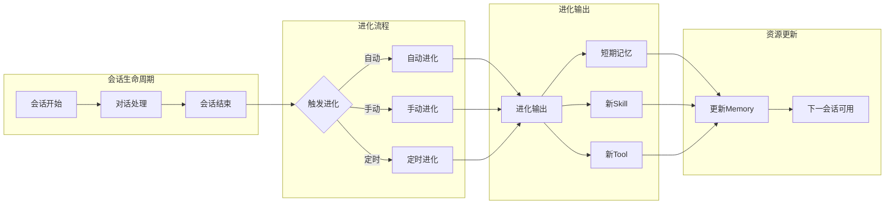

### 10.1 与 Reflexion 的区别

| 特性     | Reflexion（反思）  | Evolution（进化）   |
| -------- | ------------------ | ------------------- |
| 目的     | 分析失败，改进策略 | 提取模式，生成资源  |
| 触发时机 | 任务失败后         | 会话完成后          |
| 输出     | 反思建议           | Skill/Tool/短期记忆 |
| 作用范围 | 当前任务改进       | 系统能力扩展        |
| 存储位置 | Reflection节点     | Skill/Tool/STM节点  |
