# 接口设计

> **相关文档**: [Memory 模块概述](memory-module.md) | [节点类型定义](memory-nodes.md)

本文档详细描述 Memory 模块的核心接口设计。Memory 采用**节点类型访问器**模式，每个访问器管理特定类型的节点。

## 1. Memory 结构

Memory 是一个 Facade，持有 GraphRAG 实例和所有访问器，只暴露访问器给外部使用：

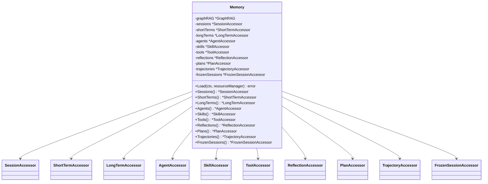

### 1.1 Load 方法

Load 方法用于将静态资源（Agent、Skill、Tool等）加载到 GraphRAG 中建立索引：

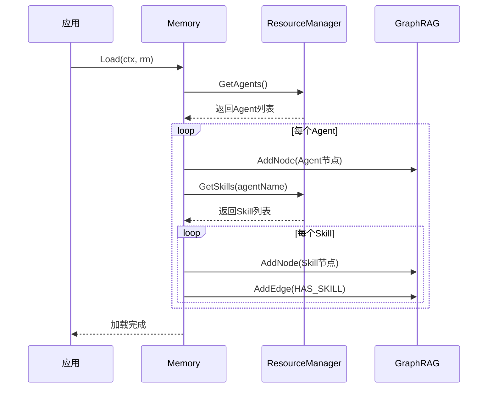

### 1.2 设计原则

| 原则        | 说明                                        |
| ----------- | ------------------------------------------- |
| Facade 模式 | Memory 只是一个访问器的容器，不暴露操作方法 |
| 单一入口    | 所有访问器持有同一个 GraphRAG 实例          |
| 职责分离    | 每个访问器只管理特定类型的节点              |

## 2. Accessor 基础设计

### 2.1 Accessor 基础接口

所有访问器共享的通用方法：

```go
type Accessor interface {
    NodeType() string
    Get(ctx context.Context, id string) (*Node, error)
    List(ctx context.Context, opts ...ListOption) ([]*Node, error)
    Delete(ctx context.Context, id string) error
}
```

### 2.2 BaseAccessor 基础实现

```go
type BaseAccessor struct {
    graphRAG  *pattern.GraphRAG
    nodeType  string
}

func (a *BaseAccessor) NodeType() string {
    return a.nodeType
}

func (a *BaseAccessor) Get(ctx context.Context, id string) (*Node, error) {
    return a.graphRAG.GetNode(ctx, id, a.nodeType)
}

func (a *BaseAccessor) List(ctx context.Context, opts ...ListOption) ([]*Node, error) {
    return a.graphRAG.ListNodes(ctx, a.nodeType, opts...)
}

func (a *BaseAccessor) Delete(ctx context.Context, id string) error {
    return a.graphRAG.DeleteNode(ctx, id, a.nodeType)
}
```

### 2.3 访问器继承关系

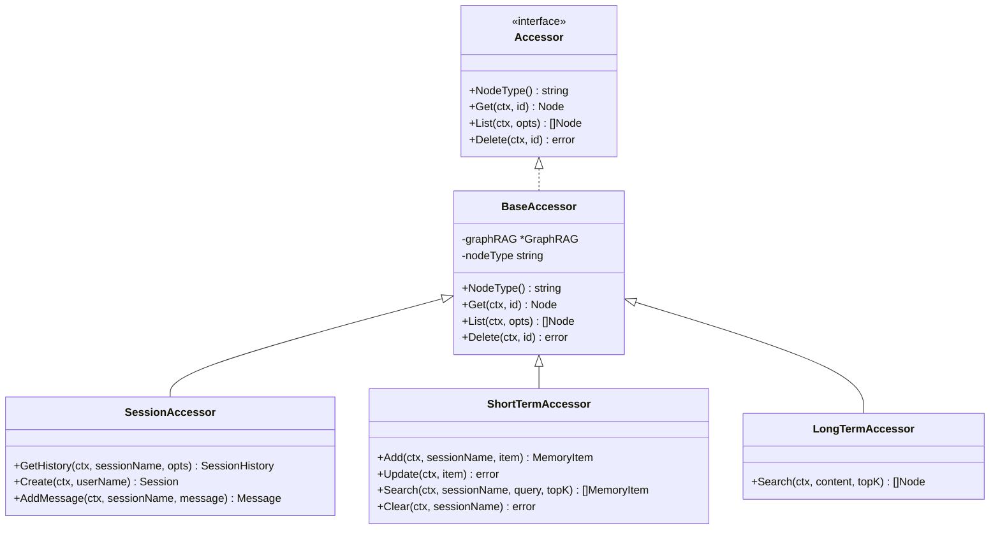

### 2.4 具体访问器实现示例

```go
type SessionAccessor struct {
    BaseAccessor
}

func NewSessionAccessor(graphRAG *pattern.GraphRAG) *SessionAccessor {
    return &SessionAccessor{
        BaseAccessor: BaseAccessor{
            graphRAG: graphRAG,
            nodeType: "Session",
        },
    }
}

func (a *SessionAccessor) GetHistory(ctx context.Context, sessionName string, opts ...SessionOption) (*SessionHistory, error) {
    return a.graphRAG.GetSessionHistory(ctx, sessionName, opts...)
}

func (a *SessionAccessor) Create(ctx context.Context, userName string) (*Session, error) {
    session := &Session{
        Name:      generateSessionID(),
        UserName:  userName,
        StartTime: time.Now(),
        Status:    SessionStatusActive,
    }
    err := a.graphRAG.AddNode(ctx, session)
    return session, err
}

func (a *SessionAccessor) AddMessage(ctx context.Context, sessionName string, message *Message) (*Message, error) {
    message.ID = generateMessageID()
    message.Timestamp = time.Now()
    err := a.graphRAG.AddNode(ctx, message)
    if err != nil {
        return nil, err
    }
    err = a.graphRAG.AddEdge(ctx, sessionName, message.ID, "HAS_MESSAGE")
    return message, err
}
```

## 3. SessionAccessor

管理 Session 和 Message 节点：

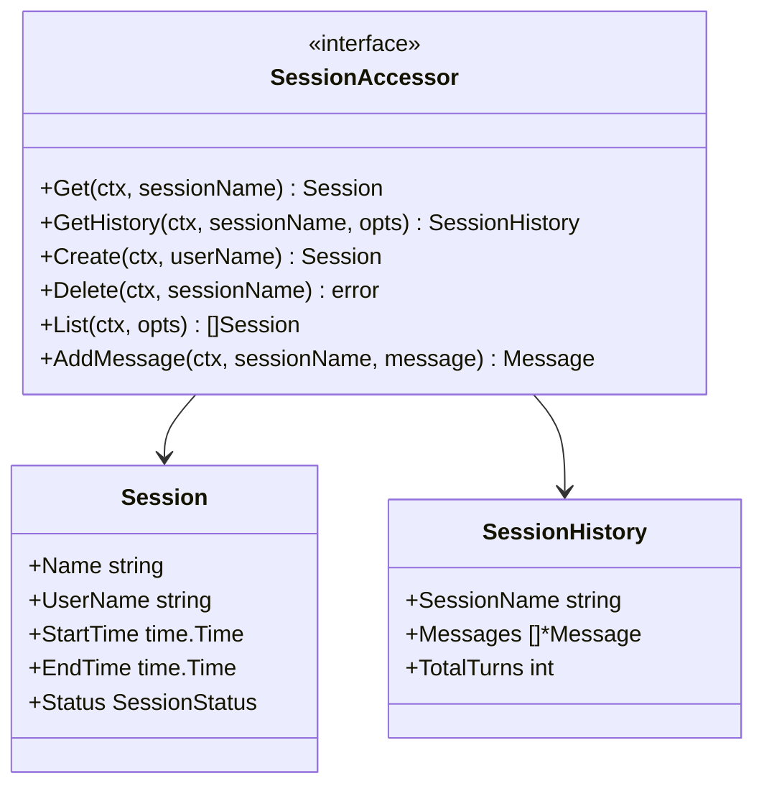

**使用示例**：

```go
sessions := memory.Sessions()

session, err := sessions.Get(ctx, "session-123")
history, err := sessions.GetHistory(ctx, "session-123",
    WithMaxTurns(10),
    WithIncludeReflections(true),
)
newSession, err := sessions.Create(ctx, "user-001")
```

## 4. ShortTermAccessor

管理 MemoryItem 节点（短期记忆）：

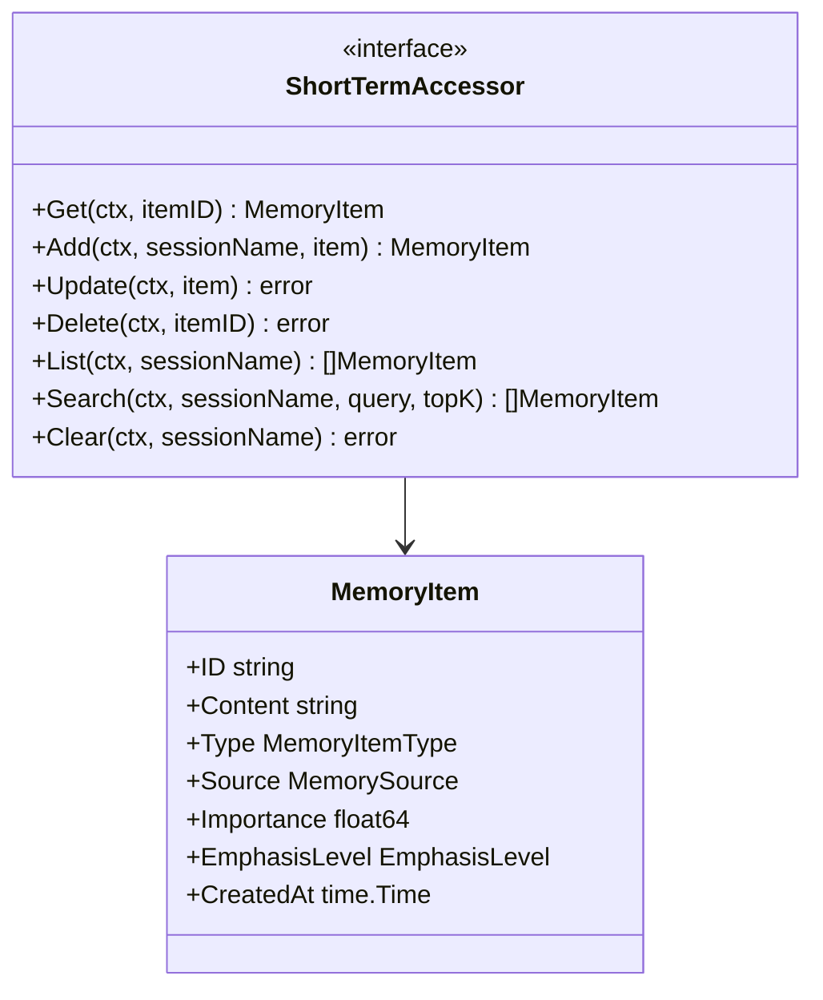

**使用示例**：

```go
shortTerms := memory.ShortTerms()

item := &MemoryItem{
    Content: "用户偏好使用中文交流",
    Type:    MemoryItemTypePreference,
}
created, err := shortTerms.Add(ctx, "session-123", item)

items, err := shortTerms.List(ctx, "session-123")
relevant, err := shortTerms.Search(ctx, "session-123", "用户偏好", 5)
```

## 5. LongTermAccessor

LongTermAccessor 是 GraphRAG 的文件索引访问器，用于语义化搜索 DocumentPath 目录下的文件内容。

**核心特点**：
- 只索引 DocumentPath 目录下的文件
- 采用**多模态 Embedding**（CLIP 模型）
- 核心能力是语义化搜索，类似人类通过"线索"搜索记忆
- GraphRAG 自动监听文件变化并同步索引，无需手动调用索引接口

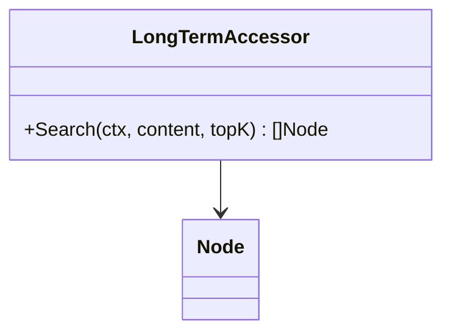

### 5.1 接口定义

```go
type LongTermAccessor struct {
    BaseAccessor
}

func (a *LongTermAccessor) Search(ctx context.Context, content string, topK int) ([]*Node, error) {
    return a.graphRAG.Retrieve(ctx, content, topK)
}
```

### 5.2 文件操作

长期记忆通过文件系统操作，GraphRAG 自动同步：

```go
// 添加长期记忆 - 直接写入文件
path := filepath.Join(resourceManager.DocumentPath, "knowledge", "topic.md")
os.WriteFile(path, []byte("# 主题\n\n内容..."), 0644)
// GraphRAG 自动检测并索引

// 更新长期记忆 - 直接修改文件
os.WriteFile(path, []byte("# 主题 (更新)\n\n新内容..."), 0644)
// GraphRAG 自动更新索引

// 删除长期记忆 - 直接删除文件
os.Remove(path)
// GraphRAG 自动清理索引
```

### 5.2 使用示例

```go
longTerms := memory.LongTerms()

// 索引目录
err := longTerms.IndexDirectory("./docs")

// 语义化搜索 - 核心功能
nodes, err := longTerms.Search(ctx, "产品功能介绍", 10)

// 按节点类型搜索
nodes, err := longTerms.SearchByType(ctx, "API使用方法", "Document", 5)
```

### 5.3 多模态 Embedding

GraphRAG 采用多模态 Embedding，而非传统文本分块：

| 特性     | 说明                               |
| -------- | ---------------------------------- |
| 多模态   | 支持文本、图像、代码等多种内容类型 |
| 语义理解 | 理解内容语义，而非简单分块         |
| 线索搜索 | 类似人类通过"线索"搜索相关记忆     |

```go
// GraphRAG 配置多模态 Embedding
graphRAG, _ := pattern.GraphRAG("goreact-memory",
    pattern.WithCLIP("clip-vit-base-patch32"),
)

// 索引知识目录
graphRAG.IndexDirectory(ctx, "./knowledge", true)
```

## 6. AgentAccessor

管理 Agent 节点：

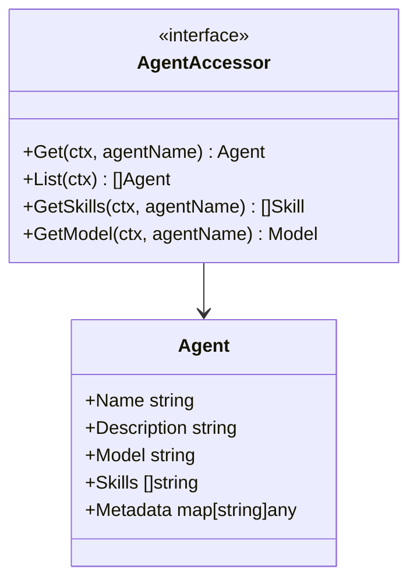

**使用示例**：

```go
agents := memory.Agents()

agent, err := agents.Get(ctx, "assistant")
skills, err := agents.GetSkills(ctx, "assistant")
```

## 7. SkillAccessor

管理 Skill 和 GeneratedSkill 节点：

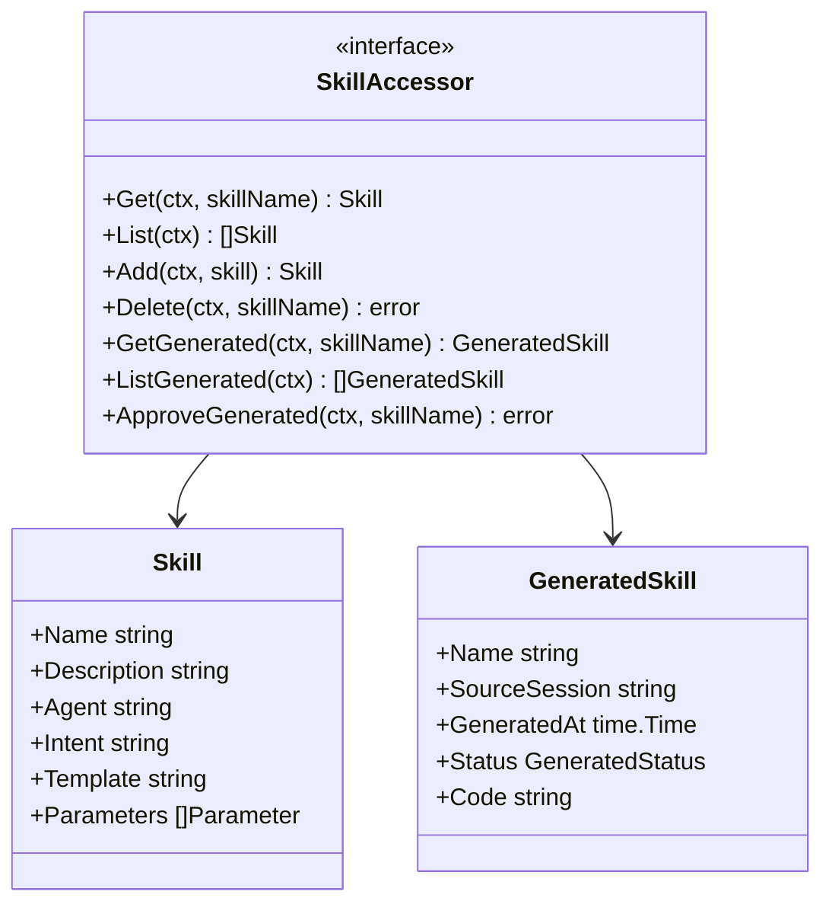

**使用示例**：

```go
skills := memory.Skills()

skill, err := skills.Get(ctx, "data-analysis")
generated, err := skills.ListGenerated(ctx)
err := skills.ApproveGenerated(ctx, "new-skill")
```

## 8. ToolAccessor

管理 Tool 和 GeneratedTool 节点：

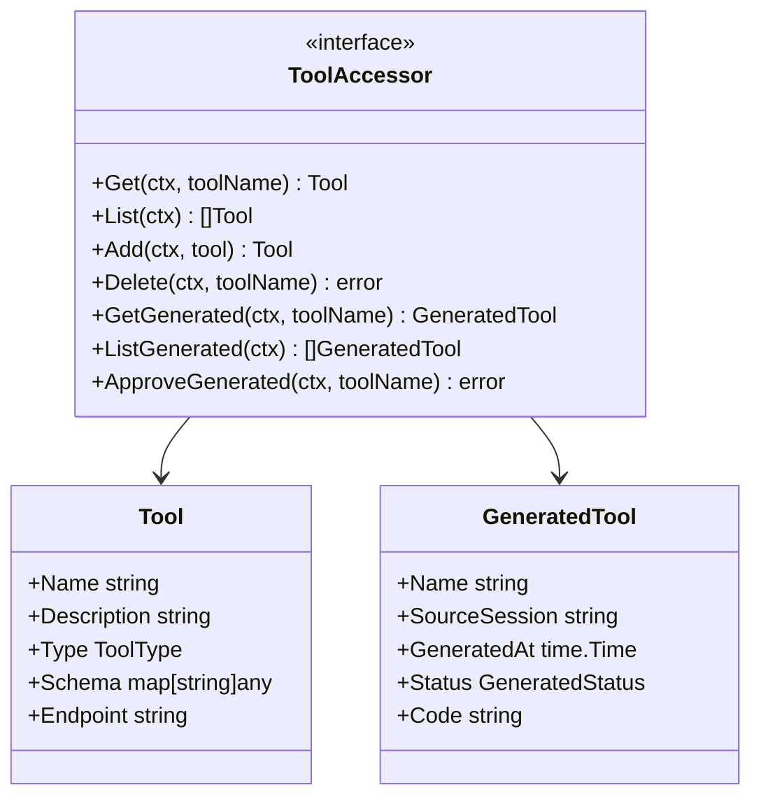

**使用示例**：

```go
tools := memory.Tools()

tool, err := tools.Get(ctx, "web-search")
generated, err := tools.ListGenerated(ctx)
```

## 9. ReflectionAccessor

管理 Reflection 节点：

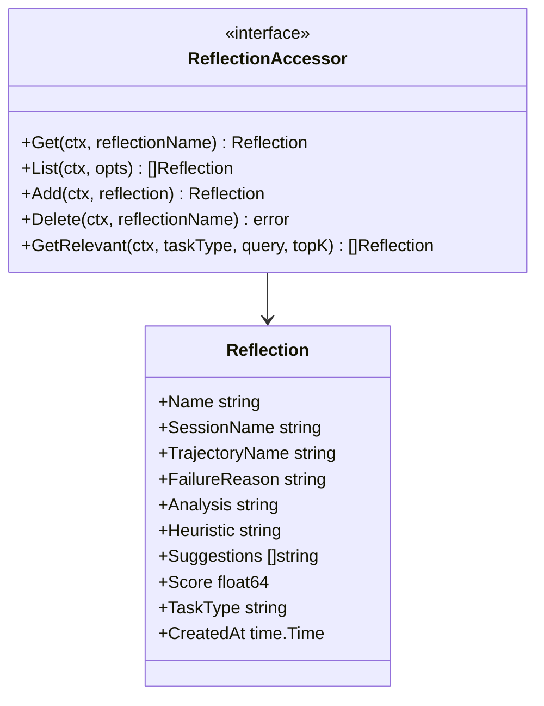

**使用示例**：

```go
reflections := memory.Reflections()

reflection, err := reflections.Get(ctx, "reflection-001")
relevant, err := reflections.GetRelevant(ctx, "data-analysis", "查询失败", 5)
```

## 10. PlanAccessor

管理 Plan 和 PlanStep 节点：

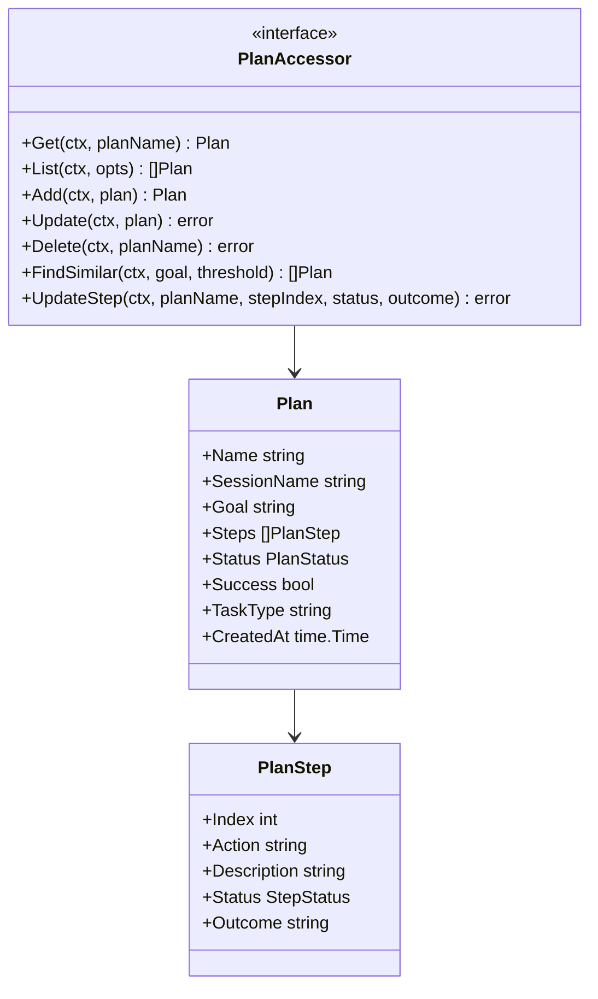

**使用示例**：

```go
plans := memory.Plans()

plan, err := plans.Get(ctx, "plan-001")
similar, err := plans.FindSimilar(ctx, "分析用户数据", 0.7)
err := plans.UpdateStep(ctx, "plan-001", 0, StepStatusCompleted, "成功")
```

## 11. TrajectoryAccessor

管理 Trajectory 节点：

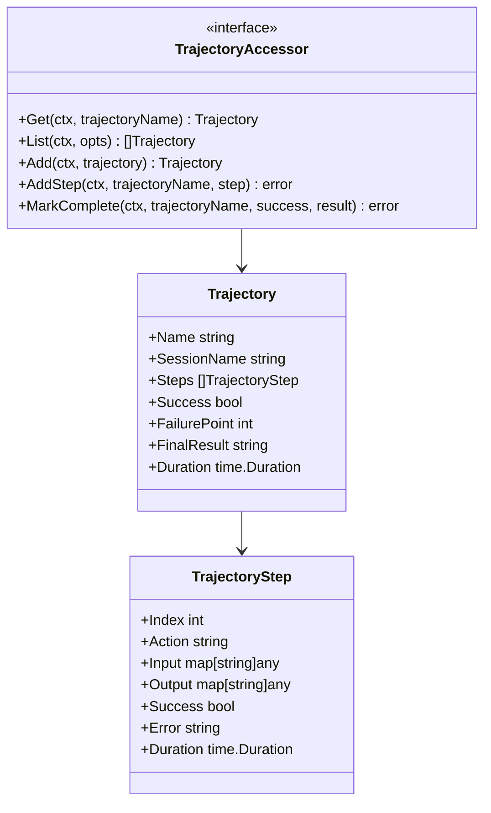

**使用示例**：

```go
trajectories := memory.Trajectories()

trajectory, err := trajectories.Get(ctx, "session-123")
err := trajectories.AddStep(ctx, "session-123", &TrajectoryStep{
    Action: "search",
    Input:  map[string]any{"query": "test"},
})
```

## 12. FrozenSessionAccessor

管理 FrozenSession 节点：

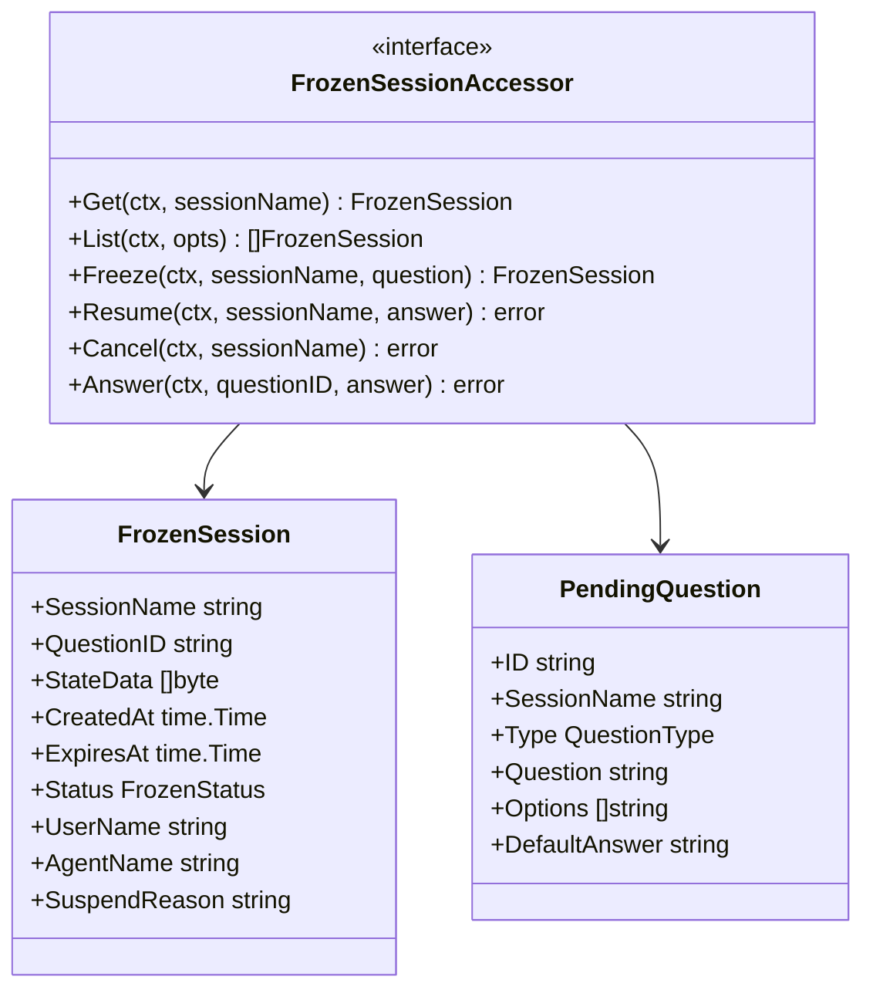

**使用示例**：

```go
frozenSessions := memory.FrozenSessions()

frozen, err := frozenSessions.Get(ctx, "session-123")
list, err := frozenSessions.List(ctx, WithStatus(FrozenStatusFrozen))
err := frozenSessions.Resume(ctx, "session-123", "用户回答")
```

## 13. 接口关系总览

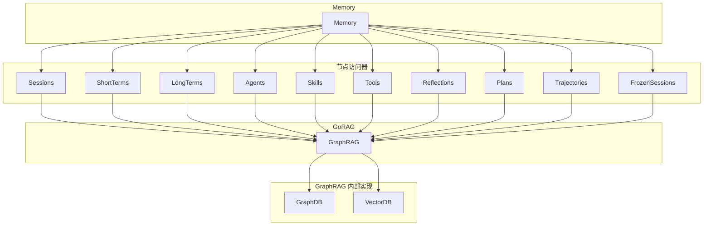

**关键设计**：
- Memory 持有 GraphRAG 实例，所有访问器通过 GraphRAG 操作存储
- 每个访问器只管理特定类型的节点，提供类型安全的 API
- 存储层对 Memory 及其访问器不可见
