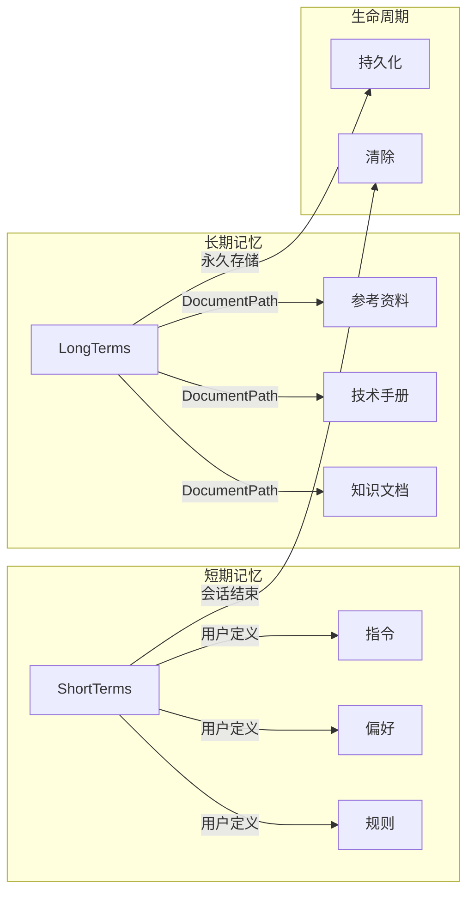
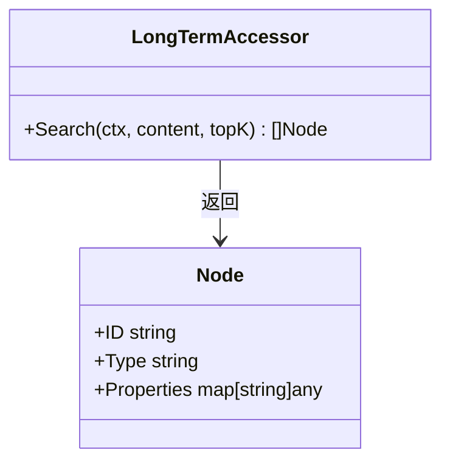
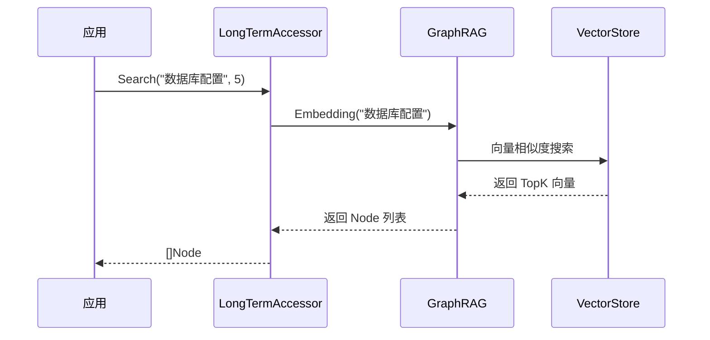
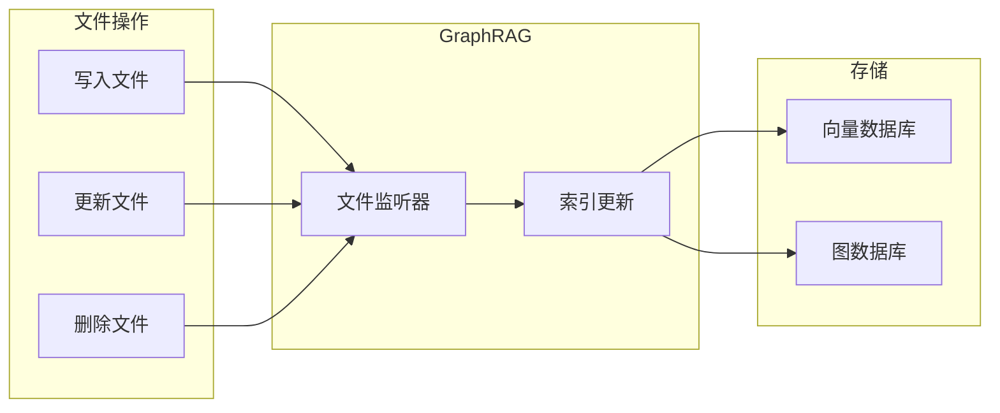
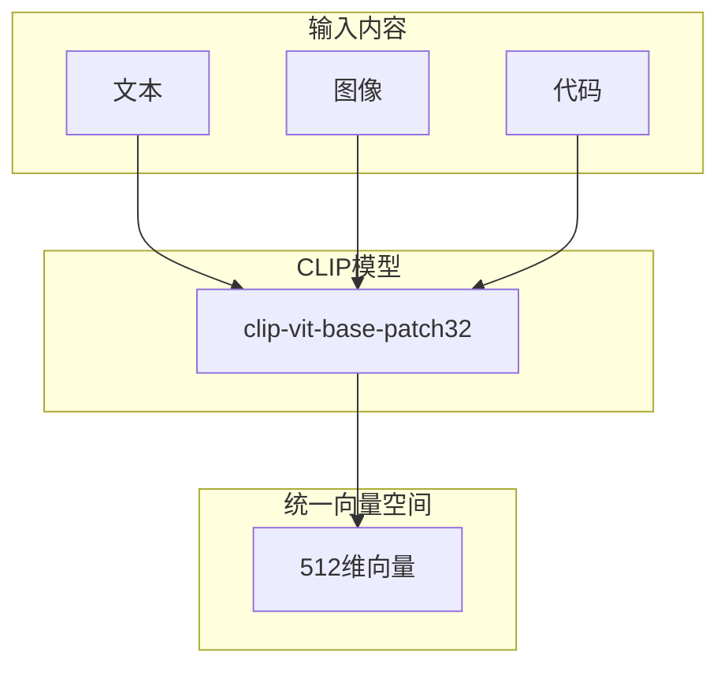
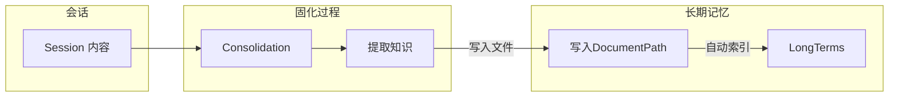

# 长期记忆功能

> **相关文档**: [Memory 模块概述](memory-module.md) | [节点类型定义](memory-nodes.md) | [接口设计](memory-interfaces.md)

长期记忆（Long-term Memory）是 GraphRAG 的核心能力，通过语义化搜索检索 DocumentPath 目录下的文件内容。与短期记忆不同，长期记忆不存储会话级数据，而是索引文件内容，支持跨会话的知识检索。由于它可以保存任何的文件所以它就成为整个系统的“知识库”。

**重要说明**：
- 长期记忆只与 DocumentPath 目录下的文件相关，与 Agents、Tools、Skills 没有任何关系
- 长期记忆不需要通过接口访问，直接操作 DocumentPath 下的文件即可
- GraphRAG 会自动监听文件变化并同步索引

## 1. LongTermAccessor 概述

长期记忆通过 `LongTerms()` 访问器管理，核心能力是语义化搜索：

```go
longTerms := memory.LongTerms()

// 语义化搜索相关内容
nodes, err := longTerms.Search(ctx, "如何配置数据库连接", 5)
```

**关键特性**：

| 特性       | 说明                                         |
| ---------- | -------------------------------------------- |
| 语义化搜索 | 通过"线索"搜索相关记忆，类似人类回忆方式     |
| 多模态支持 | 支持文本、图像、代码等多种内容类型           |
| 跨会话持久 | 知识持久化存储，所有会话共享                 |
| 自动同步   | GraphRAG 自动监听文件变化并更新索引          |
| 独立性     | 只索引 DocumentPath 目录文件，与其他资源无关 |

## 2. 与短期记忆的区别



| 特性       | 短期记忆 (ShortTerms)      | 长期记忆 (LongTerms)      |
| ---------- | -------------------------- | ------------------------- |
| 生命周期   | 会话级，会话结束后清除     | 永久存储                  |
| 存储内容   | 用户定义的规则、偏好、指令 | DocumentPath 目录文件索引 |
| 检索方式   | 精确匹配 + 语义搜索        | 纯语义化搜索              |
| 数据来源   | 用户手动定义               | DocumentPath 目录文件     |
| 访问器     | ShortTerms()               | LongTerms()               |
| 与资源关系 | 无关                       | 无关                      |

## 3. LongTermAccessor 接口



### 3.1 Search 方法

语义化搜索，通过"线索"检索相关内容：

```go
// 搜索与"数据库配置"相关的内容
nodes, err := memory.LongTerms().Search(ctx, "数据库配置", 10)
for _, node := range nodes {
    fmt.Printf("类型: %s, 内容: %s\n", node.Type, node.Properties["content"])
}
```

**搜索原理**：



## 4. 文件操作与自动同步

长期记忆通过文件系统操作，GraphRAG 自动同步：



**操作示例**：

```go
// 添加长期记忆 - 直接写入文件
path := filepath.Join(resourceManager.DocumentPath, "knowledge", "database-config.md")
os.WriteFile(path, []byte("# 数据库配置\n\n..."), 0644)
// GraphRAG 自动检测并索引

// 更新长期记忆 - 直接修改文件
os.WriteFile(path, []byte("# 数据库配置 (更新)\n\n..."), 0644)
// GraphRAG 自动更新索引

// 删除长期记忆 - 直接删除文件
os.Remove(path)
// GraphRAG 自动清理索引
```

## 5. 多模态 Embedding

长期记忆使用 CLIP 多模态模型，支持多种内容类型：



**支持的文件类型**：

| 类型 | 扩展名           | 处理方式             |
| ---- | ---------------- | -------------------- |
| 文本 | .md, .txt, .json | 直接 Embedding       |
| 代码 | .go, .py, .js    | 提取语义后 Embedding |
| 图像 | .png, .jpg, .gif | CLIP 图像编码        |
| 配置 | .yaml, .toml     | 解析后 Embedding     |

## 6. 使用场景

### 6.1 知识检索

```go
// 用户提问时检索相关知识
query := "如何处理并发请求？"
nodes, _ := memory.LongTerms().Search(ctx, query, 5)

// 构建上下文
var context strings.Builder
for _, node := range nodes {
    context.WriteString(node.Properties["content"].(string))
    context.WriteString("\n---\n")
}

// 将上下文注入 Prompt
prompt := fmt.Sprintf("参考知识：\n%s\n\n问题：%s", context.String(), query)
```

### 6.2 文档问答

```go
// 从技术文档中查找答案
answer, _ := memory.LongTerms().Search(ctx, "API 认证方式", 3)
for _, node := range answer {
    fmt.Println(node.Properties["content"])
}
```

### 6.3 代码搜索

```go
// 搜索相关代码示例
codeExamples, _ := memory.LongTerms().Search(ctx, "数据库连接池配置", 5)
for _, node := range codeExamples {
    fmt.Printf("文件: %s\n", node.Properties["file_path"])
    fmt.Println(node.Properties["content"])
}
```

## 7. 配置

长期记忆的配置通过 GraphRAG 传入：

```go
graphRAG, _ := pattern.GraphRAG("goreact-memory",
    // 多模态 Embedding 模型
    pattern.WithCLIP("clip-vit-base-patch32"),
    
    // 向量存储（可选）
    pattern.WithMilvus("goreact_memory", "localhost:19530", 512),
    
    // 启用文件监听
    pattern.WithWatcher(resourceManager.DocumentPath),
)

memory := memory.NewMemory(graphRAG)
```

**YAML 配置**：

```yaml
memory:
  graph_rag:
    embedding: "clip-vit-base-patch32"
    vector:
      type: milvus
      address: "localhost:19530"
      collection: "goreact_memory"
      dimension: 512
    watcher:
      enabled: true
      path: "./documents"
```

## 8. 与记忆固化的关系

记忆固化（Consolidation）是将 Session 内容写入长期记忆的过程：



详细内容请参考 [记忆固化](memory-consolidation.md)。

## 9. DocumentPath 目录结构

DocumentPath 是长期记忆的数据来源，典型结构如下：

```
DocumentPath/
├── knowledge/           # 知识文档
│   ├── faq.md
│   ├── guides/
│   │   └── setup.md
│   └── references/
│       └── api.md
├── documents/           # 技术文档
│   ├── architecture.md
│   └── design/
│       └── database.md
└── resources/           # 其他资源
    ├── images/
    │   └── diagram.png
    └── configs/
        └── settings.yaml
```

**说明**：
- 所有文件都会被 GraphRAG 自动索引
- 支持多种文件格式
- 目录结构不影响搜索结果

## 10. 最佳实践

### 10.1 搜索优化

```go
// 使用具体的搜索词，而非模糊描述
// 好
nodes, _ := memory.LongTerms().Search(ctx, "MySQL 连接池配置参数", 5)

// 差
nodes, _ := memory.LongTerms().Search(ctx, "数据库", 5)
```

### 10.2 文件组织

```
DocumentPath/
├── 按主题分类/
│   ├── 主题A/
│   │   ├── 文档1.md
│   │   └── 文档2.md
│   └── 主题B/
│       └── 文档3.md
└── 按类型分类/
    ├── 教程/
    ├── 参考/
    └── 示例/
```

### 10.3 文件格式

```markdown
# 标题

简要描述...

## 详细内容

...

## 相关链接

- [相关文档](./other.md)
```
