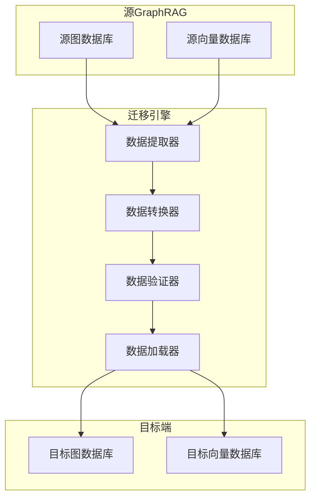
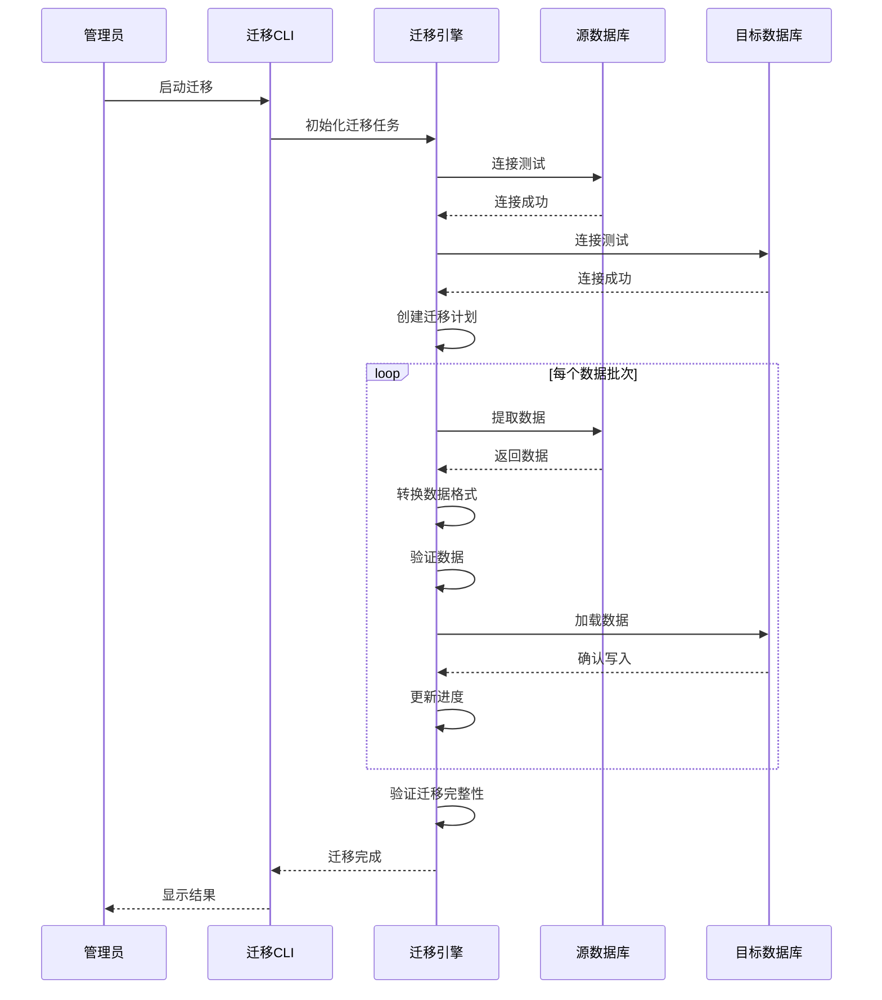
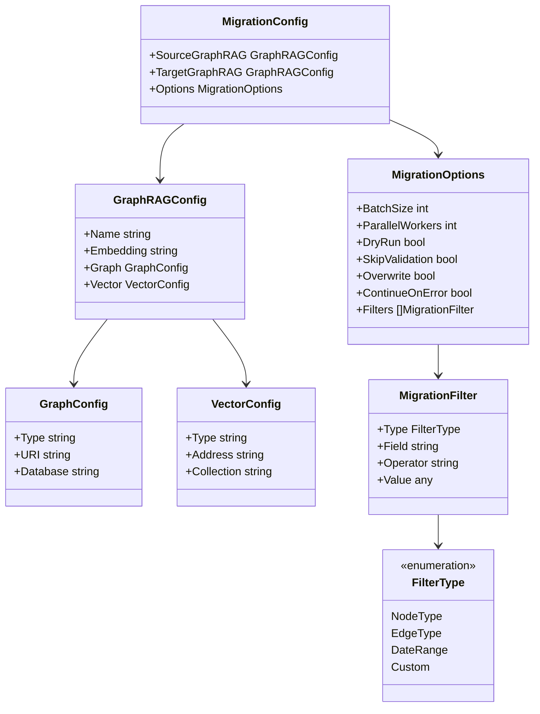
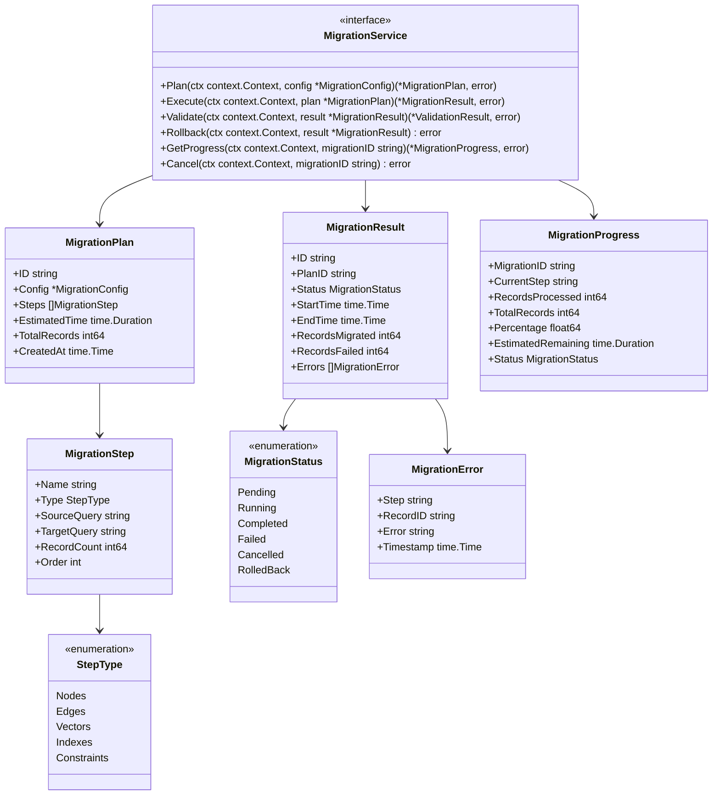
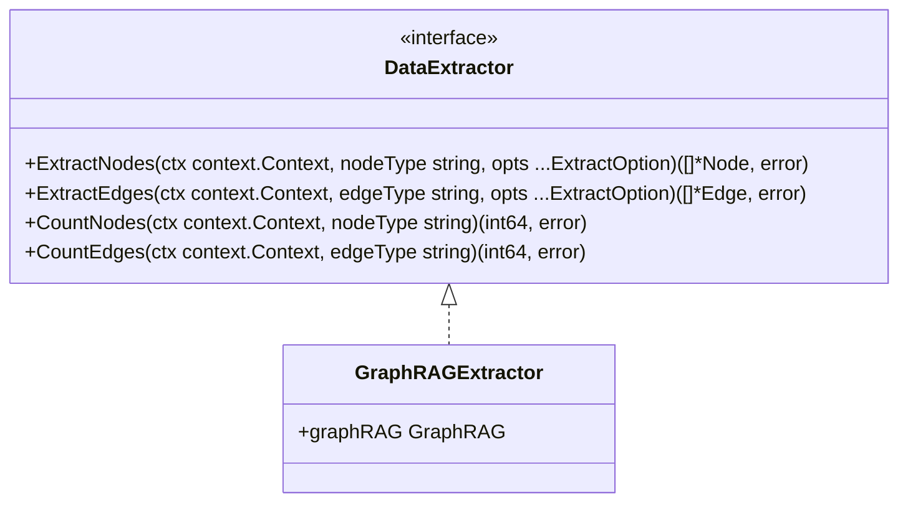
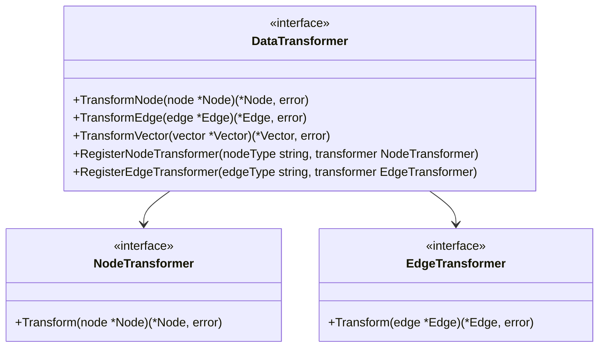
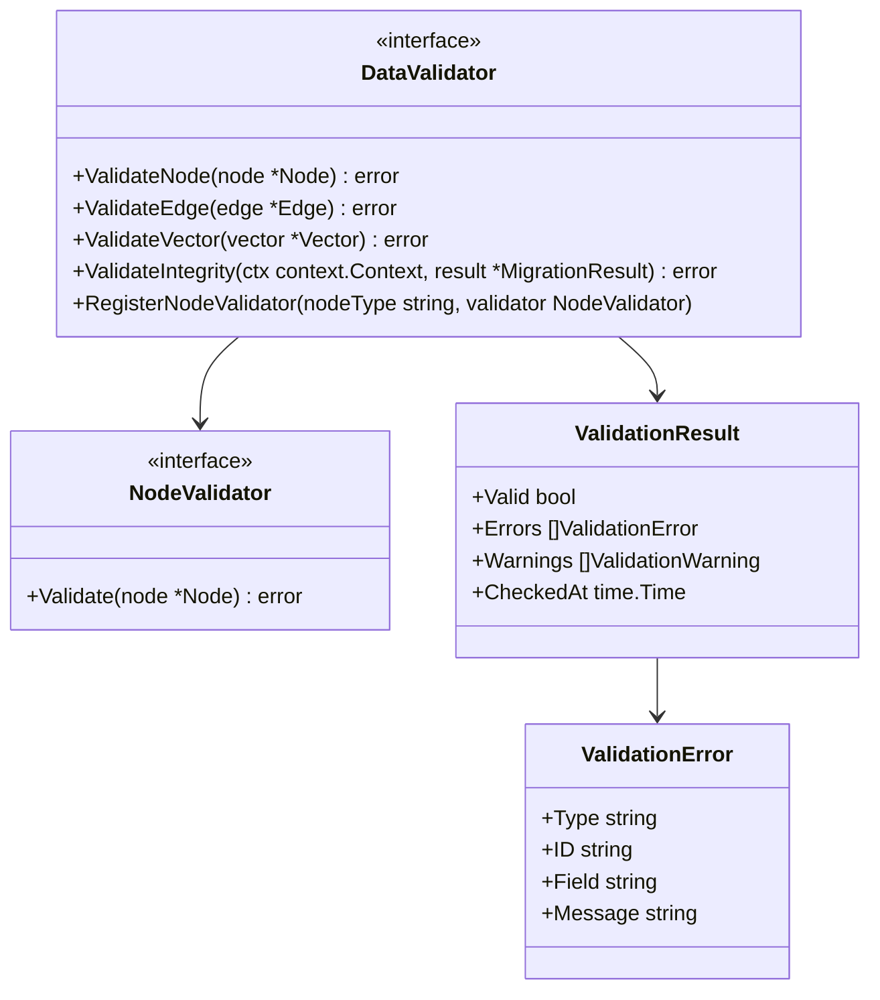
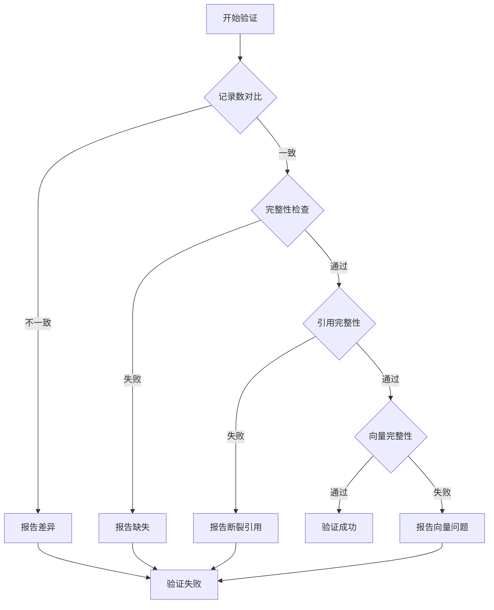
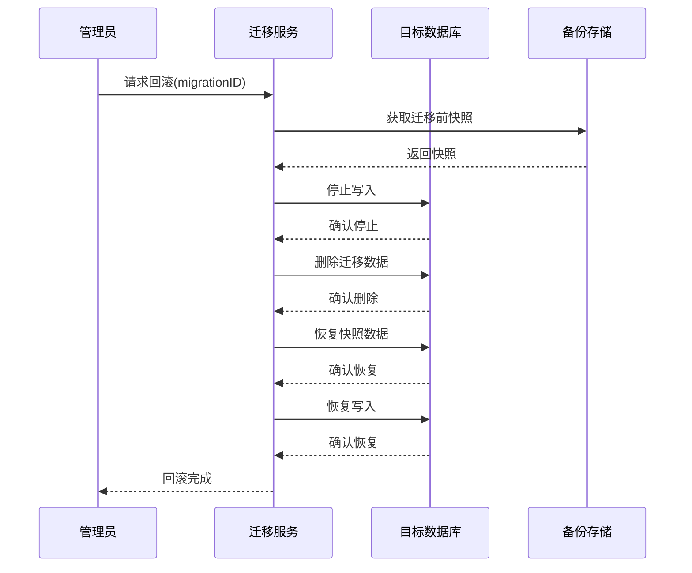

# 记忆迁移

> **相关文档**: [Memory 模块概述](memory-module.md) | [配置与存储后端](memory-configuration.md) | [接口设计](memory-interfaces.md)

数据迁移功能支持在不同 GraphRAG 实例之间迁移 Memory 数据，包括图数据库和向量数据库的迁移。

## 1. 迁移场景

| 场景         | 说明                       |
| ------------ | -------------------------- |
| 存储后端切换 | 从开发环境迁移到生产环境   |
| 数据库升级   | 从旧版本数据库迁移到新版本 |
| 多环境同步   | 在不同环境之间同步数据     |
| 数据备份恢复 | 从备份中恢复数据           |
| 集群迁移     | 从单节点迁移到集群部署     |

## 2. 迁移架构

迁移在两个 GraphRAG 实例之间进行：



## 3. 迁移流程



## 4. 迁移配置

迁移服务需要两个 GraphRAG 实例：源 GraphRAG 和目标 GraphRAG。



### 4.1 YAML 配置示例

```yaml
migration:
  source:
    name: "source-memory"
    embedding: "clip-vit-base-patch32"
    graph:
      type: neo4j
      uri: "bolt://source:7687"
      database: "goreact"
    vector:
      type: milvus
      address: "source:19530"
      collection: "goreact_memory"
      
  target:
    name: "target-memory"
    embedding: "clip-vit-base-patch32"
    graph:
      type: neo4j
      uri: "bolt://target:7687"
      database: "goreact"
      type: milvus
      connection_string: "target:19530"
      collection: "goreact_memory"
      
  options:
    batch_size: 1000
    parallel_workers: 4
    dry_run: false
    skip_validation: false
    overwrite: false
    continue_on_error: true
    filters:
      - type: date_range
        field: created_at
        operator: gte
        value: "2024-01-01"
```

## 5. 迁移服务接口



## 6. 数据提取器

数据提取器通过 GraphRAG 接口进行数据提取：



**提取选项**：

```go
type ExtractOption func(*ExtractConfig)

type ExtractConfig struct {
    BatchSize   int
    Offset      int64
    Filter      map[string]any
    OrderBy     string
    OrderDesc   bool
    Fields      []string
}
```

## 7. 数据转换器



**内置转换器**：

| 转换器                 | 说明           |
| ---------------------- | -------------- |
| IdentityTransformer    | 不做任何转换   |
| FieldMapperTransformer | 字段映射转换   |
| TimestampConverter     | 时间戳格式转换 |
| TypeConverter          | 类型转换       |

## 8. 数据验证器



**验证规则**：

| 规则            | 说明           |
| --------------- | -------------- |
| RequiredFields  | 必填字段检查   |
| TypeCheck       | 类型检查       |
| ReferenceCheck  | 引用完整性检查 |
| UniquenessCheck | 唯一性检查     |
| CustomRule      | 自定义规则     |

## 9. 迁移完整性验证



**完整性检查项**：

| 检查项     | 说明                     |
| ---------- | ------------------------ |
| 节点数量   | 源端和目标端节点数量一致 |
| 边数量     | 源端和目标端边数量一致   |
| 向量数量   | 源端和目标端向量数量一致 |
| 引用完整性 | 所有边的起止节点都存在   |
| 向量完整性 | 所有向量对应的节点都存在 |
| 属性完整性 | 所有属性都正确迁移       |

## 10. 回滚机制



**回滚策略**：

| 策略        | 说明                       |
| ----------- | -------------------------- |
| Snapshot    | 基于迁移前快照恢复         |
| Incremental | 增量回滚，只删除迁移的数据 |
| None        | 不支持回滚                 |

## 11. CLI 使用示例

```bash
# 执行迁移
goreact memory migrate --config migration.yaml

# 干运行（只生成计划）
goreact memory migrate --config migration.yaml --dry-run

# 查看迁移进度
goreact memory migrate progress --id migration-123

# 取消迁移
goreact memory migrate cancel --id migration-123

# 验证迁移结果
goreact memory migrate validate --id migration-123

# 回滚迁移
goreact memory migrate rollback --id migration-123
```

## 12. 迁移最佳实践

### 12.1 迁移前准备

1. **数据备份**: 确保源数据和目标数据都有备份
2. **容量规划**: 确保目标存储有足够空间
3. **网络检查**: 确保源端和目标端网络连通
4. **权限验证**: 确保有足够的读写权限

### 12.2 迁移执行

1. **先干运行**: 使用 `--dry-run` 验证迁移计划
2. **分批迁移**: 大数据量分批迁移，减少风险
3. **监控进度**: 实时监控迁移进度和错误
4. **保留日志**: 保留完整迁移日志用于排查

### 12.3 迁移后验证

1. **数据完整性**: 验证记录数量和引用关系
2. **功能测试**: 验证应用功能正常
3. **性能测试**: 验证查询性能符合预期
4. **清理备份**: 确认无误后清理临时备份
