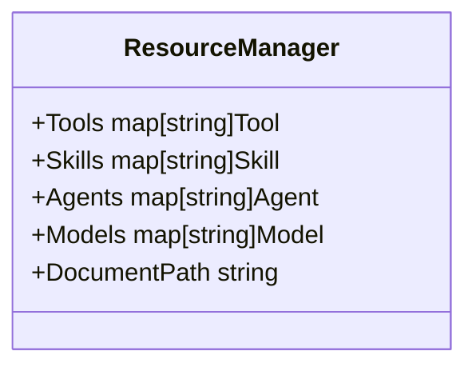
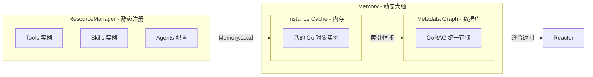
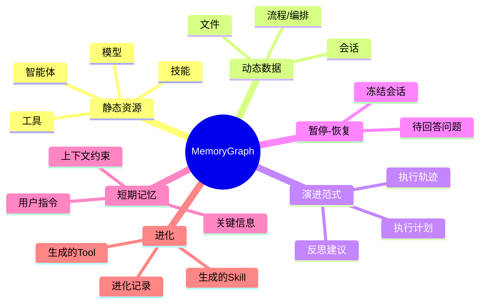
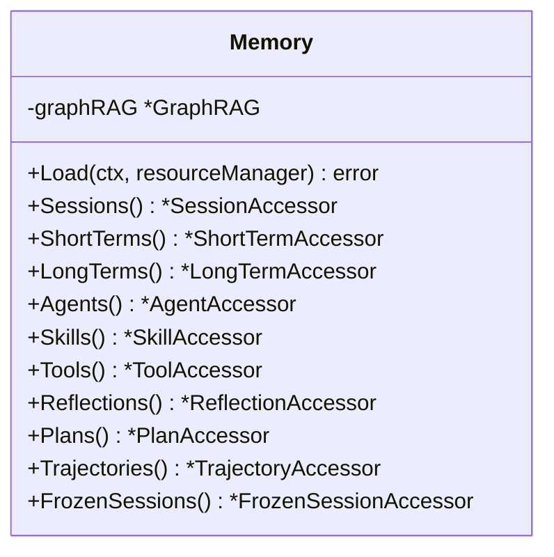
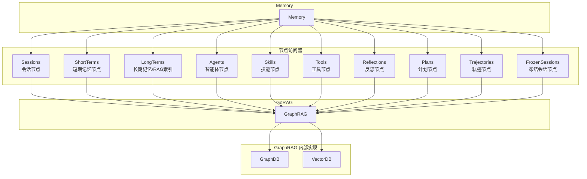
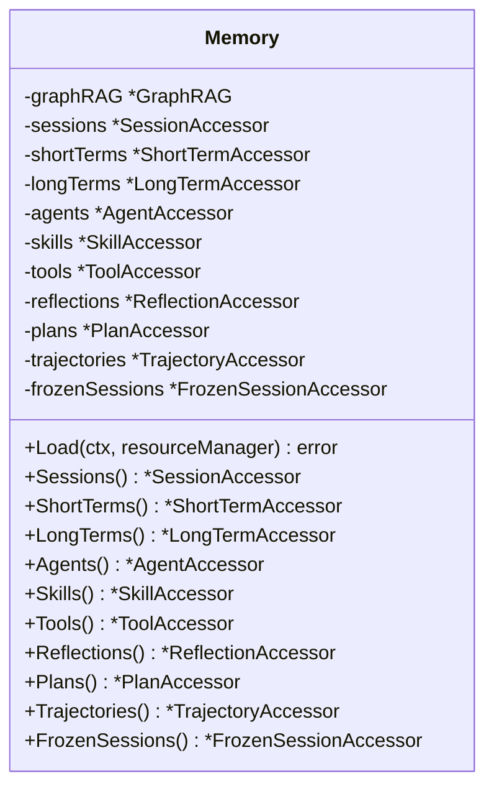
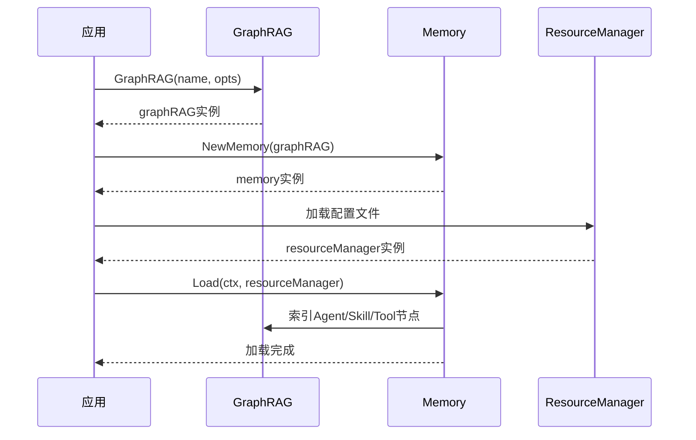
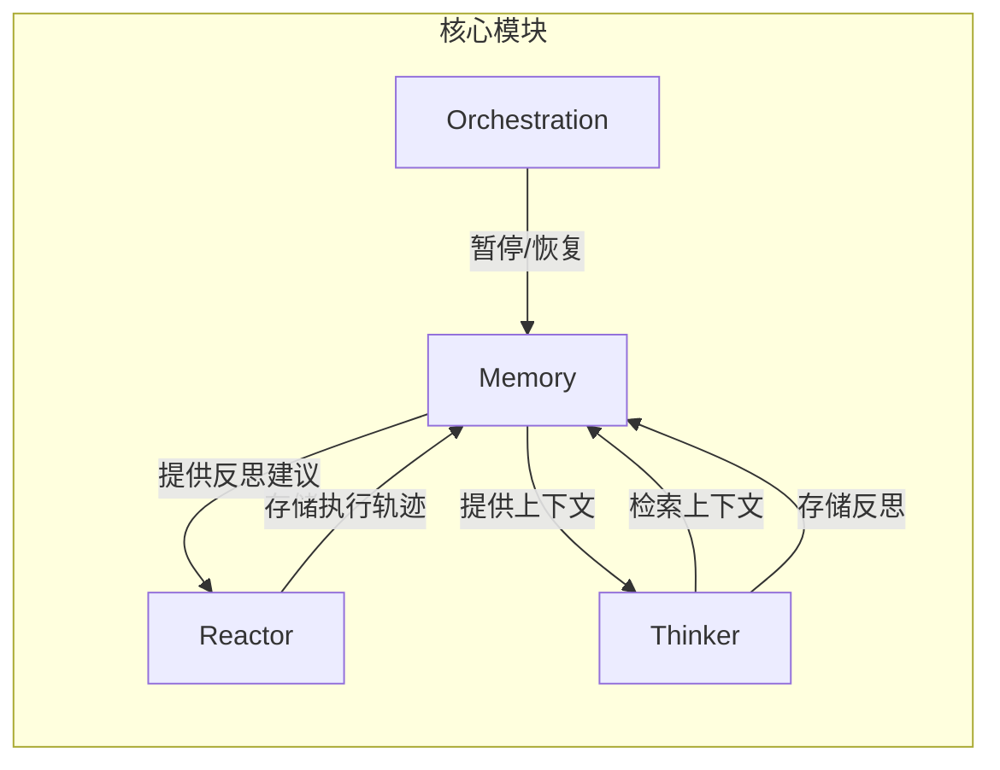

# Memory 模块设计

## 1. 模块概述

Memory（记忆）模块是 GoReAct 框架的核心创新，采用"记忆图谱"（Memory Graph）技术。记忆图谱模仿人类的"记忆图谱"，将智能体的思考过程、历史交互记录、反思经验、执行计划等存储在一个图结构中，帮助智能体进行自省和学习。

> **简言之**：记忆图谱就是智能体用于存储一切知识的数据库。

### 1.1 核心职责

- **知识存储**: 将加载过的资源、会话、记忆、流程编排步骤等所有内容都作为节点存入 GraphDB
- **记忆检索**: 基于 GraphRAG 实现语义检索和关系查询
- **反思存储**: 存储任务失败后的反思建议，供后续任务参考
- **计划存储**: 存储成功/失败的计划，支持计划复用和经验积累
- **自省学习**: 帮助智能体进行自省和学习

### 1.2 设计原则

- **基于 GoRAG GraphRAG**: 记忆图谱基于 GraphRAG（GoRAG 框架中的图 RAG 模式）实现
- **一切皆节点**: 所有加载过的内容都作为节点存入 GraphDB，形成 Agent 的总记忆体
- **经验积累**: 反思和计划支持跨会话学习

## 2. 文档导航

本模块文档已拆分为多个专题文档，便于深入阅读：

| 文档                                        | 说明                   |
| ------------------------------------------- | ---------------------- |
| [节点类型定义](memory-nodes.md)             | 所有节点类型的详细定义 |
| [关系类型定义](memory-relationships.md)     | 所有关系类型的详细定义 |
| [会话管理](memory-session.md)               | 会话存储与上下文检索   |
| [短期记忆](memory-short-term.md)            | 短期记忆功能设计       |
| [进化功能](memory-evolution.md)             | 自动学习与资源生成     |
| [反思与计划存储](memory-reflection-plan.md) | 反思机制与计划复用     |
| [配置与存储后端](memory-configuration.md)   | 配置选项与存储支持     |
| [数据迁移](memory-migration.md)             | 存储后端数据迁移       |
| [接口设计](memory-interfaces.md)            | 核心接口详细定义       |
| [记忆固化](memory-consolidation.md)         | Session内容提取固化    |

## 3. Memory 与 Resource 的关系

### 3.1 核心区别

| 概念            | 性质 | 说明                                         |
| --------------- | ---- | -------------------------------------------- |
| Resource        | 死的 | 文件与各种节点的 Schema 定义                 |
| ResourceManager | 死的 | 静态资源的统一注册场所，持有贫血对象         |
| Memory          | 活的 | 全部资源被加载到图数据库中并建立好语义化索引 |

### 3.2 ResourceManager 结构

**关键特性**：

- 所有资源对象都是贫血对象，只持有共享数据
- 每个资源实现 `core.Node` 接口，都是 GraphDB 中的节点
- Skill 是目录结构，包含 SKILL.md 和可选的 scripts、references、assets
- 开发人员无需关注 Memory 如何索引资源
- `DocumentPath` 是长期记忆的文件路径，也是 Agent 默认文件夹

### 3.3 关系图

### 3.4 工作流程

1. **ResourceManager 注册**: 将 Tools、Skills、Agents、Models 等资源注册到 ResourceManager
2. **Memory.Load**: Memory 通过 `Load(ResourceManager)` 方法将所有资源索引到 GraphRAG
3. **语义化检索**: Memory 建立好语义化索引后，支持智能检索和关系查询

> **简言之**：ResourceManager 是"仓库清单"，Memory 是"智能货架"。

## 4. 记忆图谱内容

Memory Graph 包含以下内容：

详细内容请参考 [节点类型定义](memory-nodes.md)。

## 5. 核心接口

Memory 是一个 Facade，持有 GraphRAG 实例和所有访问器：

详细接口定义请参考 [接口设计](memory-interfaces.md)。

## 6. 模块架构

Memory 基于 GoRAG 的 GraphRAG 模式实现，所有存储与检索操作都通过 GraphRAG 完成，Memory 不直接访问底层存储。

Memory 采用**节点类型访问器**模式，每个访问器管理特定类型的节点：

### 6.1 节点类型与访问器

| 访问器             | 节点类型              | 说明                           |
| ------------------ | --------------------- | ------------------------------ |
| `Sessions()`       | Session, Message      | 会话与消息管理                 |
| `ShortTerms()`     | MemoryItem            | 短期记忆（会话级偏好等）       |
| `LongTerms()`      | 索引节点              | RAG语义搜索（多模态Embedding） |
| `Agents()`         | Agent                 | 智能体节点                     |
| `Skills()`         | Skill, GeneratedSkill | 技能节点                       |
| `Tools()`          | Tool, GeneratedTool   | 工具节点                       |
| `Reflections()`    | Reflection            | 反思节点                       |
| `Plans()`          | Plan, PlanStep        | 计划节点                       |
| `Trajectories()`   | Trajectory            | 执行轨迹节点                   |
| `FrozenSessions()` | FrozenSession         | 暂停的会话节点                 |

### 6.2 接口设计

Memory 是一个 Facade，持有 GraphRAG 实例和所有访问器：

**关键设计**：

1. **Facade 模式**：Memory 只是访问器的容器，不暴露操作方法
2. **Load 方法**：将静态资源（Agent、Skill、Tool等）加载到 GraphRAG 建立索引
3. **按节点类型分类**：每个访问器只操作特定类型的节点
4. **单一入口**：所有访问器持有同一个 GraphRAG 实例

## 7. 快速开始

### 7.1 初始化 Memory

Memory 通过 GraphRAG 进行所有存储操作：

### 7.2 使用 Memory

| 访问器         | 操作                 | 说明           |
| -------------- | -------------------- | -------------- |
| Sessions       | Get/GetHistory       | 会话与消息管理 |
| ShortTerms     | Add/List/Search      | 短期记忆操作   |
| LongTerms      | Search               | RAG语义搜索    |
| Agents         | Get/List             | 智能体节点查询 |
| Skills         | Get/ApproveGenerated | 技能节点管理   |
| Tools          | Get/List             | 工具节点查询   |
| Reflections    | GetRelevant          | 反思节点检索   |
| Plans          | FindSimilar          | 计划节点匹配   |
| Trajectories   | Get                  | 轨迹节点查询   |
| FrozenSessions | Get                  | 冻结会话查询   |

详细接口请参考 [接口设计](memory-interfaces.md)。

## 8. 关键特性

### 8.1 上下文检索

Memory 通过语义检索解决传统对话系统的两大难题：

1. **上下文腐烂**: 只检索与当前意图相关的上下文，避免无关信息干扰
2. **注意力不集中**: 通过语义检索只返回最相关的上下文片段

详细说明请参考 [会话管理](memory-session.md)。

### 8.2 演进范式

Memory 支持从失败中学习和经验积累：

- **反思机制**: 分析失败原因，生成改进建议
- **计划复用**: 检索相似计划，优化执行策略
- **轨迹存储**: 记录执行过程，支持事后分析

详细说明请参考 [反思与计划存储](memory-reflection-plan.md)。

### 8.3 自动进化

Memory 能够从会话中自动学习：

- **短期记忆提取**: 自动提取重要信息
- **Skill 生成**: 将重复模式封装为可复用流程
- **Tool 生成**: 将简单重复任务自动化为代码工具

详细说明请参考 [进化功能](memory-evolution.md)。

### 8.4 记忆固化

Memory 支持将 Session 内容提取为短期记忆或长期记忆：

- **规则提取**: 将 Session 中的规则类内容提取为短期记忆
- **知识固化**: 将 Session 中的知识类内容写入 DocumentPath
- **自动同步**: GraphRAG 自动监听文件变化并更新索引

详细说明请参考 [记忆固化](memory-consolidation.md)。

## 9. 与其他模块的关系

**交互说明**：

| 模块          | 与 Memory 的交互            |
| ------------- | --------------------------- |
| Reactor       | 存储执行轨迹、获取反思建议  |
| Thinker       | 检索上下文、存储反思和计划  |
| Orchestration | 暂停/恢复会话、管理冻结状态 |

## 10. 扩展阅读

- [GoRAG GraphRAG 设计](../gorag/graphrag.md)
- [Reactor 模块设计](reactor-module.md)
- [Thinker 模块设计](thinker-module.md)
- [Orchestration 模块设计](orchestration-module.md)
