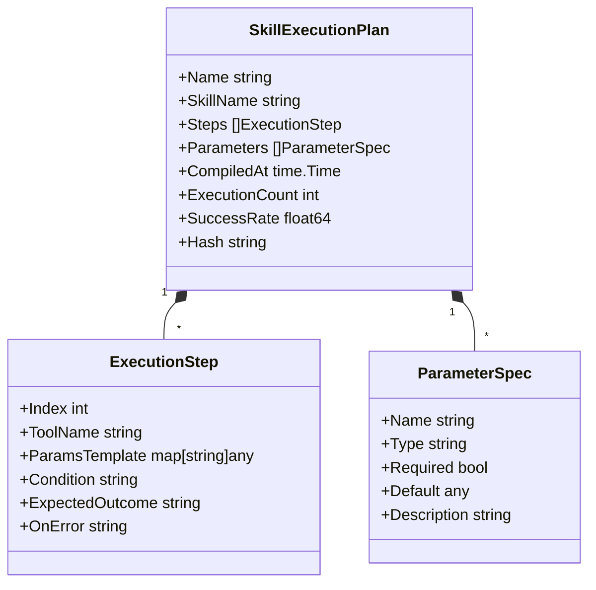
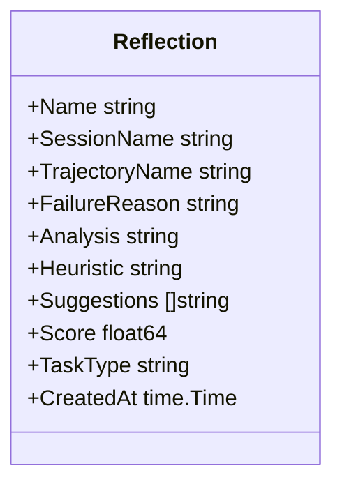
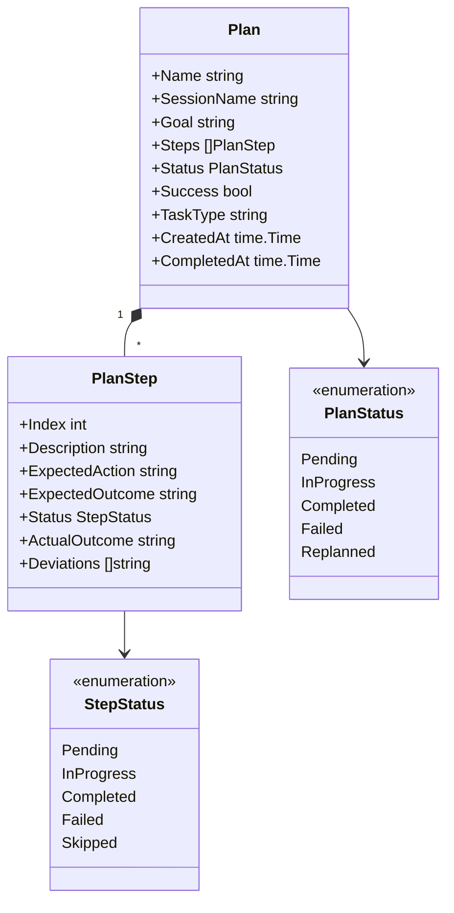
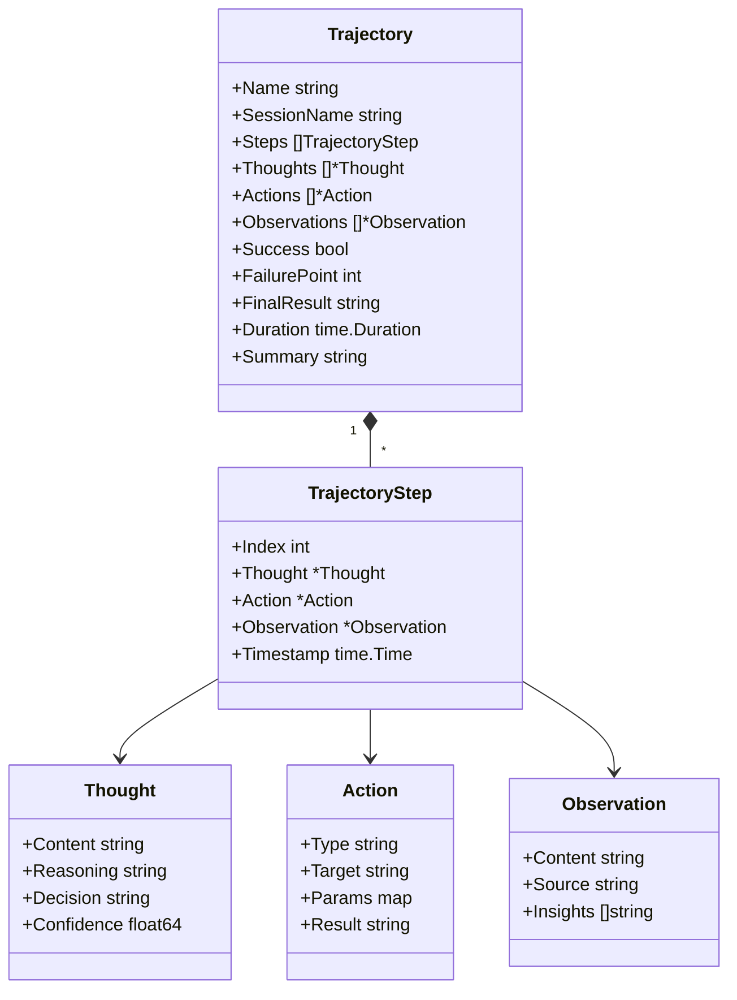
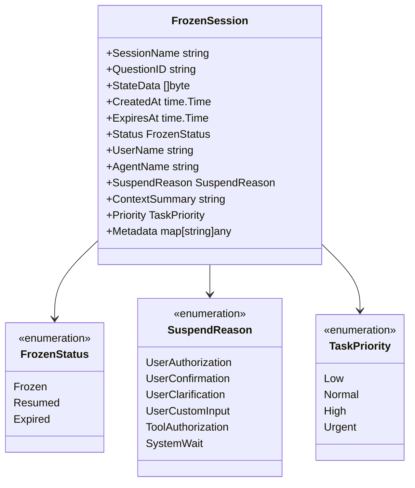
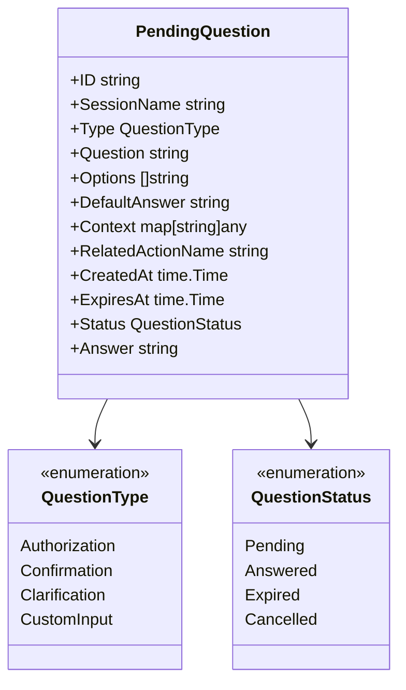
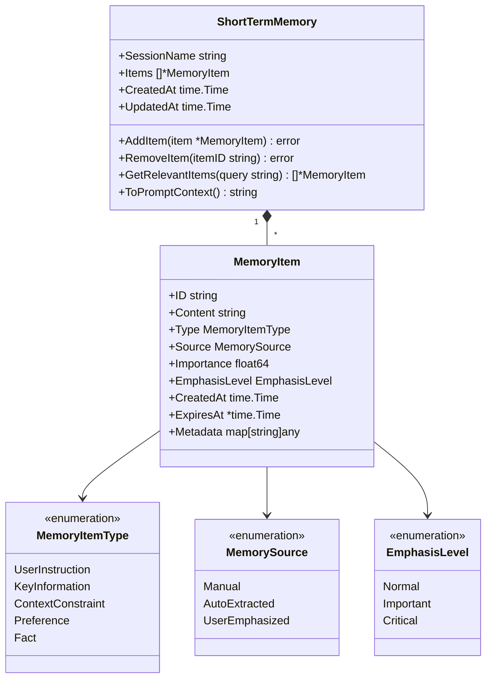
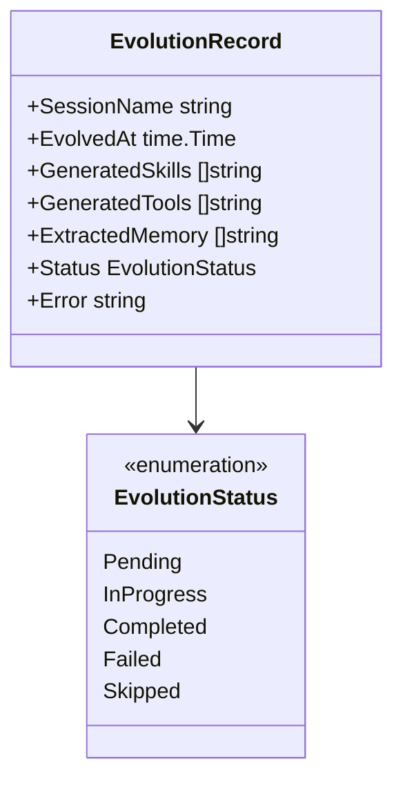
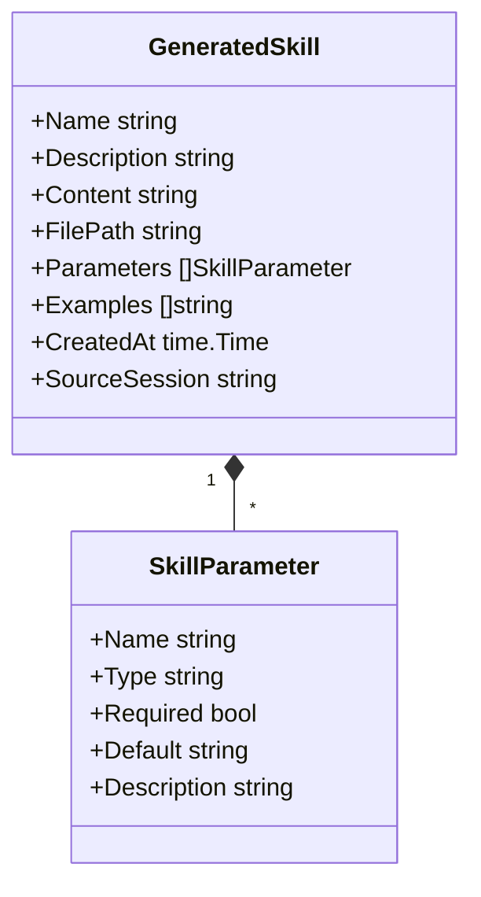
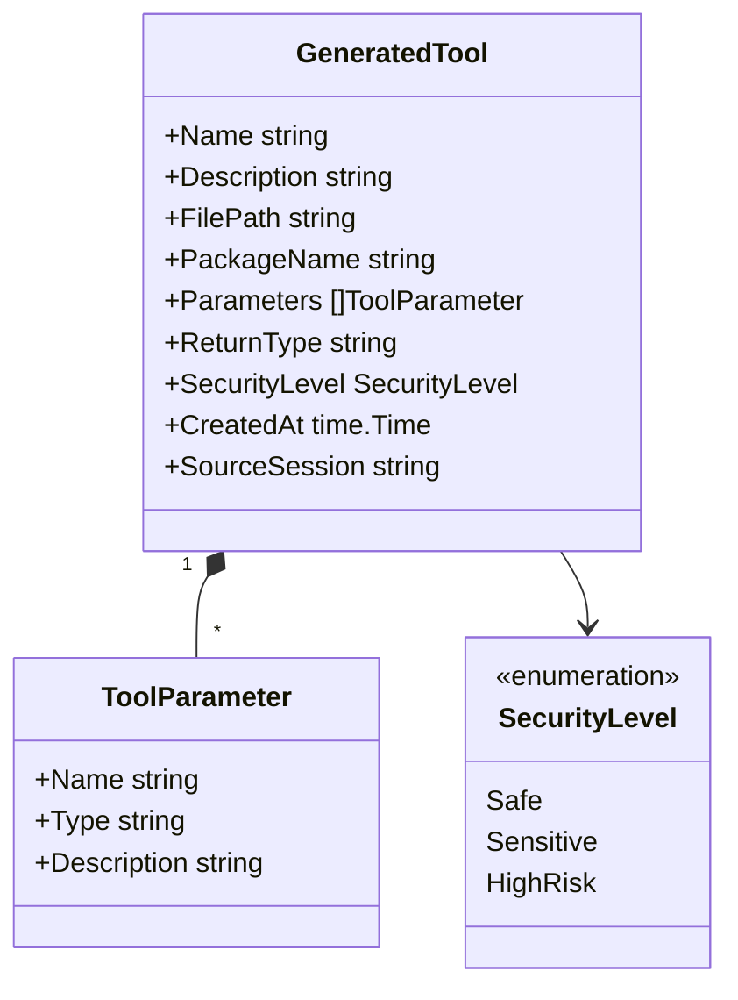

# 节点类型定义

> **相关文档**: [Memory 模块概述](memory-module.md) | [关系类型定义](memory-relationships.md)

Memory 模块使用 GoRAG 的 `core.Node` 结构，通过 `Type` 字段区分不同类型的节点。本文档详细定义所有节点类型及其属性。

## 1. 静态资源节点

| 节点类型 | 说明   | 典型属性                               |
| -------- | ------ | -------------------------------------- |
| Agent    | 智能体 | name, version, capabilities            |
| Model    | 模型   | name, base-url, api-key                |
| Skill    | 技能   | name, description, allowed-tools, path |
| Tool     | 工具   | name, description, securityLevel       |

**Skill 节点说明**：

Skill 是目录结构，通过 SKILL.md 定义。Memory.Load 时将 Skill 索引到图谱中，首次执行后编译为 SkillExecutionPlan。

## 2. 编译缓存节点

| 节点类型           | 说明           | 典型属性                                     |
| ------------------ | -------------- | -------------------------------------------- |
| SkillExecutionPlan | 技能执行计划   | skillName, steps, parameters, executionCount |
| ExecutionStep      | 参数化执行步骤 | index, toolName, paramsTemplate, condition   |

**编译缓存机制**：

```
首次执行：Skill → Reactor 解析 → SkillExecutionPlan → 存入 Memory
后续执行：Memory 获取 SkillExecutionPlan → 直接执行参数化步骤
```

### 2.1 SkillExecutionPlan 节点详细设计



**说明**：

- `SkillExecutionPlan` 通过 `name` 作为唯一标识
- `skillName` 关联对应的 Skill

**关系**：

- `Skill --COMPILED_TO--> SkillExecutionPlan`
- `SkillExecutionPlan --CONTAINS--> ExecutionStep`

## 3. 动态数据节点

| 节点类型 | 说明      | 典型属性                  |
| -------- | --------- | ------------------------- |
| Session  | 会话      | userID, startTime, status |
| Message  | 消息      | role, content, timestamp  |
| File     | 文件      | path, type, content       |
| Workflow | 流程/编排 | name, steps, status       |

## 4. 演进范式节点

| 节点类型   | 说明     | 典型属性                                   |
| ---------- | -------- | ------------------------------------------ |
| Reflection | 反思建议 | failureReason, analysis, heuristic, score  |
| Plan       | 执行计划 | goal, steps, status, success               |
| PlanStep   | 计划步骤 | index, description, expectedAction, status |
| Trajectory | 执行轨迹 | success, failurePoint, summary, duration   |

### 4.1 Reflection 节点详细设计



**属性说明**：

| 属性           | 说明                               |
| -------------- | ---------------------------------- |
| Name           | 反思唯一标识                       |
| SessionName    | 关联的会话标识                     |
| TrajectoryName | 关联的执行轨迹标识                 |
| FailureReason  | 失败原因摘要                       |
| Analysis       | 详细的失败分析                     |
| Heuristic      | 启发式建议（用于指导下一次尝试）   |
| Suggestions    | 具体改进建议列表                   |
| Score          | 反思质量分数（用于过滤低质量反思） |
| TaskType       | 任务类型（用于分类检索）           |
| CreatedAt      | 创建时间                           |

### 4.2 Plan 节点详细设计



**属性说明**：

| 属性        | 说明                     |
| ----------- | ------------------------ |
| Name        | 计划唯一标识             |
| SessionName | 关联的会话标识           |
| Goal        | 计划目标                 |
| Steps       | 计划步骤列表             |
| Status      | 计划状态                 |
| Success     | 计划是否成功完成         |
| TaskType    | 任务类型（用于分类检索） |
| CreatedAt   | 创建时间                 |
| CompletedAt | 完成时间                 |

### 4.3 Trajectory 节点详细设计



## 5. 暂停-恢复节点

### 5.1 FrozenSession 节点



**FrozenSession 字段说明**：

| 字段           | 类型          | 说明                    |
| -------------- | ------------- | ----------------------- |
| UserName       | string        | 关联的用户标识          |
| AgentName      | string        | 执行该任务的 Agent 名称 |
| SuspendReason  | SuspendReason | 暂停原因枚举            |
| ContextSummary | string        | 任务上下文摘要          |
| Priority       | TaskPriority  | 任务优先级              |
| Metadata       | map           | 扩展元数据              |

**SuspendReason 枚举说明**：

| 值                | 说明                           |
| ----------------- | ------------------------------ |
| UserAuthorization | 等待用户授权（如敏感工具调用） |
| UserConfirmation  | 等待用户确认                   |
| UserClarification | 等待用户澄清                   |
| UserCustomInput   | 等待用户自定义输入             |
| ToolAuthorization | 等待工具授权                   |
| SystemWait        | 系统等待（如依赖任务未完成）   |

### 5.2 PendingQuestion 节点



## 6. 短期记忆节点

### 6.1 ShortTermMemory 节点



**MemoryItem 字段说明**：

| 字段          | 类型           | 说明                               |
| ------------- | -------------- | ---------------------------------- |
| Content       | string         | 记忆内容                           |
| Type          | MemoryItemType | 记忆类型                           |
| Source        | MemorySource   | 来源（手动添加/自动提取/用户强调） |
| Importance    | float64        | 重要性分数 (0-1)                   |
| EmphasisLevel | EmphasisLevel  | 强调级别                           |
| ExpiresAt     | *time.Time     | 过期时间（可选）                   |

## 7. 进化相关节点

### 7.1 EvolutionRecord 节点



### 7.2 GeneratedSkill 节点



### 7.3 GeneratedTool 节点



## 8. 节点类型汇总

| 类别      | 节点类型           | 说明           |
| --------- | ------------------ | -------------- |
| 静态资源  | Agent              | 智能体定义     |
| 静态资源  | Model              | 模型配置       |
| 静态资源  | Skill              | 技能定义       |
| 静态资源  | Tool               | 工具定义       |
| 编译缓存  | SkillExecutionPlan | 技能执行计划   |
| 编译缓存  | ExecutionStep      | 参数化执行步骤 |
| 动态数据  | Session            | 会话           |
| 动态数据  | Message            | 消息           |
| 动态数据  | File               | 文件           |
| 动态数据  | Workflow           | 流程/编排      |
| 演进范式  | Reflection         | 反思建议       |
| 演进范式  | Plan               | 执行计划       |
| 演进范式  | PlanStep           | 计划步骤       |
| 演进范式  | Trajectory         | 执行轨迹       |
| 暂停-恢复 | FrozenSession      | 冻结会话       |
| 暂停-恢复 | PendingQuestion    | 待回答问题     |
| 短期记忆  | ShortTermMemory    | 短期记忆       |
| 短期记忆  | MemoryItem         | 记忆项         |
| 进化      | EvolutionRecord    | 进化记录       |
| 进化      | GeneratedSkill     | 生成的技能     |
| 进化      | GeneratedTool      | 生成的工具     |
