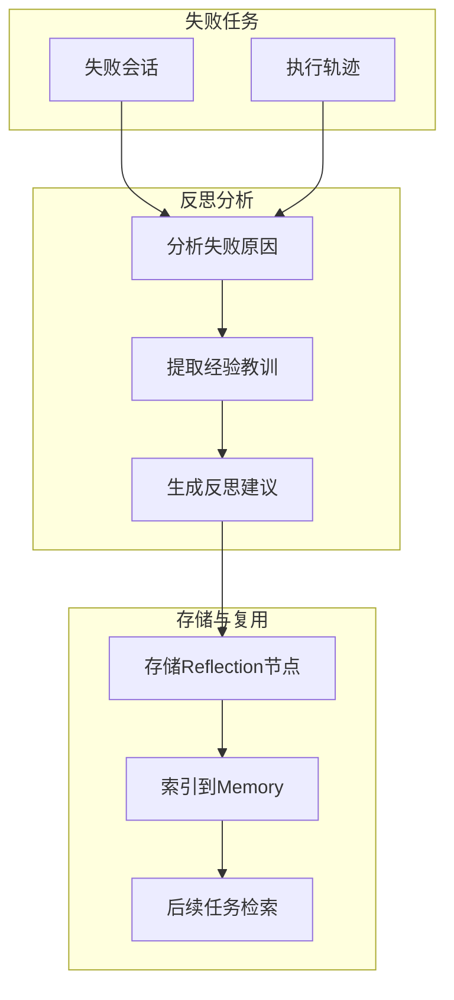
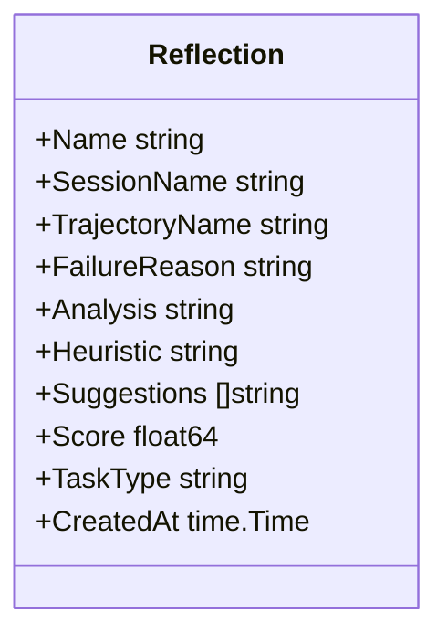
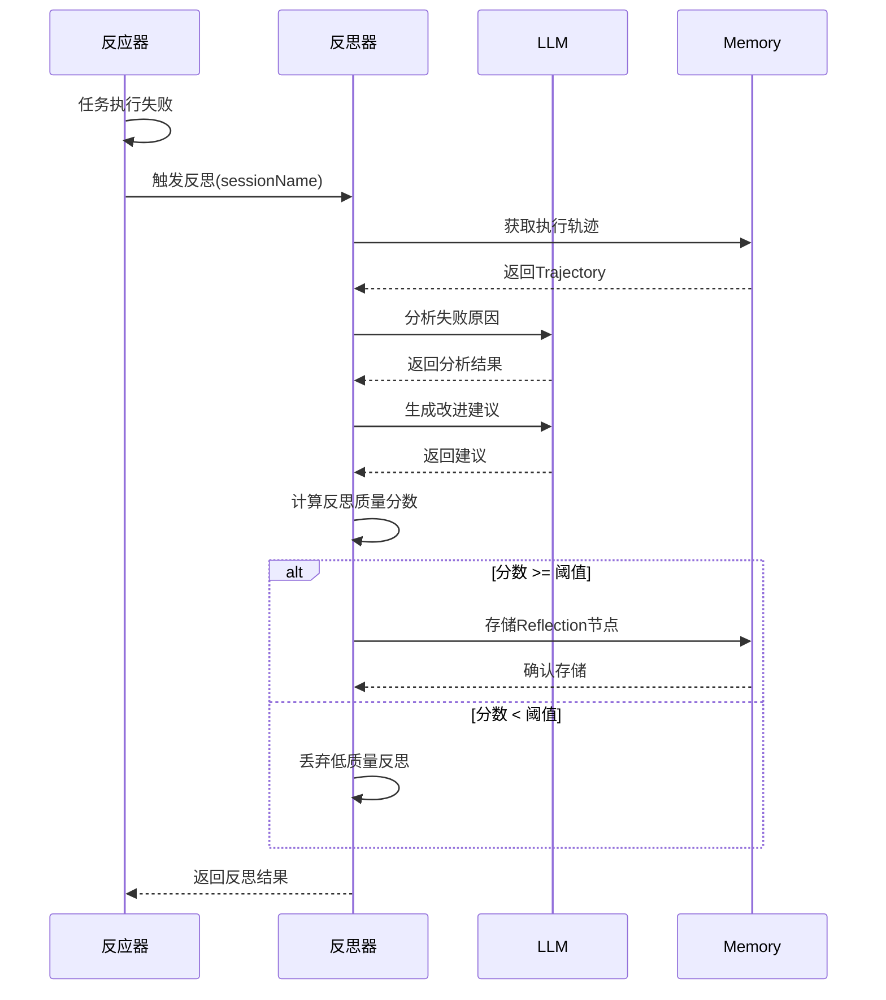
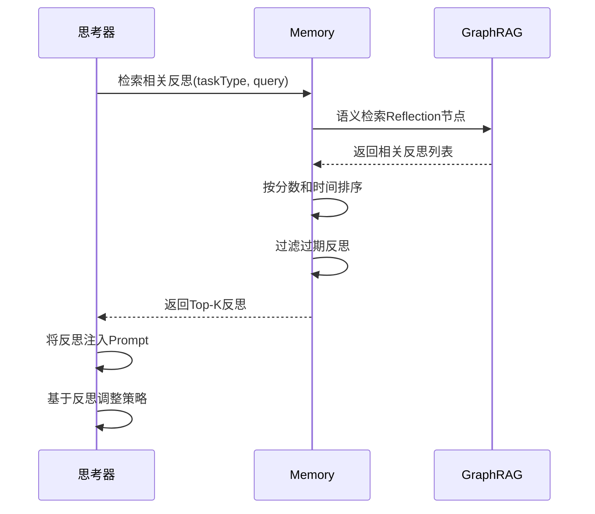
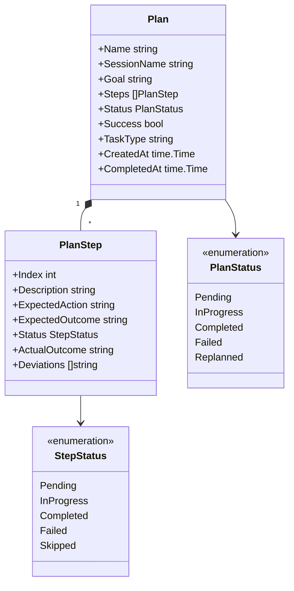
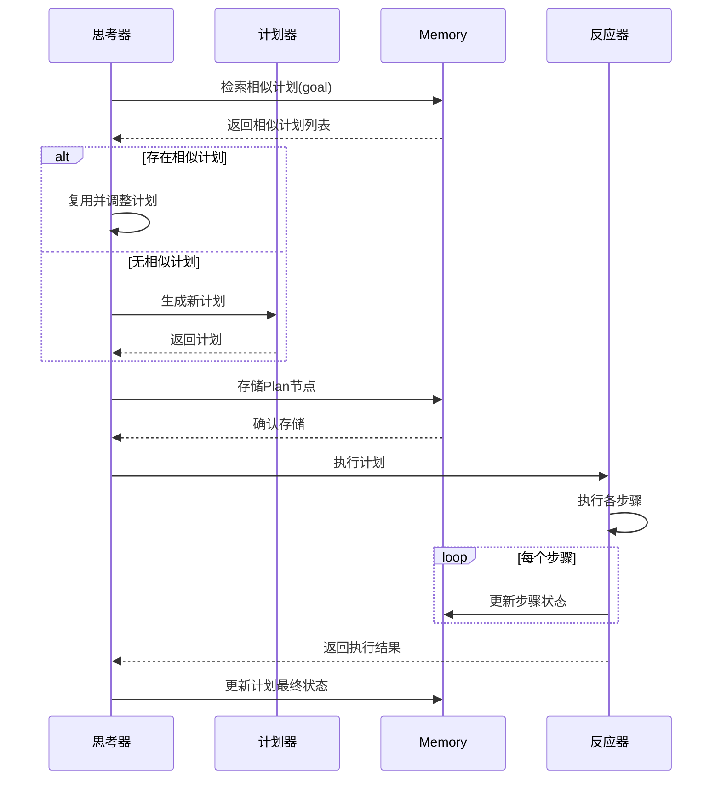
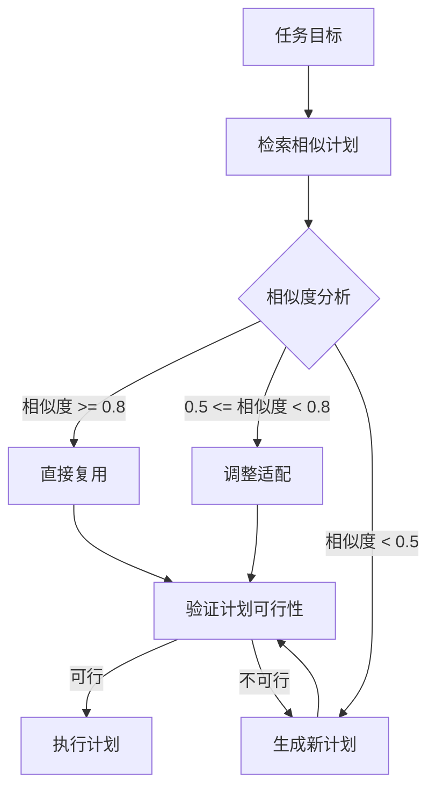
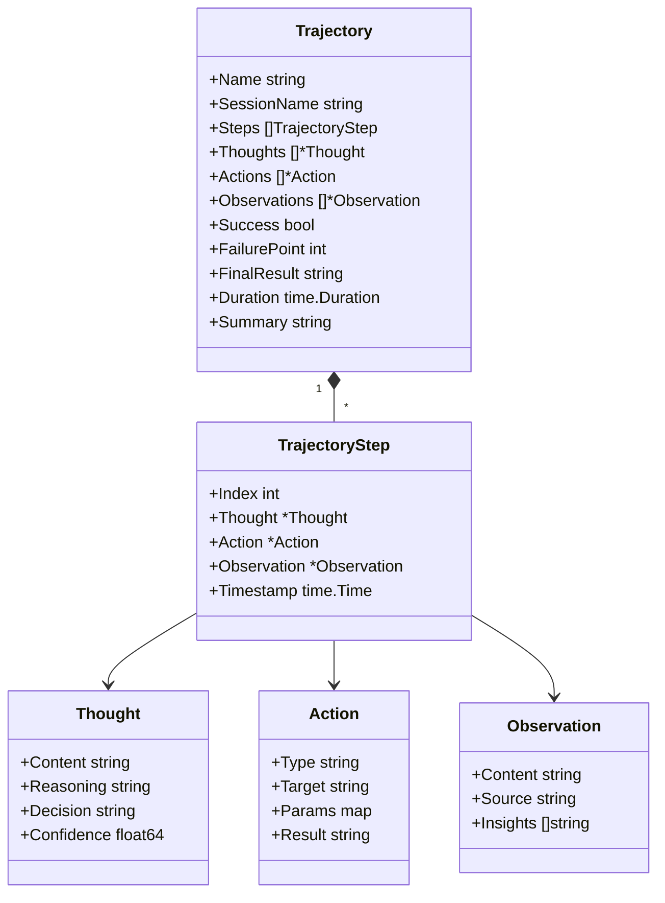
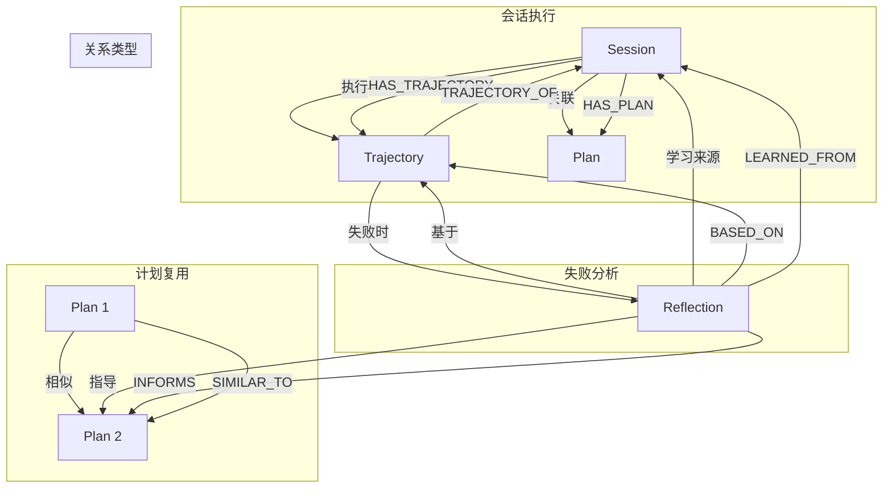

# 反思与计划存储

> **相关文档**: [Memory 模块概述](memory-module.md) | [节点类型定义](memory-nodes.md) | [接口设计](memory-interfaces.md)

反思（Reflection）与计划（Plan）是 Memory 演进范式的核心组件，使系统能够从失败中学习，并在后续任务中复用成功经验。通过 `Reflections()`、`Plans()`、`Trajectories()` 访问器管理相关节点。

## 1. 访问器概述

| 访问器         | 节点类型   | 说明         |
| -------------- | ---------- | ------------ |
| Reflections()  | Reflection | 反思节点     |
| Plans()        | Plan       | 计划节点     |
| Trajectories() | Trajectory | 执行轨迹节点 |

```go
reflections := memory.Reflections()
plans := memory.Plans()
trajectories := memory.Trajectories()
```

## 2. 反思机制概述

反思机制通过分析失败的任务执行轨迹，提取经验教训，生成指导性建议：



## 2. Reflection 节点设计



**字段说明**：

| 字段           | 说明                               |
| -------------- | ---------------------------------- |
| Name           | 反思唯一标识                       |
| SessionName    | 关联的会话标识                     |
| TrajectoryName | 关联的执行轨迹标识                 |
| FailureReason  | 失败原因摘要                       |
| Analysis       | 详细的失败分析                     |
| Heuristic      | 启发式建议（用于指导下一次尝试）   |
| Suggestions    | 具体改进建议列表                   |
| Score          | 反思质量分数（用于过滤低质量反思） |
| TaskType       | 任务类型（用于分类检索）           |
| CreatedAt      | 创建时间                           |

## 3. 反思生成流程



### 3.1 反思质量评分

| 维度     | 权重 | 说明                         |
| -------- | ---- | ---------------------------- |
| 具体性   | 0.3  | 建议是否具体可操作           |
| 相关性   | 0.3  | 建议是否与失败原因直接相关   |
| 可执行性 | 0.2  | 建议是否可在后续任务中执行   |
| 新颖性   | 0.2  | 建议是否提供了新的视角或方法 |

**分数计算**：

```
Score = Specificity * 0.3 + Relevance * 0.3 + Executability * 0.2 + Novelty * 0.2
```

### 3.2 反思阈值配置

```go
type ReflectionConfig struct {
    MinScoreThreshold    float64   // 最低质量分数阈值，默认 0.6
    MaxReflectionsPerDay int       // 每日最大反思数，默认 100
    RetentionDays        int       // 反思保留天数，默认 30
    EnableAutoReflection bool      // 是否启用自动反思，默认 true
}
```

## 4. 反思检索与应用



### 4.1 反思检索策略

| 策略     | 说明                       |
| -------- | -------------------------- |
| 任务类型 | 优先检索相同类型的任务反思 |
| 语义相似 | 检索语义相似的失败场景     |
| 时间衰减 | 最近的反思权重更高         |
| 质量过滤 | 只返回分数超过阈值的反思   |

### 4.2 反思注入模板

```markdown
{{if .Reflections}}
<reflections>
以下是相关的历史经验教训，请参考：

{{range .Reflections}}
**失败原因**: {{.FailureReason}}
**分析**: {{.Analysis}}
**建议**: {{.Heuristic}}
{{end}}
</reflections>
{{end}}
```

## 5. 计划存储机制

计划（Plan）用于存储任务执行计划，支持计划复用和相似任务优化：



### 5.1 Plan 字段说明

| 字段        | 说明                     |
| ----------- | ------------------------ |
| Name        | 计划唯一标识             |
| SessionName | 关联的会话标识           |
| Goal        | 计划目标                 |
| Steps       | 计划步骤列表             |
| Status      | 计划状态                 |
| Success     | 计划是否成功完成         |
| TaskType    | 任务类型（用于分类检索） |
| CreatedAt   | 创建时间                 |
| CompletedAt | 完成时间                 |

### 5.2 PlanStep 字段说明

| 字段            | 说明                     |
| --------------- | ------------------------ |
| Index           | 步骤索引                 |
| Description     | 步骤描述                 |
| ExpectedAction  | 预期动作                 |
| ExpectedOutcome | 预期结果                 |
| Status          | 步骤状态                 |
| ActualOutcome   | 实际结果                 |
| Deviations      | 偏差记录（与预期的差异） |

## 6. 计划生成与执行流程



### 6.1 计划复用策略



### 6.2 相似度计算

```go
func CalculatePlanSimilarity(goal1, goal2 string, steps1, steps2 []PlanStep) float64 {
    // 目标语义相似度
    goalSimilarity := semanticSimilarity(goal1, goal2)
    
    // 步骤结构相似度
    stepSimilarity := calculateStepSimilarity(steps1, steps2)
    
    // 加权平均
    return goalSimilarity * 0.4 + stepSimilarity * 0.6
}
```

## 7. 执行轨迹存储

执行轨迹（Trajectory）记录任务执行的完整过程：



### 7.1 Trajectory 字段说明

| 字段         | 说明                   |
| ------------ | ---------------------- |
| Name         | 轨迹唯一标识           |
| SessionName  | 关联的会话标识         |
| Steps        | 执行步骤列表           |
| Thoughts     | 思考过程记录           |
| Actions      | 执行动作记录           |
| Observations | 观察结果记录           |
| Success      | 任务是否成功           |
| FailurePoint | 失败点索引（如果失败） |
| FinalResult  | 最终结果               |
| Duration     | 执行时长               |
| Summary      | 执行摘要               |

## 8. 反思-计划-轨迹关系图



## 9. 反思与计划服务接口

```mermaid
classDiagram
    class ReflectionService {
        <<interface>>
        +CreateReflection(ctx context.Context, sessionName string) (*Reflection, error)
        +GetReflection(ctx context.Context, reflectionName string) (*Reflection, error)
        +ListReflections(ctx context.Context, opts ...ReflectionOption) ([]*Reflection, error)
        +DeleteReflection(ctx context.Context, reflectionName string) error
        +GetRelevantReflections(ctx context.Context, taskType string, query string, topK int) ([]*Reflection, error)
    }
    
    class PlanService {
        <<interface>>
        +CreatePlan(ctx context.Context, sessionName string, goal string) (*Plan, error)
        +GetPlan(ctx context.Context, planName string) (*Plan, error)
        +UpdatePlan(ctx context.Context, plan *Plan) error
        +DeletePlan(ctx context.Context, planName string) error
        +FindSimilarPlans(ctx context.Context, goal string, threshold float64) ([]*Plan, error)
        +UpdatePlanStep(ctx context.Context, planName string, stepIndex int, status StepStatus, outcome string) error
    }
    
    class TrajectoryService {
        <<interface>>
        +CreateTrajectory(ctx context.Context, sessionName string) (*Trajectory, error)
        +AddStep(ctx context.Context, trajectoryName string, step *TrajectoryStep) error
        +GetTrajectory(ctx context.Context, trajectoryName string) (*Trajectory, error)
        +MarkComplete(ctx context.Context, trajectoryName string, success bool, result string) error
    }
```



**方法说明**：

| 服务              | 方法                   | 说明         |
| ----------------- | ---------------------- | ------------ |
| ReflectionService | CreateReflection       | 创建反思     |
| ReflectionService | GetReflection          | 获取反思     |
| ReflectionService | ListReflections        | 列出反思     |
| ReflectionService | DeleteReflection       | 删除反思     |
| ReflectionService | GetRelevantReflections | 获取相关反思 |
| PlanService       | CreatePlan             | 创建计划     |
| PlanService       | GetPlan                | 获取计划     |
| PlanService       | UpdatePlan             | 更新计划     |
| PlanService       | DeletePlan             | 删除计划     |
| PlanService       | FindSimilarPlans       | 查找相似计划 |
| PlanService       | UpdatePlanStep         | 更新计划步骤 |
| TrajectoryService | CreateTrajectory       | 创建轨迹     |
| TrajectoryService | AddStep                | 添加步骤     |
| TrajectoryService | GetTrajectory          | 获取轨迹     |
| TrajectoryService | MarkComplete           | 标记完成     |

## 10. 配置选项

```go
type ReflectionPlanConfig struct {
    // 反思配置
    ReflectionConfig ReflectionConfig
    
    // 计划配置
    PlanConfig PlanConfig
    
    // 轨迹配置
    TrajectoryConfig TrajectoryConfig
}

type PlanConfig struct {
    EnablePlanReuse       bool      // 是否启用计划复用，默认 true
    SimilarityThreshold   float64   // 相似度阈值，默认 0.7
    MaxPlanSteps          int       // 最大计划步骤数，默认 20
    PlanRetentionDays     int       // 计划保留天数，默认 90
}

type TrajectoryConfig struct {
    EnableTrajectoryStore bool      // 是否存储轨迹，默认 true
    MaxTrajectorySteps    int       // 最大轨迹步骤数，默认 100
    TrajectoryRetentionDays int     // 轨迹保留天数，默认 30
    EnableSummary         bool      // 是否生成摘要，默认 true
}
```
