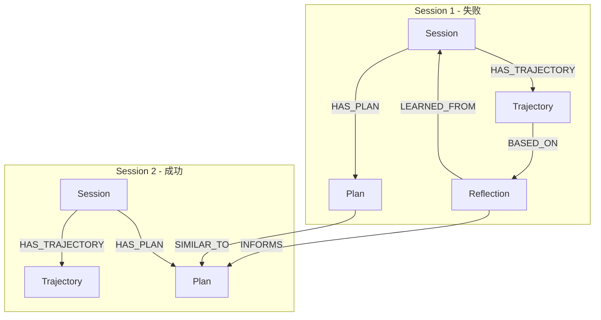
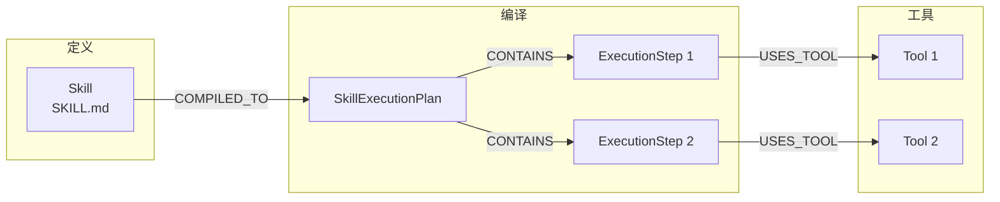
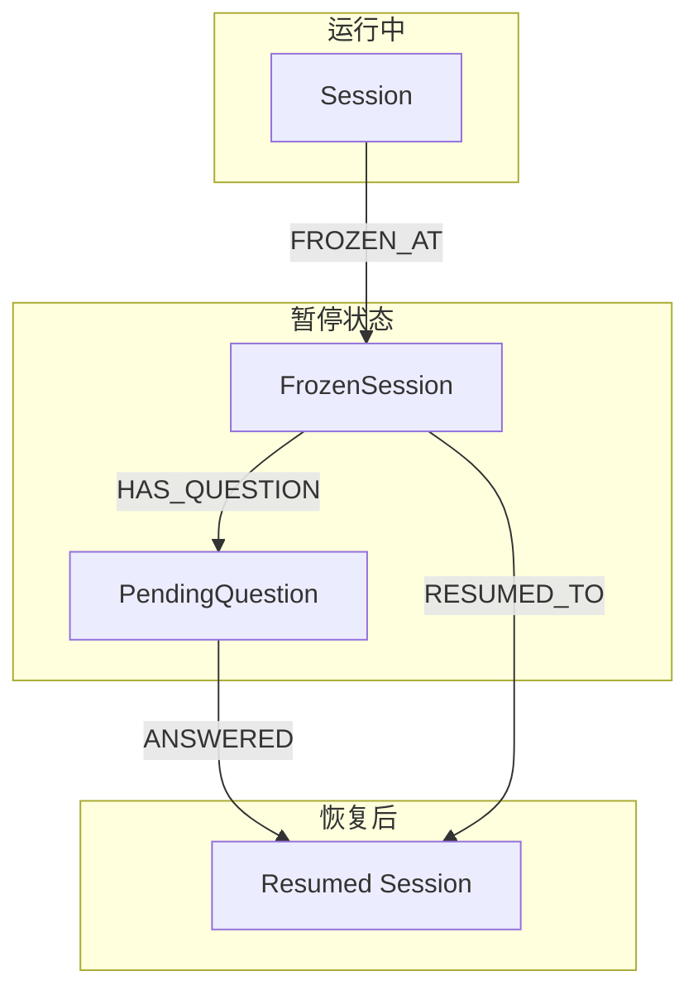
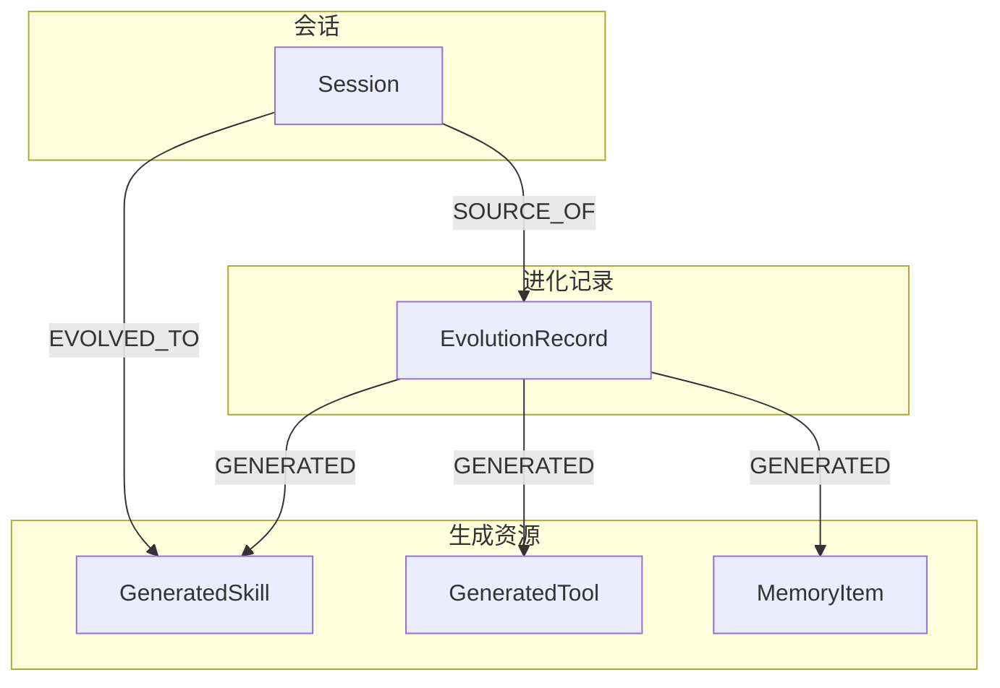

# 关系类型定义

> **相关文档**: [Memory 模块概述](memory-module.md) | [节点类型定义](memory-nodes.md)

Memory 模块使用 GoRAG 的 `core.Edge` 结构，通过 `Type` 字段区分不同类型的关系。本文档详细定义所有关系类型及其语义。

## 1. 基础关系类型

| 关系类型        | 说明                  | 方向                       |
| --------------- | --------------------- | -------------------------- |
| USES            | Agent 使用 Model/Tool | Agent → Model/Tool         |
| HAS_SKILL       | Agent 拥有 Skill      | Agent → Skill              |
| PARTICIPATED_IN | Agent 参与 Session    | Agent → Session            |
| CONTAINS        | Session 包含内容      | Session → File/...         |
| DEPENDS_ON      | 依赖关系              | Node → Node                |
| DERIVED_FROM    | 派生关系              | Node → Node                |
| COMPILED_TO     | Skill 编译为执行计划  | Skill → SkillExecutionPlan |
| USES_TOOL       | 执行计划使用工具      | ExecutionStep → Tool       |

### 1.1 USES 关系

表示 Agent 对资源的使用关系。

```
Agent --USES--> Model
Agent --USES--> Tool
```

**属性**：

| 属性       | 说明         |
| ---------- | ------------ |
| since      | 开始使用时间 |
| usageCount | 使用次数     |
| lastUsedAt | 最后使用时间 |

### 1.2 HAS_SKILL 关系

表示 Agent 拥有的技能。

```
Agent --HAS_SKILL--> Skill
```

**属性**：

| 属性     | 说明       |
| -------- | ---------- |
| enabled  | 是否启用   |
| priority | 技能优先级 |

### 1.3 PARTICIPATED_IN 关系

表示 Agent 参与的会话。

```
Agent --PARTICIPATED_IN--> Session
```

**属性**：

| 属性     | 说明     |
| -------- | -------- |
| role     | 参与角色 |
| joinedAt | 加入时间 |

### 1.4 CONTAINS 关系

表示包含关系，用于会话内容的组织。

```
Session --CONTAINS--> Message
Session --CONTAINS--> File
Session --CONTAINS--> Workflow
```

**属性**：

| 属性    | 说明     |
| ------- | -------- |
| order   | 顺序索引 |
| addedAt | 添加时间 |

### 1.5 COMPILED_TO 关系

表示 Skill 编译为执行计划的关系。

```
Skill --COMPILED_TO--> SkillExecutionPlan
```

**属性**：

| 属性       | 说明           |
| ---------- | -------------- |
| compiledAt | 编译时间       |
| hash       | 源文件 Hash    |
| modelUsed  | 编译使用的模型 |

### 1.6 USES_TOOL 关系

表示执行步骤使用工具的关系。

```
ExecutionStep --USES_TOOL--> Tool
```

**属性**：

| 属性      | 说明     |
| --------- | -------- |
| params    | 参数模板 |
| condition | 执行条件 |

## 2. 演进范式关系类型

| 关系类型      | 说明                 | 方向                    |
| ------------- | -------------------- | ----------------------- |
| LEARNED_FROM  | 从失败会话中学习     | Reflection → Session    |
| BASED_ON      | 反思基于执行轨迹     | Reflection → Trajectory |
| HAS_PLAN      | 会话关联计划         | Session → Plan          |
| PLAN_STEP     | 计划包含步骤         | Plan → PlanStep         |
| TRAJECTORY_OF | 轨迹属于会话         | Trajectory → Session    |
| INFORMS       | 反思指导计划         | Reflection → Plan       |
| SIMILAR_TO    | 相似计划（用于复用） | Plan → Plan             |
| AVOIDS        | 反思建议避免的行为   | Reflection → Action     |

### 2.1 LEARNED_FROM 关系

表示反思从失败会话中学习的关系。

```
Reflection --LEARNED_FROM--> Session
```

**属性**：

| 属性        | 说明     |
| ----------- | -------- |
| failureType | 失败类型 |
| learnedAt   | 学习时间 |

### 2.2 BASED_ON 关系

表示反思基于执行轨迹的关系。

```
Reflection --BASED_ON--> Trajectory
```

**属性**：

| 属性        | 说明         |
| ----------- | ------------ |
| failureStep | 失败步骤索引 |

### 2.3 HAS_PLAN 关系

表示会话关联计划的关系。

```
Session --HAS_PLAN--> Plan
```

**属性**：

| 属性      | 说明     |
| --------- | -------- |
| createdAt | 创建时间 |
| status    | 计划状态 |

### 2.4 PLAN_STEP 关系

表示计划包含步骤的关系。

```
Plan --PLAN_STEP--> PlanStep
```

**属性**：

| 属性  | 说明     |
| ----- | -------- |
| order | 步骤顺序 |

### 2.5 TRAJECTORY_OF 关系

表示轨迹属于会话的关系。

```
Trajectory --TRAJECTORY_OF--> Session
```

**属性**：

| 属性      | 说明     |
| --------- | -------- |
| startedAt | 开始时间 |
| endedAt   | 结束时间 |

### 2.6 INFORMS 关系

表示反思指导计划的关系。

```
Reflection --INFORMS--> Plan
```

**属性**：

| 属性      | 说明       |
| --------- | ---------- |
| relevance | 相关性分数 |
| appliedAt | 应用时间   |

### 2.7 SIMILAR_TO 关系

表示计划相似的关系，用于计划复用。

```
Plan --SIMILAR_TO--> Plan
```

**属性**：

| 属性        | 说明             |
| ----------- | ---------------- |
| similarity  | 相似度分数 (0-1) |
| sharedSteps | 共享步骤数       |

## 3. 暂停-恢复关系类型

| 关系类型     | 说明             | 方向                            |
| ------------ | ---------------- | ------------------------------- |
| HAS_QUESTION | 冻结会话关联问题 | FrozenSession → PendingQuestion |
| WAITS_FOR    | 会话等待用户输入 | Session → PendingQuestion       |
| FROZEN_AT    | 会话冻结状态     | Session → FrozenSession         |
| RESUMED_TO   | 冻结会话恢复目标 | FrozenSession → Session         |

### 3.1 HAS_QUESTION 关系

表示冻结会话关联待回答问题。

```
FrozenSession --HAS_QUESTION--> PendingQuestion
```

**属性**：

| 属性     | 说明       |
| -------- | ---------- |
| askedAt  | 提问时间   |
| priority | 问题优先级 |

### 3.2 WAITS_FOR 关系

表示会话等待用户输入。

```
Session --WAITS_FOR--> PendingQuestion
```

**属性**：

| 属性    | 说明     |
| ------- | -------- |
| reason  | 等待原因 |
| timeout | 超时时间 |

## 4. 短期记忆关系类型

| 关系类型              | 说明             | 方向                         |
| --------------------- | ---------------- | ---------------------------- |
| HAS_SHORT_TERM_MEMORY | 会话关联短期记忆 | Session → ShortTermMemory    |
| CONTAINS_ITEM         | 短期记忆包含项   | ShortTermMemory → MemoryItem |

### 4.1 HAS_SHORT_TERM_MEMORY 关系

表示会话关联短期记忆。

```
Session --HAS_SHORT_TERM_MEMORY--> ShortTermMemory
```

**属性**：

| 属性      | 说明     |
| --------- | -------- |
| createdAt | 创建时间 |
| updatedAt | 更新时间 |

### 4.2 CONTAINS_ITEM 关系

表示短期记忆包含记忆项。

```
ShortTermMemory --CONTAINS_ITEM--> MemoryItem
```

**属性**：

| 属性       | 说明       |
| ---------- | ---------- |
| addedAt    | 添加时间   |
| importance | 重要性分数 |

## 5. 进化关系类型

| 关系类型   | 说明               | 方向                                  |
| ---------- | ------------------ | ------------------------------------- |
| EVOLVED_TO | 会话进化生成新资源 | Session → GeneratedSkill/Tool         |
| GENERATED  | 进化记录生成资源   | EvolutionRecord → GeneratedSkill/Tool |
| SOURCE_OF  | 生成资源的来源会话 | Session → EvolutionRecord             |

### 5.1 EVOLVED_TO 关系

表示会话进化生成新资源。

```
Session --EVOLVED_TO--> GeneratedSkill
Session --EVOLVED_TO--> GeneratedTool
```

**属性**：

| 属性       | 说明       |
| ---------- | ---------- |
| evolvedAt  | 进化时间   |
| confidence | 置信度分数 |

### 5.2 GENERATED 关系

表示进化记录生成资源。

```
EvolutionRecord --GENERATED--> GeneratedSkill
EvolutionRecord --GENERATED--> GeneratedTool
```

**属性**：

| 属性     | 说明       |
| -------- | ---------- |
| type     | 资源类型   |
| approved | 是否已审批 |

## 6. 关系图示例

### 6.1 会话演进关系图



### 6.2 Skill 编译与执行关系图



### 6.3 暂停-恢复关系图



### 6.4 进化关系图



## 7. 关系类型汇总

| 类别      | 关系类型              | 说明         |
| --------- | --------------------- | ------------ |
| 基础      | USES                  | 使用关系     |
| 基础      | HAS_SKILL             | 拥有技能     |
| 基础      | PARTICIPATED_IN       | 参与会话     |
| 基础      | CONTAINS              | 包含关系     |
| 基础      | DEPENDS_ON            | 依赖关系     |
| 基础      | DERIVED_FROM          | 派生关系     |
| 基础      | COMPILED_TO           | 编译关系     |
| 基础      | USES_TOOL             | 使用工具     |
| 演进范式  | LEARNED_FROM          | 学习来源     |
| 演进范式  | BASED_ON              | 基于轨迹     |
| 演进范式  | HAS_PLAN              | 关联计划     |
| 演进范式  | PLAN_STEP             | 计划步骤     |
| 演进范式  | TRAJECTORY_OF         | 轨迹归属     |
| 演进范式  | INFORMS               | 指导关系     |
| 演进范式  | SIMILAR_TO            | 相似关系     |
| 演进范式  | AVOIDS                | 避免行为     |
| 暂停-恢复 | HAS_QUESTION          | 关联问题     |
| 暂停-恢复 | WAITS_FOR             | 等待输入     |
| 暂停-恢复 | FROZEN_AT             | 冻结状态     |
| 暂停-恢复 | RESUMED_TO            | 恢复目标     |
| 短期记忆  | HAS_SHORT_TERM_MEMORY | 关联短期记忆 |
| 短期记忆  | CONTAINS_ITEM         | 包含记忆项   |
| 进化      | EVOLVED_TO            | 进化生成     |
| 进化      | GENERATED             | 生成资源     |
| 进化      | SOURCE_OF             | 来源会话     |
