# 会话管理

> **相关文档**: [Memory 模块概述](memory-module.md) | [节点类型定义](memory-nodes.md) | [接口设计](memory-interfaces.md)

本文档详细描述 Memory 的 `Sessions()` 访问器功能，包括会话存储、上下文检索、多轮对话一致性保证以及暂停-恢复机制。

## 1. SessionAccessor 概述

`Sessions()` 访问器管理 Session 和 Message 节点，所有操作通过 GraphRAG 完成：

```go
sessions := memory.Sessions()

session, err := sessions.Get(ctx, "session-123")
history, err := sessions.GetHistory(ctx, "session-123")
```

## 2. Session 节点结构

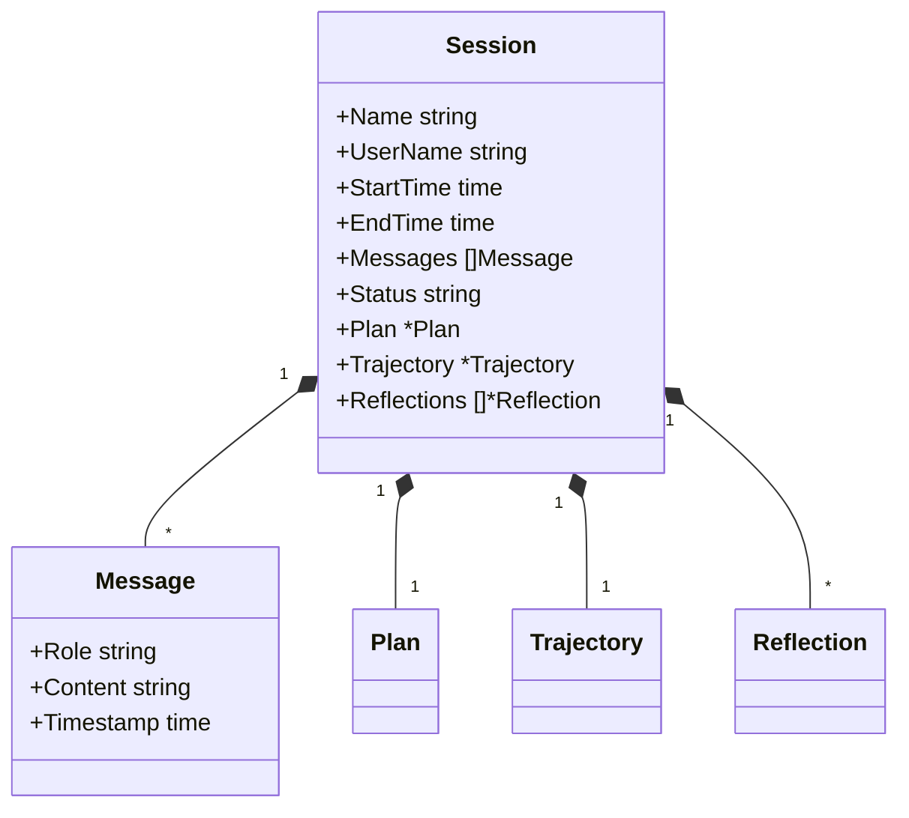

## 3. 上下文检索

当接收到用户的 Ask 后，Memory 可以查出与用户意图最贴切相关的上下文：

**检索维度**：

- **时间戳相关**: 优先返回最近的会话内容
- **内容相关**: 通过语义相似度匹配相关内容
- **反思相关**: 检索相关的反思建议

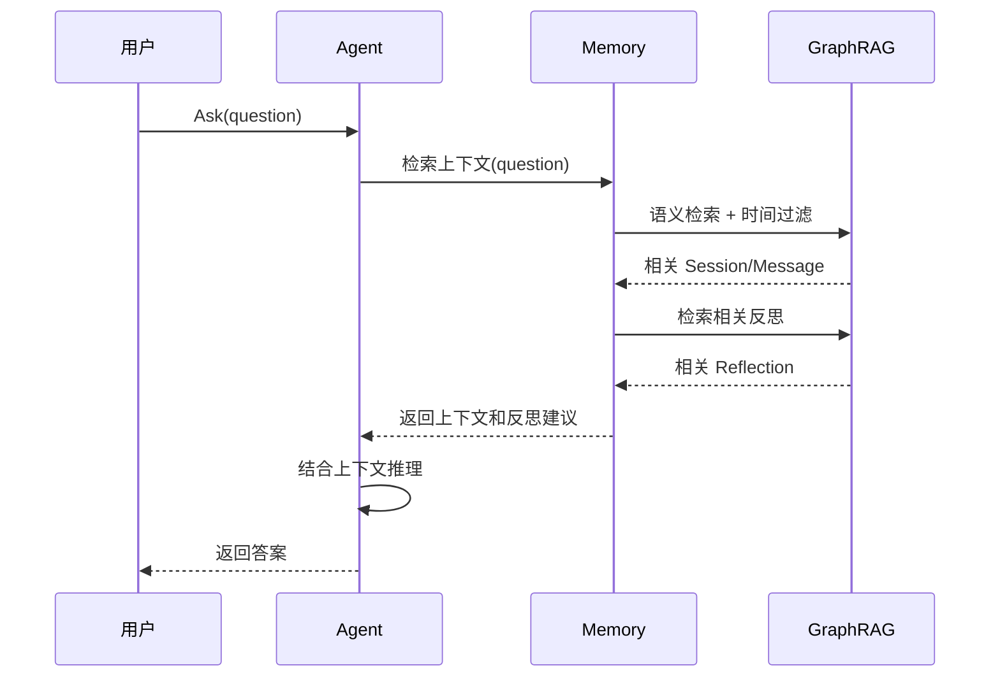

### 2.1 检索策略

| 策略       | 说明                               |
| ---------- | ---------------------------------- |
| 语义相似度 | 基于向量相似度匹配内容相关的上下文 |
| 时间衰减   | 最近的会话权重更高                 |
| 用户关联   | 优先检索当前用户的历史会话         |
| 主题聚类   | 按主题聚合相关会话                 |
| 反思关联   | 检索相关的反思建议                 |

### 2.2 解决上下文问题

这种设计优雅地解决了传统对话系统的两大难题：

1. **上下文腐烂**: 传统系统需要保留完整对话历史，随着对话增长，早期上下文逐渐失效。Memory 只检索与当前意图相关的上下文，避免无关信息干扰。
2. **注意力不集中**: 大模型在处理过长上下文时注意力会分散。Memory 通过语义检索只返回最相关的上下文片段，确保模型聚焦于关键信息。

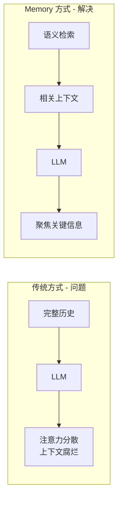

## 3. 上下文加载机制

上下文加载是意图识别的首要步骤，Memory 提供两种上下文相关性检索方式：

### 3.1 时间相关性加载

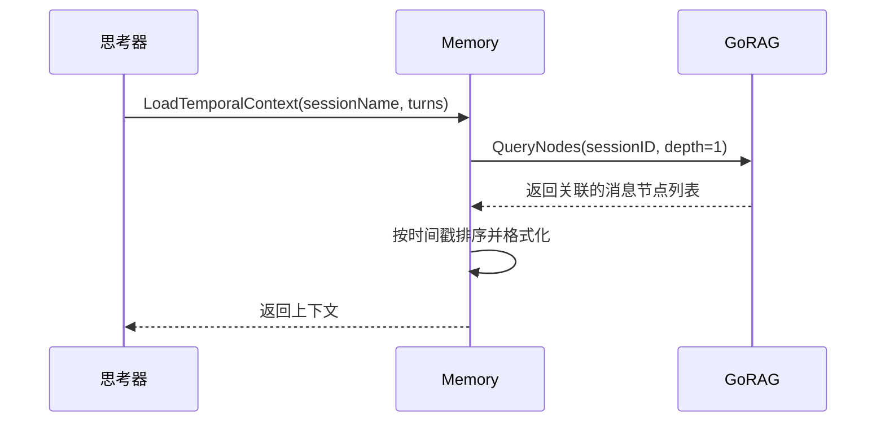

**时间相关性配置**：

| 参数         | 默认值 | 说明                                 |
| ------------ | ------ | ------------------------------------ |
| DefaultTurns | 5      | 默认加载的对话轮数                   |
| MinTurns     | 3      | 最小对话轮数                         |
| MaxTurns     | 10     | 最大对话轮数                         |
| TimeWindow   | 30m    | 时间窗口（超过此时间的对话权重降低） |

### 3.2 语义相关性加载

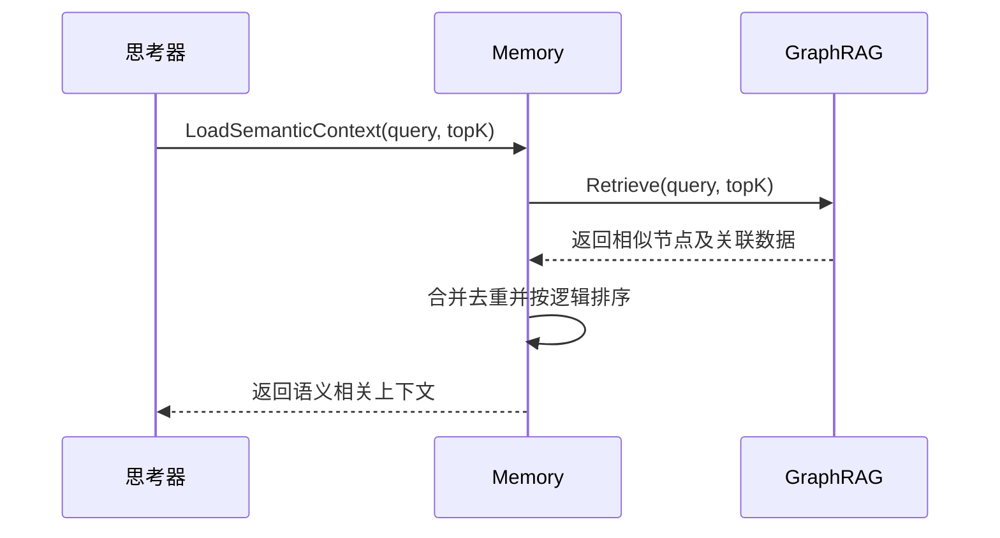

**语义相关性配置**：

| 参数                | 默认值 | 说明             |
| ------------------- | ------ | ---------------- |
| SimilarityThreshold | 0.7    | 相似度阈值       |
| TopK                | 5      | 返回的最大结果数 |
| IncludeAdjacent     | true   | 是否包含相邻消息 |
| AdjacentWindow      | 2      | 相邻消息窗口大小 |

### 3.3 混合上下文加载

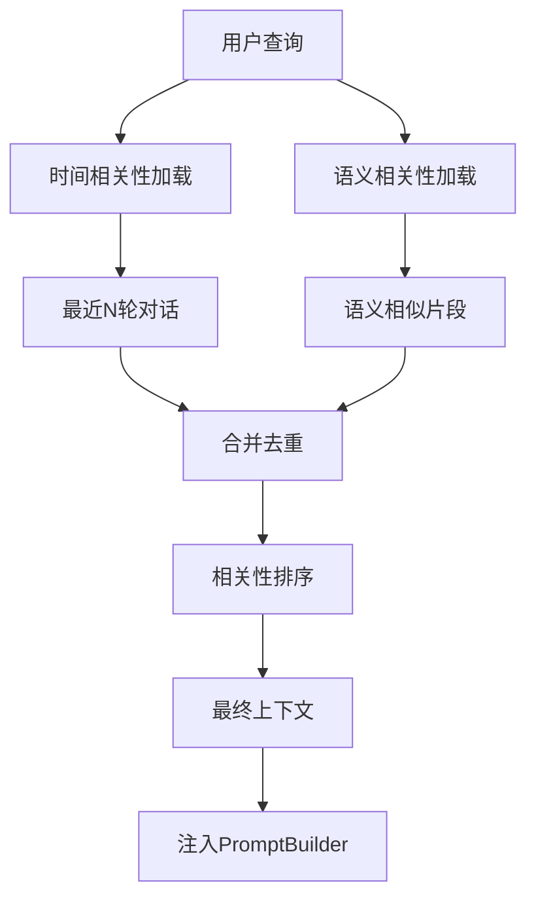

### 3.4 ContextLoader 接口

```go
type ContextLoader interface {
    LoadTemporalContext(ctx context.Context, sessionName string, opts ...ContextOption) (*Context, error)
    LoadSemanticContext(ctx context.Context, query string, opts ...ContextOption) (*Context, error)
    LoadHybridContext(ctx context.Context, sessionName string, query string, opts ...ContextOption) (*Context, error)
}

type Context struct {
    Messages    []*Message
    Relevance   []float64
    Source      ContextSource
    LoadedAt    time.Time
}

type ContextOption func(*ContextConfig)

type ContextConfig struct {
    MaxTurns           int
    SimilarityThreshold float64
    TopK               int
    TimeWindow         time.Duration
    IncludeAdjacent    bool
}
```

## 4. 多轮对话一致性保证

Memory 通过以下机制确保多轮对话的上下文一致性：

### 4.1 一致性检查机制

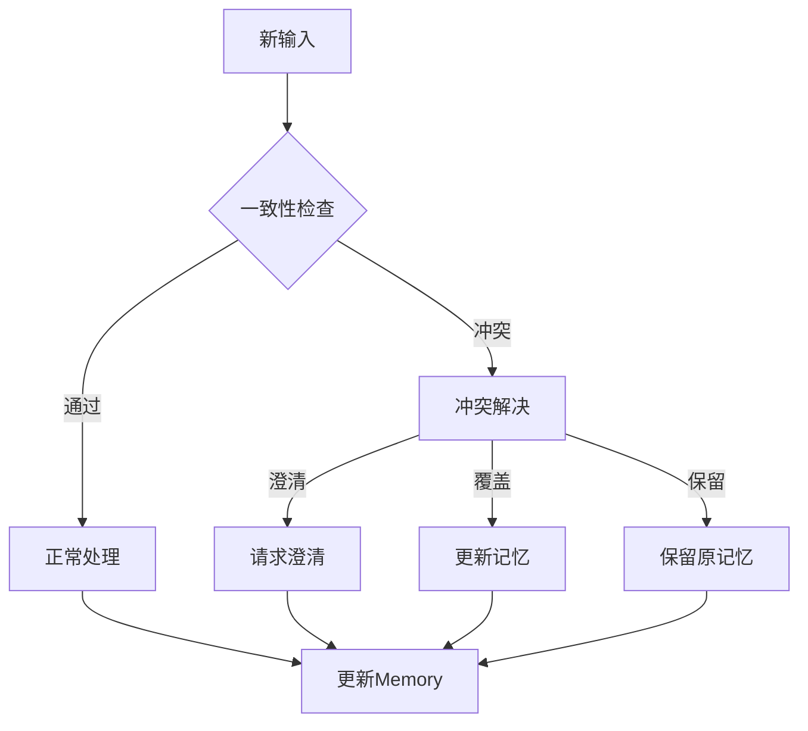

### 4.2 一致性策略

| 策略     | 说明                           | 适用场景     |
| -------- | ------------------------------ | ------------ |
| Strict   | 严格一致性，任何冲突都需澄清   | 关键决策场景 |
| Lenient  | 宽松一致性，自动解决小冲突     | 一般对话场景 |
| Adaptive | 自适应，根据内容重要性选择策略 | 混合场景     |

### 4.3 上下文状态追踪

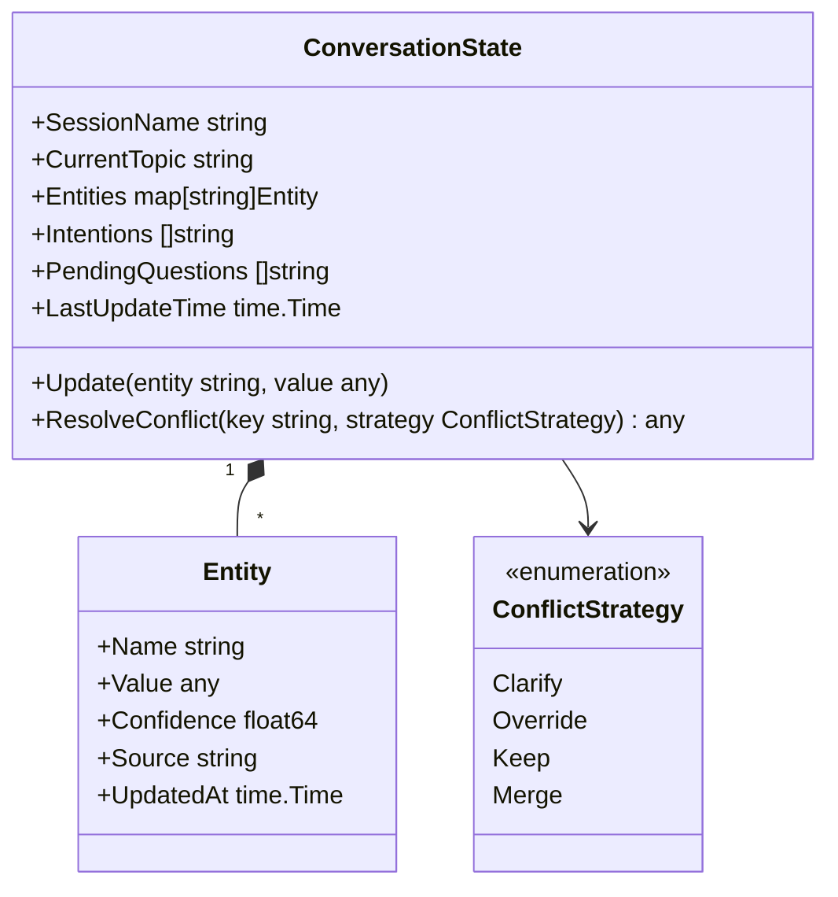

## 5. 暂停-恢复机制

### 5.1 状态序列化规范

为确保暂停-恢复机制的状态一致性，需要定义严格的状态序列化和反序列化规范：

**状态序列化结构**：

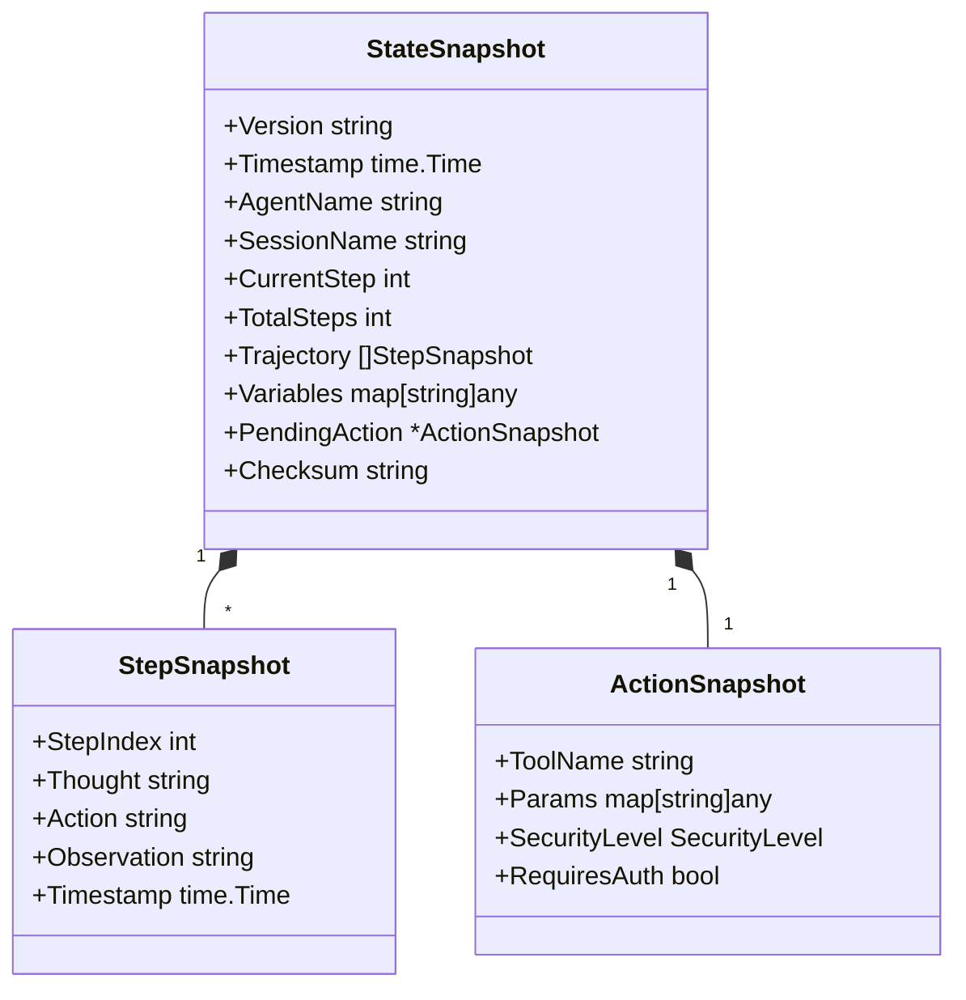

**序列化要求**：

| 要求     | 说明                                       |
| -------- | ------------------------------------------ |
| 版本控制 | StateSnapshot 必须包含版本号，支持向后兼容 |
| 校验和   | 使用 SHA256 计算校验和，确保数据完整性     |
| 原子性   | 序列化和反序列化必须是原子操作             |
| 幂等性   | 同一状态多次序列化结果必须一致             |
| 压缩     | 大型状态（>1MB）必须使用 gzip 压缩         |
| 加密     | 敏感数据（如 API Key）必须加密存储         |

### 5.2 大型状态分片策略

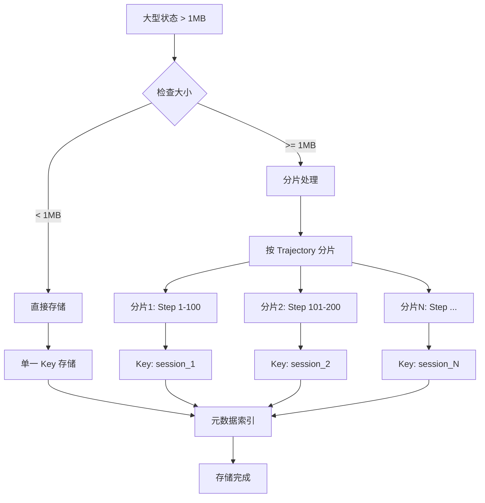

**分片配置**：

```go
type StateShardingConfig struct {
    MaxShardSize      int64   // 单分片最大大小，默认 1MB
    CompressionLevel  int     // gzip 压缩级别，默认 6
    EncryptionEnabled bool    // 是否启用加密，默认 true
    EncryptionKey     string  // 加密密钥（从环境变量获取）
}
```

### 5.3 恢复验证机制

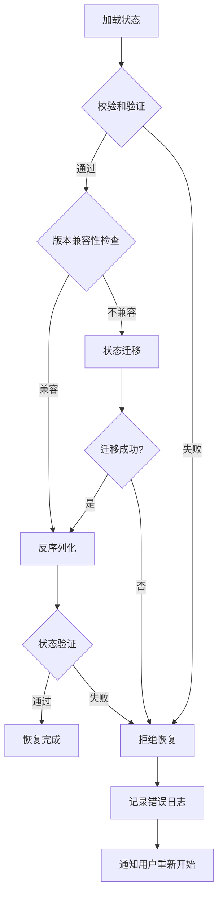

## 6. SuspendedTask 服务（UI 展示专用）

为 UI 层提供暂停任务的完整视图：

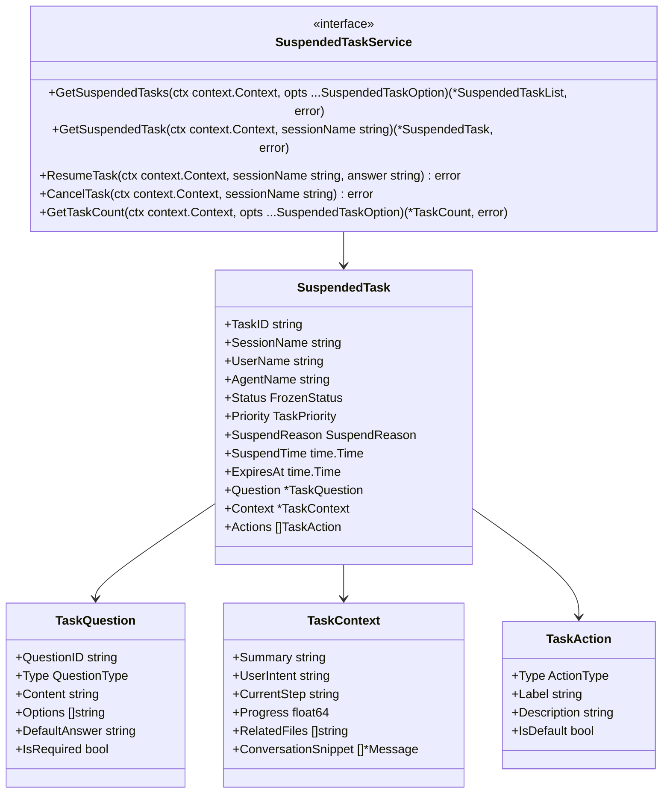

**SuspendedTaskService 方法说明**：

| 方法              | 说明                             |
| ----------------- | -------------------------------- |
| GetSuspendedTasks | 获取暂停任务列表，支持分页和过滤 |
| GetSuspendedTask  | 获取单个暂停任务的详细信息       |
| ResumeTask        | 恢复任务执行（提供用户答案）     |
| CancelTask        | 取消暂停的任务                   |
| GetTaskCount      | 获取任务统计信息                 |

**使用示例**：

```go
// 获取用户的所有暂停任务
taskList, err := service.GetSuspendedTasks(ctx,
    WithUserName("user-001"),
    WithPage(1),
    WithPageSize(10),
    WithSortBy("SuspendTime"),
    WithSortDesc(true),
)

// 获取任务统计
count, err := service.GetTaskCount(ctx, WithUserName("user-001"))

// 恢复任务
err := service.ResumeTask(ctx, "session-123", "用户授权确认")

// 取消任务
err := service.CancelTask(ctx, "session-123")
```

### 6.1 UI 集成流程

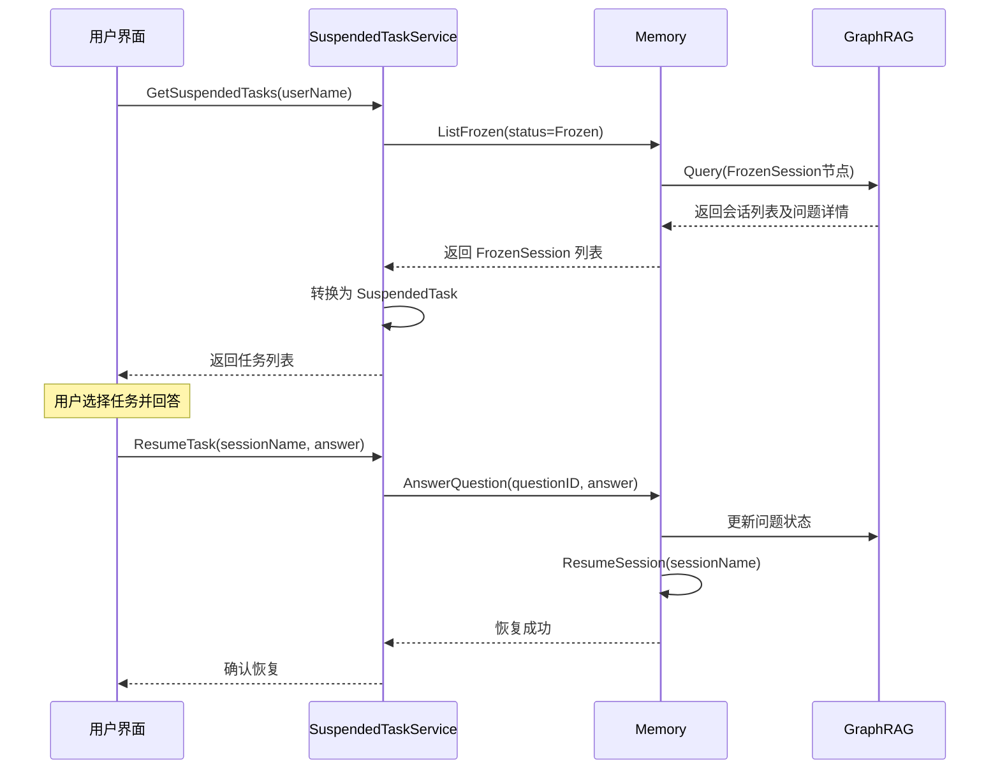

## 8. SessionAccessor 接口

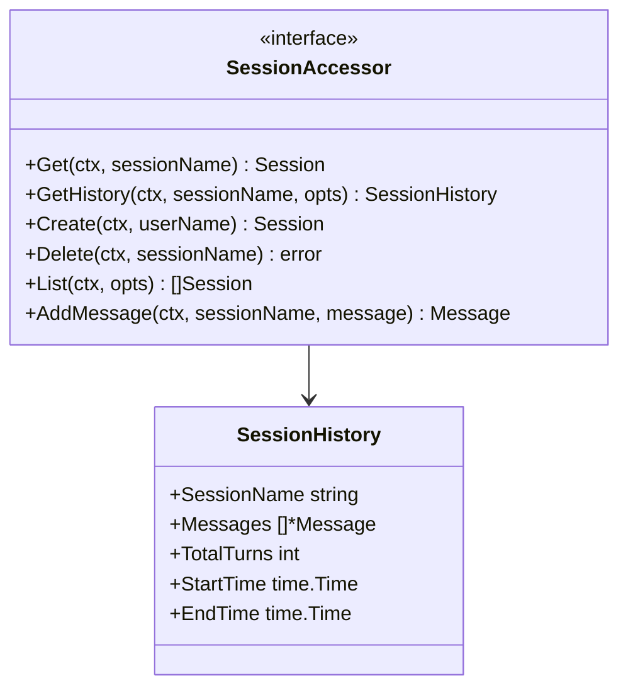

**方法说明**：

| 方法       | 说明                                  |
| ---------- | ------------------------------------- |
| Get        | 获取指定 Session 的基本信息           |
| GetHistory | 获取完整的 Session 历史，支持过滤选项 |
| Create     | 创建新的 Session                      |
| Delete     | 永久删除整个 Session 及其所有关联数据 |
| List       | 列出所有 Session，支持分页和过滤      |
| AddMessage | 向 Session 添加消息                   |

### 8.1 删除操作流程

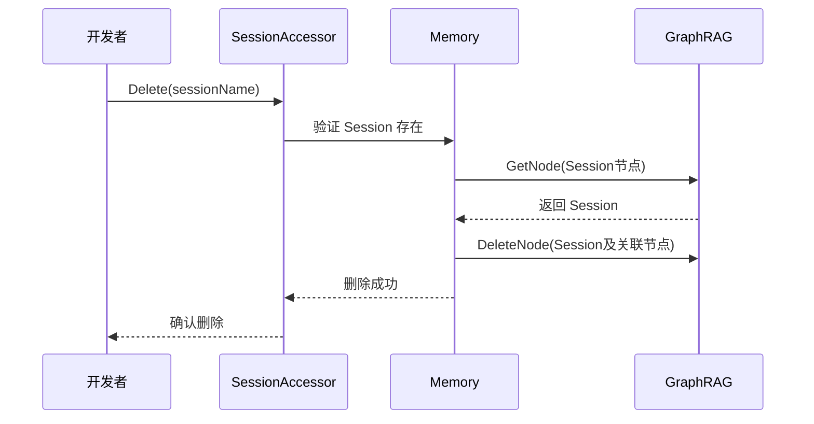

### 8.2 使用示例

```go
// 获取完整会话历史
history, err := memory.Sessions().GetHistory(ctx, "session-123",
    WithMaxTurns(10),
    WithIncludeReflections(true),
)

// 删除整个会话
err := memory.Sessions().Delete(ctx, "session-123")

// 列出用户的所有会话
sessions, err := memory.Sessions().List(ctx,
    WithUserName("user-001"),
    WithLimit(10),
)
```
