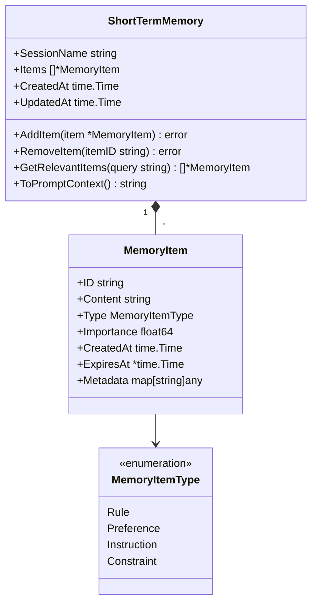
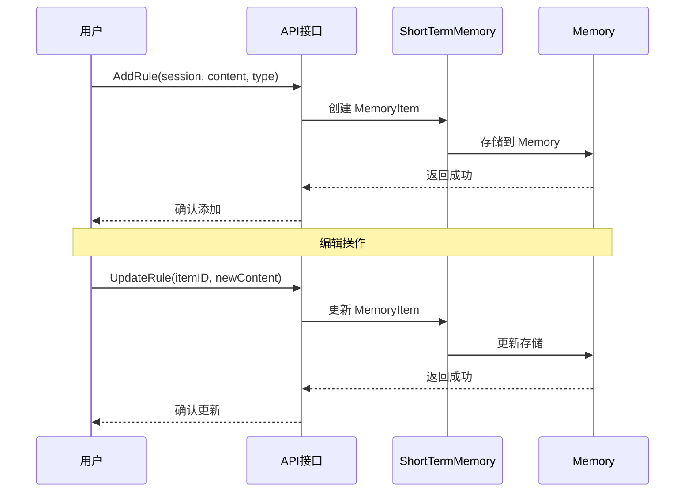
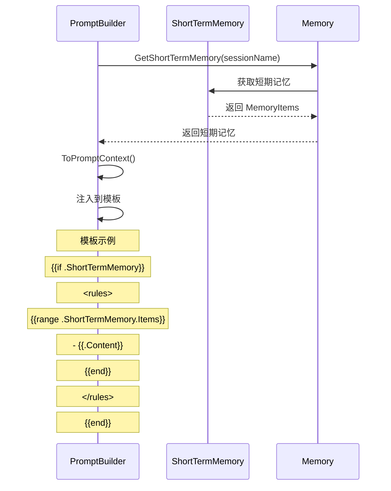
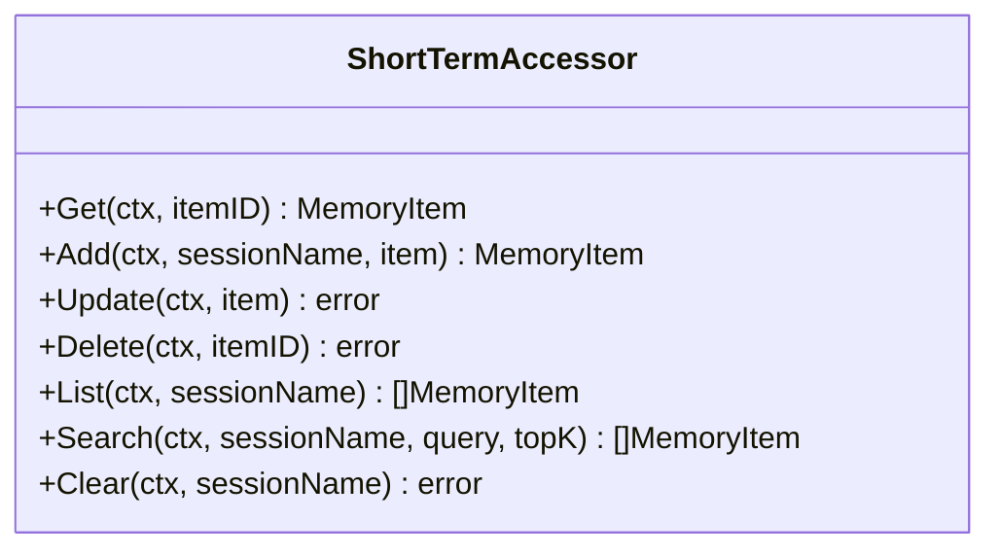

# 短期记忆功能

> **相关文档**: [Memory 模块概述](memory-module.md) | [节点类型定义](memory-nodes.md) | [接口设计](memory-interfaces.md)

短期记忆（Short-term Memory）用于存储用户定义的规则、偏好和指令。这些内容在会话期间生效，用于指导 Agent 的行为。通过 `ShortTerms()` 访问器管理 MemoryItem 节点。

**重要说明**：短期记忆存储的是用户定义的"规则"，与会话内容有本质差别。会话内容不会被存储为短期记忆。

## 1. ShortTermAccessor 概述

```go
shortTerms := memory.ShortTerms()

// 用户定义规则
item := &MemoryItem{
    Content: "所有输出必须使用中文",
    Type:    MemoryItemTypeRule,
}
created, err := shortTerms.Add(ctx, "session-123", item)
```

**关键特性**：

| 特性           | 说明                                   |
| -------------- | -------------------------------------- |
| 用户定义       | 所有内容都由用户手动添加，不会自动提取 |
| 会话级生命周期 | 会话结束后自动清除                     |
| 行为指导       | 用于指导 Agent 在当前会话中的行为      |
| 语义搜索       | 支持通过语义相似度检索相关规则         |

## 2. MemoryItem 节点结构



**字段说明**：

| 字段       | 类型           | 说明             |
| ---------- | -------------- | ---------------- |
| Content    | string         | 规则内容         |
| Type       | MemoryItemType | 规则类型         |
| Importance | float64        | 重要性分数 (0-1) |
| ExpiresAt  | *time.Time     | 过期时间（可选） |

**MemoryItemType 类型**：

| 类型        | 说明     | 示例                     |
| ----------- | -------- | ------------------------ |
| Rule        | 行为规则 | "所有输出必须使用中文"   |
| Preference  | 用户偏好 | "优先使用简洁的回答方式" |
| Instruction | 临时指令 | "本次对话专注于技术问题" |
| Constraint  | 约束条件 | "不要提及竞争对手产品"   |

## 3. 用户定义流程

用户通过 API 或配置手动定义短期记忆：



**使用示例**：

```go
accessor := memory.ShortTerms()

// 添加规则
item, err := accessor.Add(ctx, "session-123", &MemoryItem{
    Type:    MemoryItemTypeRule,
    Content: "所有输出必须使用中文",
})

// 添加偏好
item, err := accessor.Add(ctx, "session-123", &MemoryItem{
    Type:    MemoryItemTypePreference,
    Content: "优先使用简洁的回答方式",
})

// 更新规则
item.Content = "所有输出必须使用英文"
err = accessor.Update(ctx, item)

// 语义搜索相关规则
items, err := accessor.Search(ctx, "session-123", "语言偏好", 5)
```

## 4. 与 PromptBuilder 集成

短期记忆内容可被 PromptBuilder 注入到对话模板中：



**注入模板示例**：

```markdown
{{if .ShortTermMemory}}
<rules>
请遵循以下规则：
{{range .ShortTermMemory.Items}}
{{if eq .Type "Rule"}}
[规则] {{.Content}}
{{else if eq .Type "Preference"}}
[偏好] {{.Content}}
{{else if eq .Type "Instruction"}}
[指令] {{.Content}}
{{else if eq .Type "Constraint"}}
[约束] {{.Content}}
{{end}}
{{end}}
</rules>
{{end}}
```

## 5. ShortTermAccessor 接口



**方法说明**：

| 方法   | 说明                       |
| :----- | :------------------------- |
| Get    | 获取指定规则项             |
| Add    | 添加新的规则项             |
| Update | 更新规则项内容             |
| Delete | 删除指定规则项             |
| List   | 列出会话的所有规则项       |
| Search | 语义搜索相关规则项         |
| Clear  | 清空当前会话的所有短期记忆 |

## 6. 配置

```yaml
memory:
  short_term:
    max_items_per_session: 100
    default_expiration: 24h
    enable_semantic_search: true
```

**配置说明**：

| 配置项                 | 默认值 | 说明             |
| ---------------------- | ------ | ---------------- |
| max_items_per_session  | 100    | 每会话最大规则数 |
| default_expiration     | 24h    | 默认过期时间     |
| enable_semantic_search | true   | 是否启用语义搜索 |

## 7. 最佳实践

### 7.1 规则定义

```go
// 好的规则定义 - 明确、具体
accessor.Add(ctx, session, &MemoryItem{
    Type:    MemoryItemTypeRule,
    Content: "回答技术问题时，必须提供代码示例",
})

// 差的规则定义 - 模糊、不具体
accessor.Add(ctx, session, &MemoryItem{
    Type:    MemoryItemTypeRule,
    Content: "回答要好一点",
})
```

### 7.2 规则优先级

通过 Importance 字段控制规则优先级：

```go
// 高优先级规则
accessor.Add(ctx, session, &MemoryItem{
    Type:       MemoryItemTypeRule,
    Content:    "禁止泄露用户隐私信息",
    Importance: 1.0,
})

// 普通优先级规则
accessor.Add(ctx, session, &MemoryItem{
    Type:       MemoryItemTypePreference,
    Content:    "优先使用简洁的回答方式",
    Importance: 0.5,
})
```

### 7.3 规则分类

按类型组织规则，便于管理和检索：

```go
// 行为规则
rules := []MemoryItem{
    {Type: MemoryItemTypeRule, Content: "规则1"},
    {Type: MemoryItemTypeRule, Content: "规则2"},
}

// 用户偏好
preferences := []MemoryItem{
    {Type: MemoryItemTypePreference, Content: "偏好1"},
    {Type: MemoryItemTypePreference, Content: "偏好2"},
}
```
