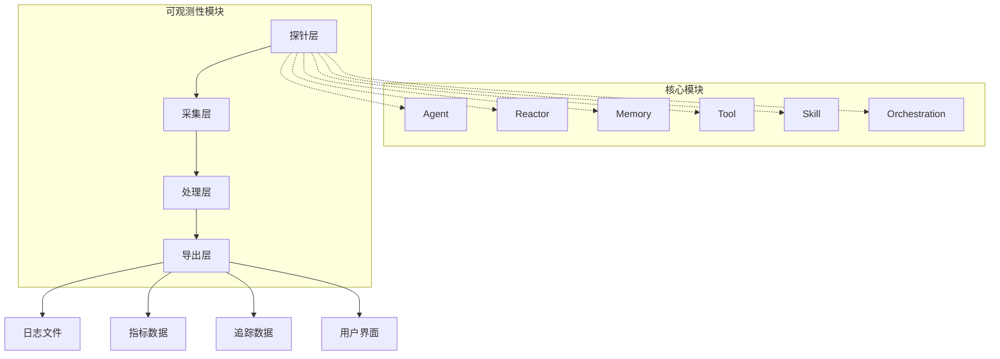
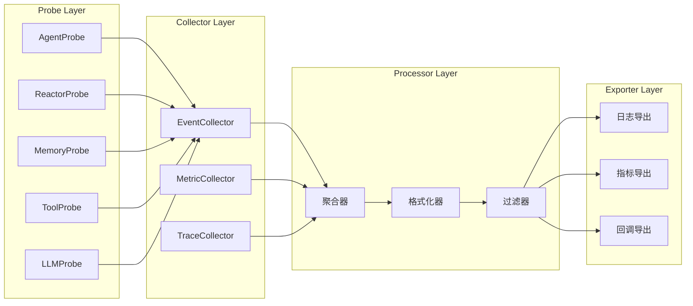
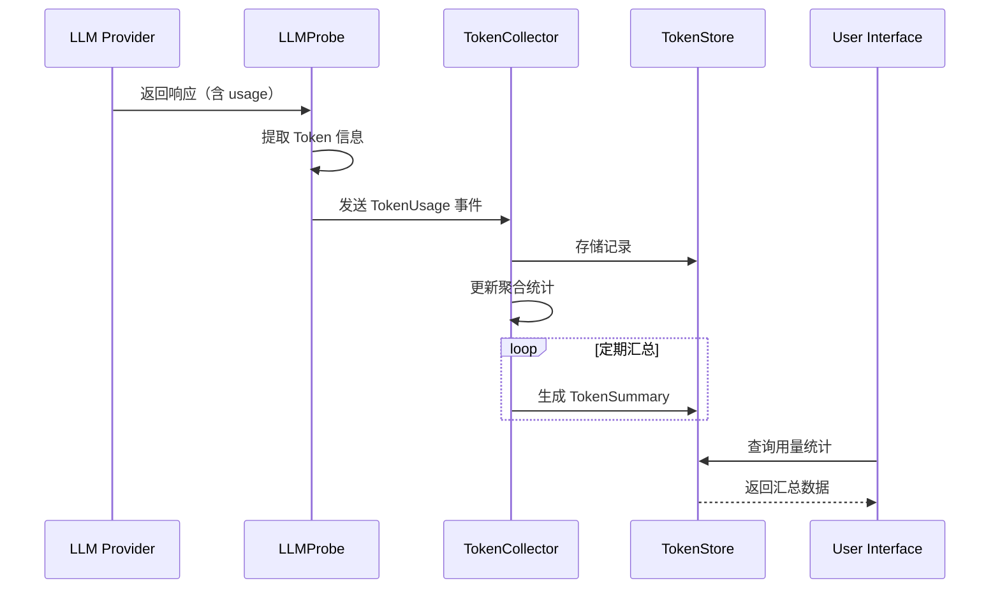
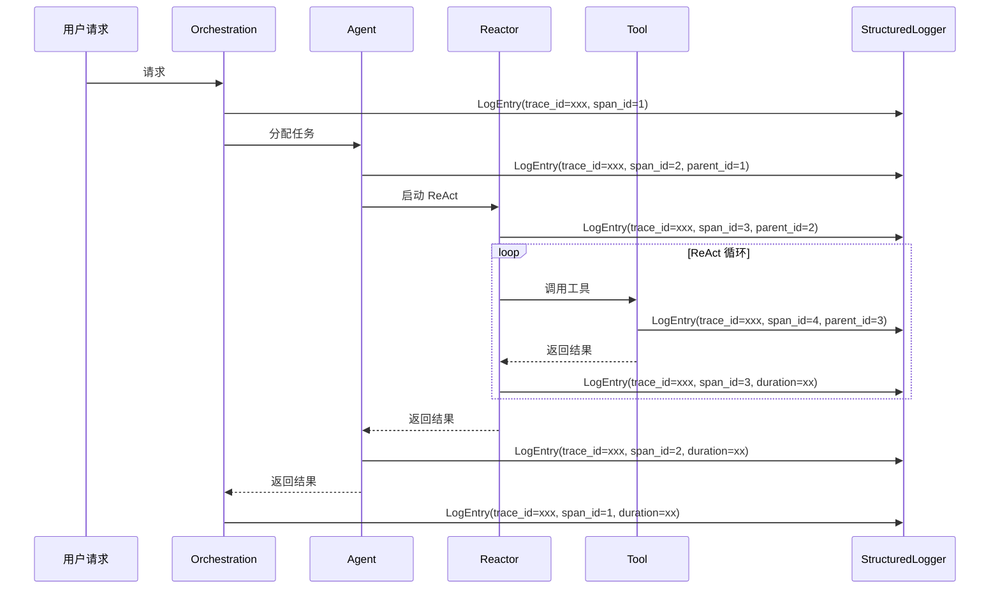
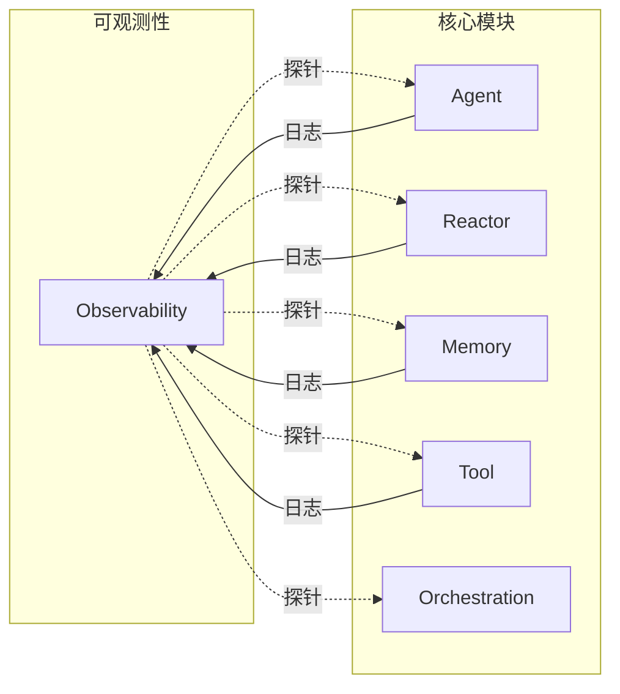

# 可观测性模块设计

## 1. 模块概述

可观测性模块是 GoReAct 框架的横切关注点，以探针式组件形式横跨所有核心模块，实现全链路监控、Token 用量统计和结构化日志追踪。

### 1.1 设计定位



### 1.2 核心职责

| 职责 | 说明 |
|------|------|
| **Token 用量统计** | 精确记录 LLM 输入/输出 Token 消耗，支持成本分析 |
| **结构化日志追踪** | 全链路日志记录，支持生产环境问题排查 |
| **思考过程监控** | 实时输出 LLM 推理过程 |
| **执行状态追踪** | 追踪 Agent 执行状态和进度 |
| **性能指标采集** | 采集延迟、吞吐量等性能指标 |

## 2. 架构设计

### 2.1 分层架构



### 2.2 组件职责

#### 2.2.1 探针层（Probe Layer）

探针层是可观测性的核心，以非侵入方式嵌入各模块：

```go
type Probe interface {
    Name() string
    Start(ctx context.Context) error
    Stop(ctx context.Context) error
    Collect() []Event
}
```

| 探针 | 监控目标 | 采集事件 |
|------|----------|----------|
| `AgentProbe` | Agent 模块 | 状态变更、任务分配、等待用户 |
| `ReactorProbe` | Reactor 模块 | ReAct 循环、思考过程、终止条件 |
| `MemoryProbe` | Memory 模块 | 查询延迟、缓存命中、存储操作 |
| `ToolProbe` | Tool 模块 | 工具调用、执行时间、错误信息 |
| `LLMProbe` | LLM 调用 | Token 用量、请求延迟、响应状态 |

#### 2.2.2 采集层（Collector Layer）

```go
type Collector interface {
    Collect(event Event)
    Flush() []Event
}

type EventCollector struct {
    buffer chan Event
    size   int
}

type MetricCollector struct {
    counters   map[string]int64
    gauges     map[string]float64
    histograms map[string][]float64
}

type TraceCollector struct {
    spans map[string]*Span
}
```

#### 2.2.3 处理层（Processor Layer）

```go
type Processor interface {
    Process(events []Event) []Event
}

type Aggregator struct {
    window time.Duration
    rules  []AggregationRule
}

type Formatter struct {
    format string  // json, text
}

type Filter struct {
    level   LogLevel
    patterns []string
}
```

#### 2.2.4 导出层（Exporter Layer）

```go
type Exporter interface {
    Export(ctx context.Context, data any) error
}

type LogExporter struct {
    file    *os.File
    encoder *json.Encoder
}

type MetricExporter struct {
    endpoint string
    client   http.Client
}

type HookExporter struct {
    hooks []Hook
}
```

## 3. Token 用量统计

### 3.1 数据模型

```go
type TokenUsage struct {
    ID           string    `json:"id"`
    AgentName    string    `json:"agent_name"`
    ModelName    string    `json:"model_name"`
    Timestamp    time.Time `json:"timestamp"`
    InputTokens  int64     `json:"input_tokens"`
    OutputTokens int64     `json:"output_tokens"`
    TotalTokens  int64     `json:"total_tokens"`
    RequestID    string    `json:"request_id"`
    TaskType     string    `json:"task_type"`
}

type TokenSummary struct {
    AgentName         string    `json:"agent_name"`
    PeriodStart       time.Time `json:"period_start"`
    PeriodEnd         time.Time `json:"period_end"`
    TotalInputTokens  int64     `json:"total_input_tokens"`
    TotalOutputTokens int64     `json:"total_output_tokens"`
    TotalTokens       int64     `json:"total_tokens"`
    RequestCount      int64     `json:"request_count"`
    EstimatedCost     float64   `json:"estimated_cost"`
}
```

### 3.2 统计流程



### 3.3 接口设计

```go
type TokenTracker interface {
    Record(usage TokenUsage) error
    GetSummary(agentName string, period TimeRange) (*TokenSummary, error)
    GetDetails(agentName string, period TimeRange) ([]TokenUsage, error)
    Export(format string) ([]byte, error)
}

type TokenTrackerImpl struct {
    store     TokenStore
    aggregator *TokenAggregator
    pricing   map[string]Pricing
}

type Pricing struct {
    ModelName      string  `json:"model_name"`
    InputPrice     float64 `json:"input_price"`     // per 1K tokens
    OutputPrice    float64 `json:"output_price"`    // per 1K tokens
    Currency       string  `json:"currency"`
}
```

### 3.4 成本计算

```go
func (t *TokenTrackerImpl) CalculateCost(usage TokenUsage) float64 {
    pricing, ok := t.pricing[usage.ModelName]
    if !ok {
        return 0
    }
    
    inputCost := float64(usage.InputTokens) / 1000 * pricing.InputPrice
    outputCost := float64(usage.OutputTokens) / 1000 * pricing.OutputPrice
    
    return inputCost + outputCost
}
```

### 3.5 Token 统计精确性保障

**数据来源优先级**：

| 优先级 | 数据来源           | 说明                                   |
| ------ | ------------------ | -------------------------------------- |
| 1      | LLM API 响应       | 使用 `usage` 字段中的精确 Token 数     |
| 2      | 流式响应累计       | 累加每个 chunk 的 Token 数             |
| 3      | 本地估算           | 当 API 不返回时使用 tiktoken 估算      |

**精确统计实现**：

```go
type TokenCountSource int

const (
    SourceAPIResponse  TokenCountSource = iota  // 来自 API 响应
    SourceStreamAccumulate                       // 流式累计
    SourceLocalEstimate                          // 本地估算
)

type PreciseTokenUsage struct {
    InputTokens   int64
    OutputTokens  int64
    Source        TokenCountSource
    Confidence    float64           // 置信度：API=1.0, 流式=0.95, 估算=0.8
    EstimatedBy   string            // 估算工具名称（如 tiktoken-cl100k_base）
}
```

**不同模型的 Token 统计差异**：

| 模型类型         | 统计方式           | 注意事项                               |
| ---------------- | ------------------ | -------------------------------------- |
| OpenAI GPT 系列  | API 返回精确值     | 直接使用 `usage.total_tokens`          |
| Claude 系列      | API 返回精确值     | 注意 `input_tokens` 包含系统提示       |
| 开源模型         | 可能无精确值       | 需要本地估算或使用 tokenizer           |
| 流式响应         | 需要累计           | 部分模型在最后一个 chunk 返回总量      |

**估算误差处理**：

```go
func (t *TokenTrackerImpl) EstimateTokens(text string, model string) (*PreciseTokenUsage, error) {
    encoder, err := t.getEncoder(model)
    if err != nil {
        return nil, err
    }
    
    tokens := encoder.Encode(text)
    
    return &PreciseTokenUsage{
        InputTokens: int64(len(tokens)),
        Source:      SourceLocalEstimate,
        Confidence:  0.8,
        EstimatedBy: encoder.Name(),
    }, nil
}
```

**统计误差范围**：

| 统计来源         | 误差范围   | 说明                                   |
| ---------------- | ---------- | -------------------------------------- |
| API 精确返回     | 0%         | 完全精确                               |
| 流式累计         | ±2%        | 可能存在 chunk 边界误差                |
| tiktoken 估算    | ±5%        | 与实际 tokenizer 可能存在差异          |
| 字符数估算       | ±15%       | 仅作为最后手段                         |

**精确性验证机制**：

```go
func (t *TokenTrackerImpl) ValidateAccuracy(usage TokenUsage) error {
    // 1. 检查是否为负值
    if usage.InputTokens < 0 || usage.OutputTokens < 0 {
        return fmt.Errorf("invalid token count: negative value")
    }
    
    // 2. 检查是否超出模型上下文限制
    maxContext := t.getModelMaxContext(usage.ModelName)
    if usage.InputTokens > maxContext {
        return fmt.Errorf("input tokens exceed model context limit")
    }
    
    // 3. 检查输入输出比例是否合理
    ratio := float64(usage.OutputTokens) / float64(usage.InputTokens)
    if ratio > 10.0 {
        // 输出远大于输入，可能统计异常
        log.Warn("unusual token ratio detected", "ratio", ratio)
    }
    
    return nil
}
```

## 4. 结构化日志追踪

### 4.1 日志数据模型

```go
type LogEntry struct {
    Timestamp   time.Time              `json:"timestamp"`
    Level       LogLevel               `json:"level"`
    Message     string                 `json:"message"`
    Agent       string                 `json:"agent,omitempty"`
    Module      string                 `json:"module"`
    TraceID     string                 `json:"trace_id"`
    SpanID      string                 `json:"span_id"`
    ParentID    string                 `json:"parent_id,omitempty"`
    Duration    time.Duration          `json:"duration,omitempty"`
    Error       string                 `json:"error,omitempty"`
    StackTrace  string                 `json:"stack_trace,omitempty"`
    Context     map[string]any         `json:"context,omitempty"`
}

type LogLevel string

const (
    LogLevelDebug LogLevel = "debug"
    LogLevelInfo  LogLevel = "info"
    LogLevelWarn  LogLevel = "warn"
    LogLevelError LogLevel = "error"
)
```

### 4.2 日志追踪流程



### 4.3 日志接口设计

```go
type StructuredLogger interface {
    Debug(msg string, fields ...Field)
    Info(msg string, fields ...Field)
    Warn(msg string, fields ...Field)
    Error(msg string, err error, fields ...Field)
    
    WithAgent(name string) StructuredLogger
    WithModule(name string) StructuredLogger
    WithTrace(traceID, spanID string) StructuredLogger
    WithContext(ctx map[string]any) StructuredLogger
    
    StartSpan(name string) *Span
    EndSpan(span *Span)
}

type Field struct {
    Key   string
    Value any
}

func String(key, value string) Field {
    return Field{Key: key, Value: value}
}

func Int(key string, value int) Field {
    return Field{Key: key, Value: value}
}

func Duration(key string, value time.Duration) Field {
    return Field{Key: key, Value: value}
}

func Any(key string, value any) Field {
    return Field{Key: key, Value: value}
}
```

### 4.4 关键处理步骤日志点

| 模块 | 处理步骤 | 日志级别 | 关键字段 |
|------|----------|----------|----------|
| Orchestration | 任务接收 | INFO | task_id, task_type |
| Orchestration | Agent 选择 | INFO | agent_name, reason |
| Agent | 任务开始 | INFO | agent_name, task |
| Agent | 等待用户 | WARN | agent_name, question |
| Reactor | ReAct 循环开始 | DEBUG | iteration, state |
| Reactor | 思考完成 | DEBUG | reasoning, action |
| Reactor | 终止条件检查 | DEBUG | should_stop, reason |
| Thinker | 推理开始 | DEBUG | context_size |
| Thinker | 推理完成 | INFO | duration, tokens |
| Actor | 工具选择 | INFO | tool_name, params |
| Actor | 工具执行 | INFO | tool_name, duration |
| Observer | 结果处理 | DEBUG | result_type |
| Memory | 查询执行 | DEBUG | query, duration |
| Memory | 存储操作 | DEBUG | node_type, duration |
| Tool | 执行开始 | INFO | tool_name, params |
| Tool | 执行完成 | INFO | tool_name, duration |
| Tool | 执行失败 | ERROR | tool_name, error, stack |
| LLM | 请求发送 | DEBUG | model, prompt_tokens |
| LLM | 响应接收 | INFO | model, tokens, duration |

### 4.5 日志配置

```yaml
logging:
  level: info
  format: json
  output:
    - type: file
      path: ./logs/app.log
      max_size: 100
      max_backups: 5
      max_age: 30
      compress: true
    - type: stdout
      format: text
  fields:
    app: goreact
    version: 1.0.0
  sampling:
    enabled: true
    initial: 100
    thereafter: 100
```

## 5. 事件系统

### 5.1 事件类型

```go
type EventType string

const (
    EventTypeThought       EventType = "thought"
    EventTypeAgentState    EventType = "agent_state"
    EventTypeWaitingUser   EventType = "waiting_user"
    EventTypeToolCall      EventType = "tool_call"
    EventTypeTokenUsage    EventType = "token_usage"
    EventTypeError         EventType = "error"
    EventTypeReActLoop     EventType = "react_loop"
)
```

### 5.2 事件定义

```go
type Event interface {
    Type() EventType
    Timestamp() time.Time
    AgentName() string
    TraceID() string
}

type ThoughtEvent struct {
    eventType   EventType
    timestamp   time.Time
    agentName   string
    traceID     string
    Content     string  `json:"content"`
    Reasoning   string  `json:"reasoning"`
    Action      string  `json:"action"`
    Confidence  float64 `json:"confidence"`
}

type AgentStateEvent struct {
    eventType   EventType
    timestamp   time.Time
    agentName   string
    traceID     string
    State       AgentState `json:"state"`
    Action      string     `json:"action"`
    Duration    time.Duration `json:"duration"`
    Progress    float64    `json:"progress"`
}

type WaitingEvent struct {
    eventType   EventType
    timestamp   time.Time
    agentName   string
    traceID     string
    Question    string     `json:"question"`
    Timeout     time.Duration `json:"timeout"`
    Options     []string   `json:"options,omitempty"`
}

type TokenUsageEvent struct {
    eventType   EventType
    timestamp   time.Time
    agentName   string
    traceID     string
    Model       string `json:"model"`
    InputTokens int64  `json:"input_tokens"`
    OutputTokens int64 `json:"output_tokens"`
    TotalTokens int64  `json:"total_tokens"`
    Cost        float64 `json:"cost"`
}

type ToolCallEvent struct {
    eventType   EventType
    timestamp   time.Time
    agentName   string
    traceID     string
    ToolName    string         `json:"tool_name"`
    Params      map[string]any `json:"params"`
    Result      any            `json:"result,omitempty"`
    Duration    time.Duration  `json:"duration"`
    Error       string         `json:"error,omitempty"`
}

type ErrorEvent struct {
    eventType   EventType
    timestamp   time.Time
    agentName   string
    traceID     string
    Error       string `json:"error"`
    StackTrace  string `json:"stack_trace"`
    Recoverable bool   `json:"recoverable"`
}
```

### 5.3 事件钩子接口

```go
type Hook interface {
    OnThought(ctx context.Context, e *ThoughtEvent)
    OnAgentState(ctx context.Context, e *AgentStateEvent)
    OnWaitingForUser(ctx context.Context, e *WaitingEvent)
    OnTokenUsage(ctx context.Context, e *TokenUsageEvent)
    OnToolCall(ctx context.Context, e *ToolCallEvent)
    OnError(ctx context.Context, e *ErrorEvent)
}

type HookFunc func(ctx context.Context, e Event)

type HookRegistry struct {
    hooks map[EventType][]HookFunc
    mu    sync.RWMutex
}

func (r *HookRegistry) Register(eventType EventType, hook HookFunc) {
    r.mu.Lock()
    defer r.mu.Unlock()
    r.hooks[eventType] = append(r.hooks[eventType], hook)
}

func (r *HookRegistry) Emit(ctx context.Context, e Event) {
    r.mu.RLock()
    hooks := r.hooks[e.Type()]
    r.mu.RUnlock()
    
    for _, hook := range hooks {
        go hook(ctx, e)
    }
}
```

## 6. 探针集成

### 6.1 Agent 探针

```go
type AgentProbe struct {
    collector *EventCollector
    logger    StructuredLogger
}

func (p *AgentProbe) OnTaskStart(agent *Agent, task string) {
    p.logger.Info("task started",
        String("agent", agent.Name()),
        String("task", task),
    )
    p.collector.Collect(&AgentStateEvent{
        State:    StateThinking,
        Action:   "task_start",
    })
}

func (p *AgentProbe) OnTaskEnd(agent *Agent, result string, duration time.Duration) {
    p.logger.Info("task completed",
        String("agent", agent.Name()),
        Duration("duration", duration),
    )
}

func (p *AgentProbe) OnWaitingForUser(agent *Agent, question string) {
    p.logger.Warn("waiting for user input",
        String("agent", agent.Name()),
        String("question", question),
    )
    p.collector.Collect(&WaitingEvent{
        Question: question,
    })
}
```

### 6.2 Reactor 探针

```go
type ReactorProbe struct {
    collector *EventCollector
    logger    StructuredLogger
}

func (p *ReactorProbe) OnReActLoopStart(iteration int) {
    p.logger.Debug("react loop started",
        Int("iteration", iteration),
    )
}

func (p *ReactorProbe) OnThought(reasoning, action string) {
    p.logger.Debug("thought generated",
        String("reasoning", reasoning),
        String("action", action),
    )
    p.collector.Collect(&ThoughtEvent{
        Reasoning: reasoning,
        Action:    action,
    })
}

func (p *ReactorProbe) OnReActLoopEnd(iteration int, shouldStop bool, reason string) {
    p.logger.Debug("react loop ended",
        Int("iteration", iteration),
        Bool("should_stop", shouldStop),
        String("reason", reason),
    )
}
```

### 6.3 LLM 探针

```go
type LLMProbe struct {
    tracker   TokenTracker
    collector *EventCollector
    logger    StructuredLogger
}

func (p *LLMProbe) OnLLMRequest(model string, inputTokens int) {
    p.logger.Debug("llm request",
        String("model", model),
        Int("input_tokens", inputTokens),
    )
}

func (p *LLMProbe) OnLLMResponse(model string, usage TokenUsage) {
    p.logger.Info("llm response",
        String("model", model),
        Int64("input_tokens", usage.InputTokens),
        Int64("output_tokens", usage.OutputTokens),
        Int64("total_tokens", usage.TotalTokens),
    )
    
    p.tracker.Record(usage)
    p.collector.Collect(&TokenUsageEvent{
        Model:        model,
        InputTokens:  usage.InputTokens,
        OutputTokens: usage.OutputTokens,
        TotalTokens:  usage.TotalTokens,
    })
}
```

### 6.4 Tool 探针

```go
type ToolProbe struct {
    collector *EventCollector
    logger    StructuredLogger
}

func (p *ToolProbe) OnToolCall(toolName string, params map[string]any) {
    p.logger.Info("tool called",
        String("tool", toolName),
        Any("params", params),
    )
}

func (p *ToolProbe) OnToolResult(toolName string, result any, duration time.Duration, err error) {
    if err != nil {
        p.logger.Error("tool execution failed",
            String("tool", toolName),
            Duration("duration", duration),
            String("error", err.Error()),
        )
        p.collector.Collect(&ErrorEvent{
            Error:       err.Error(),
            Recoverable: true,
        })
    } else {
        p.logger.Info("tool execution completed",
            String("tool", toolName),
            Duration("duration", duration),
        )
    }
}
```

## 7. 配置管理

### 7.1 配置结构

```go
type ObservabilityConfig struct {
    Enabled   bool              `yaml:"enabled"`
    Logging   LoggingConfig     `yaml:"logging"`
    Tracing   TracingConfig     `yaml:"tracing"`
    Metrics   MetricsConfig     `yaml:"metrics"`
    Token     TokenConfig       `yaml:"token"`
    Hooks     HooksConfig       `yaml:"hooks"`
}

type LoggingConfig struct {
    Level    string        `yaml:"level"`
    Format   string        `yaml:"format"`
    Outputs  []OutputConfig `yaml:"outputs"`
    Sampling SamplingConfig `yaml:"sampling"`
}

type TracingConfig struct {
    Enabled    bool   `yaml:"enabled"`
    SampleRate float64 `yaml:"sample_rate"`
    Exporter   string `yaml:"exporter"`
}

type MetricsConfig struct {
    Enabled  bool     `yaml:"enabled"`
    Interval Duration `yaml:"interval"`
    Exporter string   `yaml:"exporter"`
}

type TokenConfig struct {
    Enabled      bool               `yaml:"enabled"`
    Pricing      map[string]Pricing `yaml:"pricing"`
    ExportPath   string             `yaml:"export_path"`
    Aggregation  Duration           `yaml:"aggregation"`
}

type HooksConfig struct {
    Thought     bool `yaml:"thought"`
    AgentState  bool `yaml:"agent_state"`
    WaitingUser bool `yaml:"waiting_user"`
    TokenUsage  bool `yaml:"token_usage"`
    ToolCall    bool `yaml:"tool_call"`
    Error       bool `yaml:"error"`
}
```

### 7.2 YAML 配置示例

```yaml
observability:
  enabled: true
  
  logging:
    level: info
    format: json
    outputs:
      - type: file
        path: ./logs/goreact.log
        max_size: 100
        max_backups: 5
        max_age: 30
        compress: true
      - type: stdout
        format: text
    sampling:
      enabled: true
      initial: 100
      thereafter: 100
  
  tracing:
    enabled: true
    sample_rate: 1.0
    exporter: jaeger
  
  metrics:
    enabled: true
    interval: 60s
    exporter: prometheus
  
  token:
    enabled: true
    pricing:
      gpt-4:
        input_price: 0.03
        output_price: 0.06
        currency: USD
      gpt-3.5-turbo:
        input_price: 0.0015
        output_price: 0.002
        currency: USD
    export_path: ./logs/tokens.json
    aggregation: 1h
  
  hooks:
    thought: true
    agent_state: true
    waiting_user: true
    token_usage: true
    tool_call: true
    error: true
```

## 8. 使用示例

### 8.1 注册事件钩子

```go
package main

import (
    "context"
    "fmt"
    
    "github.com/goreact/goreact"
    "github.com/goreact/goreact/observe"
)

func main() {
    ctx := context.Background()
    
    observe.OnThought(func(ctx context.Context, e *observe.ThoughtEvent) {
        fmt.Printf("[思考] %s\n", e.Reasoning)
    })
    
    observe.OnAgentState(func(ctx context.Context, e *observe.AgentStateEvent) {
        fmt.Printf("[%s] %s\n", e.AgentName, e.State)
    })
    
    observe.OnTokenUsage(func(ctx context.Context, e *observe.TokenUsageEvent) {
        fmt.Printf("[Token] 输入: %d, 输出: %d, 成本: $%.4f\n",
            e.InputTokens, e.OutputTokens, e.Cost)
    })
    
    observe.OnError(func(ctx context.Context, e *observe.ErrorEvent) {
        fmt.Printf("[错误] %s\n", e.Error)
    })
    
    goreact.Run("goreact.yaml")
}
```

### 8.2 查询 Token 用量

```go
func printTokenSummary() {
    tracker := observe.GetTokenTracker()
    
    summary, err := tracker.GetSummary("assistant", observe.Last24Hours())
    if err != nil {
        log.Fatal(err)
    }
    
    fmt.Printf("过去 24 小时 Token 用量:\n")
    fmt.Printf("  输入: %d tokens\n", summary.TotalInputTokens)
    fmt.Printf("  输出: %d tokens\n", summary.TotalOutputTokens)
    fmt.Printf("  总计: %d tokens\n", summary.TotalTokens)
    fmt.Printf("  请求: %d 次\n", summary.RequestCount)
    fmt.Printf("  预估成本: $%.4f\n", summary.EstimatedCost)
}
```

### 8.3 导出用量报告

```go
func exportUsageReport() {
    tracker := observe.GetTokenTracker()
    
    data, err := tracker.Export("csv")
    if err != nil {
        log.Fatal(err)
    }
    
    err = os.WriteFile("token_report.csv", data, 0644)
    if err != nil {
        log.Fatal(err)
    }
}
```

## 9. 与其他模块的关系

### 9.1 模块依赖关系



### 9.2 集成点

| 核心模块 | 集成方式 | 采集数据 |
|----------|----------|----------|
| Agent | AgentProbe | 状态变更、任务分配、等待用户 |
| Reactor | ReactorProbe | ReAct 循环、思考过程、终止条件 |
| Thinker | ThinkerProbe | 推理过程、上下文大小 |
| Actor | ActorProbe | 工具选择、执行状态 |
| Observer | ObserverProbe | 结果处理、状态更新 |
| Memory | MemoryProbe | 查询延迟、存储操作 |
| Tool | ToolProbe | 调用参数、执行时间、错误 |
| Orchestration | OrchestrationProbe | 任务路由、Agent 选择 |

## 10. 性能考量

### 10.1 异步处理

所有事件采集和处理采用异步方式，避免阻塞主流程：

```go
type AsyncCollector struct {
    buffer chan Event
    worker int
}

func (c *AsyncCollector) Collect(e Event) {
    select {
    case c.buffer <- e:
    default:
        // buffer full, drop event
    }
}
```

### 10.2 采样策略

对于高频事件，采用采样策略减少开销：

```go
type Sampler struct {
    initial    int
    thereafter int
    counter    int64
}

func (s *Sampler) ShouldSample() bool {
    n := atomic.AddInt64(&s.counter, 1)
    if n <= int64(s.initial) {
        return true
    }
    return (n-int64(s.initial))%int64(s.thereafter) == 0
}
```

### 10.3 资源限制

```yaml
observability:
  buffer_size: 10000
  worker_count: 4
  max_memory: 100MB
  drop_on_full: true
```

## 11. 探针集成示例

### 11.1 在 Agent 模块中集成探针

```
// Agent 执行流程中的探针集成点

function Agent.Execute(input):
    // 1. 探针：任务开始
    probe.OnTaskStart(agent, input)
    
    try:
        // 2. 探针：状态变更
        probe.OnStateChange(agent, StateThinking)
        
        // 3. 委托给 Reactor 执行
        result = reactor.Execute(input)
        
        // 4. 探针：任务完成
        probe.OnTaskEnd(agent, result, duration)
        
        return result
        
    except UserInputRequired as e:
        // 5. 探针：等待用户输入
        probe.OnWaitingForUser(agent, e.Question)
        state.Pause()
        
    except Error as e:
        // 6. 探针：错误记录
        probe.OnError(agent, e)
        raise
```

### 11.2 在 Reactor 模块中集成探针

```
// ReAct 循环中的探针集成点

function Reactor.Execute(input):
    // 1. 探针：循环开始
    probe.OnReActLoopStart(iteration)
    
    while not shouldTerminate:
        // 2. 探针：思考阶段开始
        probe.OnPhaseStart("think")
        
        thought = thinker.Think(state)
        
        // 3. 探针：思考结果
        probe.OnThought(thought.Reasoning, thought.Action)
        
        if thought.HasAction():
            // 4. 探针：行动阶段开始
            probe.OnPhaseStart("act")
            
            result = actor.Act(thought.Action)
            
            // 5. 探针：行动结果
            probe.OnActionResult(thought.Action, result, duration)
            
            // 6. 探针：观察阶段
            probe.OnPhaseStart("observe")
            observation = observer.Observe(result)
            probe.OnObservation(observation)
        
        // 7. 探针：循环迭代完成
        probe.OnReActLoopIteration(iteration, state)
        iteration++
    
    // 8. 探针：循环结束
    probe.OnReActLoopEnd(iteration, reason)
```

### 11.3 在 Tool 模块中集成探针

```
// Tool 执行中的探针集成点

function Tool.Execute(params):
    startTime = time.Now()
    
    // 1. 探针：工具调用开始
    probe.OnToolCallStart(tool.Name, params)
    
    try:
        // 2. 安全检查
        if not whitelist.IsAllowed(tool.Name):
            // 探针：权限拒绝
            probe.OnToolDenied(tool.Name, "not in whitelist")
            return Error(CodeToolNotWhitelisted)
        
        // 3. 执行工具
        result = tool.Handler(params)
        
        duration = time.Since(startTime)
        
        // 4. 探针：工具调用成功
        probe.OnToolCallEnd(tool.Name, result, duration, nil)
        
        return result
        
    except Error as e:
        duration = time.Since(startTime)
        
        // 5. 探针：工具调用失败
        probe.OnToolCallEnd(tool.Name, nil, duration, e)
        
        raise
```

### 11.4 在 Memory 模块中集成探针

```
// Memory 操作中的探针集成点

function Memory.Query(query, opts):
    startTime = time.Now()
    
    // 1. 探针：查询开始
    probe.OnQueryStart(query, opts)
    
    try:
        result = graphRAG.Query(query, opts)
        
        duration = time.Since(startTime)
        
        // 2. 探针：查询完成
        probe.OnQueryEnd(query, len(result), duration)
        
        return result
        
    except Error as e:
        // 3. 探针：查询失败
        probe.OnQueryError(query, e)
        raise

function Memory.Store(node):
    startTime = time.Now()
    
    // 1. 探针：存储开始
    probe.OnStoreStart(node.Type, node.Name)
    
    try:
        graphRAG.Store(node)
        
        duration = time.Since(startTime)
        
        // 2. 探针：存储完成
        probe.OnStoreEnd(node.Type, node.Name, duration)
        
    except Error as e:
        // 3. 探针：存储失败
        probe.OnStoreError(node.Type, node.Name, e)
        raise
```

### 11.5 探针集成检查清单

| 模块 | 集成点 | 探针方法 | 必须集成 |
|------|--------|----------|----------|
| Agent | 任务开始 | `OnTaskStart` | ✅ |
| Agent | 任务结束 | `OnTaskEnd` | ✅ |
| Agent | 状态变更 | `OnStateChange` | ✅ |
| Agent | 等待用户 | `OnWaitingForUser` | ✅ |
| Agent | 错误 | `OnError` | ✅ |
| Reactor | 循环开始/结束 | `OnReActLoopStart/End` | ✅ |
| Reactor | 思考结果 | `OnThought` | ✅ |
| Reactor | 行动结果 | `OnActionResult` | ✅ |
| Reactor | 观察结果 | `OnObservation` | ⚪ |
| Tool | 调用开始/结束 | `OnToolCallStart/End` | ✅ |
| Tool | 权限拒绝 | `OnToolDenied` | ✅ |
| Memory | 查询 | `OnQueryStart/End` | ⚪ |
| Memory | 存储 | `OnStoreStart/End` | ⚪ |
| LLM | 请求/响应 | `OnLLMRequest/Response` | ✅ |

**说明**：✅ 必须集成，⚪ 可选集成
