# 观察器模块设计

## 1. 模块概述

观察器（Observer）是 ReAct 循环中的感知组件，负责处理行动执行结果，提取有价值的洞察，并更新记忆。它是连接执行与学习的桥梁，确保每次执行的经验都能被有效沉淀。

### 1.1 核心职责

- **结果处理**：处理行动执行结果，转换为结构化观察
- **洞察提取**：从结果中提取有价值的洞察和模式
- **相关性评估**：评估结果与当前任务的相关性
- **记忆更新**：将观察和洞察持久化到记忆中

### 1.2 设计原则

- **信息提炼**：从原始结果中提炼关键信息
- **上下文关联**：将观察与当前任务上下文关联
- **增量学习**：支持从每次执行中学习
- **可追溯性**：保持观察的完整追溯链

## 2. 接口设计

### 2.1 核心接口

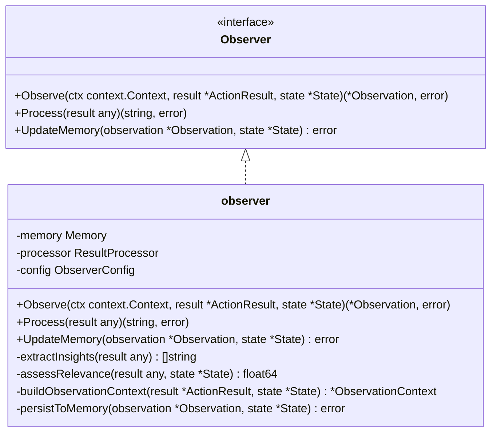
```mermaid
classDiagram
    class Observer {
        <<interface>>
        +Observe(ctx context.Context, result *ActionResult, state *State) (*Observation, error)
        +Process(result any) (string, error)
        +UpdateMemory(observation *Observation, state *State) error
    }
    
    class observer {
        -memory Memory
        -processor ResultProcessor
        -config ObserverConfig
        +Observe(ctx context.Context, result *ActionResult, state *State) (*Observation, error)
        +Process(result any) (string, error)
        +UpdateMemory(observation *Observation, state *State) error
        -extractInsights(result any) []string
        -assessRelevance(result any, state *State) float64
        -buildObservationContext(result *ActionResult, state *State) *ObservationContext
        -persistToMemory(observation *Observation, state *State) error
    }
    
    Observer <|.. observer
```

### 2.2 Observation 结构

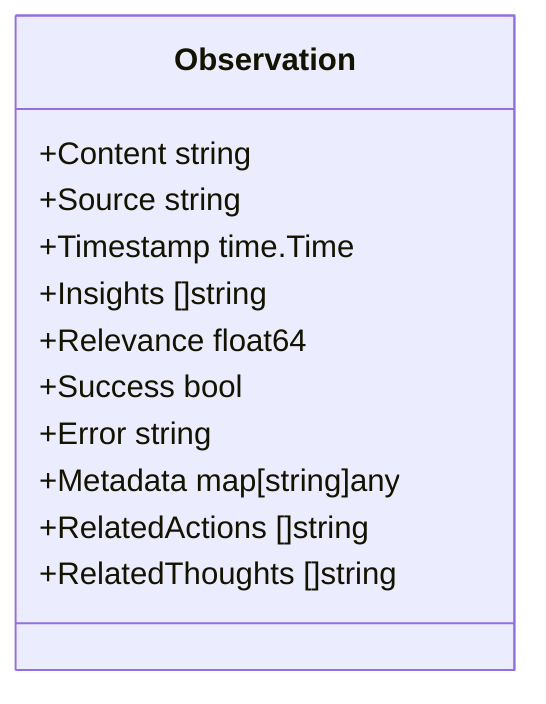
```mermaid
classDiagram
    class Observation {
        +Content string
        +Source string
        +Timestamp time.Time
        +Insights []string
        +Relevance float64
        +Success bool
        +Error string
        +Metadata map[string]any
        +RelatedActions []string
        +RelatedThoughts []string
    }
```

**Observation 字段说明**：

| 字段 | 类型 | 说明 |
|------|------|------|
| Content | string | 观察内容（处理后的结果） |
| Source | string | 来源（工具名/技能名/子代理名） |
| Timestamp | time.Time | 观察时间戳 |
| Insights | []string | 提取的洞察列表 |
| Relevance | float64 | 与当前任务的相关性 (0.0-1.0) |
| Success | bool | 执行是否成功 |
| Error | string | 错误信息（如果失败） |
| Metadata | map[string]any | 额外元数据 |
| RelatedActions | []string | 关联的行动名称 |
| RelatedThoughts | []string | 关联的思考内容 |

### 2.3 ObservationContext 结构

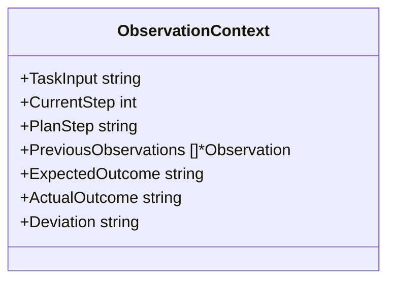
```mermaid
classDiagram
    class ObservationContext {
        +TaskInput string
        +CurrentStep int
        +PlanStep string
        +PreviousObservations []*Observation
        +ExpectedOutcome string
        +ActualOutcome string
        +Deviation string
    }
```

### 2.4 ObserverConfig 配置

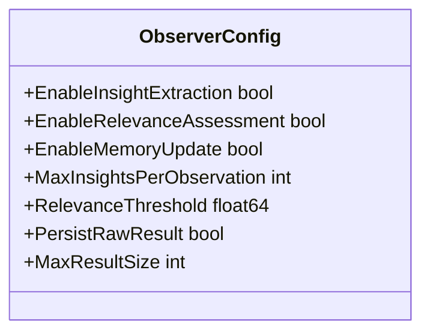
```mermaid
classDiagram
    class ObserverConfig {
        +EnableInsightExtraction bool
        +EnableRelevanceAssessment bool
        +EnableMemoryUpdate bool
        +MaxInsightsPerObservation int
        +RelevanceThreshold float64
        +PersistRawResult bool
        +MaxResultSize int
    }
```

| 配置项 | 说明 | 默认值 |
|--------|------|--------|
| EnableInsightExtraction | 是否启用洞察提取 | true |
| EnableRelevanceAssessment | 是否启用相关性评估 | true |
| EnableMemoryUpdate | 是否更新记忆 | true |
| MaxInsightsPerObservation | 每次观察最大洞察数 | 5 |
| RelevanceThreshold | 相关性阈值 | 0.5 |
| PersistRawResult | 是否持久化原始结果 | false |
| MaxResultSize | 最大结果大小（字节） | 1048576 (1MB) |

## 3. 观察流程设计

### 3.1 完整观察流程

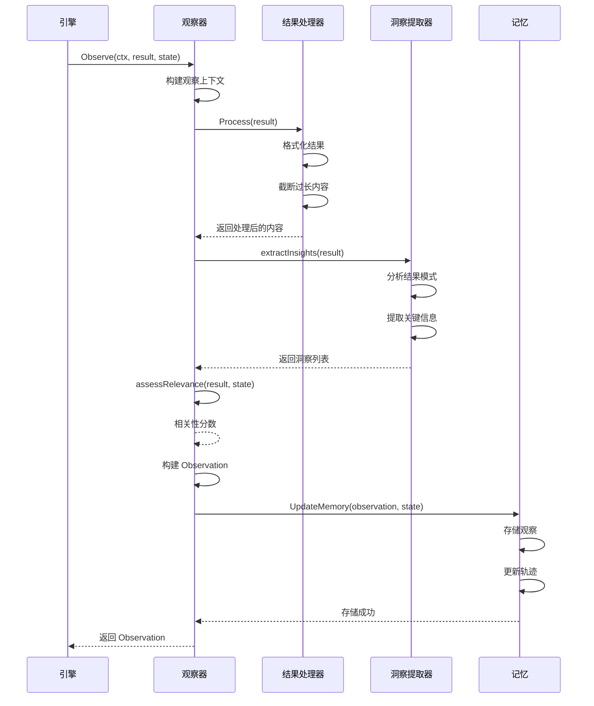
```mermaid
sequenceDiagram
    participant Engine as 引擎
    participant Observer as 观察器
    participant Processor as 结果处理器
    participant InsightExtractor as 洞察提取器
    participant Memory as 记忆

    Engine->>Observer: Observe(ctx, result, state)
    
    Observer->>Observer: 构建观察上下文
    
    Observer->>Processor: Process(result)
    Processor->>Processor: 格式化结果
    Processor->>Processor: 截断过长内容
    Processor-->>Observer: 返回处理后的内容
    
    Observer->>InsightExtractor: extractInsights(result)
    InsightExtractor->>InsightExtractor: 分析结果模式
    InsightExtractor->>InsightExtractor: 提取关键信息
    InsightExtractor-->>Observer: 返回洞察列表
    
    Observer->>Observer: assessRelevance(result, state)
    Observer-->>Observer: 相关性分数
    
    Observer->>Observer: 构建 Observation
    
    Observer->>Memory: UpdateMemory(observation, state)
    Memory->>Memory: 存储观察
    Memory->>Memory: 更新轨迹
    Memory-->>Observer: 存储成功
    
    Observer-->>Engine: 返回 Observation
```

### 3.2 结果处理流程

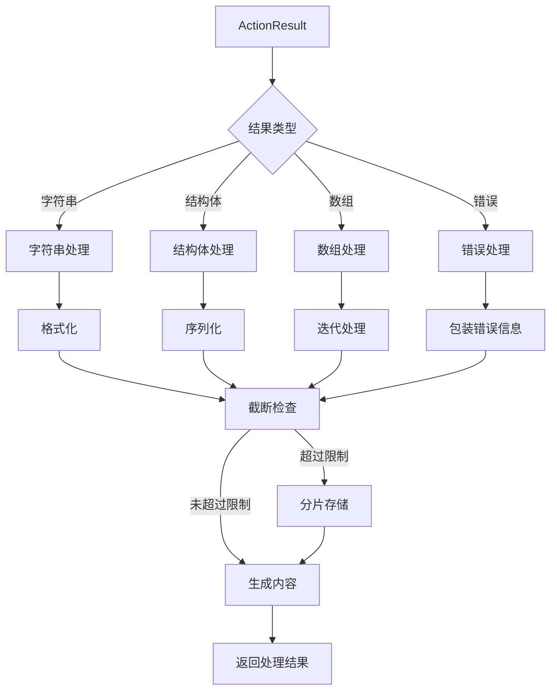
```mermaid
flowchart TB
    Result[ActionResult] --> TypeCheck{结果类型}
    
    TypeCheck --> |字符串| String[字符串处理]
    TypeCheck --> |结构体| Struct[结构体处理]
    TypeCheck --> |数组| Array[数组处理]
    TypeCheck --> |错误| Error[错误处理]
    
    String --> Format[格式化]
    Struct --> Serialize[序列化]
    Array --> Iterate[迭代处理]
    Error --> Wrap[包装错误信息]
    
    Format --> Truncate[截断检查]
    Serialize --> Truncate
    Iterate --> Truncate
    Wrap --> Truncate
    
    Truncate --> |超过限制| Split[分片存储]
    Truncate --> |未超过限制| Content[生成内容]
    Split --> Content
    
    Content --> Return[返回处理结果]
```

### 3.3 洞察提取流程

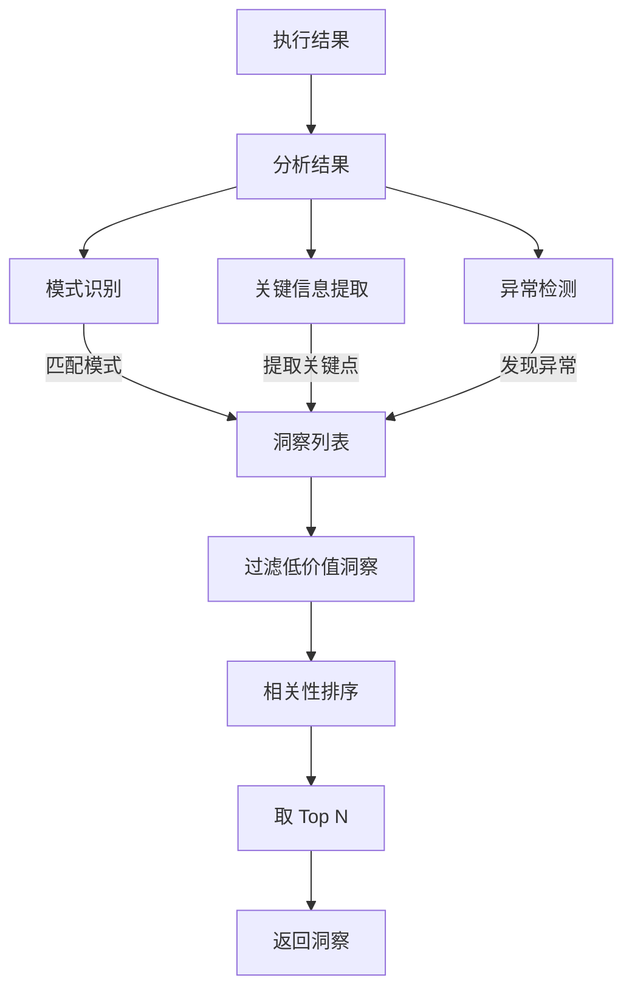
```mermaid
flowchart TB
    Result[执行结果] --> Analyze[分析结果]
    
    Analyze --> Pattern[模式识别]
    Analyze --> KeyInfo[关键信息提取]
    Analyze --> Anomaly[异常检测]
    
    Pattern --> |匹配模式| Insights[洞察列表]
    KeyInfo --> |提取关键点| Insights
    Anomaly --> |发现异常| Insights
    
    Insights --> Filter[过滤低价值洞察]
    Filter --> Rank[相关性排序]
    Rank --> Top[取 Top N]
    Top --> Return[返回洞察]
```

## 4. 结果处理器

### 4.1 处理器接口

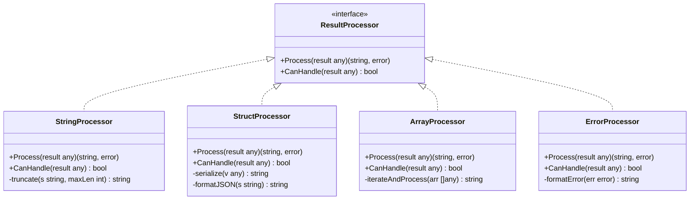
```mermaid
classDiagram
    class ResultProcessor {
        <<interface>>
        +Process(result any) (string, error)
        +CanHandle(result any) bool
    }
    
    class StringProcessor {
        +Process(result any) (string, error)
        +CanHandle(result any) bool
        -truncate(s string, maxLen int) string
    }
    
    class StructProcessor {
        +Process(result any) (string, error)
        +CanHandle(result any) bool
        -serialize(v any) string
        -formatJSON(s string) string
    }
    
    class ArrayProcessor {
        +Process(result any) (string, error)
        +CanHandle(result any) bool
        -iterateAndProcess(arr []any) string
    }
    
    class ErrorProcessor {
        +Process(result any) (string, error)
        +CanHandle(result any) bool
        -formatError(err error) string
    }
    
    ResultProcessor <|.. StringProcessor
    ResultProcessor <|.. StructProcessor
    ResultProcessor <|.. ArrayProcessor
    ResultProcessor <|.. ErrorProcessor
```

### 4.2 处理器选择策略

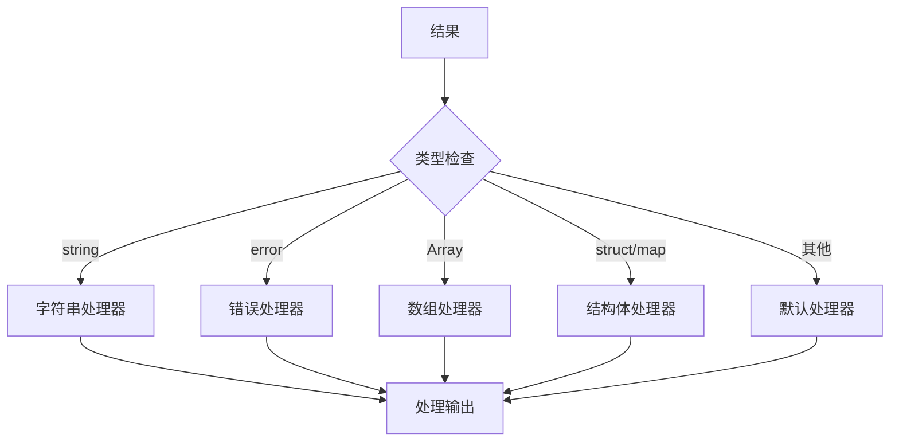
```mermaid
flowchart TB
    Result[结果] --> Check{类型检查}
    
    Check --> |string| StringProc[字符串处理器]
    Check --> |error| ErrorProc[错误处理器]
    Check --> |Array| ArrayProc[数组处理器]
    Check --> |struct/map| StructProc[结构体处理器]
    Check --> |其他| DefaultProc[默认处理器]
    
    StringProc --> Output[处理输出]
    ErrorProc --> Output
    ArrayProc --> Output
    StructProc --> Output
    DefaultProc --> Output
```

### 4.3 结果截断策略

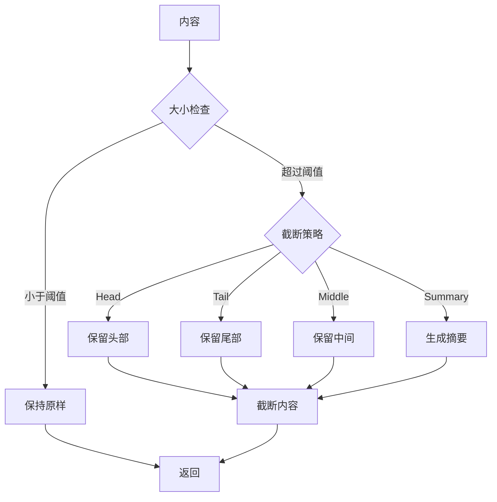
```mermaid
flowchart TB
    Content[内容] --> SizeCheck{大小检查}
    
    SizeCheck --> |小于阈值| Keep[保持原样]
    SizeCheck --> |超过阈值| Strategy{截断策略}
    
    Strategy --> |Head| Head[保留头部]
    Strategy --> |Tail| Tail[保留尾部]
    Strategy --> |Middle| Middle[保留中间]
    Strategy --> |Summary| Summary[生成摘要]
    
    Head --> Truncated[截断内容]
    Tail --> Truncated
    Middle --> Truncated
    Summary --> Truncated
    
    Keep --> Return[返回]
    Truncated --> Return
```

## 5. 洞察提取器

### 5.1 洞察提取器接口

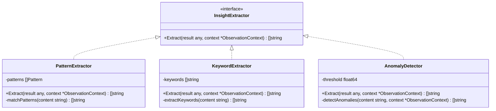
```mermaid
classDiagram
    class InsightExtractor {
        <<interface>>
        +Extract(result any, context *ObservationContext) []string
    }
    
    class PatternExtractor {
        -patterns []Pattern
        +Extract(result any, context *ObservationContext) []string
        -matchPatterns(content string) []string
    }
    
    class KeywordExtractor {
        -keywords []string
        +Extract(result any, context *ObservationContext) []string
        -extractKeywords(content string) []string
    }
    
    class AnomalyDetector {
        -threshold float64
        +Extract(result any, context *ObservationContext) []string
        -detectAnomalies(content string, context *ObservationContext) []string
    }
    
    InsightExtractor <|.. PatternExtractor
    InsightExtractor <|.. KeywordExtractor
    InsightExtractor <|.. AnomalyDetector
```

### 5.2 洞察类型

| 洞察类型 | 说明 | 示例 |
|---------|------|------|
| PatternMatch | 模式匹配 | "发现重复的错误模式：连接超时" |
| KeyFinding | 关键发现 | "找到目标文件：config.yaml" |
| Anomaly | 异常检测 | "响应时间异常：超过平均值 3 倍" |
| Trend | 趋势识别 | "错误率呈上升趋势" |
| Recommendation | 建议 | "建议增加重试机制" |

### 5.3 洞察提取规则

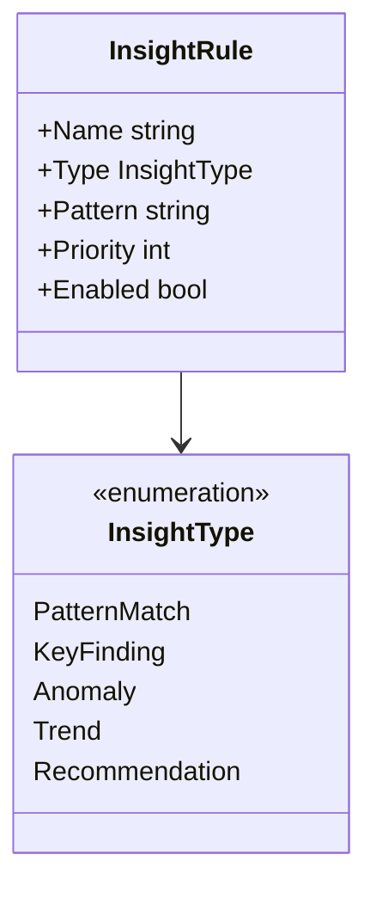
```mermaid
classDiagram
    class InsightRule {
        +Name string
        +Type InsightType
        +Pattern string
        +Priority int
        +Enabled bool
    }
    
    class InsightType {
        <<enumeration>>
        PatternMatch
        KeyFinding
        Anomaly
        Trend
        Recommendation
    }
    
    InsightRule --> InsightType
```

## 6. 相关性评估

### 6.1 评估维度

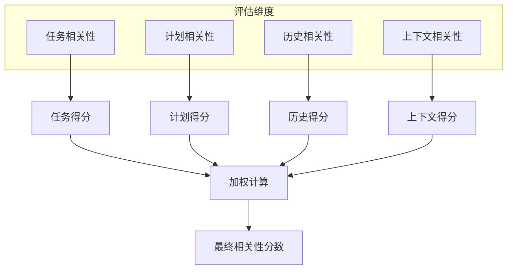
```mermaid
flowchart TB
    subgraph 评估维度
        Task[任务相关性]
        Plan[计划相关性]
        History[历史相关性]
        Context[上下文相关性]
    end
    
    Task --> Score1[任务得分]
    Plan --> Score2[计划得分]
    History --> Score3[历史得分]
    Context --> Score4[上下文得分]
    
    Score1 --> Weight[加权计算]
    Score2 --> Weight
    Score3 --> Weight
    Score4 --> Weight
    
    Weight --> Final[最终相关性分数]
```

### 6.2 评估算法

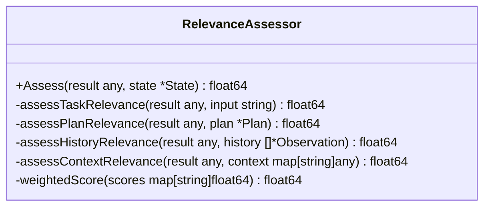
```mermaid
classDiagram
    class RelevanceAssessor {
        +Assess(result any, state *State) float64
        -assessTaskRelevance(result any, input string) float64
        -assessPlanRelevance(result any, plan *Plan) float64
        -assessHistoryRelevance(result any, history []*Observation) float64
        -assessContextRelevance(result any, context map[string]any) float64
        -weightedScore(scores map[string]float64) float64
    }
```

### 6.3 权重配置

| 维度 | 默认权重 | 说明 |
|------|---------|------|
| TaskRelevance | 0.4 | 与当前任务的相关性 |
| PlanRelevance | 0.3 | 与当前计划步骤的相关性 |
| HistoryRelevance | 0.2 | 与历史观察的相关性 |
| ContextRelevance | 0.1 | 与上下文的相关性 |

## 7. 记忆更新

### 7.1 更新流程

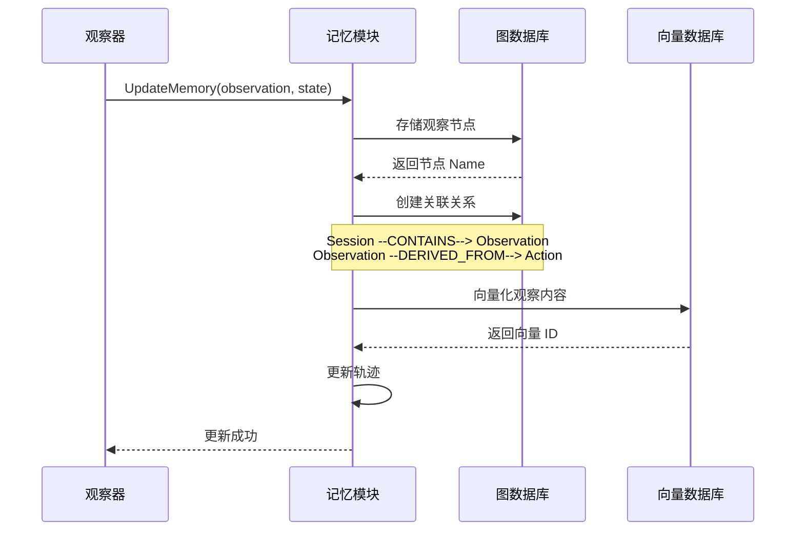
```mermaid
sequenceDiagram
    participant Observer as 观察器
    participant Memory as 记忆模块
    participant GraphDB as 图数据库
    participant VectorDB as 向量数据库

    Observer->>Memory: UpdateMemory(observation, state)
    
    Memory->>GraphDB: 存储观察节点
    GraphDB-->>Memory: 返回节点 Name
    
    Memory->>GraphDB: 创建关联关系
    Note over Memory,GraphDB: Session --CONTAINS--> Observation<br/>Observation --DERIVED_FROM--> Action
    
    Memory->>VectorDB: 向量化观察内容
    VectorDB-->>Memory: 返回向量 ID
    
    Memory->>Memory: 更新轨迹
    
    Memory-->>Observer: 更新成功
```

### 7.2 存储结构

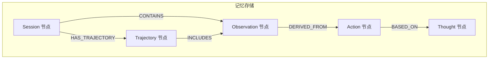
```mermaid
graph TB
    subgraph Memory[记忆存储]
        Session[Session 节点]
        Observation[Observation 节点]
        Action[Action 节点]
        Thought[Thought 节点]
        Trajectory[Trajectory 节点]
    end
    
    Session --> |CONTAINS| Observation
    Observation --> |DERIVED_FROM| Action
    Action --> |BASED_ON| Thought
    
    Session --> |HAS_TRAJECTORY| Trajectory
    Trajectory --> |INCLUDES| Observation
```

### 7.3 索引策略

| 索引类型 | 字段 | 说明 |
|---------|------|------|
| 时间索引 | Timestamp | 支持时间范围查询 |
| 来源索引 | Source | 支持按来源过滤 |
| 相关性索引 | Relevance | 支持相关性排序 |
| 向量索引 | Content | 支持语义检索 |

## 8. 轨迹构建

### 8.1 轨迹结构

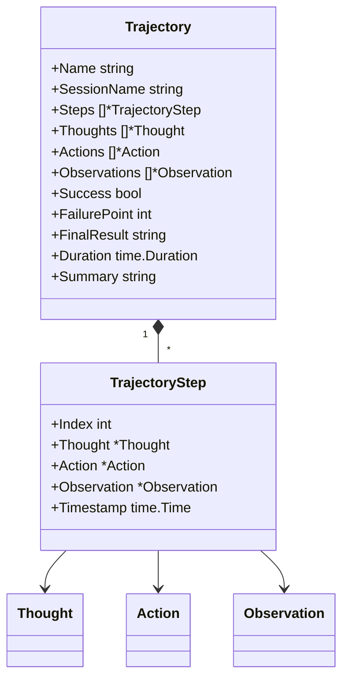
```mermaid
classDiagram
    class Trajectory {
        +Name string
        +SessionName string
        +Steps []*TrajectoryStep
        +Thoughts []*Thought
        +Actions []*Action
        +Observations []*Observation
        +Success bool
        +FailurePoint int
        +FinalResult string
        +Duration time.Duration
        +Summary string
    }
    
    class TrajectoryStep {
        +Index int
        +Thought *Thought
        +Action *Action
        +Observation *Observation
        +Timestamp time.Time
    }
    
    Trajectory "1" *-- "*" TrajectoryStep
    TrajectoryStep --> Thought
    TrajectoryStep --> Action
    TrajectoryStep --> Observation
```

### 8.2 轨迹构建流程

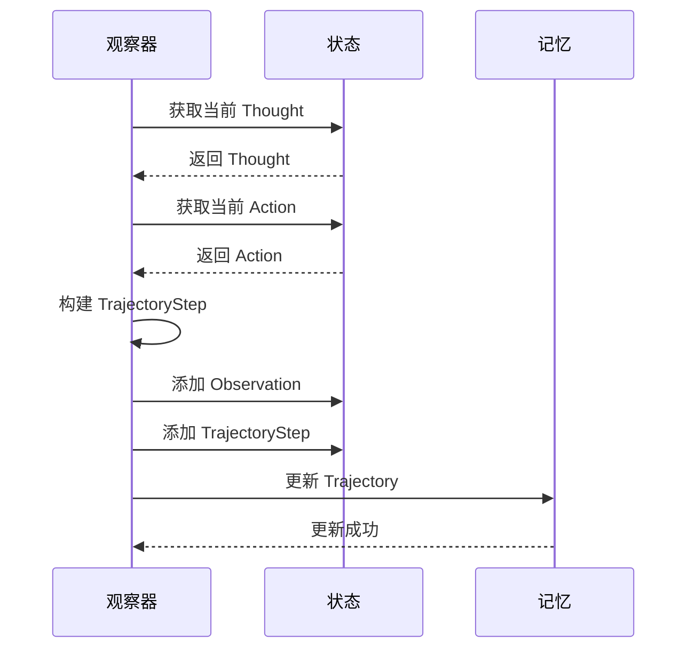
```mermaid
sequenceDiagram
    participant Observer as 观察器
    participant State as 状态
    participant Memory as 记忆

    Observer->>State: 获取当前 Thought
    State-->>Observer: 返回 Thought
    
    Observer->>State: 获取当前 Action
    State-->>Observer: 返回 Action
    
    Observer->>Observer: 构建 TrajectoryStep
    
    Observer->>State: 添加 Observation
    Observer->>State: 添加 TrajectoryStep
    
    Observer->>Memory: 更新 Trajectory
    Memory-->>Observer: 更新成功
```

### 8.3 轨迹摘要生成

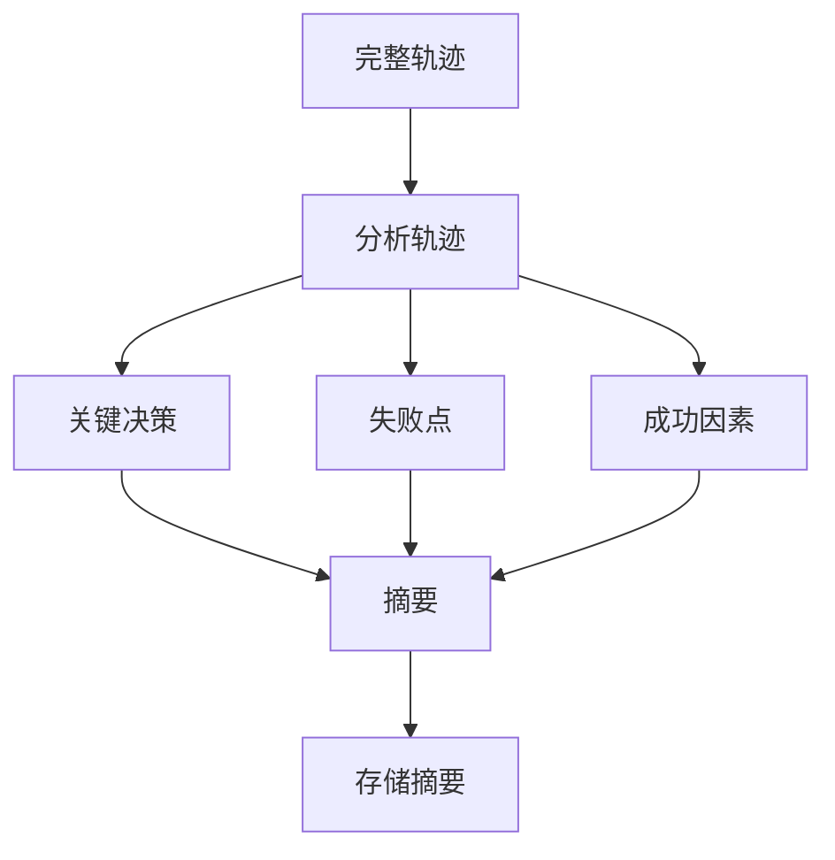
```mermaid
flowchart TB
    Trajectory[完整轨迹] --> Analyze[分析轨迹]
    
    Analyze --> KeyDecisions[关键决策]
    Analyze --> FailurePoints[失败点]
    Analyze --> SuccessFactors[成功因素]
    
    KeyDecisions --> Summary[摘要]
    FailurePoints --> Summary
    SuccessFactors --> Summary
    
    Summary --> Store[存储摘要]
```

## 9. 与其他模块的关系

### 9.1 与 Reactor 的关系

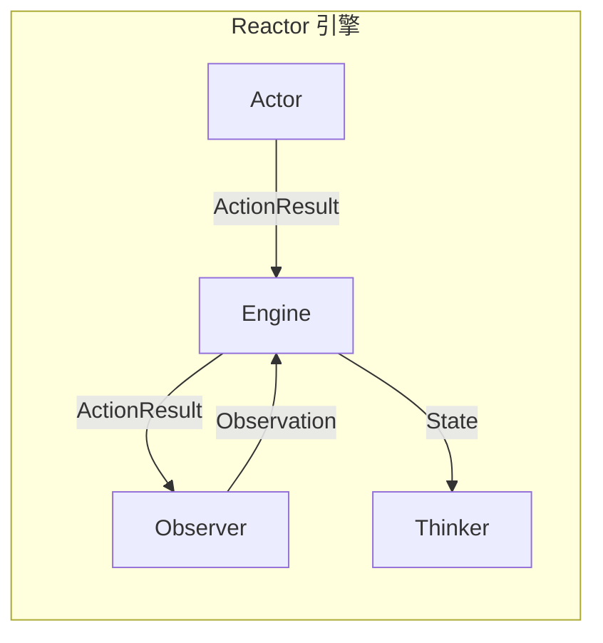
```mermaid
graph LR
    subgraph Reactor[Reactor 引擎]
        Engine[Engine]
        Thinker[Thinker]
        Actor[Actor]
        Observer[Observer]
    end
    
    Actor --> |ActionResult| Engine
    Engine --> |ActionResult| Observer
    Observer --> |Observation| Engine
    Engine --> |State| Thinker
```

### 9.2 与 Memory 的关系

```mermaid
sequenceDiagram
    participant Observer as 观察器
    participant Memory as 记忆模块

    Observer->>Memory: Store(observation)
    Memory-->>Observer: 存储成功
    
    Observer->>Memory: UpdateTrajectory(step)
    Memory-->>Observer: 更新成功
    
    Observer->>Memory: CreateRelations(observation, action)
    Memory-->>Observer: 关系创建成功
    
    Note over Observer,Memory: 下次思考时，Thinker 可以检索这些观察
```

### 9.3 与 Reflector 的关系

```mermaid
graph TB
    subgraph Observer[观察器]
        BuildTrajectory[构建轨迹]
    end
    
    subgraph Reflector[反思器]
        AnalyzeFailure[分析失败]
        GenerateHeuristic[生成启发式]
    end
    
    BuildTrajectory --> |Trajectory| Reflector
    Reflector --> |Reflection| Memory[(记忆)]
```

## 10. 错误处理

### 10.1 错误类型

| 错误类型 | 说明 | 处理策略 |
|---------|------|---------|
| ProcessError | 结果处理失败 | 使用原始结果 |
| ExtractionError | 洞察提取失败 | 跳过洞察提取 |
| StorageError | 存储失败 | 重试或记录日志 |
| TruncationError | 截断失败 | 使用默认截断 |

### 10.2 降级策略

```mermaid
flowchart TB
    Error[发生错误] --> Check{错误类型}
    
    Check --> |ProcessError| Raw[使用原始结果]
    Check --> |ExtractionError| Skip[跳过洞察]
    Check --> |StorageError| Retry{重试?}
    
    Retry --> |是| DoRetry[重试存储]
    Retry --> |否| Log[记录日志]
    
    DoRetry --> |成功| Success[继续]
    DoRetry --> |失败| Log
    
    Raw --> Continue[继续流程]
    Skip --> Continue
    Log --> Continue
    Success --> Continue
```

## 11. 监控与可观测性

### 11.1 关键指标

| 指标 | 说明 |
|------|------|
| observe_duration_ms | 观察处理耗时 |
| insight_count | 提取的洞察数量 |
| relevance_score_avg | 平均相关性分数 |
| memory_update_count | 记忆更新次数 |
| trajectory_step_count | 轨迹步骤数 |
| error_rate | 错误率 |

### 11.2 日志记录

```
[Observer] session=session-001 step=5 source=bash insights=2 relevance=0.85 duration=50ms
[Observer] session=session-001 step=5 insight="发现目标文件：config.yaml"
[Observer] session=session-001 step=5 insight="配置项缺失：timeout"
[Observer] session=session-001 step=6 error=StorageError retry=1
```

## 12. 总结

观察器是 ReAct 循环的"眼睛"，负责：
- 处理执行结果，转换为结构化观察
- 提取有价值的洞察和模式
- 评估结果与任务的相关性
- 更新记忆和构建执行轨迹

通过洞察提取和轨迹构建，观察器确保每次执行的经验都能被有效沉淀，为后续的思考和学习提供支持。
