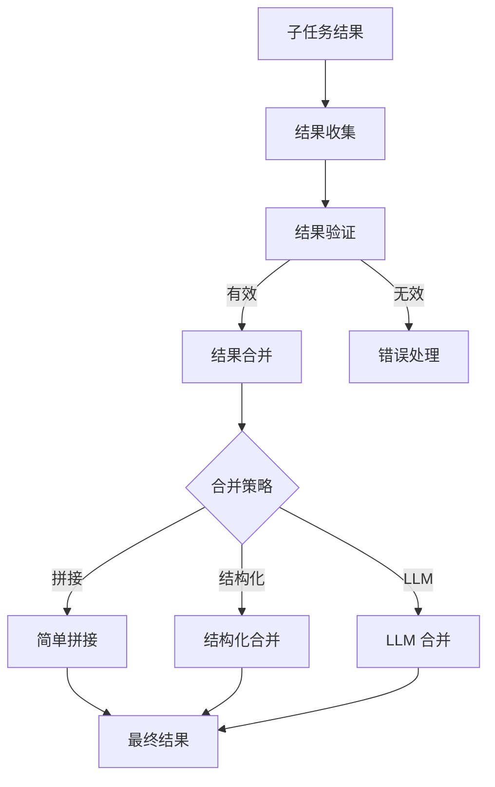
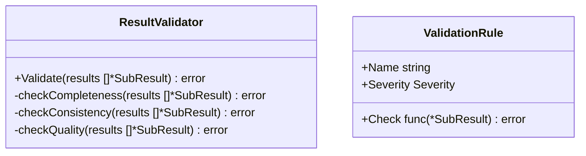

# 结果聚合设计

本文档描述编排模块的结果聚合机制，包括合并策略与验证规则。

## 1. 结果合并

### 1.1 合并策略

| 策略       | 说明                   | 适用场景          |
| ---------- | ---------------------- | ----------------- |
| 简单拼接   | 按顺序拼接所有结果     | 独立任务          |
| 结构化合并 | 按字段合并为结构化结果 | 有结构任务        |
| LLM 合并   | 通过 LLM 整合结果      | 复杂/非结构化任务 |
| 投票合并   | 多结果投票决定最终结果 | 需要共识的任务    |

### 1.2 合并流程

## 2. 结果验证

### 2.1 验证规则结构

### 2.2 验证类型

| 验证类型   | 说明               | 失败处理       |
| ---------- | ------------------ | -------------- |
| 完整性检查 | 所有子任务都有结果 | 标记缺失任务   |
| 一致性检查 | 结果之间无矛盾     | 触发冲突解决   |
| 质量检查   | 结果满足质量标准   | 标记低质量结果 |
| 格式检查   | 结果格式符合预期   | 尝试格式转换   |

## 3. 相关文档

- [编排模块概述](orchestration-module.md) - 模块架构与核心流程
- [编排核心接口](orchestration-interfaces.md) - Aggregator 接口定义
- [执行协调设计](orchestration-coordination.md) - 子任务执行与结果收集
