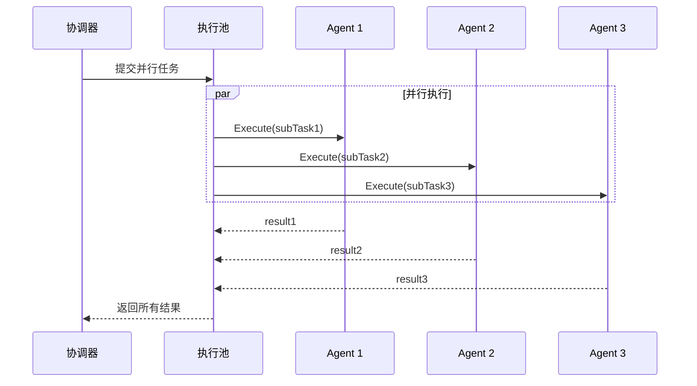
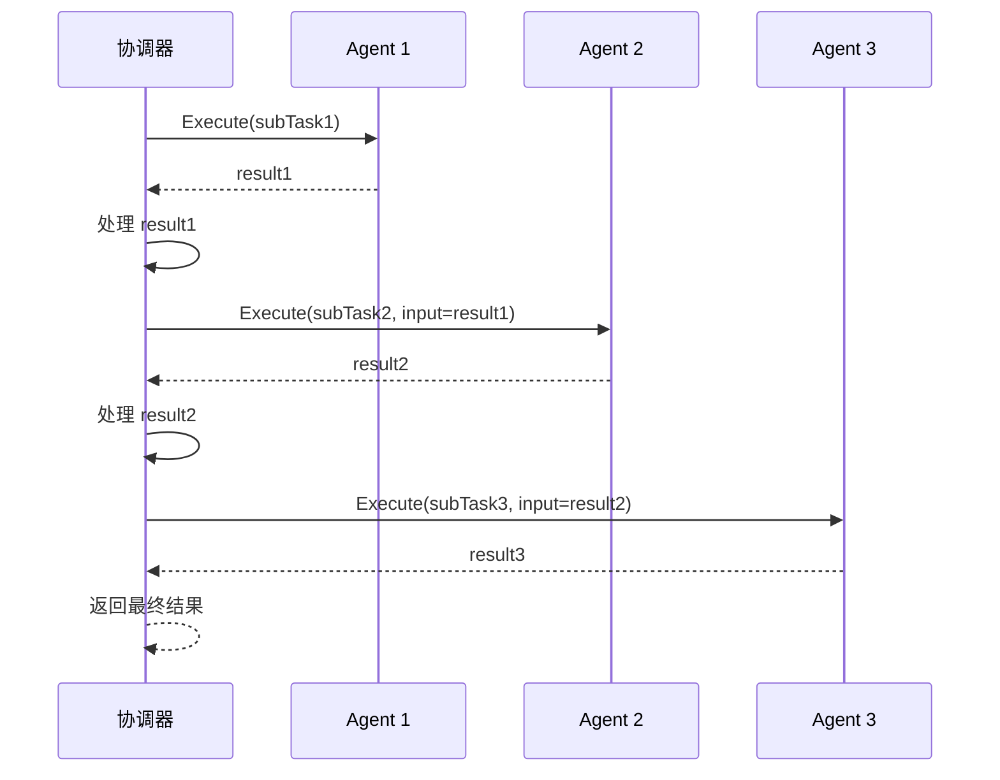
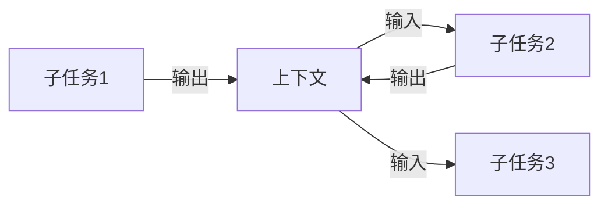
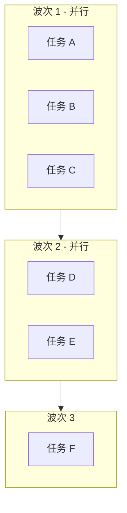
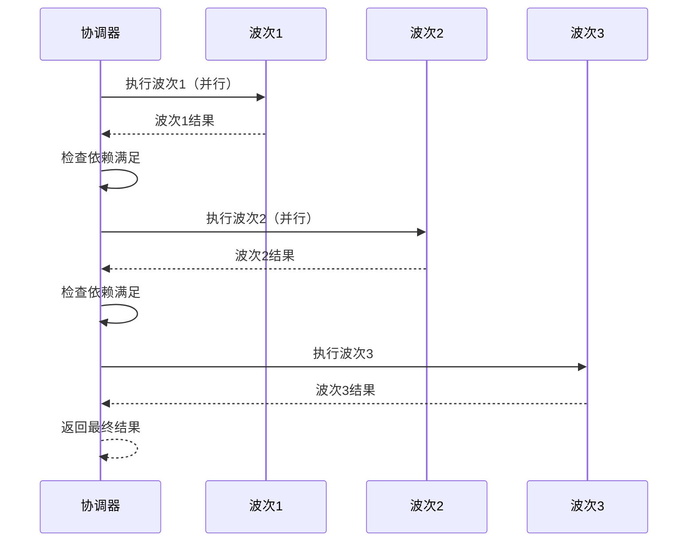

# 执行协调设计

本文档描述编排模块的执行协调机制，包括并行、串行和混合执行模式。

## 1. 并行执行

### 1.1 并行执行模型



### 1.2 并发控制结构

```mermaid
classDiagram
    class ExecutorPool {
        +MaxWorkers int
        +Semaphore chan struct{}
        +Submit(task func()) error
        +WaitAll() error
    }
    
    class ConcurrencyConfig {
        +MaxConcurrent int
        +Timeout time.Duration
        +RetryCount int
    }
```

## 2. 串行执行

### 2.1 串行执行模型



### 2.2 数据传递



## 3. 混合执行

### 3.1 波次执行模型



### 3.2 波次执行流程



## 4. 并发控制细节

### 4.1 并发控制伪代码

```
function ExecuteParallel(subTasks, agents, config):
    // 1. 初始化并发控制
    semaphore = NewSemaphore(config.MaxConcurrent)
    rateLimiter = NewRateLimiter(config.RateLimitPerAgent)
    results = NewConcurrentMap()
    errors = NewConcurrentSlice()
    wg = NewWaitGroup()
    
    // 2. 并行执行子任务
    for each subTask in subTasks:
        // 2.1 获取信号量（控制并发数）
        semaphore.Acquire()
        
        // 2.2 启动 goroutine
        go func(task):
            defer semaphore.Release()
            defer wg.Done()
            
            // 2.3 速率限制
            rateLimiter.Wait()
            
            // 2.4 执行子任务
            agent = agents[task.Name]
            ctx, cancel = WithTimeout(task.Timeout)
            defer cancel()
            
            result, err = agent.Execute(ctx, task.Input)
            
            if err != null:
                errors.Append(TaskError{Task: task, Error: err})
                // 错误处理策略
                if config.RetryCount > 0:
                    result = RetryWithBackoff(task, agent, config.RetryCount)
            
            results.Store(task.Name, result)
        (subTask)
        
        wg.Add(1)
    
    // 3. 等待所有任务完成
    wg.Wait()
    
    // 4. 处理错误
    if errors.Len() > 0:
        if config.FailFast:
            return Error(errors.First())
        // 继续返回部分结果
    
    return results.Values()
```

### 4.2 信号量控制

```
type Semaphore struct {
    ch chan struct{}
}

function NewSemaphore(maxConcurrent int):
    return Semaphore{ch: make(chan struct{}, maxConcurrent)}

function (s *Semaphore) Acquire():
    s.ch <- struct{}{}  // 阻塞直到有空位

function (s *Semaphore) Release():
    <-s.ch  // 释放一个位置
```

### 4.3 错误恢复机制

```
function RetryWithBackoff(task, agent, maxRetries):
    backoff = InitialBackoff  // 初始退避时间，如 1s
    
    for i = 0; i < maxRetries; i++:
        result, err = agent.Execute(ctx, task.Input)
        
        if err == null:
            return result
            
        // 判断错误类型
        if IsPermanentError(err):
            return Error(err)  // 永久性错误，不重试
            
        // 可恢复错误，等待后重试
        Sleep(backoff)
        backoff = min(backoff * 2, MaxBackoff)  // 指数退避
    
    return Error(MaxRetriesExceeded)
```

### 4.4 并发配置参数

| 参数 | 默认值 | 说明 |
|------|--------|------|
| `MaxConcurrent` | 5 | 最大并发 Agent 数 |
| `RateLimitPerAgent` | 10 | 每个 Agent 每秒请求数限制 |
| `Timeout` | 5m | 单个子任务超时时间 |
| `RetryCount` | 3 | 失败重试次数 |
| `InitialBackoff` | 1s | 初始退避时间 |
| `MaxBackoff` | 30s | 最大退避时间 |
| `FailFast` | false | 是否在第一个错误时立即返回 |

### 4.5 并发安全考虑

| 考虑点 | 处理方式 |
|--------|----------|
| 状态共享 | 使用并发安全的数据结构（sync.Map、sync.Mutex） |
| 资源竞争 | 通过信号量控制并发数 |
| 上下文取消 | 使用 context.Context 传播取消信号 |
| goroutine 泄漏 | 使用 defer 确保资源释放，使用 WaitGroup 等待完成 |
| panic 恢复 | 在 goroutine 中使用 recover 捕获 panic |

## 5. 相关文档

- [编排模块概述](orchestration-module.md) - 模块架构与核心流程
- [编排核心接口](orchestration-interfaces.md) - Coordinator 接口定义
- [任务分解设计](orchestration-planning.md) - 依赖图与执行顺序
