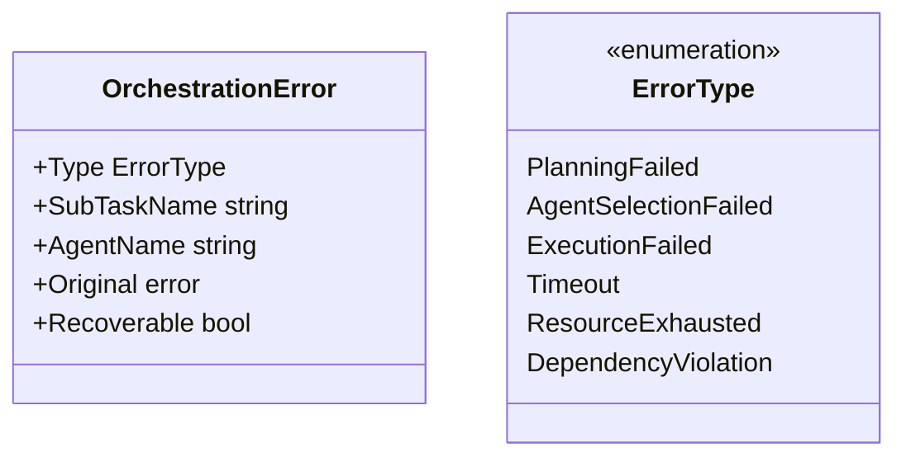
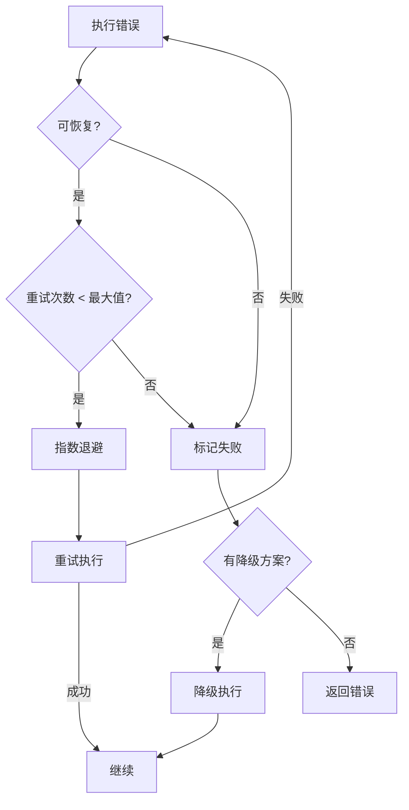

# 编排错误处理与恢复

本文档描述编排模块的错误处理策略与恢复机制。

## 1. 错误类型定义

### 1.1 OrchestrationError 结构

### 1.2 错误类型说明

| 错误类型             | 说明                   | 可恢复性 |
| -------------------- | ---------------------- | -------- |
| PlanningFailed       | 任务规划失败           | 可重试   |
| AgentSelectionFailed | Agent 选择失败         | 可选择替代 |
| ExecutionFailed      | 执行失败               | 可重试   |
| Timeout              | 执行超时               | 可重试   |
| ResourceExhausted    | 资源耗尽               | 可等待   |
| DependencyViolation  | 依赖关系违反           | 需重新规划 |

## 2. 处理策略

### 2.1 错误处理策略表

| 错误类型             | 处理策略       | 说明                   |
| -------------------- | -------------- | ---------------------- |
| PlanningFailed       | 重试规划       | 重新调用规划器         |
| AgentSelectionFailed | 选择替代 Agent | 从候选列表选择次优     |
| ExecutionFailed      | 重试/降级      | 重试执行或降级处理     |
| Timeout              | 取消并重试     | 取消当前执行，重新调度 |
| ResourceExhausted    | 等待/降级      | 等待资源释放或降级执行 |
| DependencyViolation  | 重新规划       | 重新分析依赖并规划     |

### 2.2 重试机制流程

## 3. 相关文档

- [编排模块概述](orchestration-module.md) - 模块架构与核心流程
- [多 Agent 暂停-恢复机制](orchestration-pause-resume.md) - 状态恢复与快照
