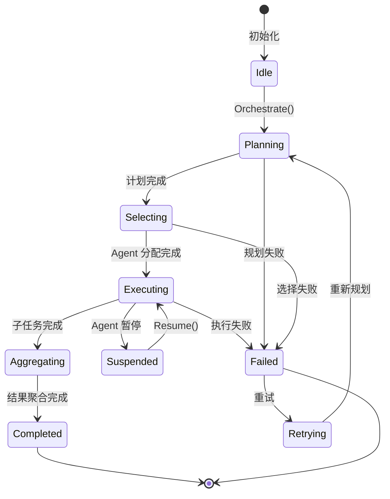
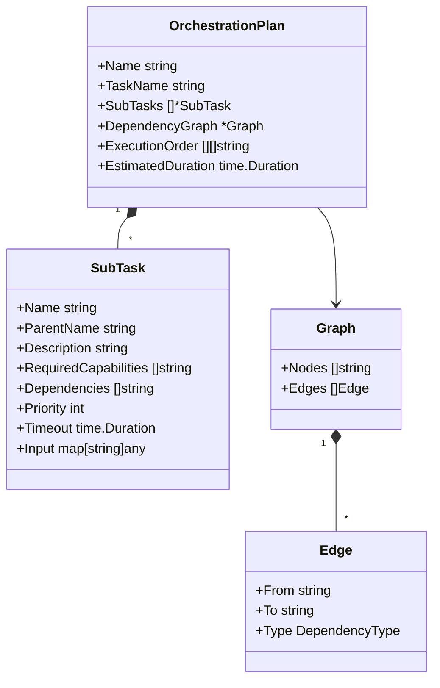
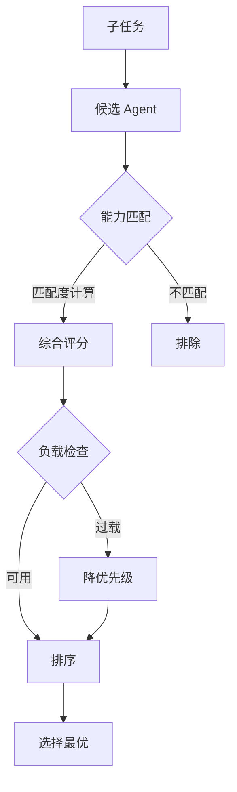
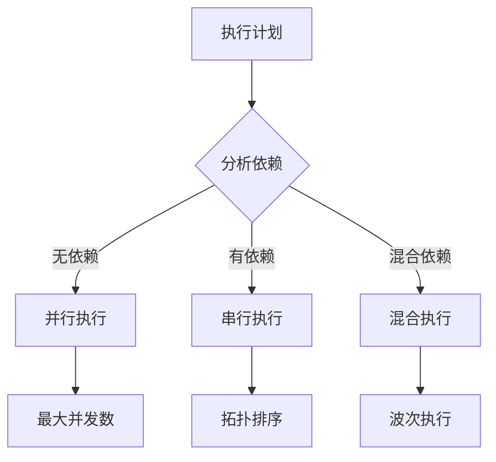
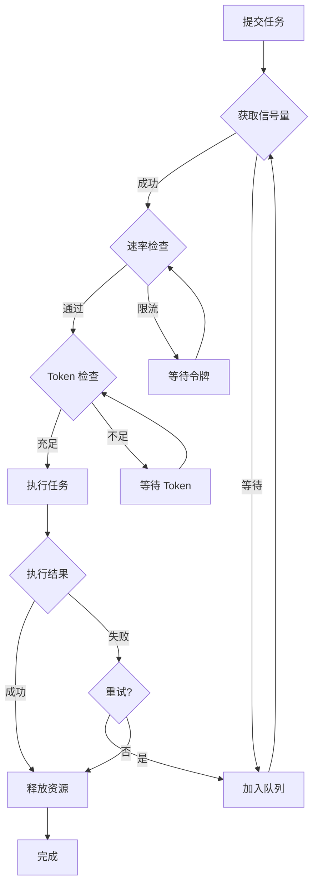

# 编排核心接口设计

本文档定义多 Agent 编排模块的核心接口。

## 1. 编排器接口

### 1.1 Orchestrator 接口

```go
type Orchestrator interface {
    Orchestrate(ctx context.Context, task *Task) (*Result, error)
    Status() *Status
    Pause() error
    Resume(ctx context.Context, sessionName string, answers map[string]string) (*Result, error)
    Stop() error
}
```

**方法说明**：

| 方法        | 说明                                  |
| ----------- | ------------------------------------- |
| Orchestrate | 执行编排任务，返回最终结果            |
| Status      | 获取当前编排状态                      |
| Pause       | 暂停编排执行                          |
| Resume      | 恢复编排执行，传入各 Agent 的答案映射 |
| Stop        | 停止编排执行                          |

### 1.2 编排状态机



## 2. 任务规划器接口

### 2.1 TaskPlanner 接口

```go
type TaskPlanner interface {
    Plan(task *Task) (*OrchestrationPlan, error)
    Decompose(task *Task) ([]*SubTask, error)
    Optimize(plan *OrchestrationPlan) (*OrchestrationPlan, error)
}
```

**方法说明**：

| 方法      | 说明                             |
| --------- | -------------------------------- |
| Plan      | 生成完整的执行计划               |
| Decompose | 将任务分解为子任务               |
| Optimize  | 优化执行计划（并行度、资源分配） |

### 2.2 OrchestrationPlan 结构



## 3. Agent 选择器接口

### 3.1 Selector 接口

```go
type Selector interface {
    Select(subTask *SubTask, candidates []Agent) (Agent, error)
    SelectBatch(subTasks []*SubTask, candidates []Agent) (map[string]Agent, error)
    Capabilities(agent Agent) (*Capabilities, error)
}
```

**方法说明**：

| 方法         | 说明                       |
| ------------ | -------------------------- |
| Select       | 为单个子任务选择最优 Agent |
| SelectBatch  | 批量为多个子任务选择 Agent |
| Capabilities | 获取 Agent 的能力描述      |

### 3.2 选择策略流程



## 4. 执行协调器接口

### 4.1 Coordinator 接口

```go
type Coordinator interface {
    Execute(ctx context.Context, plan *OrchestrationPlan, agents map[string]Agent) ([]*SubResult, error)
    ExecuteParallel(ctx context.Context, subTasks []*SubTask, agents map[string]Agent) ([]*SubResult, error)
    ExecuteSequential(ctx context.Context, subTasks []*SubTask, agents map[string]Agent) ([]*SubResult, error)
}
```

**方法说明**：

| 方法              | 说明                           |
| ----------------- | ------------------------------ |
| Execute           | 根据计划执行，自动选择执行模式 |
| ExecuteParallel   | 并行执行无依赖的子任务         |
| ExecuteSequential | 串行执行有依赖的子任务         |

### 4.2 执行模式选择



## 5. 并发控制

### 5.1 并发配置

```go
type ConcurrencyConfig struct {
    MaxConcurrent      int           // 最大并发 Agent 数，默认 5
    RateLimitPerAgent  int           // 每个 Agent 每秒请求数限制，默认 10
    TokenBucketSize    int           // 令牌桶大小，默认 100
    Timeout            time.Duration // 单个任务超时，默认 5 分钟
    RetryCount         int           // 失败重试次数，默认 3
}

type ConcurrencyPool struct {
    config       ConcurrencyConfig
    semaphore    chan struct{}       // 信号量控制并发数
    rateLimiter  *rate.Limiter       // 速率限制器
    tokenBucket  *TokenBucket        // Token 消耗限制
}
```

### 5.2 并发执行策略

| 策略         | 说明                          | 适用场景       |
| ------------ | ----------------------------- | -------------- |
| 固定并发池   | 固定数量的 goroutine 执行任务 | 任务量稳定     |
| 动态扩缩容   | 根据负载动态调整并发数        | 任务量波动大   |
| 优先级队列   | 按任务优先级调度执行          | 任务优先级不同 |
| 资源感知调度 | 根据 Agent 资源占用情况调度   | 资源受限环境   |

### 5.3 并发控制流程



### 5.4 资源隔离

```go
type ResourceIsolation struct {
    AgentPools    map[string]*AgentPool    // 每个 Agent 独立资源池
    TaskPools     map[string]*TaskPool     // 按任务类型隔离
    PriorityPools map[int]*PriorityPool    // 按优先级隔离
}

func (r *ResourceIsolation) Execute(ctx context.Context, task *Task) error {
    pool := r.selectPool(task)
    
    if err := pool.Acquire(ctx); err != nil {
        return err
    }
    defer pool.Release()
    
    return pool.Execute(ctx, task)
}
```

### 5.5 并发监控指标

| 指标                   | 说明                  |
| ---------------------- | --------------------- |
| ActiveAgents           | 当前活跃的 Agent 数量 |
| QueuedTasks            | 队列中等待的任务数    |
| AvgExecutionTime       | 平均执行时间          |
| ConcurrencyUtilization | 并发池利用率          |
| RateLimitHits          | 速率限制触发次数      |

## 6. 相关文档

- [编排模块概述](orchestration-module.md) - 模块架构与核心流程
- [任务分解设计](orchestration-planning.md) - 任务分解策略与依赖分析
- [Agent 选择设计](orchestration-selection.md) - 能力匹配与负载均衡
- [执行协调设计](orchestration-coordination.md) - 并行与串行执行
