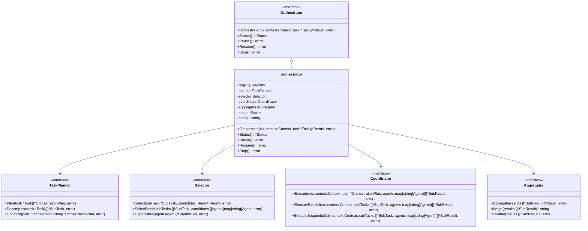
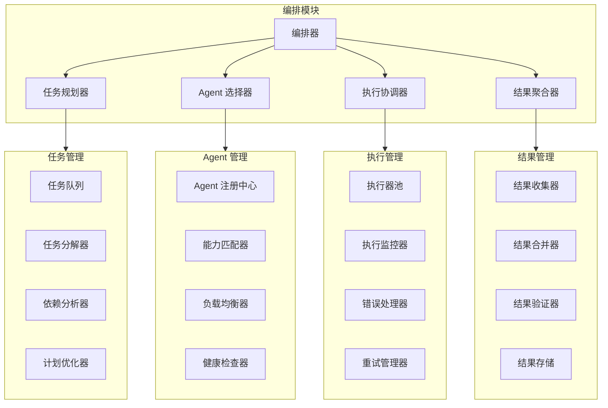
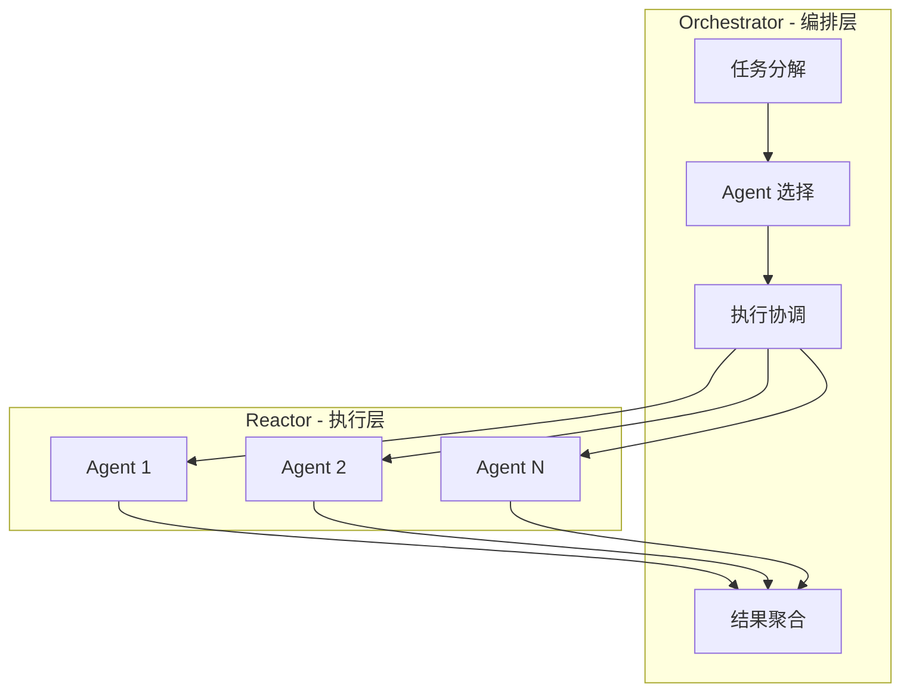
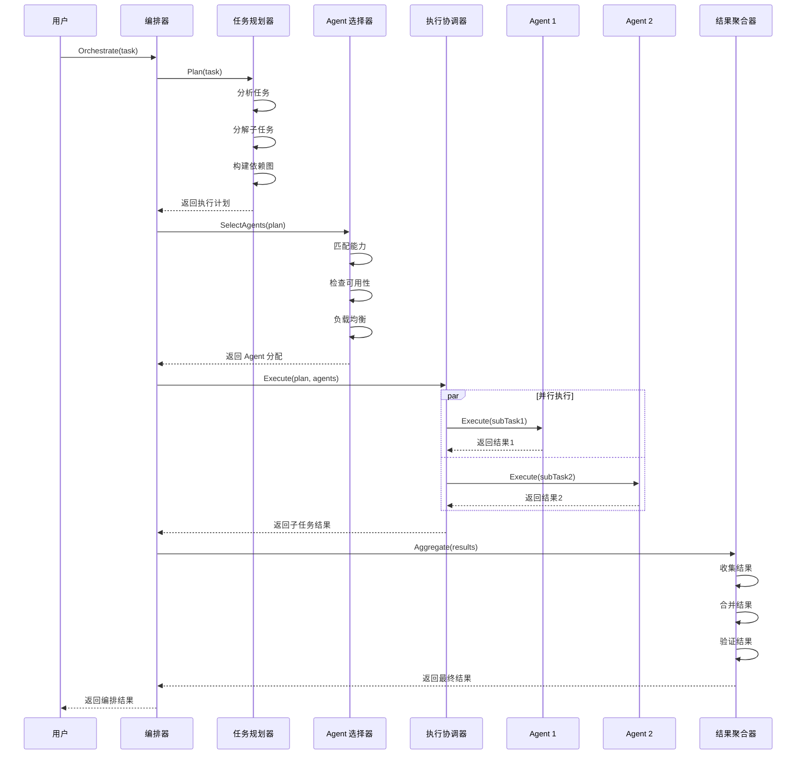

# 多 Agent 编排模块设计

多 Agent 编排模块是 GoReAct 框架的核心组件之一，负责协调多个 Agent 的协作。该模块采用集中式编排模式，通过主 Agent（Master Agent）协调多个工作 Agent（Worker Agent）的执行，支持并行和串行任务执行，实现复杂任务的分解、分配和结果整合。

## 1. 核心职责

| 职责       | 说明                              |
| ---------- | --------------------------------- |
| 任务分解   | 将复杂任务分解为多个子任务        |
| Agent 选择 | 根据子任务需求选择合适的 Agent    |
| 任务分配   | 将子任务分配给选定的 Agent        |
| 执行协调   | 协调多个 Agent 的执行顺序和并发   |
| 结果整合   | 汇总和整合各 Agent 的执行结果     |
| 错误处理   | 处理 Agent 执行过程中的错误和异常 |

## 2. 设计原则

- **集中式编排**: 通过主 Agent 集中管理和协调
- **灵活调度**: 支持并行和串行任务执行
- **智能分配**: 根据能力和负载智能分配任务
- **容错机制**: 支持错误处理和重试机制
- **可扩展性**: 支持动态添加和移除 Agent

## 3. 模块架构

### 3.1 类图设计

### 3.2 组件结构

## 4. 与 Reactor 的协作关系

Orchestrator 与 Reactor 是两个不同层级的抽象：

| 层级   | 模块         | 职责                                    |
| ------ | ------------ | --------------------------------------- |
| 编排层 | Orchestrator | 多 Agent 协调、任务分解与分配、结果整合 |
| 执行层 | Reactor      | 单 Agent 内部的 ReAct 循环、规划与反思  |

**协作模式**：

1. **Orchestrator 负责多 Agent 编排**：将复杂任务分解为子任务，选择合适的 Agent 执行
2. **每个 Agent 内部使用 Reactor**：Reactor 负责单个 Agent 的 ReAct 循环、规划和反思
3. **结果向上汇总**：各 Agent 的执行结果由 Orchestrator 聚合

**与 Agent 模块中 SubAgent 的关系**：

- Agent 模块中的 SubAgent 是 Reactor 内部的轻量级委托机制，用于简单的任务委托
- Orchestrator 是独立的编排模块，用于复杂的多 Agent 协作场景
- 两者可以共存：Orchestrator 编排多个 Agent，每个 Agent 内部可以使用 SubAgent 机制

**选型决策准则**：

| 维度           | SubAgent（Reactor 内部委托）           | Orchestrator（独立编排模块）                  |
| -------------- | -------------------------------------- | --------------------------------------------- |
| **子任务数量** | 单个子任务委托给单个 Agent             | 多个子任务分配给多个 Agent                    |
| **并发需求**   | 串行执行，等待子任务完成后继续         | 支持并行、串行、混合执行模式                  |
| **任务分解**   | 由 Thinker 在推理中决定委托            | 由 TaskPlanner 进行结构化分解和依赖分析       |
| **结果整合**   | 子任务结果直接作为 Observation 回传    | 由 Aggregator 进行多源结果合并和验证          |
| **典型场景**   | "这个子问题让专业 Agent 回答一下"      | "把需求分析、编码、测试分给不同 Agent 并行做" |
| **触发方式**   | Thinker 生成 `SubAgentDelegate` Action | 开发者/上层系统显式调用 `Orchestrate()`       |
| **状态管理**   | 共享父 Reactor 的 Memory               | 独立管理 OrchestrationState                   |
| **适用复杂度** | 低（1:1 委托）                         | 高（N:M 编排、依赖图、波次执行）              |

## 5. 核心流程

### 5.1 编排流程

## 6. 模块文档索引

| 文档                                                               | 内容                                                           |
| ------------------------------------------------------------------ | -------------------------------------------------------------- |
| [orchestration-interfaces.md](orchestration-interfaces.md)         | 核心接口设计：Orchestrator、TaskPlanner、Selector、Coordinator |
| [orchestration-planning.md](orchestration-planning.md)             | 任务分解策略与依赖分析                                         |
| [orchestration-selection.md](orchestration-selection.md)           | Agent 选择：能力匹配与负载均衡                                 |
| [orchestration-coordination.md](orchestration-coordination.md)     | 执行协调：并行、串行、混合执行                                 |
| [orchestration-aggregation.md](orchestration-aggregation.md)       | 结果聚合：合并策略与验证规则                                   |
| [orchestration-pause-resume.md](orchestration-pause-resume.md)     | 多 Agent 暂停-恢复机制                                         |
| [orchestration-error-handling.md](orchestration-error-handling.md) | 错误处理与恢复                                                 |
| [orchestration-observability.md](orchestration-observability.md)   | 监控与可观测性                                                 |

## 7. 相关文档

- [Agent 模块设计](agent-module.md) - Agent 定义与 SubAgent 机制
- [Reactor 模块设计](reactor-module.md) - 单 Agent 执行引擎
- [Memory 模块设计](memory-module.md) - 编排状态存储
