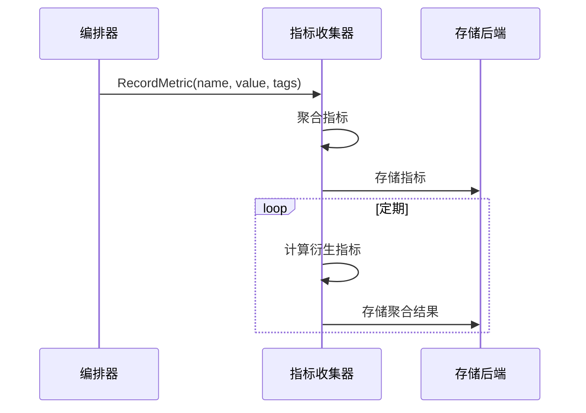
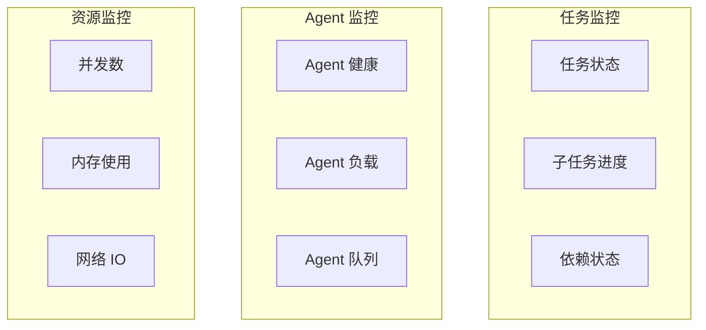

# 编排监控与可观测性

本文档描述编排模块的监控指标与可观测性设计。

## 1. 性能指标

### 1.1 核心指标

| 指标         | 说明                       | 计算方式                           |
| ------------ | -------------------------- | ---------------------------------- |
| 编排延迟     | 从任务提交到开始执行的时间 | StartTime - SubmitTime             |
| 执行时间     | 总执行时间                 | EndTime - StartTime                |
| 子任务成功率 | 成功子任务占比             | SuccessCount / TotalCount          |
| Agent 利用率 | Agent 繁忙时间占比         | BusyTime / TotalTime               |
| 并行效率     | 实际并行度 / 理论并行度    | ActualParallelism / MaxParallelism |

### 1.2 指标收集流程

## 2. 执行监控

### 2.1 监控维度

### 2.2 告警规则

| 告警         | 条件                    | 级别     |
| ------------ | ----------------------- | -------- |
| 任务超时     | 执行时间 > 预估时间 * 2 | Warning  |
| Agent 不可用 | 健康检查失败 > 3 次     | Critical |
| 高失败率     | 失败率 > 20%            | Warning  |
| 资源耗尽     | 并发数 = 最大并发数     | Warning  |

## 3. 相关文档

- [编排模块概述](orchestration-module.md) - 模块架构与核心流程
- [编排错误处理](orchestration-error-handling.md) - 错误处理与恢复
