# 多 Agent 暂停-恢复机制

在多 Agent 编排过程中，任意 Agent 都可能触发暂停（如需要用户授权）。Orchestrator 需要协调所有 Agent 的暂停-恢复流程，确保状态一致性和依赖关系正确处理。

## 1. 暂停场景分析

### 1.1 单 Agent 暂停

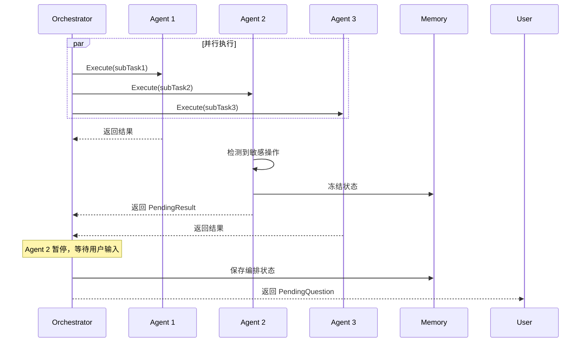

### 1.2 多 Agent 同时暂停

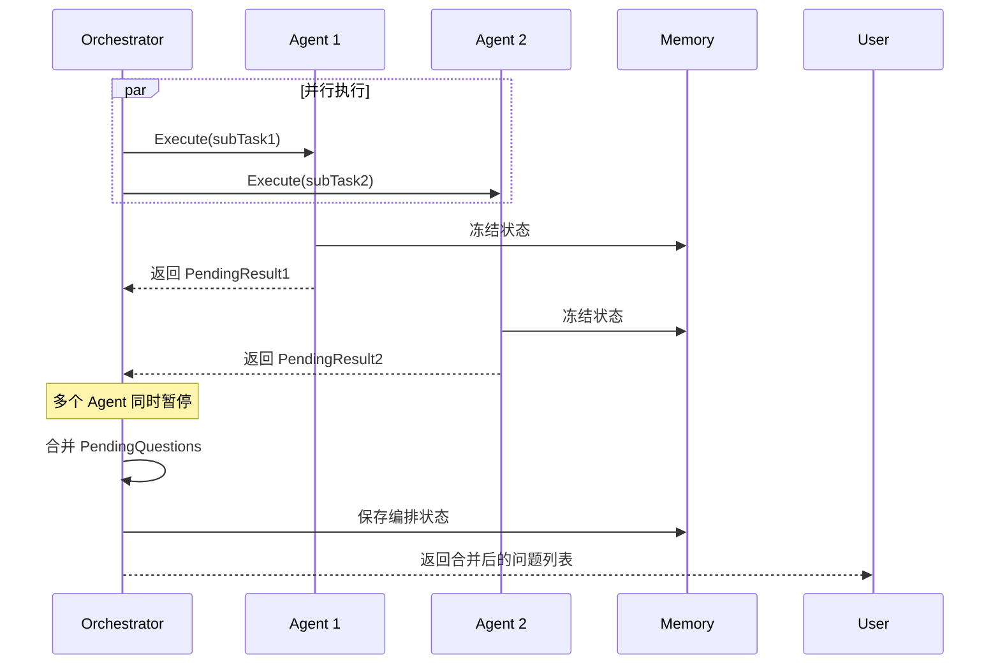

## 2. 编排状态管理

### 2.1 OrchestrationState 结构

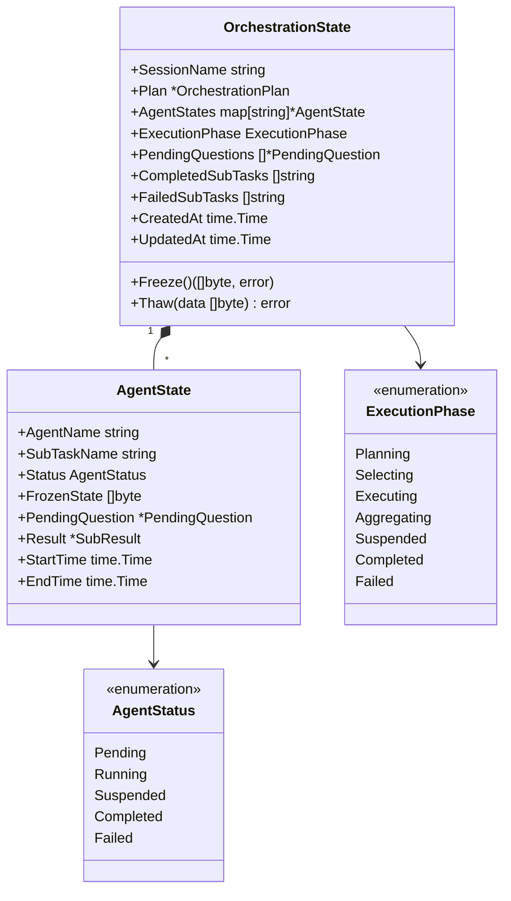

### 2.2 状态存储接口

所有编排状态通过 Memory 存储：

```go
type OrchestrationStateStorage interface {
    Store(ctx context.Context, state *OrchestrationState) error
    Get(ctx context.Context, sessionName string) (*OrchestrationState, error)
    UpdateAgentState(ctx context.Context, sessionName string, agentName string, agentState *AgentState) error
    Delete(ctx context.Context, sessionName string) error
}
```

### 2.3 快照粒度定义

快照分为两个层级，确保恢复时的灵活性和一致性：

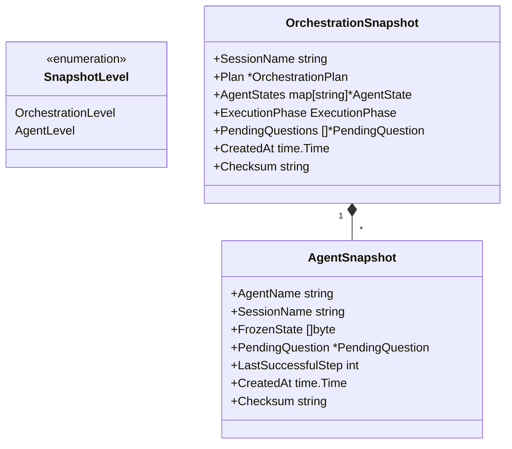

| 快照层级               | 范围                        | 适用场景              | 恢复策略               |
| ---------------------- | --------------------------- | --------------------- | ---------------------- |
| **OrchestrationLevel** | 整个编排任务的所有Agent状态 | 全局暂停、系统级恢复  | 整体恢复，保持依赖关系 |
| **AgentLevel**         | 单个Agent的独立状态         | 单Agent暂停、部分恢复 | 独立恢复，需检查依赖   |

### 2.4 快照恢复决策树

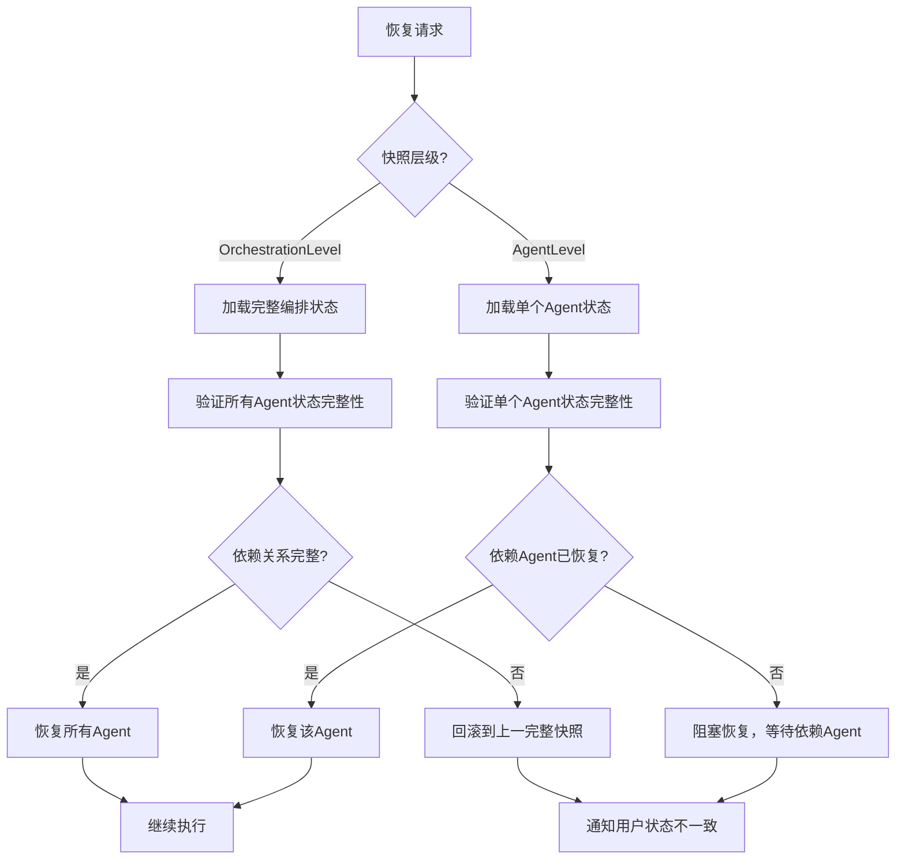

## 3. 暂停触发与传播

### 3.1 暂停触发条件

| 触发源     | 条件               | 处理方式        |
| ---------- | ------------------ | --------------- |
| Agent 内部 | 敏感工具、需要确认 | 单 Agent 暂停   |
| 依赖阻塞   | 上游 Agent 暂停    | 下游 Agent 等待 |
| 资源竞争   | 共享资源被锁定     | 相关 Agent 等待 |
| 用户干预   | 外部暂停请求       | 所有 Agent 暂停 |

### 3.2 暂停传播机制

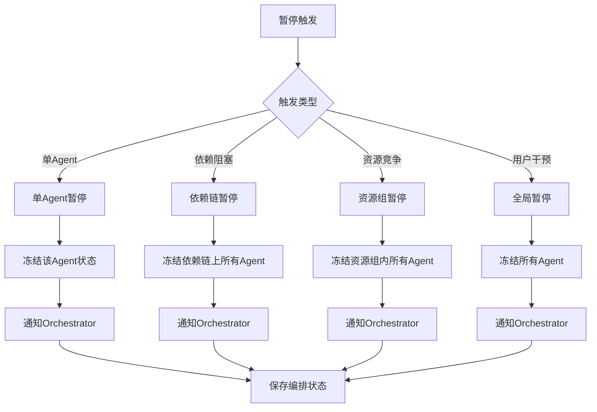

## 4. 依赖关系与同步

### 4.1 依赖感知暂停

当 Agent A 暂停时，其下游依赖 Agent B 会被自动置于 `Blocked` 状态。Orchestrator 维持着一张动态的依赖状态图，任何状态变更都会触发级联检查。

### 4.2 同步屏障与死锁预防

在多 Agent 并行执行时，同步屏障（Barrier）用于确保所有前置任务完成后再启动后续任务。

### 4.3 死锁检测与解决机制

多 Agent 协作中最核心的挑战之一是由于资源竞争或逻辑循环导致的死锁。GoReAct 采用以下策略：

1. **静态图验证**：在 `Planner` 生成计划后，首先进行 DAG（有向无环图）检测，如果存在逻辑闭环则拒绝执行并回馈给用户。
2. **动态超时回滚**：对于在执行过程中产生的隐性死锁（如 Agent A 等待 Agent B 释放文件锁，而 B 在等待 A 的结果），系统会通过 `MaxWaitTime` 触发自动熔断，回滚到最近的一个安全快照，并尝试重新规划路径。
3. **用户干预入口**：当自动解决失效时，Orchestrator 会生成一个 `Authorization` 类型的 PendingQuestion，向人类报告当前的"僵局"，由人类决定强制终止哪一方。

## 5. 恢复协议

### 5.1 恢复流程

当用户针对某个 `PendingQuestion` 给出回复后，系统执行以下**原子恢复协议**：

1. **快照校验**：检查 Memory 中的 `FrozenSession` 签名，确保状态未被篡改。
2. **上下文补全**：将用户的输入作为 `Observation` 注入回该 Agent 的 Trajectory 结尾。
3. **依赖重估**：检查该回复是否解除了其他 Agent 的 Blocked 状态。
4. **断点续传**：Reactor 恢复执行循环，跳过已成功的历史步骤，从失败或暂停的断点处通过 `IsIdempotent` 检查后决定是否重新执行。

### 5.2 答案映射结构

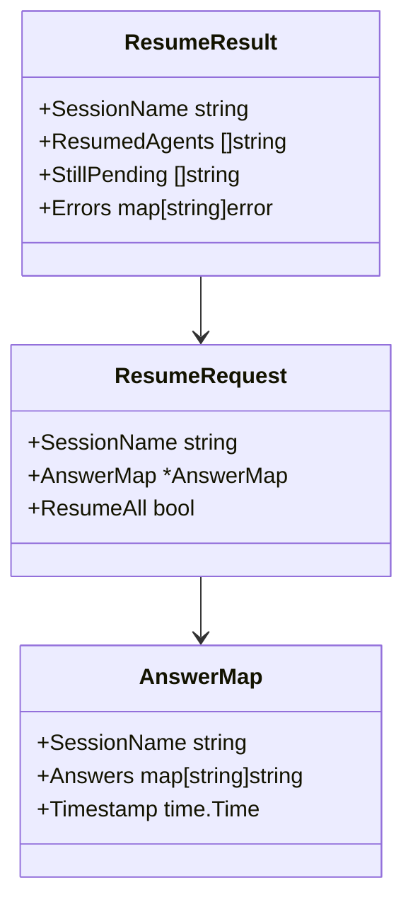

### 5.3 部分恢复策略

```go
type ResumeStrategy int

const (
    ResumeAll      ResumeStrategy = iota  // 恢复所有暂停的Agent
    ResumeSelected                         // 只恢复选中的Agent
    ResumeSequential                       // 按顺序逐个恢复
)
```

### 5.4 ResumeSelected 依赖检查

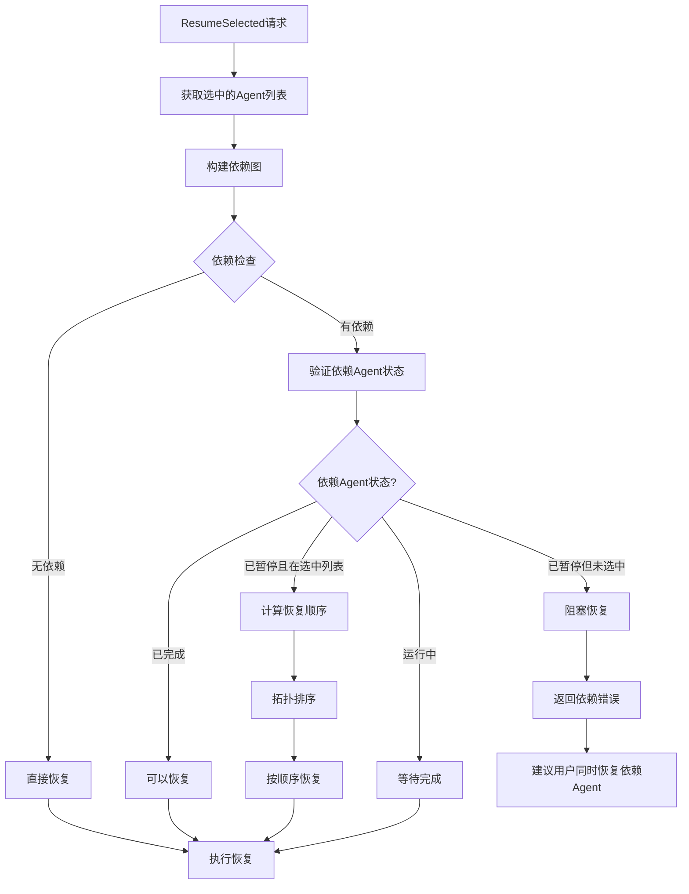

## 6. 状态签名与验证

### 6.1 签名结构

```go
type SnapshotSigner struct {
    privateKey ed25519.PrivateKey
    publicKey  ed25519.PublicKey
}

type SignedSnapshot struct {
    Content    []byte `json:"content"`     // 快照内容（JSON序列化）
    Signature  []byte `json:"signature"`   // Ed25519签名
    Algorithm  string `json:"algorithm"`   // 签名算法：Ed25519
    KeyID      string `json:"key_id"`      // 密钥标识
    Timestamp  int64  `json:"timestamp"`   // 签名时间戳
}
```

### 6.2 签名生成流程

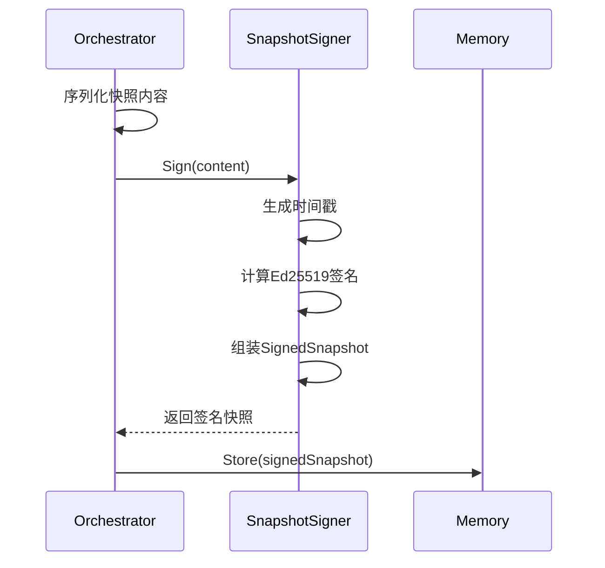

### 6.3 签名验证流程

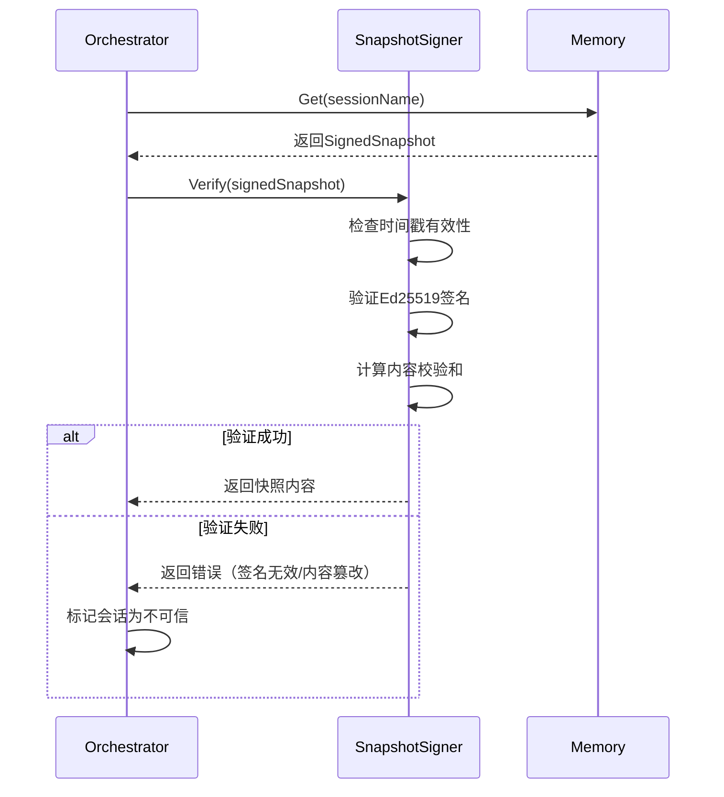

### 6.4 密钥管理策略

| 环境     | 密钥来源            | 轮换周期 |
| -------- | ------------------- | -------- |
| 开发环境 | 本地配置文件        | 不轮换   |
| 测试环境 | 环境变量            | 30天     |
| 生产环境 | 密钥管理服务（KMS） | 7天      |

## 7. 并发控制

### 7.1 并发暂停处理

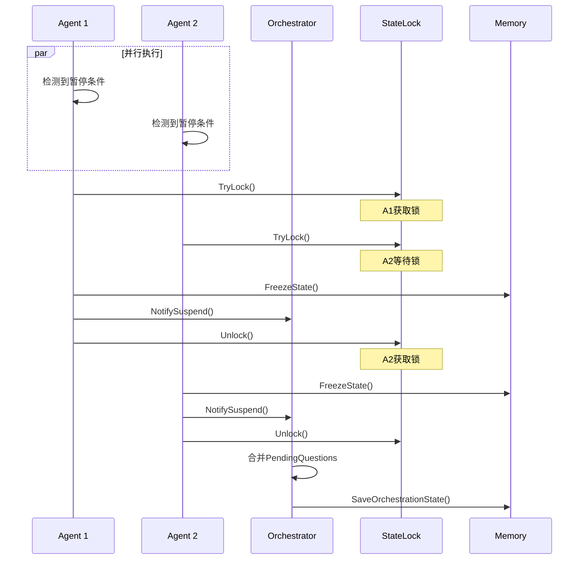

### 7.2 锁机制设计

```go
type StateLockManager struct {
    mu            sync.RWMutex
    sessionLocks  map[string]*SessionLock
    lockTimeout   time.Duration
}

type SessionLock struct {
    SessionName   string
    WriteLock     *sync.Mutex
    ReadCount     int32
    LastAccess    time.Time
    PendingOps    int32
}

func (lm *StateLockManager) AcquireWriteLock(ctx context.Context, sessionName string) (*SessionLock, error) {
    lm.mu.Lock()
    sessionLock, exists := lm.sessionLocks[sessionName]
    if !exists {
        sessionLock = &SessionLock{
            SessionName: sessionName,
            WriteLock:   &sync.Mutex{},
        }
        lm.sessionLocks[sessionName] = sessionLock
    }
    lm.mu.Unlock()
    
    done := make(chan struct{})
    go func() {
        sessionLock.WriteLock.Lock()
        close(done)
    }()
    
    select {
    case <-done:
        atomic.AddInt32(&sessionLock.PendingOps, 1)
        return sessionLock, nil
    case <-time.After(lm.lockTimeout):
        return nil, fmt.Errorf("lock acquisition timeout for session: %s", sessionName)
    case <-ctx.Done():
        return nil, ctx.Err()
    }
}
```

## 8. 相关文档

- [编排模块概述](orchestration-module.md) - 模块架构与核心流程
- [编排核心接口](orchestration-interfaces.md) - Orchestrator 接口定义
- [执行协调设计](orchestration-coordination.md) - 并发执行与同步
