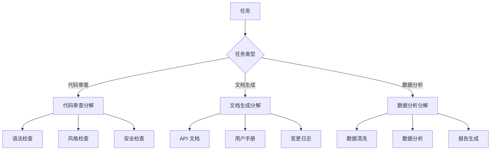
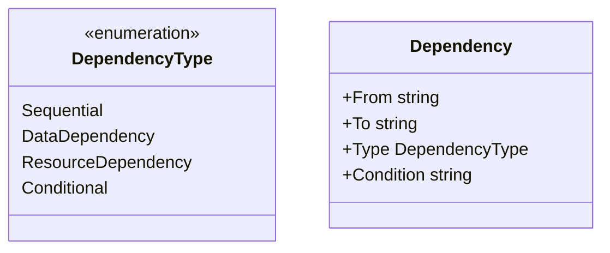
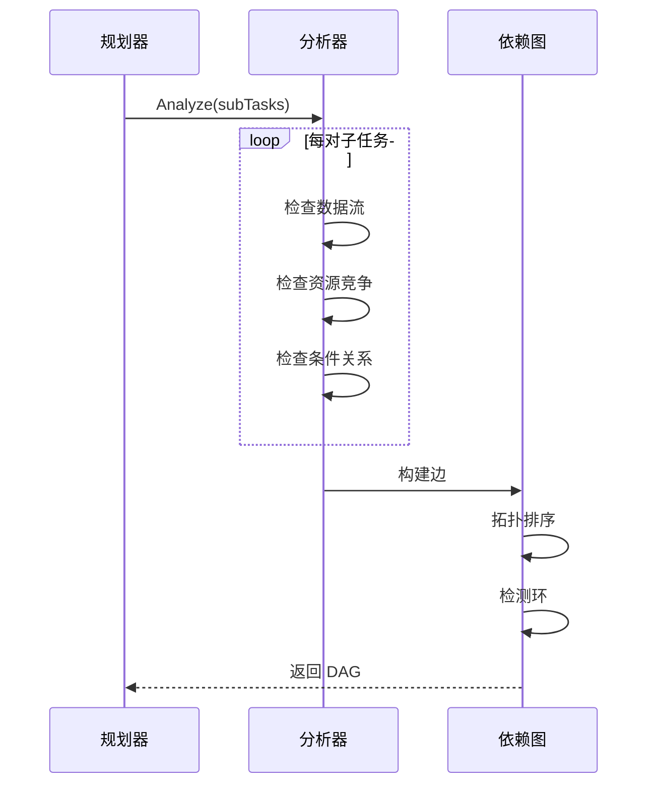

# 任务分解设计

本文档描述编排模块的任务分解策略与依赖分析机制。

## 1. 分解策略

### 1.1 策略类型

| 策略     | 说明               | 适用场景          |
| -------- | ------------------ | ----------------- |
| 规则分解 | 基于预定义规则分解 | 结构化任务        |
| LLM 分解 | 通过 LLM 智能分解  | 复杂/非结构化任务 |
| 混合分解 | 规则 + LLM 结合    | 中等复杂度任务    |

### 1.2 规则分解示例



### 1.3 LLM 分解提示词模板

```
你是一个任务分解专家。请将以下任务分解为多个可并行执行的子任务。

## 任务描述
{{.TaskDescription}}

## 可用 Agent 能力
{{range .Agents}}
- {{.Name}}: {{.Capabilities}}
{{end}}

## 分解要求
1. 每个子任务应该独立可执行
2. 明确子任务之间的依赖关系
3. 为每个子任务指定所需能力

## 输出格式
请以 JSON 格式输出分解结果。
```

## 2. 依赖分析

### 2.1 依赖类型



| 依赖类型           | 说明     | 示例                      |
| ------------------ | -------- | ------------------------- |
| Sequential         | 顺序依赖 | A 必须在 B 之前执行       |
| DataDependency     | 数据依赖 | B 需要 A 的输出作为输入   |
| ResourceDependency | 资源依赖 | A 和 B 共享同一资源       |
| Conditional        | 条件依赖 | B 是否执行取决于 A 的结果 |

### 2.2 依赖图构建流程



### 2.3 拓扑排序算法

```go
func TopologicalSort(graph *Graph) ([][]string, error) {
    // Kahn 算法实现层级拓扑排序
    // 返回按层级分组的执行顺序
    // 每一层内的任务可以并行执行
}
```

## 3. 相关文档

- [编排模块概述](orchestration-module.md) - 模块架构与核心流程
- [编排核心接口](orchestration-interfaces.md) - TaskPlanner 接口定义
- [执行协调设计](orchestration-coordination.md) - 基于依赖图的执行调度
