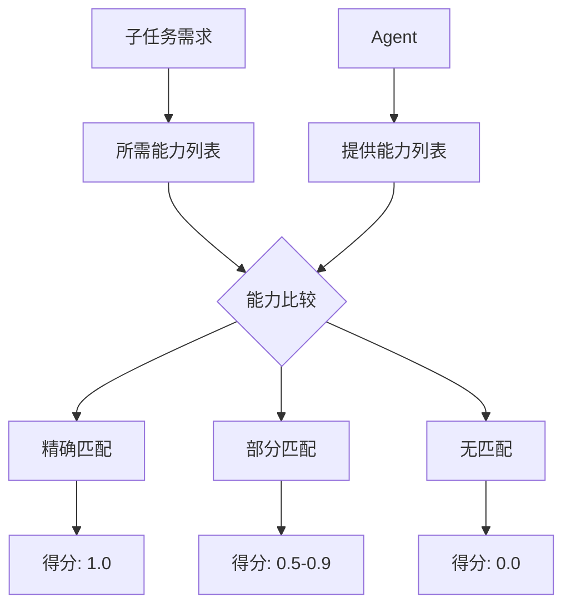
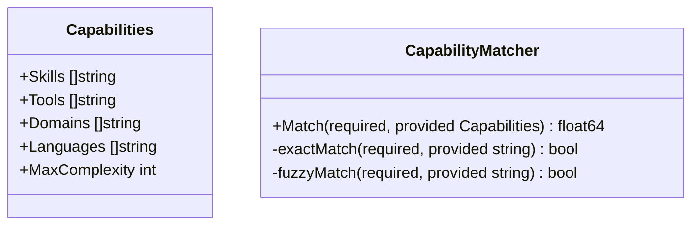
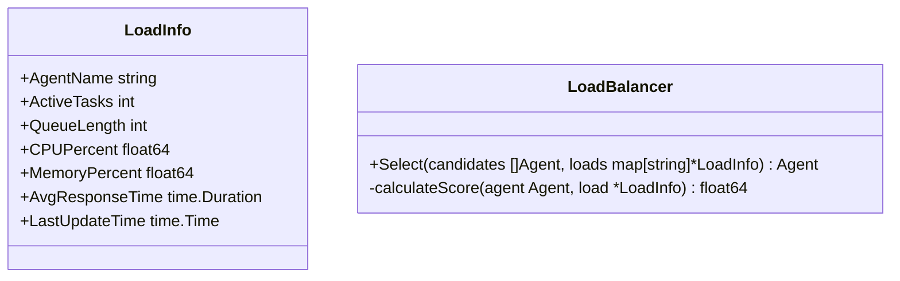

# Agent 选择设计

本文档描述编排模块的 Agent 选择机制，包括能力匹配与负载均衡策略。

## 1. 能力匹配

### 1.1 匹配算法流程



### 1.2 能力描述结构



### 1.3 匹配规则

| 规则     | 说明                     | 得分 |
| -------- | ------------------------ | ---- |
| 精确匹配 | 能力名称完全一致         | 1.0  |
| 包含匹配 | 所需能力是提供能力的子集 | 0.9  |
| 模糊匹配 | 语义相似度 > 0.8         | 0.7  |
| 部分匹配 | 部分能力满足             | 0.5  |
| 不匹配   | 无相关能力               | 0.0  |

## 2. 负载均衡

### 2.1 负载指标



### 2.2 均衡策略

| 策略     | 说明                       | 适用场景     |
| -------- | -------------------------- | ------------ |
| 最少任务 | 选择当前任务数最少的 Agent | 任务量均衡   |
| 最短队列 | 选择队列最短的 Agent       | 响应时间优先 |
| 加权轮询 | 按能力权重轮询分配         | 能力差异大   |
| 随机选择 | 随机选择可用 Agent         | 简单场景     |

### 2.3 综合评分公式

```
Score = w1 * CapabilityScore + w2 * LoadScore + w3 * HistoryScore

其中:
- CapabilityScore: 能力匹配得分
- LoadScore: 负载得分（负载越低得分越高）
- HistoryScore: 历史成功率得分
- w1, w2, w3: 权重系数（默认 0.5, 0.3, 0.2）
```

## 3. 相关文档

- [编排模块概述](orchestration-module.md) - 模块架构与核心流程
- [编排核心接口](orchestration-interfaces.md) - Selector 接口定义
- [任务分解设计](orchestration-planning.md) - 子任务所需能力定义
