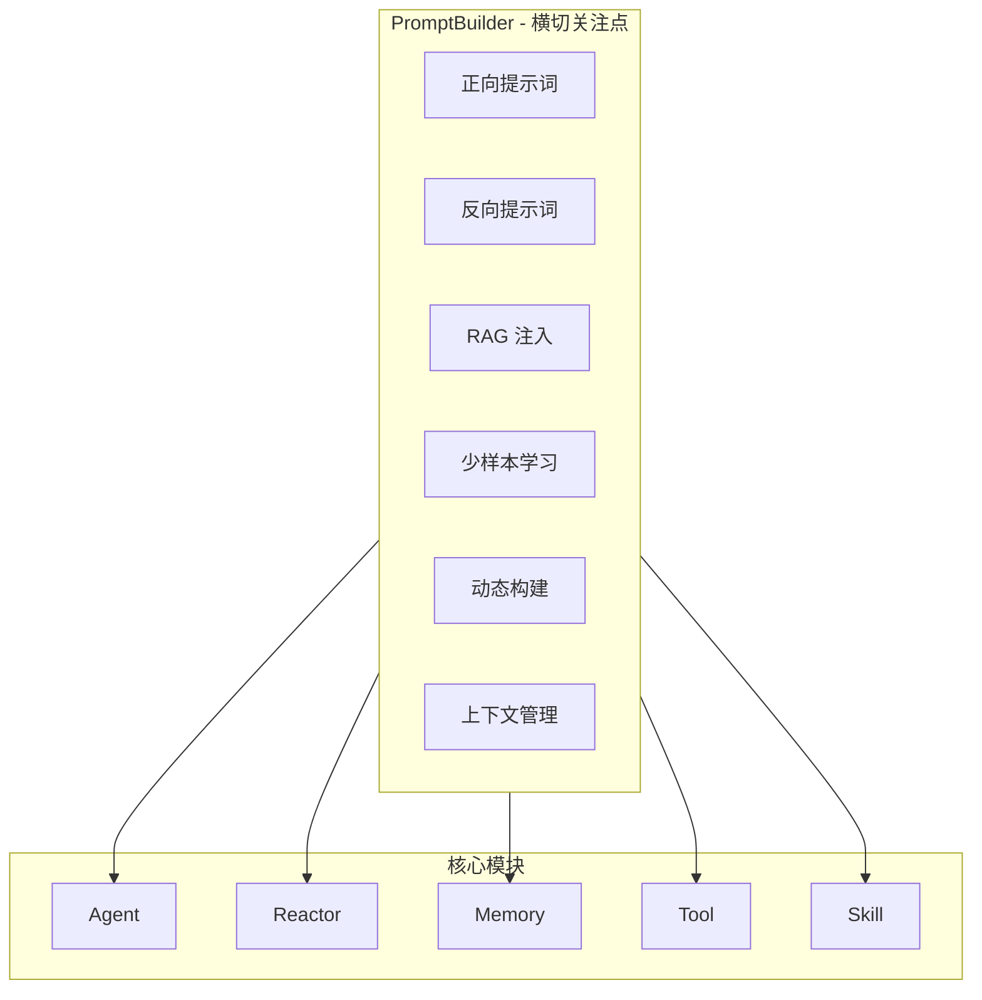
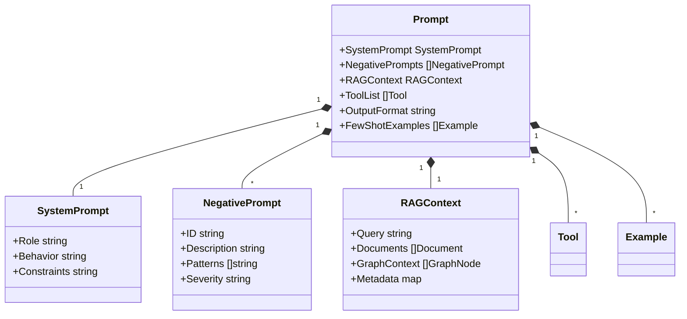
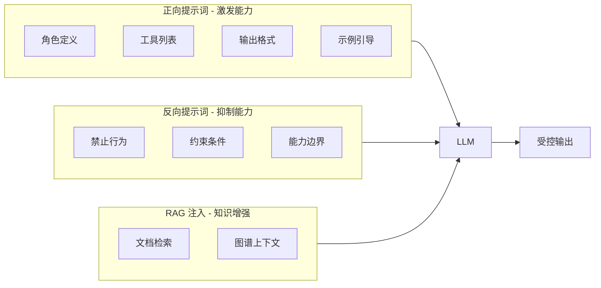
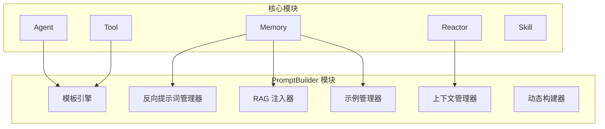

# PromptBuilder 模块设计

PromptBuilder 是 ReAct 框架的核心能力，横跨所有模块。它不仅通过精心设计的提示模板和少样本学习策略激发模型的 ReAct 行为，还通过反向提示词（抑制能力）约束模型的行为边界，并通过 RAG 注入增强模型的知识能力。

> **核心理念**：要让一个通用的大语言模型表现出 ReAct 的行为，通常不需要重新预训练或进行复杂的微调。在大多数情况下，通过精心设计的提示工程即可实现。

## 1. 核心职责

| 职责       | 说明                                  |
| ---------- | ------------------------------------- |
| 正向引导   | 定义 Agent 的角色、工具列表和输出格式 |
| 反向抑制   | 通过反向提示词约束模型行为边界        |
| RAG 注入   | 从 Memory 检索相关知识并注入 Prompt   |
| 少样本学习 | 提供高质量示例激发 ReAct 潜能         |
| 动态构建   | 根据上下文动态生成 Prompt             |
| 上下文管理 | 处理上下文窗口限制                    |

## 2. 设计原则

| 原则     | 说明                           |
| -------- | ------------------------------ |
| 模板约束 | 通过严格的格式约束引导模型输出 |
| 实例引导 | 通过 Few-shot 示例展示推理过程 |
| 反向抑制 | 通过反向提示词阻止不期望的行为 |
| 知识增强 | 通过 RAG 注入扩展模型知识边界  |
| 动态适配 | 根据任务阶段和权限动态调整     |

## 3. 模块架构

### 3.1 PromptBuilder 在 ReAct 中的位置



### 3.2 Prompt 结构



## 4. 核心接口

### 4.1 PromptBuilder 接口

```go
type PromptBuilder interface {
    Build(ctx context.Context, req *BuildRequest) (*Prompt, error)
    BuildPlanPrompt(ctx context.Context, req *PlanPromptRequest) (*Prompt, error)
    BuildThinkPrompt(ctx context.Context, req *ThinkPromptRequest) (*Prompt, error)
    BuildReflectionPrompt(ctx context.Context, req *ReflectionPromptRequest) (*Prompt, error)
}

type BuildRequest struct {
    Agent       *Agent
    Input       string
    Tools       []*Tool
    Skills      []*Skill
    Session     *Session
    RAGContext  *RAGContext
}

type PlanPromptRequest struct {
    Agent       *Agent
    Input       string
    Session     *Session
}

type ThinkPromptRequest struct {
    Agent       *Agent
    Input       string
    Plan        *Plan
    CurrentStep int
    Session     *Session
    Tools       []*Tool
}

type ReflectionPromptRequest struct {
    Agent      *Agent
    Trajectory *Trajectory
    Error      error
    Session    *Session
}
```

### 4.2 接口方法说明

| 方法                    | 用途            | 调用时机           |
| ----------------------- | --------------- | ------------------ |
| `Build`                 | 构建完整 Prompt | Agent 初始化时     |
| `BuildPlanPrompt`       | 构建规划 Prompt | Planner 规划阶段   |
| `BuildThinkPrompt`      | 构建思考 Prompt | Thinker 推理阶段   |
| `BuildReflectionPrompt` | 构建反思 Prompt | Reflector 反思阶段 |

## 5. 核心能力

### 5.1 双向引导机制



### 4.2 能力矩阵

| 能力维度 | 实现方式          | 效果         |
| -------- | ----------------- | ------------ |
| 正向引导 | System Prompt     | 激发模型能力 |
| 反向抑制 | Negative Prompts  | 约束行为边界 |
| 知识增强 | RAG 注入          | 扩展知识范围 |
| 示例引导 | Few-shot Learning | 提升推理质量 |
| 动态适配 | 动态构建          | 适应不同场景 |

## 5. 模块依赖关系



## 6. 模块文档索引

| 文档                                                           | 内容                                     |
| -------------------------------------------------------------- | ---------------------------------------- |
| [prompt-positive-negative.md](prompt-positive-negative.md)     | 正向与反向提示词设计、冲突消解机制       |
| [prompt-rag-injection.md](prompt-rag-injection.md)             | RAG 注入流程、模式、策略与上下文管理     |
| [prompt-templates.md](prompt-templates.md)                     | 核心 Prompt 模板设计、输出格式约束       |
| [prompt-few-shot.md](prompt-few-shot.md)                       | 少样本学习策略、示例设计与检索           |
| [prompt-dynamic-build.md](prompt-dynamic-build.md)             | 动态 Prompt 构建、上下文窗口管理         |
| [prompt-evolution-paradigms.md](prompt-evolution-paradigms.md) | 演进范式提示词支持（规划、反思、重规划） |

## 7. 相关文档

- [Agent 模块设计](agent-module.md) - Agent 定义与 SubAgent 机制
- [Reactor 模块设计](reactor-module.md) - 单 Agent 执行引擎
- [Memory 模块设计](memory-module.md) - 知识存储与检索
- [Tool 模块设计](tool-module.md) - 工具定义与管理
- [Skill 模块设计](skill-module.md) - 技能定义与编译
