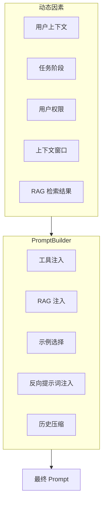
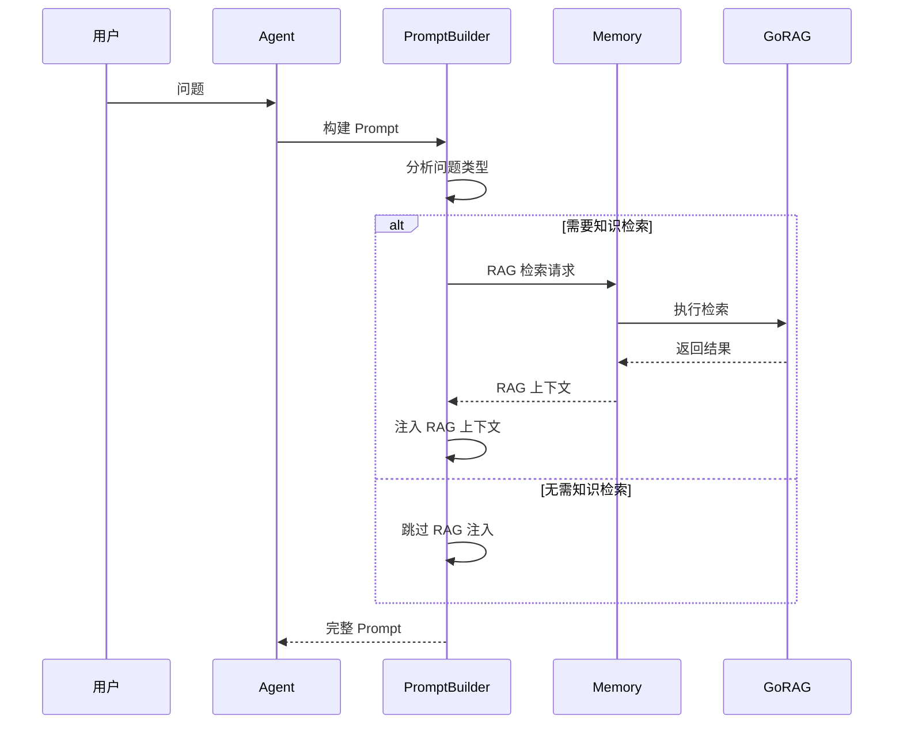
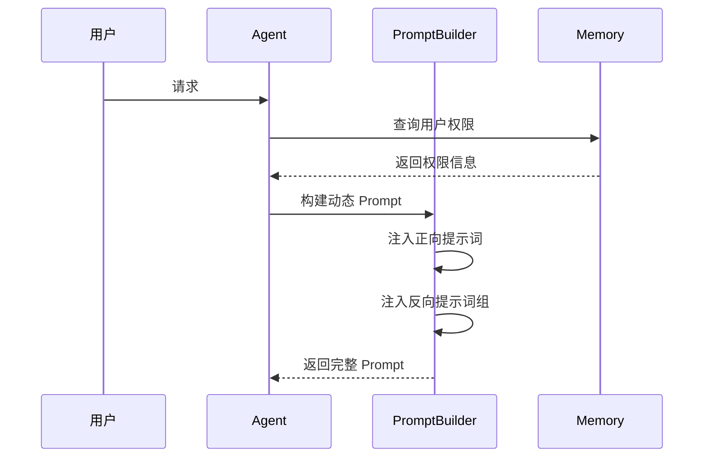
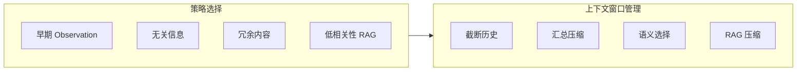
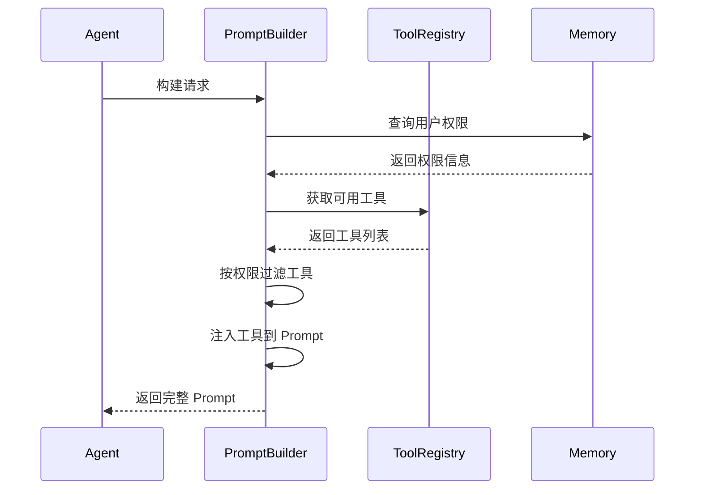
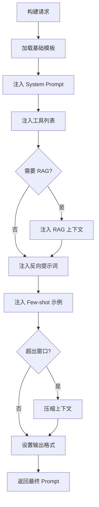

# 动态 Prompt 构建

动态 Prompt 构建是 PromptBuilder 的核心能力，根据运行时上下文动态组装最终的 Prompt。

## 1. 动态构建场景



**动态因素说明**：

| 因素         | 说明                   | 影响             |
| ------------ | ---------------------- | ---------------- |
| 用户上下文   | 用户身份、偏好、历史   | 个性化 Prompt    |
| 任务阶段     | 规划、执行、反思       | 不同阶段不同模板 |
| 用户权限     | 可访问的工具和资源     | 工具列表过滤     |
| 上下文窗口   | 模型的 Token 限制      | 内容压缩策略     |
| RAG 检索结果 | 检索到的相关知识       | 知识注入内容     |

## 2. 动态 RAG 注入

根据问题类型和上下文动态注入 RAG 内容：



### 2.1 问题类型分析

```go
type QuestionAnalyzer struct {
    patterns map[QuestionType][]string
}

type QuestionType int

const (
    QuestionTypeFactual QuestionType = iota
    QuestionTypeProcedural
    QuestionTypeAnalytical
    QuestionTypeCreative
)

func (a *QuestionAnalyzer) Analyze(question string) QuestionType {
    for qType, patterns := range a.patterns {
        for _, pattern := range patterns {
            if strings.Contains(strings.ToLower(question), pattern) {
                return qType
            }
        }
    }
    return QuestionTypeFactual
}

func (b *PromptBuilder) shouldInjectRAG(question string) bool {
    qType := b.analyzer.Analyze(question)
    return qType == QuestionTypeFactual || qType == QuestionTypeAnalytical
}
```

## 3. 动态反向提示词

根据用户权限和任务阶段，动态注入反向提示词：



### 3.1 权限感知注入

```go
func (b *PromptBuilder) injectNegativePrompts(prompt *Prompt, permission *Permission) {
    groups := b.negativeManager.GetEnabledGroups()
    
    for _, group := range groups {
        if b.shouldInjectGroup(group, permission) {
            prompt.NegativePrompts = append(prompt.NegativePrompts, group.Prompts...)
        }
    }
}

func (b *PromptBuilder) shouldInjectGroup(group *NegativePromptGroup, permission *Permission) bool {
    if !group.Enabled {
        return false
    }
    
    if group.ID == "permission" && permission.IsAdmin {
        return false
    }
    
    return true
}
```

## 4. 上下文窗口管理

随着 T-A-O 循环的增加，Prompt 长度可能超过模型的上下文窗口：



**管理策略**：

| 策略       | 说明                        | 适用场景     |
| ---------- | --------------------------- | ------------ |
| 截断历史   | 丢弃早期的 Observation      | 长对话       |
| 汇总压缩   | 通过 Summarization 浓缩历史 | 复杂任务     |
| 语义选择   | 只保留相关的历史片段        | 语义敏感任务 |
| RAG 压缩   | 压缩 RAG 上下文内容         | 知识密集任务 |

### 4.1 Token 计数与截断

```go
type ContextWindowManager struct {
    maxTokens     int
    tokenizer     Tokenizer
    summarizer    Summarizer
    compressionThreshold float64
}

func (m *ContextWindowManager) Manage(prompt *Prompt) error {
    currentTokens := m.tokenizer.Count(prompt.String())
    
    if currentTokens <= m.maxTokens {
        return nil
    }
    
    targetTokens := int(float64(m.maxTokens) * m.compressionThreshold)
    
    for m.tokenizer.Count(prompt.String()) > targetTokens {
        if !m.compressOne(prompt) {
            break
        }
    }
    
    return nil
}

func (m *ContextWindowManager) compressOne(prompt *Prompt) bool {
    if len(prompt.History) > 0 {
        prompt.History = prompt.History[1:]
        return true
    }
    
    if len(prompt.RAGContext.Documents) > 0 {
        prompt.RAGContext.Documents = prompt.RAGContext.Documents[:len(prompt.RAGContext.Documents)-1]
        return true
    }
    
    return false
}
```

### 4.2 历史压缩策略

```go
func (m *ContextWindowManager) summarizeHistory(history []HistoryEntry) string {
    if len(history) <= 3 {
        return m.formatHistory(history)
    }
    
    recentHistory := history[len(history)-3:]
    oldHistory := history[:len(history)-3]
    
    summary := m.summarizer.Summarize(oldHistory)
    
    return fmt.Sprintf("历史摘要: %s\n\n最近操作:\n%s", 
        summary, m.formatHistory(recentHistory))
}
```

## 5. 动态工具注入

根据用户权限和任务需求动态注入工具列表：



### 5.1 工具过滤实现

```go
func (b *PromptBuilder) injectTools(prompt *Prompt, req *BuildRequest) {
    allTools := b.registry.GetAllTools()
    
    allowedTools := make([]Tool, 0)
    for _, tool := range allTools {
        if b.hasPermission(req.Permission, tool.RequiredPermission) {
            allowedTools = append(allowedTools, tool)
        }
    }
    
    if req.Skill != nil {
        allowedTools = b.filterBySkill(allowedTools, req.Skill)
    }
    
    prompt.Tools = allowedTools
}

func (b *PromptBuilder) hasPermission(userPerm *Permission, required string) bool {
    for _, perm := range userPerm.Permissions {
        if perm == required || perm == "admin" {
            return true
        }
    }
    return false
}
```

## 6. 构建流程



### 6.1 构建器实现

```go
func (b *PromptBuilder) Build(ctx context.Context, req *BuildRequest) (*Prompt, error) {
    prompt := b.loadTemplate(req.TemplateID)
    
    b.injectSystemPrompt(prompt, req.Agent)
    b.injectTools(prompt, req)
    
    if b.shouldInjectRAG(req.Query) {
        if err := b.injectRAGContext(ctx, prompt, req.Query); err != nil {
            return nil, err
        }
    }
    
    b.injectNegativePrompts(prompt, req.Permission)
    b.injectFewShotExamples(prompt, req.Query)
    b.setOutputFormat(prompt, req.Format)
    
    if err := b.contextManager.Manage(prompt); err != nil {
        return nil, err
    }
    
    return prompt, nil
}
```

## 7. 相关文档

- [PromptBuilder 模块概述](prompt-builder-module.md)
- [正向与反向提示词](prompt-positive-negative.md)
- [RAG 注入设计](prompt-rag-injection.md)
- [核心 Prompt 模板设计](prompt-templates.md)
