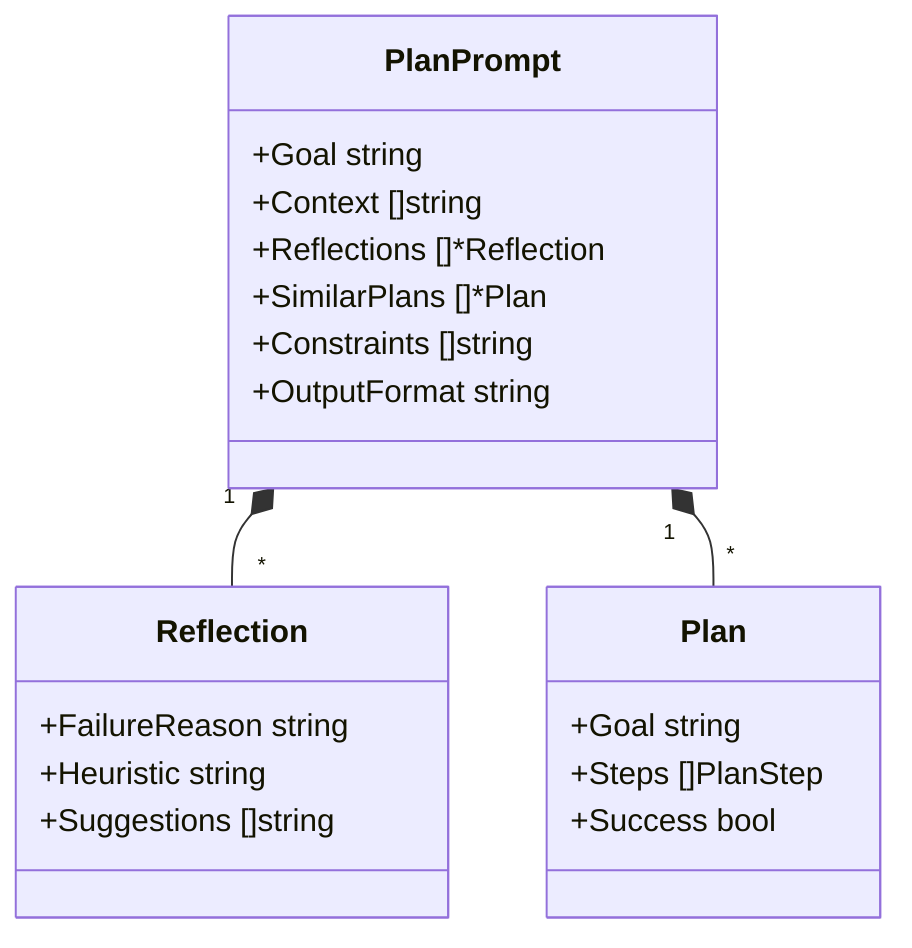
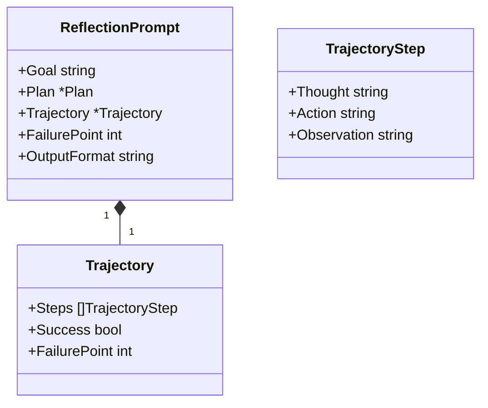
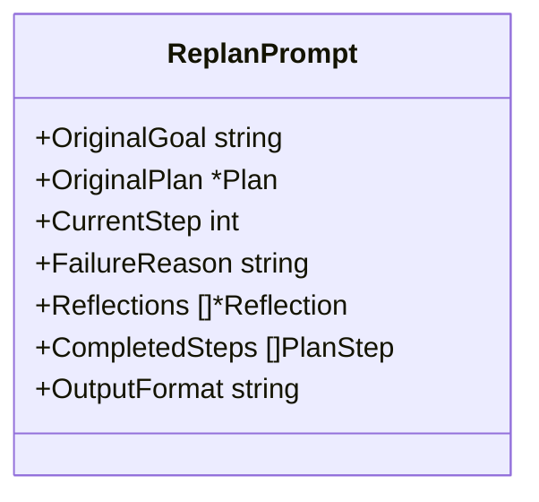
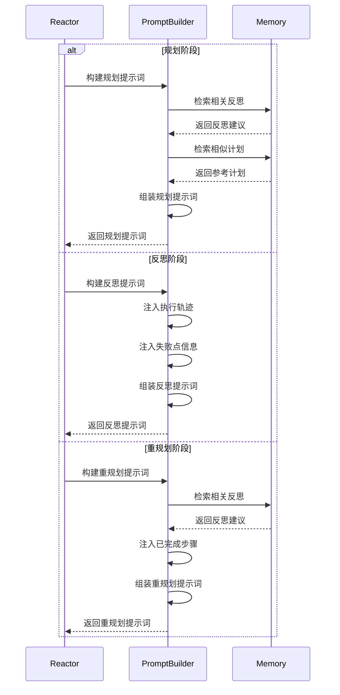
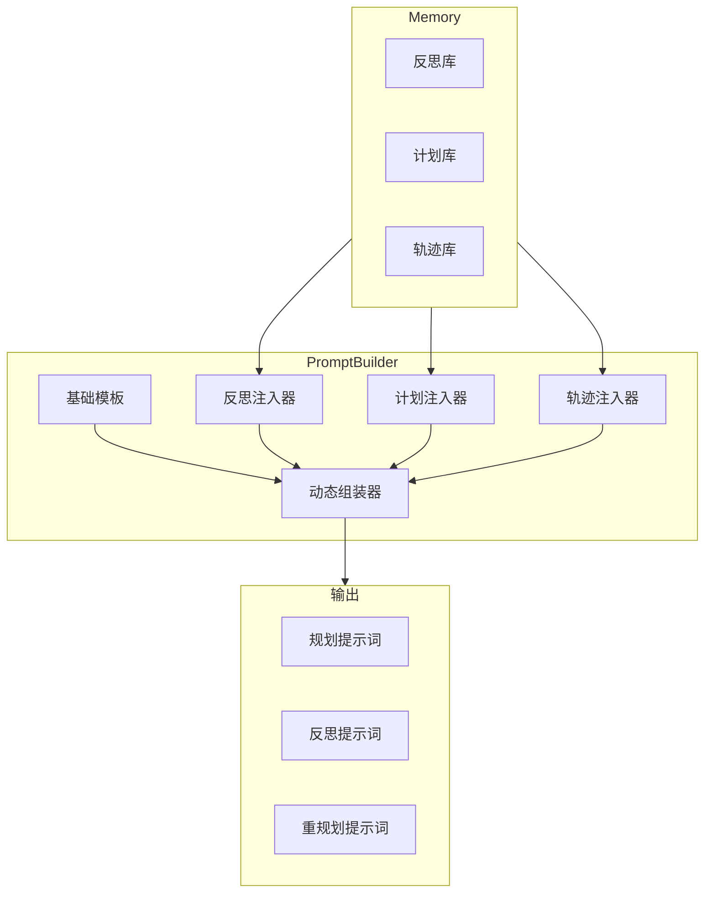
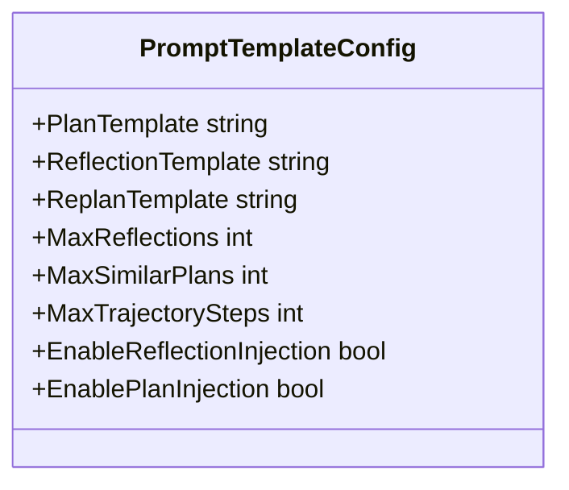

# 演进范式提示词支持

PromptBuilder 支持 Plan-and-Solve 和 Reflexion 两个演进范式，通过专门的提示词模板和动态注入机制实现。

## 1. 概述

演进范式通过专门的提示词模板支持更高级的推理能力：

| 范式           | 提示词类型       | 用途                        |
| -------------- | ---------------- | --------------------------- |
| Plan-and-Solve | PlanPrompt       | 指导 Planner 生成执行计划   |
| Plan-and-Solve | ReplanPrompt     | 指导 Planner 重新规划       |
| Reflexion      | ReflectionPrompt | 指导 Reflector 分析失败原因 |

## 2. 规划提示词（Plan Prompt）

规划提示词用于指导 Planner 组件生成执行计划：



### 2.1 规划提示词模板

```
# 规划任务

## 目标
{goal}

## 可用工具
{tools}

## 相关反思建议
{reflections}

## 相似成功计划参考
{similar_plans}

## 约束条件
- 每个步骤必须对应一个具体的工具调用
- 步骤之间要有明确的依赖关系
- 最多 {max_steps} 个步骤

## 输出格式
Step 1: [描述] -> [工具名]
Step 2: [描述] -> [工具名]
...
```

### 2.2 规划提示词构建

```go
func (b *PromptBuilder) BuildPlanPrompt(req *PlanPromptRequest) (*Prompt, error) {
    prompt := b.loadTemplate("plan")
    
    prompt.SetVariable("goal", req.Goal)
    prompt.SetVariable("tools", b.formatTools(req.Tools))
    
    reflections := b.memory.GetReflections(req.Goal, 5)
    prompt.SetVariable("reflections", b.formatReflections(reflections))
    
    similarPlans := b.memory.GetSimilarPlans(req.Goal, 3)
    prompt.SetVariable("similar_plans", b.formatPlans(similarPlans))
    
    return prompt, nil
}
```

## 3. 反思提示词（Reflection Prompt）

反思提示词用于指导 Reflector 组件分析失败原因：



### 3.1 反思提示词模板

```
# 反思分析

## 原始目标
{goal}

## 执行计划
{plan}

## 执行轨迹
{trajectory}

## 失败点
第 {failure_point} 步失败

## 分析要求
1. 分析失败的根本原因
2. 识别可以改进的环节
3. 提出具体的改进建议
4. 总结可复用的经验

## 输出格式
Failure Analysis: [失败分析]
Root Cause: [根本原因]
Heuristic: [启发式建议]
Suggestions:
- [建议1]
- [建议2]
```

### 3.2 反思提示词构建

```go
func (b *PromptBuilder) BuildReflectionPrompt(req *ReflectionPromptRequest) (*Prompt, error) {
    prompt := b.loadTemplate("reflection")
    
    prompt.SetVariable("goal", req.Goal)
    prompt.SetVariable("plan", b.formatPlan(req.Plan))
    prompt.SetVariable("trajectory", b.formatTrajectory(req.Trajectory))
    prompt.SetVariable("failure_point", fmt.Sprintf("%d", req.FailurePoint))
    
    return prompt, nil
}

func (b *PromptBuilder) formatTrajectory(t *Trajectory) string {
    var sb strings.Builder
    for i, step := range t.Steps {
        sb.WriteString(fmt.Sprintf("Step %d:\n", i+1))
        sb.WriteString(fmt.Sprintf("  Thought: %s\n", step.Thought))
        sb.WriteString(fmt.Sprintf("  Action: %s\n", step.Action))
        sb.WriteString(fmt.Sprintf("  Observation: %s\n", step.Observation))
    }
    return sb.String()
}
```

## 4. 重规划提示词（Replan Prompt）

当需要重新规划时使用：



### 4.1 重规划提示词模板

```
# 重新规划

## 原始目标
{original_goal}

## 原始计划
{original_plan}

## 当前进度
已完成 {current_step}/{total_steps} 步

## 失败原因
{failure_reason}

## 反思建议
{reflections}

## 已完成步骤结果
{completed_steps}

## 重规划要求
1. 保留已成功的步骤
2. 调整失败步骤的执行方式
3. 必要时添加新的步骤
4. 确保新计划能够达成目标

## 输出格式
Step {current_step}: [调整后的步骤] -> [工具名]
Step {current_step+1}: [新步骤] -> [工具名]
...
```

### 4.2 重规划提示词构建

```go
func (b *PromptBuilder) BuildReplanPrompt(req *ReplanPromptRequest) (*Prompt, error) {
    prompt := b.loadTemplate("replan")
    
    prompt.SetVariable("original_goal", req.OriginalGoal)
    prompt.SetVariable("original_plan", b.formatPlan(req.OriginalPlan))
    prompt.SetVariable("current_step", fmt.Sprintf("%d", req.CurrentStep))
    prompt.SetVariable("total_steps", fmt.Sprintf("%d", len(req.OriginalPlan.Steps)))
    prompt.SetVariable("failure_reason", req.FailureReason)
    
    reflections := b.memory.GetReflections(req.OriginalGoal, 3)
    prompt.SetVariable("reflections", b.formatReflections(reflections))
    
    prompt.SetVariable("completed_steps", b.formatCompletedSteps(req.CompletedSteps))
    
    return prompt, nil
}
```

## 5. 提示词注入流程



## 6. 动态提示词组装



## 7. 提示词模板配置



**配置项说明**：

| 配置项                    | 说明                 | 默认值 |
| ------------------------- | -------------------- | ------ |
| PlanTemplate              | 规划提示词模板路径   | 内置   |
| ReflectionTemplate        | 反思提示词模板路径   | 内置   |
| ReplanTemplate            | 重规划提示词模板路径 | 内置   |
| MaxReflections            | 最大注入反思数量     | 5      |
| MaxSimilarPlans           | 最大注入相似计划数量 | 3      |
| MaxTrajectorySteps        | 最大注入轨迹步骤数量 | 10     |
| EnableReflectionInjection | 是否启用反思注入     | true   |
| EnablePlanInjection       | 是否启用计划注入     | true   |

### 7.1 配置实现

```go
type EvolutionPromptConfig struct {
    PlanTemplate              string
    ReflectionTemplate        string
    ReplanTemplate            string
    MaxReflections            int
    MaxSimilarPlans           int
    MaxTrajectorySteps        int
    EnableReflectionInjection bool
    EnablePlanInjection       bool
}

var DefaultEvolutionConfig = EvolutionPromptConfig{
    PlanTemplate:              "templates/plan.tmpl",
    ReflectionTemplate:        "templates/reflection.tmpl",
    ReplanTemplate:            "templates/replan.tmpl",
    MaxReflections:            5,
    MaxSimilarPlans:           3,
    MaxTrajectorySteps:        10,
    EnableReflectionInjection: true,
    EnablePlanInjection:       true,
}
```

## 8. 相关文档

- [PromptBuilder 模块概述](prompt-builder-module.md)
- [动态 Prompt 构建](prompt-dynamic-build.md)
- [Memory 模块设计](memory-module.md)
- [Reactor 模块设计](reactor-module.md)
