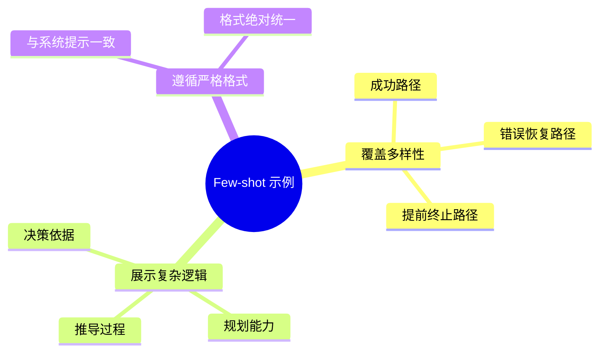
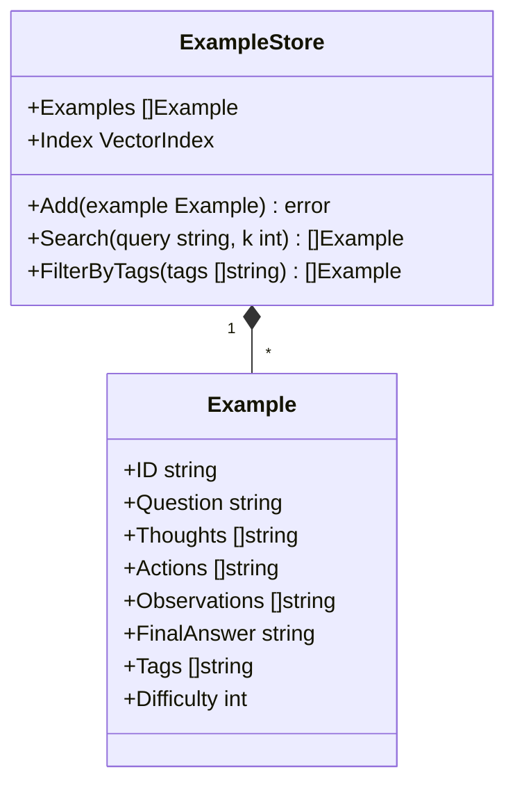
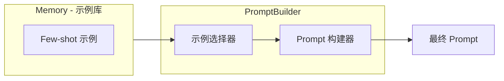
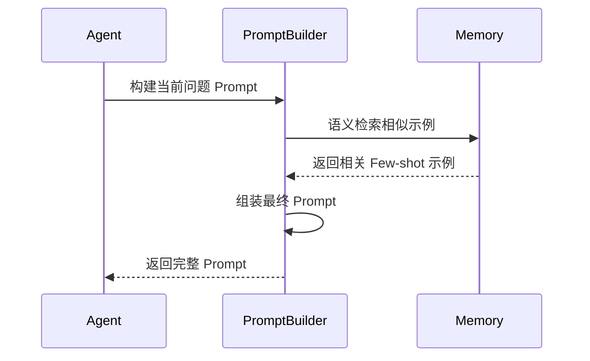

# 少样本学习策略

Few-shot 学习通过提供高质量示例激发模型的 ReAct 潜能，是 PromptBuilder 的核心能力之一。

## 1. Few-shot 的必要性

对于具有挑战性的任务，仅仅提供系统提示（Zero-shot）往往不够：

| 问题           | 说明                       |
| -------------- | -------------------------- |
| 分解困难       | 模型无法有效分解任务       |
| 格式错误       | 容易产生格式错误           |
| 缺乏恢复能力   | 遇到错误无法有效恢复       |
| 推理不稳定     | 推理过程缺乏一致性         |

## 2. 示例设计原则



### 2.1 示例类型

| 类型     | 说明                        | 用途         |
| -------- | --------------------------- | ------------ |
| 成功路径 | 标准的 T-A-O 循环到最终答案 | 展示基本流程 |
| 错误恢复 | 搜索无结果时换词重试        | 展示容错能力 |
| 提前终止 | 信息不足时主动结束          | 展示判断能力 |

### 2.2 示例数据结构



### 2.3 示例定义

```go
type Example struct {
    ID           string
    Question     string
    Thoughts     []string
    Actions      []string
    Observations []string
    FinalAnswer  string
    Tags         []string
    Difficulty   int
}

var SuccessPathExample = Example{
    ID:       "success-001",
    Question: "北京今天天气如何？",
    Thoughts: []string{
        "我需要查询北京今天的天气信息",
        "我可以使用天气查询工具",
    },
    Actions: []string{
        "weather[北京]",
        "Finish[北京今天天气晴朗，气温25°C]",
    },
    Observations: []string{
        "北京今天天气晴朗，气温25°C，空气质量良好",
    },
    FinalAnswer: "北京今天天气晴朗，气温25°C",
    Tags:        []string{"weather", "success"},
    Difficulty:  1,
}

var ErrorRecoveryExample = Example{
    ID:       "recovery-001",
    Question: "苹果公司的股价是多少？",
    Thoughts: []string{
        "我需要查询苹果公司的股价",
        "第一次搜索没有结果，可能关键词不够准确",
        "我应该使用更精确的公司代码",
    },
    Actions: []string{
        "search[苹果股价]",
        "search[AAPL stock price]",
        "Finish[苹果公司(AAPL)当前股价为$178.50]",
    },
    Observations: []string{
        "未找到相关结果",
        "苹果公司(AAPL)当前股价为$178.50",
    },
    FinalAnswer: "苹果公司(AAPL)当前股价为$178.50",
    Tags:        []string{"finance", "recovery"},
    Difficulty:  2,
}
```

## 3. 示例存储与检索



### 3.1 示例选择策略

| 策略       | 说明                     | 适用场景       |
| ---------- | ------------------------ | -------------- |
| 语义相似度 | 选择与当前问题最相似     | 通用场景       |
| 任务类型   | 根据任务类型筛选         | 特定领域       |
| 难度匹配   | 根据问题复杂度选择       | 复杂任务       |
| 多样性     | 确保示例覆盖不同场景     | 避免过拟合     |

### 3.2 选择器实现

```go
type ExampleSelector struct {
    store      *ExampleStore
    maxExamples int
    strategies []SelectionStrategy
}

func (s *ExampleSelector) Select(query string, opts SelectOptions) []Example {
    candidates := s.store.Search(query, s.maxExamples*2)
    
    if len(opts.Tags) > 0 {
        candidates = s.filterByTags(candidates, opts.Tags)
    }
    
    if opts.Difficulty > 0 {
        candidates = s.filterByDifficulty(candidates, opts.Difficulty)
    }
    
    candidates = s.ensureDiversity(candidates)
    
    if len(candidates) > s.maxExamples {
        candidates = candidates[:s.maxExamples]
    }
    
    return candidates
}

func (s *ExampleSelector) ensureDiversity(examples []Example) []Example {
    result := []Example{}
    seen := make(map[string]bool)
    
    for _, ex := range examples {
        key := strings.Join(ex.Tags, ",")
        if !seen[key] {
            result = append(result, ex)
            seen[key] = true
        }
    }
    
    return result
}
```

## 4. 示例格式化

### 4.1 格式化模板

```go
func (b *PromptBuilder) formatExamples(examples []Example) string {
    var sb strings.Builder
    
    sb.WriteString("# Few-shot Examples\n\n")
    
    for i, ex := range examples {
        sb.WriteString(fmt.Sprintf("## Example %d\n", i+1))
        sb.WriteString(fmt.Sprintf("Question: %s\n", ex.Question))
        
        for j := 0; j < len(ex.Thoughts); j++ {
            sb.WriteString(fmt.Sprintf("Thought: %s\n", ex.Thoughts[j]))
            sb.WriteString(fmt.Sprintf("Action: %s\n", ex.Actions[j]))
            if j < len(ex.Observations) {
                sb.WriteString(fmt.Sprintf("Observation: %s\n", ex.Observations[j]))
            }
        }
        
        sb.WriteString(fmt.Sprintf("Final Answer: %s\n\n", ex.FinalAnswer))
    }
    
    return sb.String()
}
```

### 4.2 格式化输出示例

```
# Few-shot Examples

## Example 1
Question: 北京今天天气如何？
Thought: 我需要查询北京今天的天气信息
Action: weather[北京]
Observation: 北京今天天气晴朗，气温25°C，空气质量良好
Thought: 我已经获取了天气信息，可以回答用户的问题
Action: Finish[北京今天天气晴朗，气温25°C]
Final Answer: 北京今天天气晴朗，气温25°C

## Example 2
Question: 苹果公司的股价是多少？
Thought: 我需要查询苹果公司的股价
Action: search[苹果股价]
Observation: 未找到相关结果
Thought: 第一次搜索没有结果，我应该使用更精确的公司代码
Action: search[AAPL stock price]
Observation: 苹果公司(AAPL)当前股价为$178.50
Thought: 我已经获取了股价信息
Action: Finish[苹果公司(AAPL)当前股价为$178.50]
Final Answer: 苹果公司(AAPL)当前股价为$178.50
```

## 5. 与 Memory 的协作

### 5.1 示例从 Memory 检索



### 5.2 示例库管理

```go
type ExampleManager struct {
    memory MemoryAccessor
}

func (m *ExampleManager) AddExample(ctx context.Context, example *Example) error {
    node := &MemoryNode{
        Type:       NodeTypeExample,
        Content:    example.Question,
        Properties: exampleToMap(example),
    }
    return m.memory.Store(ctx, node)
}

func (m *ExampleManager) SearchExamples(ctx context.Context, query string, k int) ([]*Example, error) {
    results, err := m.memory.Search(ctx, &SearchRequest{
        Query: query,
        Types: []NodeType{NodeTypeExample},
        Limit: k,
    })
    if err != nil {
        return nil, err
    }
    
    examples := make([]*Example, len(results))
    for i, node := range results {
        examples[i] = mapToExample(node.Properties)
    }
    return examples, nil
}
```

## 6. 相关文档

- [PromptBuilder 模块概述](prompt-builder-module.md)
- [核心 Prompt 模板设计](prompt-templates.md)
- [Memory 模块设计](memory-module.md)
