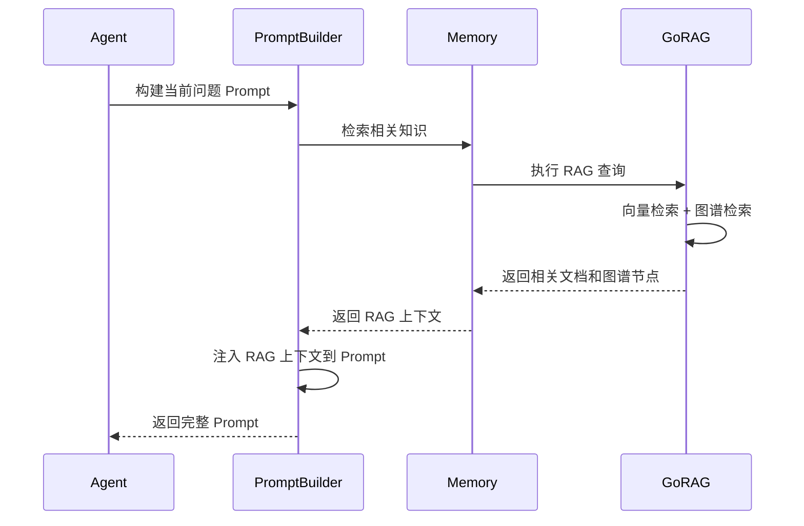
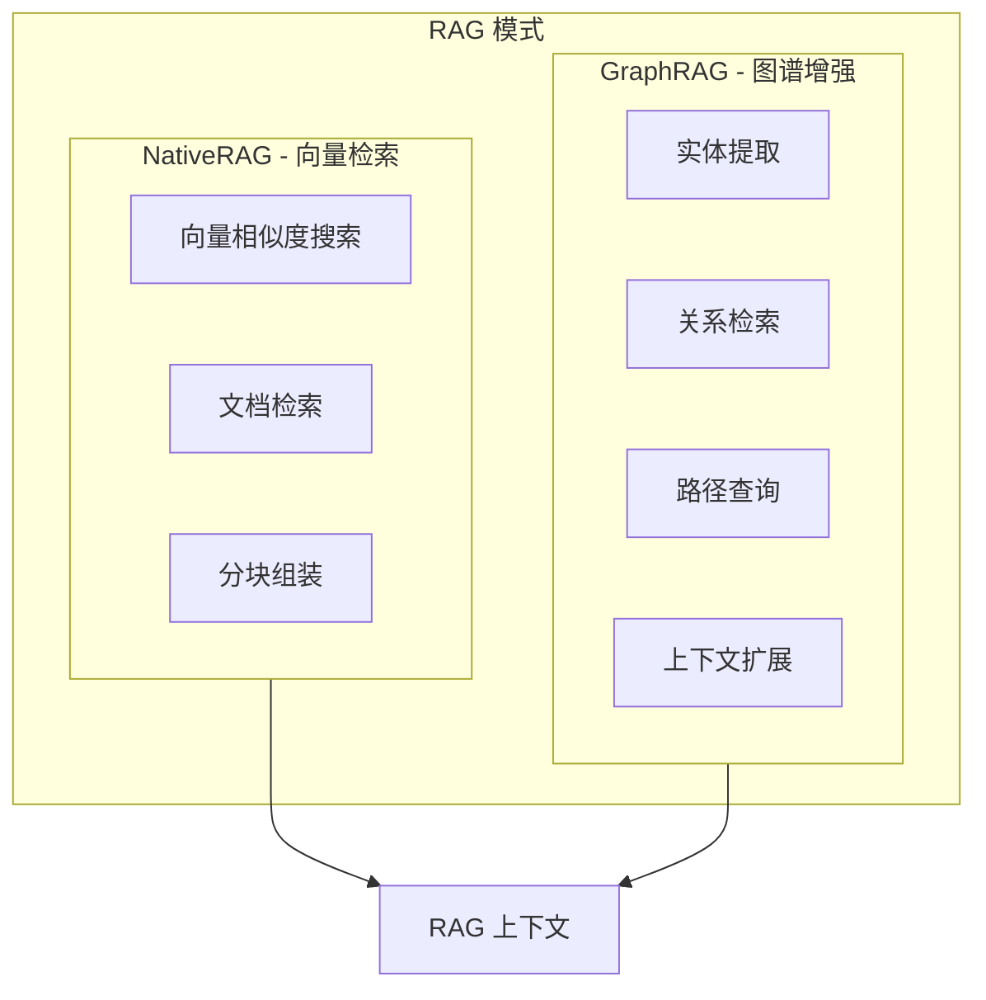
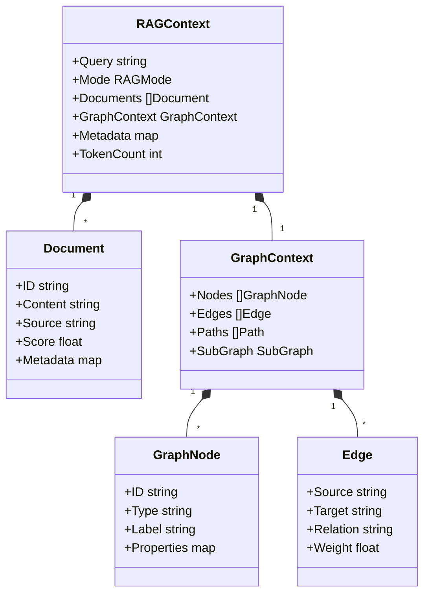
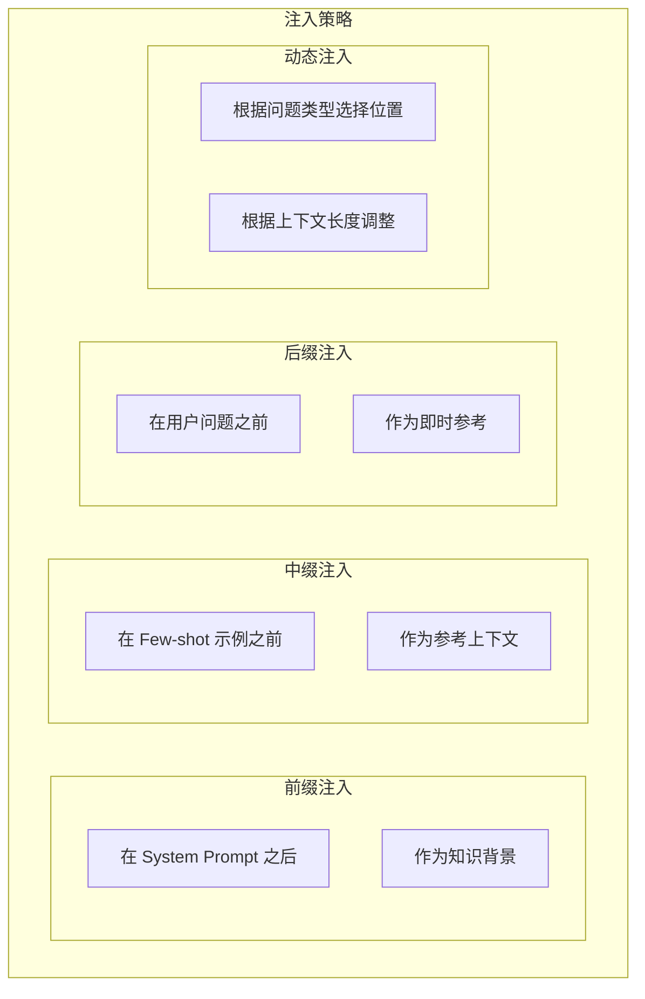
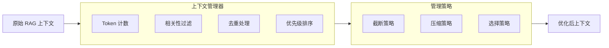
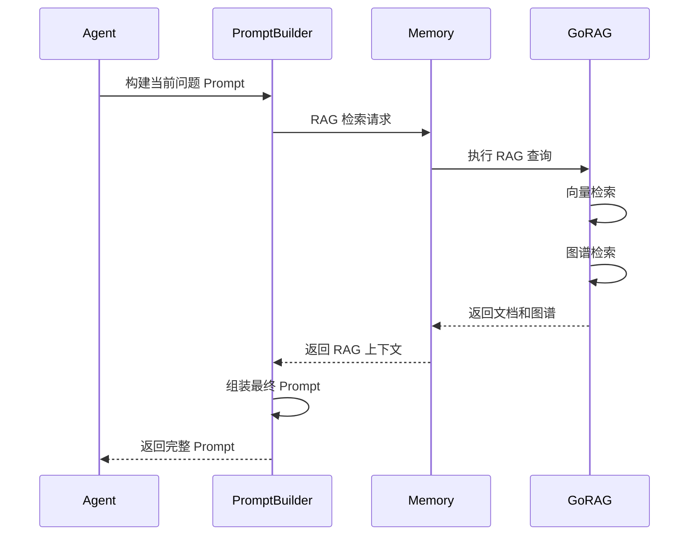

# RAG 注入设计

RAG（Retrieval-Augmented Generation）注入是 PromptBuilder 的核心能力之一，通过从 Memory 检索相关知识并注入 Prompt，扩展模型的知识边界。

## 1. RAG 注入流程



## 2. RAG 模式



**RAG 模式对比**：

| 模式      | 说明                     | 适用场景       |
| --------- | ------------------------ | -------------- |
| NativeRAG | 基于向量相似度的文档检索 | 通用知识检索   |
| GraphRAG  | 基于知识图谱的关系检索   | 复杂关系推理   |
| Hybrid    | 结合向量和图谱的混合检索 | 高精度知识需求 |

## 3. RAG 上下文结构



### 3.1 核心数据结构

```go
type RAGContext struct {
    Query        string
    Mode         RAGMode
    Documents    []Document
    GraphContext *GraphContext
    Metadata     map[string]interface{}
    TokenCount   int
}

type RAGMode int

const (
    RAGModeNative RAGMode = iota
    RAGModeGraph
    RAGModeHybrid
)

type Document struct {
    ID       string
    Content  string
    Source   string
    Score    float64
    Metadata map[string]interface{}
}

type GraphContext struct {
    Nodes    []GraphNode
    Edges    []Edge
    Paths    []Path
    SubGraph *SubGraph
}
```

## 4. RAG 注入策略



**注入策略说明**：

| 策略     | 位置             | 说明           | 适用场景         |
| -------- | ---------------- | -------------- | ---------------- |
| 前缀注入 | System Prompt 后 | 作为背景知识   | 需要全局知识背景 |
| 中缀注入 | Few-shot 前      | 作为参考上下文 | 需要参考示例推理 |
| 后缀注入 | 用户问题前       | 作为即时参考   | 需要针对性知识   |
| 动态注入 | 根据情况         | 智能选择位置   | 复杂场景         |

### 4.1 注入策略实现

```go
type InjectionStrategy int

const (
    InjectionPrefix InjectionStrategy = iota
    InjectionInfix
    InjectionSuffix
    InjectionDynamic
)

func (b *PromptBuilder) injectRAGContext(
    prompt *Prompt,
    context *RAGContext,
    strategy InjectionStrategy,
) {
    ragSection := b.formatRAGContext(context)
    
    switch strategy {
    case InjectionPrefix:
        prompt.Sections = append(
            []Section{{Type: "rag", Content: ragSection}},
            prompt.Sections...,
        )
    case InjectionInfix:
        b.insertBeforeExamples(prompt, ragSection)
    case InjectionSuffix:
        b.insertBeforeQuestion(prompt, ragSection)
    case InjectionDynamic:
        b.smartInject(prompt, context)
    }
}
```

## 5. RAG 上下文管理



**上下文管理策略**：

| 策略       | 说明              | 适用场景     |
| ---------- | ----------------- | ------------ |
| Token 截断 | 按 Token 限制截断 | 上下文超限   |
| 相关性过滤 | 按相关性分数过滤  | 低质量结果   |
| 内容去重   | 去除重复内容      | 检索结果冗余 |
| 优先级排序 | 按重要性排序      | 多源知识整合 |

### 5.1 Token 管理

```go
type ContextManager struct {
    maxTokens    int
    minRelevance float64
}

func (m *ContextManager) Optimize(context *RAGContext) *RAGContext {
    context = m.filterByRelevance(context)
    context = m.deduplicate(context)
    context = m.prioritize(context)
    context = m.truncateByTokens(context)
    return context
}

func (m *ContextManager) truncateByTokens(context *RAGContext) *RAGContext {
    for m.countTokens(context) > m.maxTokens {
        if len(context.Documents) > 0 {
            context.Documents = context.Documents[:len(context.Documents)-1]
        } else {
            break
        }
    }
    return context
}
```

### 5.2 相关性过滤

```go
func (m *ContextManager) filterByRelevance(context *RAGContext) *RAGContext {
    filtered := make([]Document, 0)
    for _, doc := range context.Documents {
        if doc.Score >= m.minRelevance {
            filtered = append(filtered, doc)
        }
    }
    context.Documents = filtered
    return context
}
```

## 6. 与 Memory 的协作

### 6.1 RAG 上下文检索



### 6.2 历史会话作为上下文

Memory 存储的历史会话可以作为动态上下文注入：

```mermaid
graph LR
    subgraph Memory[Memory]
        Sessions[历史会话]
        Examples[Few-shot 示例]
        Knowledge[知识库]
        GraphDB[图谱数据库]
    end
    
    subgraph PromptBuilder[PromptBuilder]
        ContextRetriever[上下文检索器]
        RAGRetriever[RAG 检索器]
        PromptBuilder[Prompt 构建器]
    end
    
    Memory --> ContextRetriever
    Memory --> RAGRetriever
    ContextRetriever --> PromptBuilder
    RAGRetriever --> PromptBuilder
    PromptBuilder --> FinalPrompt[最终 Prompt]
```

## 7. 相关文档

- [PromptBuilder 模块概述](prompt-builder-module.md)
- [正向与反向提示词](prompt-positive-negative.md)
- [核心 Prompt 模板设计](prompt-templates.md)
- [Memory 模块设计](memory-module.md)
