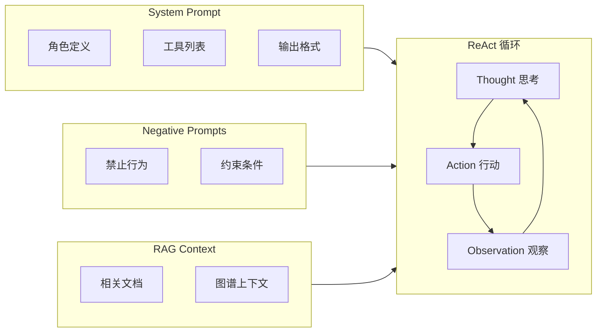
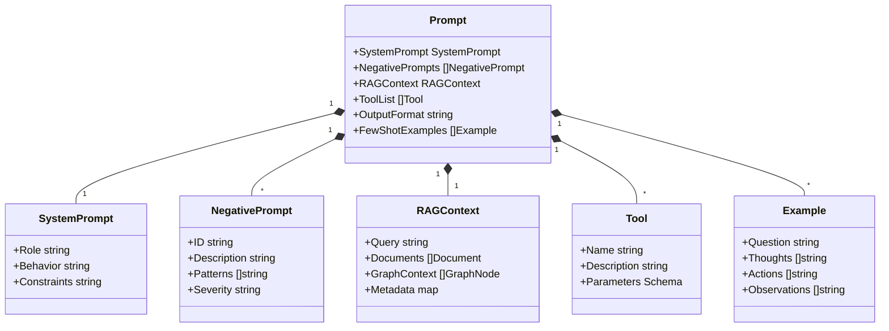
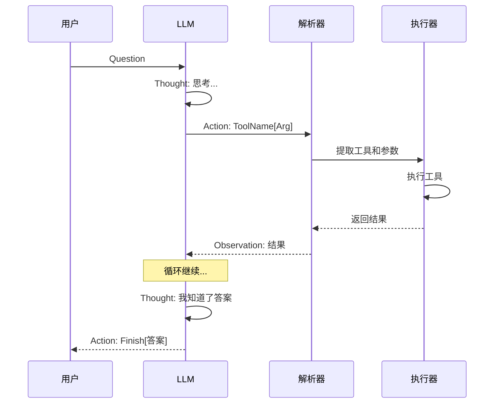
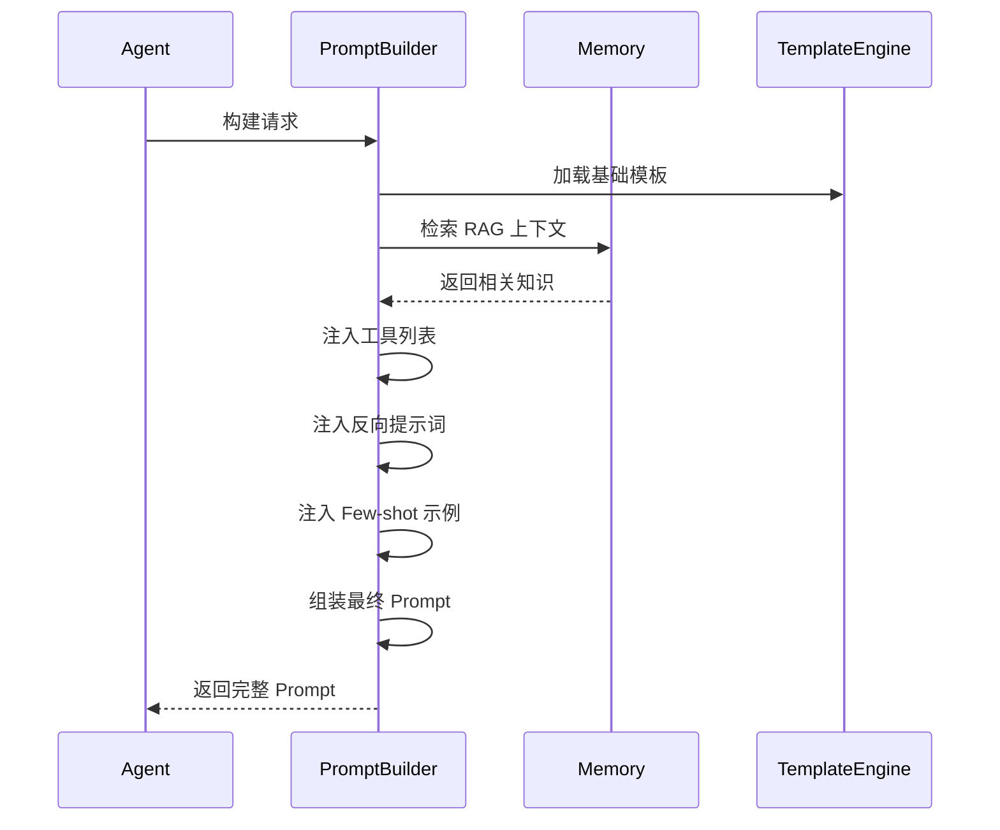
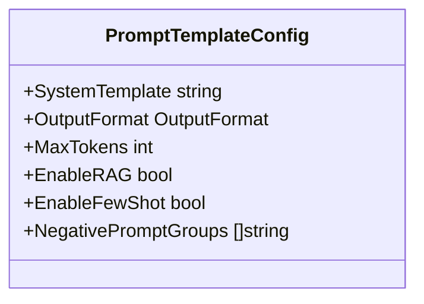

# 核心 Prompt 模板设计

Prompt 模板定义了 Agent 与 LLM 交互的标准格式，是 PromptBuilder 的核心输出产物。

## 1. 基础模板结构

一个标准的 ReAct Agent 架构包含正向、反向提示词和 RAG 上下文：



**模板要素**：

| 要素         | 说明                       |
| ------------ | -------------------------- |
| 角色定义     | 定义智能体的身份和能力边界 |
| 工具列表     | 可用工具及其使用方法       |
| 输出格式     | 严格的 T-A-O 格式          |
| 反向提示词   | 禁止行为和约束条件         |
| RAG 上下文   | 检索到的相关知识和图谱信息 |
| 终止条件     | Finish 动作的触发方式      |

## 2. Prompt 数据结构



## 3. 完整 Prompt 结构示例

```
# System Prompt
你是一个智能助手，能够通过思考和行动来回答问题。

## 可用工具
- search[query]: 搜索相关信息
- calculate[expression]: 执行计算

## 输出格式
Thought: 你的思考过程
Action: 工具名[参数]

# RAG Context
## 相关文档
[1] 文档内容... (来源: xxx, 相关度: 0.95)
[2] 文档内容... (来源: xxx, 相关度: 0.87)

## 相关实体关系
- 实体A --关系--> 实体B
- 实体C --关系--> 实体D

# Negative Prompts
- 不要编造不存在的工具
- 不要在 Action 之外输出额外解释
- 不要泄露敏感信息

# Few-shot Examples
Question: 示例问题
Thought: 示例思考...
Action: 示例行动...

# User Question
用户的问题
```

## 4. 输出格式约束



### 4.1 格式定义

```go
type OutputFormat struct {
    ThoughtPrefix  string
    ActionPrefix   string
    ObservationPrefix string
    FinishAction   string
}

var ReActOutputFormat = OutputFormat{
    ThoughtPrefix:  "Thought:",
    ActionPrefix:   "Action:",
    ObservationPrefix: "Observation:",
    FinishAction:   "Finish",
}
```

### 4.2 格式验证

```go
func (p *Parser) ParseAction(output string) (*Action, error) {
    lines := strings.Split(output, "\n")
    for _, line := range lines {
        if strings.HasPrefix(line, "Action:") {
            return p.parseActionLine(line)
        }
    }
    return nil, ErrNoActionFound
}

func (p *Parser) parseActionLine(line string) (*Action, error) {
    actionStr := strings.TrimPrefix(line, "Action:")
    actionStr = strings.TrimSpace(actionStr)
    
    idx := strings.Index(actionStr, "[")
    if idx == -1 {
        return nil, ErrInvalidActionFormat
    }
    
    name := actionStr[:idx]
    argStr := actionStr[idx+1 : len(actionStr)-1]
    
    return &Action{
        Name: name,
        Args: argStr,
    }, nil
}
```

## 5. 模板构建流程



### 5.1 构建器实现

```go
type PromptBuilder struct {
    templateEngine  *TemplateEngine
    ragInjector     *RAGInjector
    negativeManager *NegativePromptManager
    exampleSelector *ExampleSelector
}

func (b *PromptBuilder) Build(ctx context.Context, req *BuildRequest) (*Prompt, error) {
    prompt := &Prompt{}
    
    b.buildSystemPrompt(prompt, req)
    b.injectTools(prompt, req.Tools)
    b.injectRAGContext(ctx, prompt, req.Query)
    b.injectNegativePrompts(prompt, req.Permission)
    b.injectFewShotExamples(prompt, req.Query)
    b.setOutputFormat(prompt)
    
    return prompt, nil
}
```

## 6. 模板配置



**配置项说明**：

| 配置项               | 说明               | 默认值 |
| -------------------- | ------------------ | ------ |
| SystemTemplate       | 系统提示词模板路径 | 内置   |
| OutputFormat         | 输出格式配置       | ReAct  |
| MaxTokens            | 最大 Token 数      | 4096   |
| EnableRAG            | 是否启用 RAG       | true   |
| EnableFewShot        | 是否启用 Few-shot  | true   |
| NegativePromptGroups | 启用的反向提示词组 | 全部   |

## 7. 相关文档

- [PromptBuilder 模块概述](prompt-builder-module.md)
- [正向与反向提示词](prompt-positive-negative.md)
- [RAG 注入设计](prompt-rag-injection.md)
- [少样本学习策略](prompt-few-shot.md)
