# Reactor 模块设计

## 1. 模块概述

Reactor（ReAct 引擎）是 GoReAct 框架的核心组件，负责实现推理-行动-观察（Reasoning-Acting-Observation）循环。该引擎模仿人类的思考过程，通过交替进行思考、执行行动和观察结果，实现智能体的自主决策和自我修正能力。

在基础 ReAct 之上，Reactor 还融入了两个重要的演进范式：

- **Plan-and-Solve**: 在执行前进行全局规划，分离规划器与执行器
- **Reflexion**: 在失败后进行自我反思，将反思结果转化为记忆指导重试

### 1.1 核心职责

- **规划（Planning）**: 在执行前生成全局计划，分离规划与执行
- **推理（Reasoning）**: 分析当前状态，思考下一步行动
- **行动（Acting）**: 执行具体的工具调用或技能执行
- **观察（Observation）**: 观察行动结果，更新认知状态
- **反思（Reflection）**: 任务失败后进行自我反思，生成改进建议
- **循环控制**: 控制推理-行动-观察循环的终止条件
- **状态管理**: 管理整个执行过程中的状态和上下文

### 1.2 设计原则

- **自主决策**: 智能体能够自主决定下一步行动
- **自我修正**: 通过观察结果进行自我修正
- **全局规划**: 在行动前进行宏观规划，避免盲目执行
- **反思学习**: 从失败中学习，避免重复错误
- **透明可解释**: 推理过程透明，可解释性强
- **灵活可扩展**: 支持自定义推理策略和行动类型

## 2. 模块架构

### 2.1 类图设计


```mermaid
classDiagram
    class Engine {
        <<interface>>
        +Execute(ctx context.Context, input string, opts ...Option) (*Result, error)
        +ExecuteStream(ctx context.Context, input string, opts ...Option) (<-chan any, error)
        +State() *State
        +Pause() error
        +Resume(ctx context.Context, state *State, answer string) (*Result, error)
        +ResumeStream(ctx context.Context, state *State, answer string) (<-chan any, error)
        +Stop() error
    }
    
    class engine {
        -planner Planner
        -thinker Thinker
        -actor Actor
        -observer Observer
        -reflector Reflector
        -terminator Terminator
        -memory Memory
        -promptBuilder PromptBuilder
        -state *State
        -config Config
        +Execute(ctx context.Context, input string, opts ...Option) (*Result, error)
        +State() *State
        +Pause() error
        +Resume() error
        +Stop() error
        -runLoop(ctx context.Context, input string) (*Result, error)
        -shouldTerminate(state *State) bool
        -shouldReplan(state *State) bool
        -shouldReflect(state *State) bool
        -updateState(event Event)
    }
    
    class Planner {
        <<interface>>
        +Plan(ctx context.Context, input string, state *State) (*Plan, error)
        +Replan(ctx context.Context, state *State) (*Plan, error)
        +Validate(plan *Plan) error
    }
    
    class planner {
        -llmClient LLMClient
        -promptBuilder PromptBuilder
        -memory Memory
        -config PlannerConfig
        +Plan(ctx context.Context, input string, state *State) (*Plan, error)
        +Replan(ctx context.Context, state *State) (*Plan, error)
        +Validate(plan *Plan) error
        -buildPlanPrompt(input string, state *State) string
        -parsePlanResponse(response string) (*Plan, error)
    }
    
    class Thinker {
        <<interface>>
        +Think(ctx context.Context, state *State) (*Thought, error)
        +BuildPrompt(state *State) string
        +ParseResponse(response string) (*Thought, error)
    }
    
    class Actor {
        <<interface>>
        +Act(ctx context.Context, action *Action, state *State) (*ActionResult, error)
        +Validate(action *Action) error
    }
    
    class Observer {
        <<interface>>
        +Observe(ctx context.Context, result *ActionResult, state *State) (*Observation, error)
        +Process(result any) (string, error)
        +UpdateMemory(observation *Observation, state *State) error
    }
    
    class Reflector {
        <<interface>>
        +Reflect(ctx context.Context, trajectory *Trajectory, state *State) (*Reflection, error)
        +GenerateHeuristic(reflection *Reflection) string
        +StoreReflection(reflection *Reflection, state *State) error
    }
    
    class reflector {
        -llmClient LLMClient
        -promptBuilder PromptBuilder
        -memory Memory
        -config ReflectorConfig
        +Reflect(ctx context.Context, trajectory *Trajectory, state *State) (*Reflection, error)
        +GenerateHeuristic(reflection *Reflection) string
        +StoreReflection(reflection *Reflection, state *State) error
        -buildReflectionPrompt(trajectory *Trajectory) string
        -parseReflectionResponse(response string) (*Reflection, error)
    }
    
    class Terminator {
        <<interface>>
        +ShouldTerminate(state *State) (bool, TerminationReason)
        +Evaluate(state *State) *EvaluationResult
    }
    
    class terminator {
        -evaluators []Evaluator
        -config TerminatorConfig
        +ShouldTerminate(state *State) (bool, TerminationReason)
        +Evaluate(state *State) *EvaluationResult
        -checkMaxSteps(state *State) bool
        -checkGoalAchieved(state *State) bool
        -checkStuck(state *State) bool
    }
    
    class State {
        +SessionName string
        +CurrentStep int
        +MaxSteps int
        +Input string
        +Plan *Plan
        +CurrentPlanStep int
        +Thoughts []*Thought
        +Actions []*Action
        +Observations []*Observation
        +Reflections []*Reflection
        +Trajectory *Trajectory
        +RetryCount int
        +MaxRetries int
        +Context map[string]any
        +Status Status
        +StartTime time.Time
        +CurrentThought *Thought
        +CurrentAction *Action
        +CurrentObservation *Observation
    }
    
    class Plan {
        +Name string
        +Goal string
        +Steps []*PlanStep
        +CurrentStepIndex int
        +Status PlanStatus
        +CreatedAt time.Time
    }
    
    class PlanStep {
        +Index int
        +Description string
        +ExpectedAction string
        +Status StepStatus
        +Result string
    }
    
    class Thought {
        +Content string
        +Timestamp time.Time
        +Reasoning string
        +Decision string
        +Confidence float64
    }
    
    class Action {
        +Type ActionType
        +Target string
        +Params map[string]any
        +Timestamp time.Time
        +Reasoning string
    }
    
    class Observation {
        +Content string
        +Source string
        +Timestamp time.Time
        +Insights []string
        +Relevance float64
    }
    
    class Reflection {
        +Name string
        +TrajectoryName string
        +FailureReason string
        +Analysis string
        +Heuristic string
        +Suggestions []string
        +Timestamp time.Time
    }
    
    class Trajectory {
        +Name string
        +Thoughts []*Thought
        +Actions []*Action
        +Observations []*Observation
        +Success bool
        +FinalResult string
    }
    
    Engine <|.. engine
    engine --> Planner
    engine --> Thinker
    engine --> Actor
    engine --> Observer
    engine --> Reflector
    engine --> Terminator
    engine --> State
    
    Planner <|.. planner
    Thinker <|.. thinker
    Actor <|.. actor
    Observer <|.. observer
    Reflector <|.. reflector
    Terminator <|.. terminator
    
    State --> Plan
    State --> Thought
    State --> Action
    State --> Observation
    State --> Reflection
    State --> Trajectory
    Plan --> PlanStep
```

### 2.2 T-A-O 组件详细设计

Thinker、Actor、Observer 是 ReAct 循环的三个核心组件，每个组件的设计都极为复杂，已独立为单独的设计文档：

| 组件     | 设计文档                                   | 核心职责                            |
| -------- | ------------------------------------------ | ----------------------------------- |
| Thinker  | [thinker-module.md](./thinker-module.md)   | 推理决策、上下文构建、提示词生成    |
| Actor    | [actor-module.md](./actor-module.md)       | 行动验证、工具/技能执行、子代理委托 |
| Observer | [observer-module.md](./observer-module.md) | 结果处理、洞察提取、记忆更新        |

### 2.3 组件结构

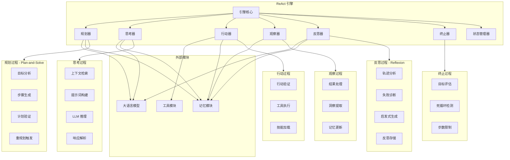
```mermaid
graph TB
    subgraph Reactor[ReAct 引擎]
        EngineCore[引擎核心]
        Planner[规划器]
        Thinker[思考器]
        Actor[行动器]
        Observer[观察器]
        Reflector[反思器]
        Terminator[终止器]
        StateManager[状态管理器]
    end
    
    subgraph PlanningProcess[规划过程 - Plan-and-Solve]
        GoalAnalysis[目标分析]
        StepGeneration[步骤生成]
        PlanValidation[计划验证]
        ReplanTrigger[重规划触发]
    end
    
    subgraph ThinkingProcess[思考过程]
        ContextRetrieval[上下文检索]
        PromptBuilding[提示词构建]
        LLMInference[LLM 推理]
        ResponseParsing[响应解析]
    end
    
    subgraph ActingProcess[行动过程]
        ActionValidation[行动验证]
        ToolExecution[工具执行]
        SkillLoading[技能加载]
    end
    
    subgraph ObservationProcess[观察过程]
        ResultProcessing[结果处理]
        InsightExtraction[洞察提取]
        MemoryUpdate[记忆更新]
    end
    
    subgraph ReflectionProcess[反思过程 - Reflexion]
        TrajectoryAnalysis[轨迹分析]
        FailureDiagnosis[失败诊断]
        HeuristicGeneration[启发式生成]
        ReflectionStorage[反思存储]
    end
    
    subgraph TerminationProcess[终止过程]
        GoalEvaluation[目标评估]
        StuckDetection[死循环检测]
        StepLimit[步数限制]
    end
    
    subgraph ExternalModules[外部模块]
        LLM[大语言模型]
        Memory[记忆模块]
        Tools[工具模块]
    end
    
    EngineCore --> Planner
    EngineCore --> Thinker
    EngineCore --> Actor
    EngineCore --> Observer
    EngineCore --> Reflector
    EngineCore --> Terminator
    EngineCore --> StateManager
    
    Planner --> PlanningProcess
    Thinker --> ThinkingProcess
    Actor --> ActingProcess
    Observer --> ObservationProcess
    Reflector --> ReflectionProcess
    Terminator --> TerminationProcess
    
    Planner --> LLM
    Planner --> Memory
    Thinker --> LLM
    Thinker --> Memory
    Actor --> Tools
    Actor --> Memory
    Observer --> Memory
    Reflector --> LLM
    Reflector --> Memory
```

## 3. 核心流程设计

### 3.1 ReAct 循环伪代码

以下伪代码描述 ReAct 循环的核心逻辑：

```
function Execute(input, opts):
    // 1. 初始化状态
    state = NewState(input, opts)
    
    // 2. 意图识别
    intent = thinker.ClassifyIntent(input, state)
    
    switch intent.Type:
        case Chat:
            return thinker.GenerateChatResponse(input)
            
        case Clarification:
            answer = thinker.ExtractAnswer(input)
            memory.UpdateClarification(state.SessionName, answer)
            return ResumeFromPause(state)
            
        case FollowUp:
            state = memory.LoadContext(state.SessionName)
            // 继续执行 Task 流程
            
        case Feedback:
            feedback = thinker.AnalyzeFeedback(input)
            memory.StoreFeedback(state.SessionName, feedback)
            if feedback.NeedRetry:
                return RetryWithFeedback(state, feedback)
            return ConfirmFeedback(feedback)
            
        case Task:
            // 继续执行以下流程
    
    // 3. Plan 阶段 - Plan-and-Solve
    plan = planner.Plan(input, state)
    if plan == null:
        return Error(CodePlanFailed)
    state.Plan = plan
    
    // 4. ReAct 主循环
    while not terminator.ShouldTerminate(state):
        // 4.1 Think 阶段
        thought = thinker.Think(state)
        state.Thoughts.append(thought)
        
        // 4.2 检查终止条件
        if terminator.ShouldTerminate(state):
            break
            
        // 4.3 Act 阶段
        if thought.HasAction():
            action = thought.Action
            result = actor.Act(action, state)
            state.Actions.append(action)
            
            // 4.4 Observe 阶段
            observation = observer.Observe(result, state)
            state.Observations.append(observation)
            
            // 4.5 更新轨迹
            state.Trajectory.Add(thought, action, observation)
            
            // 4.6 检查是否需要重规划
            if planner.NeedReplan(state):
                state.Plan = planner.Replan(state)
        else:
            // 无行动，结束循环
            break
            
        // 4.7 步数递增
        state.CurrentStep++
        
        // 4.8 检查最大步数
        if state.CurrentStep >= state.MaxSteps:
            state.Status = StatusMaxStepsExceeded
            break
    
    // 5. 评估结果
    evaluation = terminator.Evaluate(state)
    
    // 6. Reflect 阶段 - Reflexion（失败时）
    if not evaluation.Success and state.RetryCount < state.MaxRetries:
        reflection = reflector.Reflect(state.Trajectory, state)
        memory.StoreReflection(reflection)
        
        // 注入反思，重试
        state.RetryCount++
        state.InjectReflection(reflection)
        return Execute(input, opts)  // 递归重试
    
    // 7. 返回结果
    return BuildResult(state, evaluation)
```

**关键控制点**：

| 控制点 | 位置 | 说明 |
|--------|------|------|
| 意图识别 | 循环前 | 区分 Chat/Clarification/FollowUp/Feedback/Task |
| 规划生成 | 循环前 | Plan-and-Solve 范式，执行前生成全局计划 |
| 终止判断 | 循环开始 | 检查目标达成、死循环、最大步数 |
| 行动检查 | Think 后 | 判断是否有可执行行动 |
| 重规划检查 | Observe 后 | 判断是否偏离计划需要重规划 |
| 步数限制 | 循环末尾 | 防止无限循环 |
| 反思重试 | 循环后 | Reflexion 范式，失败后反思重试 |

### 3.2 完整执行流程

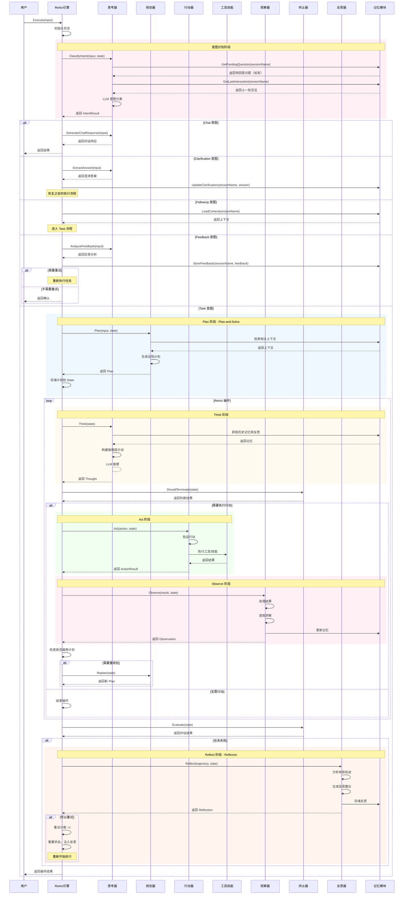
```mermaid
sequenceDiagram
    participant U as 用户
    participant E as ReAct引擎
    participant T as 思考器
    participant P as 规划器
    participant A as 行动器
    participant TL as 工具技能
    participant O as 观察器
    participant TM as 终止器
    participant R as 反思器
    participant M as 记忆模块

    U->>E: Execute(input)
    E->>E: 初始化状态
    
    rect rgb(255, 240, 245)
        Note over E,M: 意图识别阶段
        E->>T: ClassifyIntent(input, state)
        T->>M: GetPendingQuestion(sessionName)
        M-->>T: 返回待回答问题（如有）
        T->>M: GetLastInteraction(sessionName)
        M-->>T: 返回上一轮交互
        T->>T: LLM 意图分类
        T-->>E: 返回 IntentResult
    end
    
    alt Chat 意图
        E->>T: GenerateChatResponse(input)
        T-->>E: 返回对话响应
        E-->>U: 返回结果
        
    else Clarification 意图
        E->>T: ExtractAnswer(input)
        T-->>E: 返回澄清答案
        E->>M: UpdateClarification(sessionName, answer)
        Note over E: 恢复之前的执行流程
        
    else FollowUp 意图
        E->>M: LoadContext(sessionName)
        M-->>E: 返回上下文
        Note over E: 进入 Task 流程
        
    else Feedback 意图
        E->>T: AnalyzeFeedback(input)
        T-->>E: 返回反馈分析
        E->>M: StoreFeedback(sessionName, feedback)
        alt 需要重试
            Note over E: 重新执行任务
        else 不需要重试
            E-->>U: 返回确认
        end
        
    else Task 意图
        rect rgb(240, 248, 255)
            Note over E,M: Plan 阶段 - Plan-and-Solve
            E->>P: Plan(input, state)
            P->>M: 检索相关上下文
            M-->>P: 返回上下文
            P->>P: 生成全局计划
            P-->>E: 返回 Plan
            E->>E: 存储计划到 State
        end
        
        loop ReAct 循环
            rect rgb(255, 250, 240)
                Note over E,M: Think 阶段
                E->>T: Think(state)
                T->>M: 获取历史记忆和反思
                M-->>T: 返回记忆
                T->>T: 构建推理提示词
                T-->T: LLM 推理
                T-->>E: 返回 Thought
            end
            
            E->>TM: ShouldTerminate(state)
            TM-->>E: 返回判断结果
            
            alt 需要执行行动
                rect rgb(240, 255, 240)
                    Note over E,TL: Act 阶段
                    E->>A: Act(action, state)
                    A->>A: 验证行动
                    A->>TL: 执行工具/技能
                    TL-->>A: 返回结果
                    A-->>E: 返回 ActionResult
                end
                
                rect rgb(255, 240, 245)
                    Note over E,M: Observe 阶段
                    E->>O: Observe(result, state)
                    O->>O: 处理结果
                    O->>O: 提取洞察
                    O->>M: 更新记忆
                    O-->>E: 返回 Observation
                end
                
                E->>E: 检查是否偏离计划
                alt 需要重规划
                    E->>P: Replan(state)
                    P-->>E: 返回新 Plan
                end
            else 无需行动
                E->>E: 结束循环
            end
        end
        
        E->>TM: Evaluate(state)
        TM-->>E: 返回评估结果
        
        alt 任务失败
            rect rgb(255, 245, 238)
                Note over E,M: Reflect 阶段 - Reflexion
                E->>R: Reflect(trajectory, state)
                R->>R: 分析失败轨迹
                R->>R: 生成反思建议
                R->>M: 存储反思
                R-->>E: 返回 Reflection
                
                alt 可以重试
                    E->>E: 重试计数 +1
                    E->>E: 重置状态，注入反思
                    Note over E: 重新开始执行
                end
            end
        end
        
        E-->>U: 返回最终结果
    end
```

### 3.2 Plan-and-Solve 流程

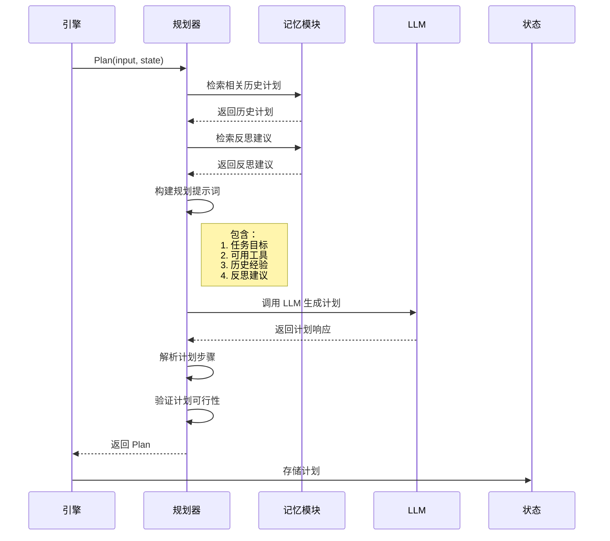
```mermaid
sequenceDiagram
    participant Engine as 引擎
    participant Planner as 规划器
    participant Memory as 记忆模块
    participant LLM as LLM
    participant State as 状态

    Engine->>Planner: Plan(input, state)
    
    Planner->>Memory: 检索相关历史计划
    Memory-->>Planner: 返回历史计划
    
    Planner->>Memory: 检索反思建议
    Memory-->>Planner: 返回反思建议
    
    Planner->>Planner: 构建规划提示词
    Note right of Planner: 包含：<br/>1. 任务目标<br/>2. 可用工具<br/>3. 历史经验<br/>4. 反思建议
    
    Planner->>LLM: 调用 LLM 生成计划
    LLM-->>Planner: 返回计划响应
    
    Planner->>Planner: 解析计划步骤
    Planner->>Planner: 验证计划可行性
    
    Planner-->>Engine: 返回 Plan
    
    Engine->>State: 存储计划
```

### 3.3 Reflexion 流程

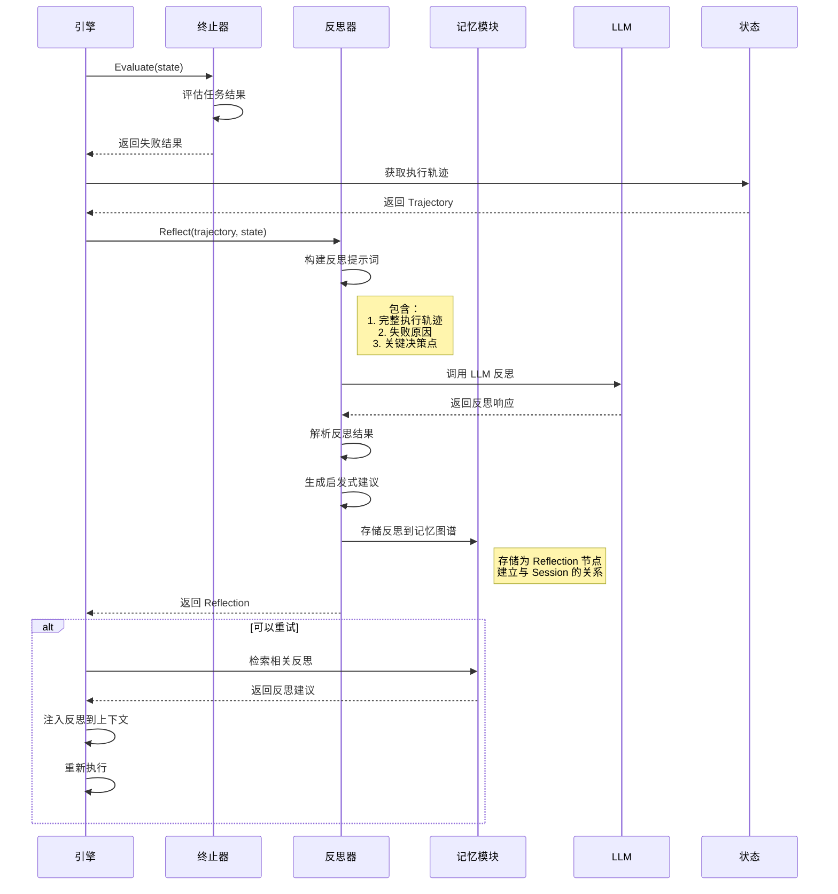
```mermaid
sequenceDiagram
    participant Engine as 引擎
    participant Terminator as 终止器
    participant Reflector as 反思器
    participant Memory as 记忆模块
    participant LLM as LLM
    participant State as 状态

    Engine->>Terminator: Evaluate(state)
    Terminator->>Terminator: 评估任务结果
    Terminator-->>Engine: 返回失败结果
    
    Engine->>State: 获取执行轨迹
    State-->>Engine: 返回 Trajectory
    
    Engine->>Reflector: Reflect(trajectory, state)
    
    Reflector->>Reflector: 构建反思提示词
    Note right of Reflector: 包含：<br/>1. 完整执行轨迹<br/>2. 失败原因<br/>3. 关键决策点
    
    Reflector->>LLM: 调用 LLM 反思
    LLM-->>Reflector: 返回反思响应
    
    Reflector->>Reflector: 解析反思结果
    Reflector->>Reflector: 生成启发式建议
    
    Reflector->>Memory: 存储反思到记忆图谱
    Note right of Memory: 存储为 Reflection 节点<br/>建立与 Session 的关系
    
    Reflector-->>Engine: 返回 Reflection
    
    alt 可以重试
        Engine->>Memory: 检索相关反思
        Memory-->>Engine: 返回反思建议
        Engine->>Engine: 注入反思到上下文
        Engine->>Engine: 重新执行
    end
```

### 3.4 重规划流程

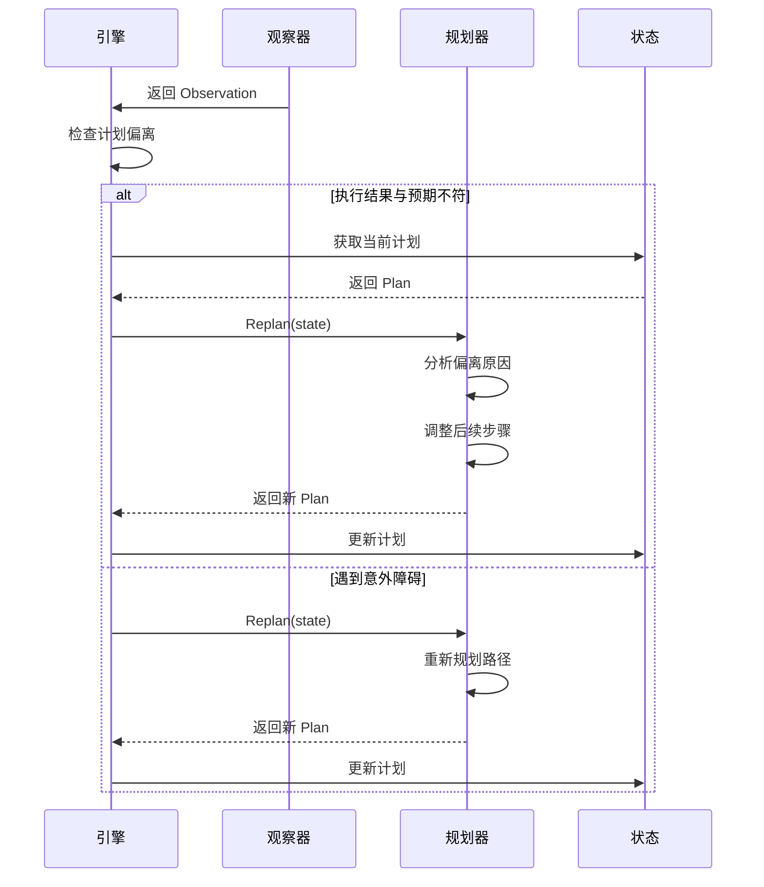
```mermaid
sequenceDiagram
    participant Engine as 引擎
    participant Observer as 观察器
    participant Planner as 规划器
    participant State as 状态

    Observer->>Engine: 返回 Observation
    Engine->>Engine: 检查计划偏离
    
    alt 执行结果与预期不符
        Engine->>State: 获取当前计划
        State-->>Engine: 返回 Plan
        
        Engine->>Planner: Replan(state)
        Planner->>Planner: 分析偏离原因
        Planner->>Planner: 调整后续步骤
        Planner-->>Engine: 返回新 Plan
        
        Engine->>State: 更新计划
    else 遇到意外障碍
        Engine->>Planner: Replan(state)
        Planner->>Planner: 重新规划路径
        Planner-->>Engine: 返回新 Plan
        
        Engine->>State: 更新计划
    end
```

### 3.5 Skill 执行流程

Actor 在执行 Skill 时会优先使用编译缓存：

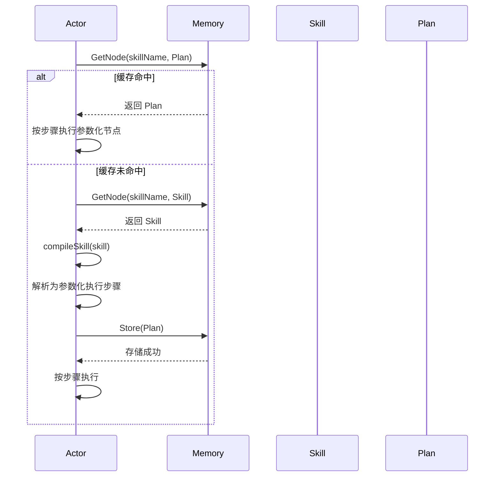
```mermaid
sequenceDiagram
    participant A as Actor
    participant M as Memory
    participant S as Skill
    participant P as Plan

    A->>M: GetNode(skillName, Plan)
    
    alt 缓存命中
        M-->>A: 返回 Plan
        A->>A: 按步骤执行参数化节点
    else 缓存未命中
        A->>M: GetNode(skillName, Skill)
        M-->>A: 返回 Skill
        
        A->>A: compileSkill(skill)
        A->>A: 解析为参数化执行步骤
        A->>M: Store(Plan)
        M-->>A: 存储成功
        
        A->>A: 按步骤执行
    end
```

**SkillExecutionPlan 结构**：

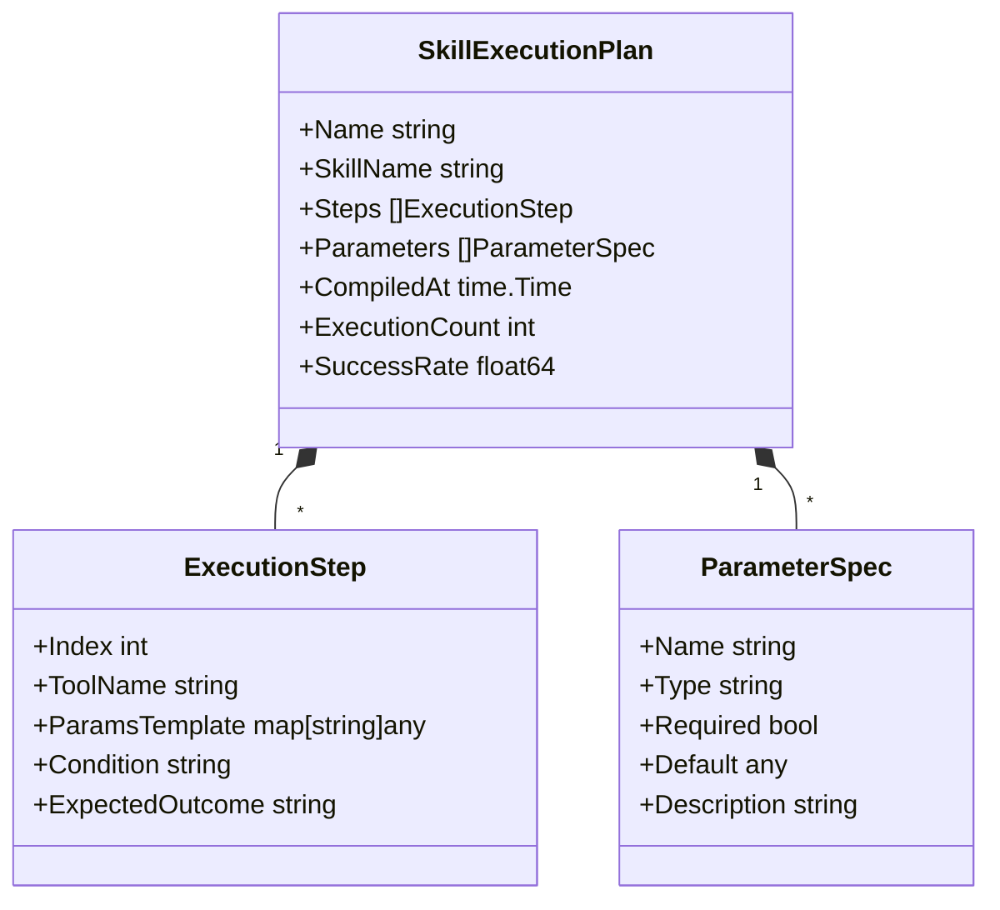
```mermaid
classDiagram
    class SkillExecutionPlan {
        +Name string
        +SkillName string
        +Steps []ExecutionStep
        +Parameters []ParameterSpec
        +CompiledAt time.Time
        +ExecutionCount int
        +SuccessRate float64
    }
    
    class ExecutionStep {
        +Index int
        +ToolName string
        +ParamsTemplate map[string]any
        +Condition string
        +ExpectedOutcome string
    }
    
    class ParameterSpec {
        +Name string
        +Type string
        +Required bool
        +Default any
        +Description string
    }
    
    SkillExecutionPlan "1" *-- "*" ExecutionStep
    SkillExecutionPlan "1" *-- "*" ParameterSpec
```

## 4. 核心组件设计

### 4.1 Planner（规划器）

规划器负责在执行前生成全局计划，实现 Plan-and-Solve 范式。

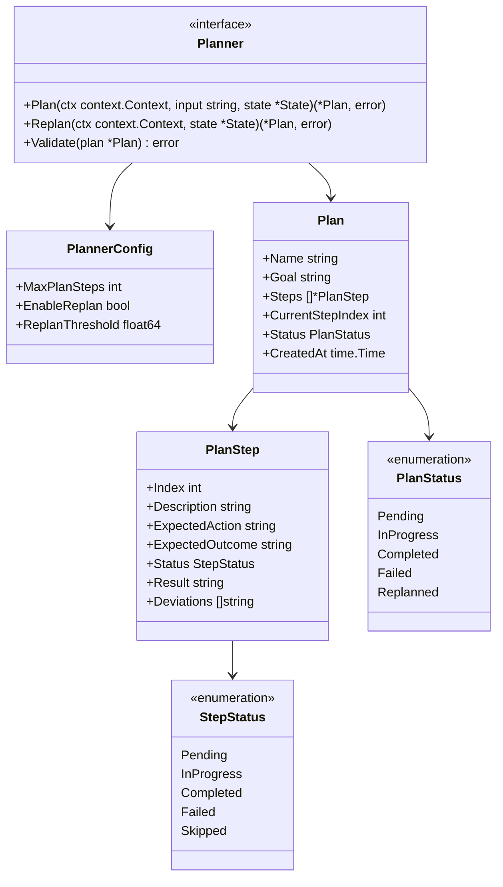
```mermaid
classDiagram
    class Planner {
        <<interface>>
        +Plan(ctx context.Context, input string, state *State) (*Plan, error)
        +Replan(ctx context.Context, state *State) (*Plan, error)
        +Validate(plan *Plan) error
    }
    
    class PlannerConfig {
        +MaxPlanSteps int
        +EnableReplan bool
        +ReplanThreshold float64
    }
    
    class Plan {
        +Name string
        +Goal string
        +Steps []*PlanStep
        +CurrentStepIndex int
        +Status PlanStatus
        +CreatedAt time.Time
    }
    
    class PlanStep {
        +Index int
        +Description string
        +ExpectedAction string
        +ExpectedOutcome string
        +Status StepStatus
        +Result string
        +Deviations []string
    }
    
    class PlanStatus {
        <<enumeration>>
        Pending
        InProgress
        Completed
        Failed
        Replanned
    }
    
    class StepStatus {
        <<enumeration>>
        Pending
        InProgress
        Completed
        Failed
        Skipped
    }
    
    Planner --> PlannerConfig
    Planner --> Plan
    Plan --> PlanStep
    Plan --> PlanStatus
    PlanStep --> StepStatus
```

**规划策略**：

| 策略       | 说明                   | 适用场景   |
| ---------- | ---------------------- | ---------- |
| 线性规划   | 生成顺序执行的步骤列表 | 简单任务   |
| 条件规划   | 包含条件分支的计划     | 不确定任务 |
| 迭代规划   | 先粗略规划，逐步细化   | 复杂任务   |
| 自适应规划 | 根据执行反馈动态调整   | 动态环境   |

### 4.2 Reflector（反思器）

反思器负责在任务失败后进行自我反思，实现 Reflexion 范式。

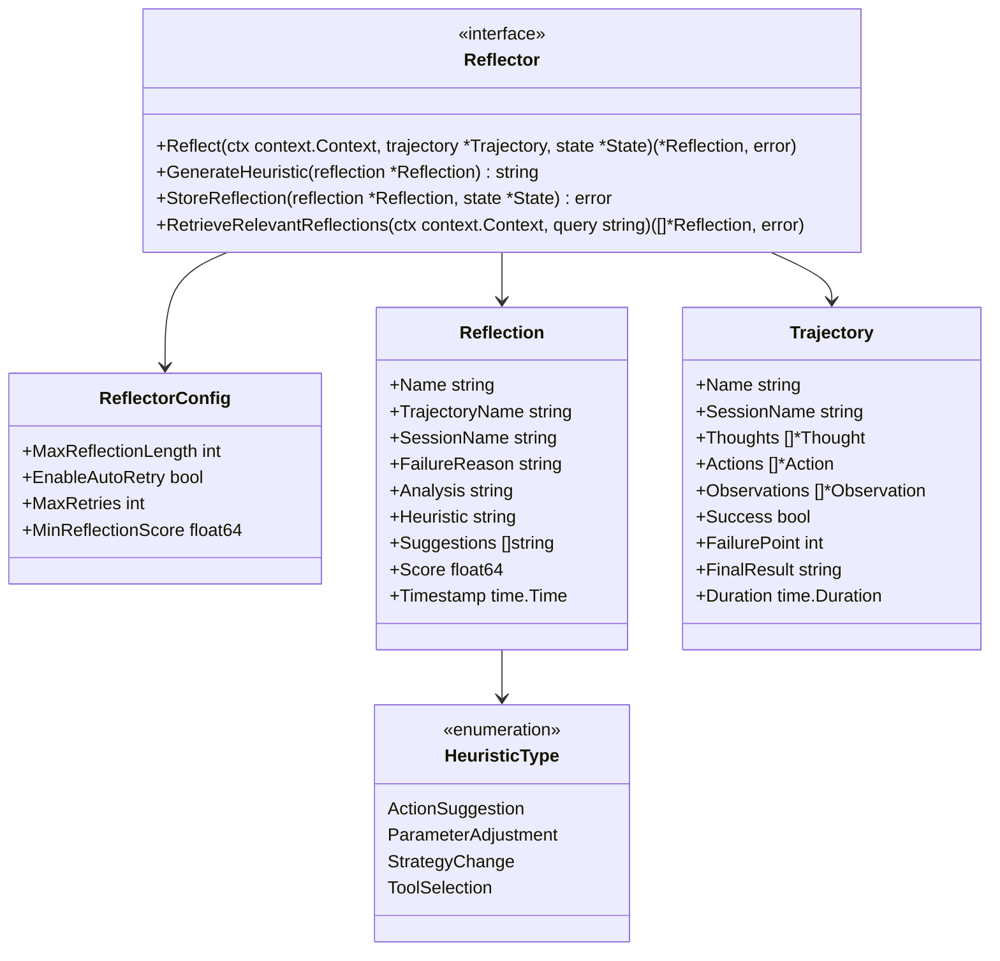
```mermaid
classDiagram
    class Reflector {
        <<interface>>
        +Reflect(ctx context.Context, trajectory *Trajectory, state *State) (*Reflection, error)
        +GenerateHeuristic(reflection *Reflection) string
        +StoreReflection(reflection *Reflection, state *State) error
        +RetrieveRelevantReflections(ctx context.Context, query string) ([]*Reflection, error)
    }
    
    class ReflectorConfig {
        +MaxReflectionLength int
        +EnableAutoRetry bool
        +MaxRetries int
        +MinReflectionScore float64
    }
    
    class Reflection {
        +Name string
        +TrajectoryName string
        +SessionName string
        +FailureReason string
        +Analysis string
        +Heuristic string
        +Suggestions []string
        +Score float64
        +Timestamp time.Time
    }
    
    class Trajectory {
        +Name string
        +SessionName string
        +Thoughts []*Thought
        +Actions []*Action
        +Observations []*Observation
        +Success bool
        +FailurePoint int
        +FinalResult string
        +Duration time.Duration
    }
    
    class HeuristicType {
        <<enumeration>>
        ActionSuggestion
        ParameterAdjustment
        StrategyChange
        ToolSelection
    }
    
    Reflector --> ReflectorConfig
    Reflector --> Reflection
    Reflector --> Trajectory
    Reflection --> HeuristicType
```

**反思类型**：

| 类型     | 说明                 | 示例                           |
| -------- | -------------------- | ------------------------------ |
| 行为反思 | 反思行动选择是否正确 | "应该先搜索 A 再搜索 B"        |
| 参数反思 | 反思参数设置是否合理 | "搜索关键词太宽泛，应该更具体" |
| 策略反思 | 反思整体策略是否有效 | "应该采用分治策略而非穷举"     |
| 工具反思 | 反思工具选择是否恰当 | "应该用搜索工具而非计算工具"   |

### 4.3 Terminator（终止器）

终止器负责判断任务是否完成，并评估任务结果。

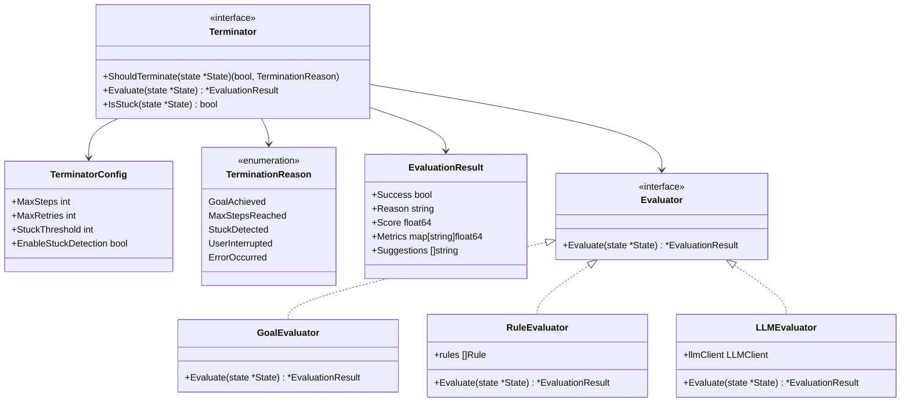
```mermaid
classDiagram
    class Terminator {
        <<interface>>
        +ShouldTerminate(state *State) (bool, TerminationReason)
        +Evaluate(state *State) *EvaluationResult
        +IsStuck(state *State) bool
    }
    
    class TerminatorConfig {
        +MaxSteps int
        +MaxRetries int
        +StuckThreshold int
        +EnableStuckDetection bool
    }
    
    class TerminationReason {
        <<enumeration>>
        GoalAchieved
        MaxStepsReached
        StuckDetected
        UserInterrupted
        ErrorOccurred
    }
    
    class EvaluationResult {
        +Success bool
        +Reason string
        +Score float64
        +Metrics map[string]float64
        +Suggestions []string
    }
    
    class Evaluator {
        <<interface>>
        +Evaluate(state *State) *EvaluationResult
    }
    
    class GoalEvaluator {
        +Evaluate(state *State) *EvaluationResult
    }
    
    class RuleEvaluator {
        +rules []Rule
        +Evaluate(state *State) *EvaluationResult
    }
    
    class LLMEvaluator {
        +llmClient LLMClient
        +Evaluate(state *State) *EvaluationResult
    }
    
    Terminator --> TerminatorConfig
    Terminator --> TerminationReason
    Terminator --> EvaluationResult
    Terminator --> Evaluator
    Evaluator <|.. GoalEvaluator
    Evaluator <|.. RuleEvaluator
    Evaluator <|.. LLMEvaluator
```

**评估器类型**：

| 类型          | 说明                  | 适用场景     |
| ------------- | --------------------- | ------------ |
| GoalEvaluator | 检查是否达到目标状态  | 明确目标任务 |
| RuleEvaluator | 基于规则判断成功/失败 | 结构化任务   |
| LLMEvaluator  | 使用 LLM 评估结果质量 | 开放式任务   |

## 5. 状态管理设计

### 5.1 引擎状态

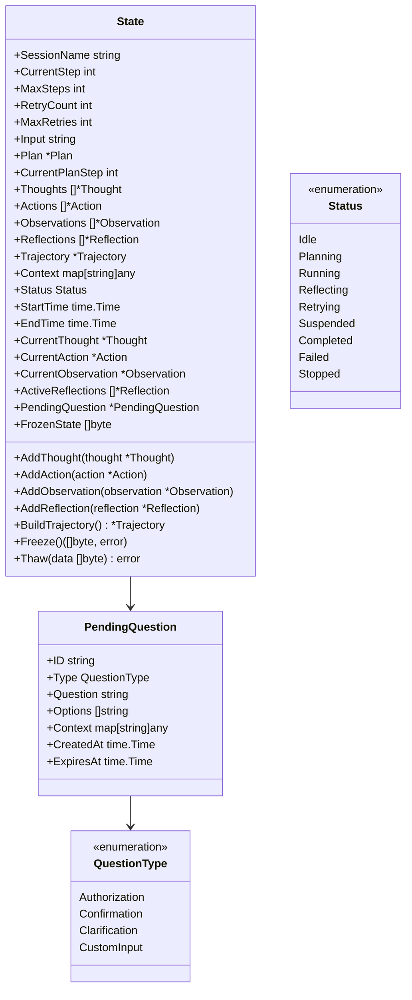
```mermaid
classDiagram
    class State {
        +SessionName string
        +CurrentStep int
        +MaxSteps int
        +RetryCount int
        +MaxRetries int
        +Input string
        +Plan *Plan
        +CurrentPlanStep int
        +Thoughts []*Thought
        +Actions []*Action
        +Observations []*Observation
        +Reflections []*Reflection
        +Trajectory *Trajectory
        +Context map[string]any
        +Status Status
        +StartTime time.Time
        +EndTime time.Time
        +CurrentThought *Thought
        +CurrentAction *Action
        +CurrentObservation *Observation
        +ActiveReflections []*Reflection
        +PendingQuestion *PendingQuestion
        +FrozenState []byte
        +AddThought(thought *Thought)
        +AddAction(action *Action)
        +AddObservation(observation *Observation)
        +AddReflection(reflection *Reflection)
        +BuildTrajectory() *Trajectory
        +Freeze() ([]byte, error)
        +Thaw(data []byte) error
    }
    
    class Status {
        <<enumeration>>
        Idle
        Planning
        Running
        Reflecting
        Retrying
        Suspended
        Completed
        Failed
        Stopped
    }
    
    class PendingQuestion {
        +ID string
        +Type QuestionType
        +Question string
        +Options []string
        +Context map[string]any
        +CreatedAt time.Time
        +ExpiresAt time.Time
    }
    
    class QuestionType {
        <<enumeration>>
        Authorization
        Confirmation
        Clarification
        CustomInput
    }
    
    State --> PendingQuestion
    PendingQuestion --> QuestionType
```

**新增字段说明**：

| 字段            | 类型             | 说明                       |
| --------------- | ---------------- | -------------------------- |
| PendingQuestion | *PendingQuestion | 待用户回答的问题           |
| FrozenState     | []byte           | 冻结的完整状态（序列化后） |

### 5.2 状态转换

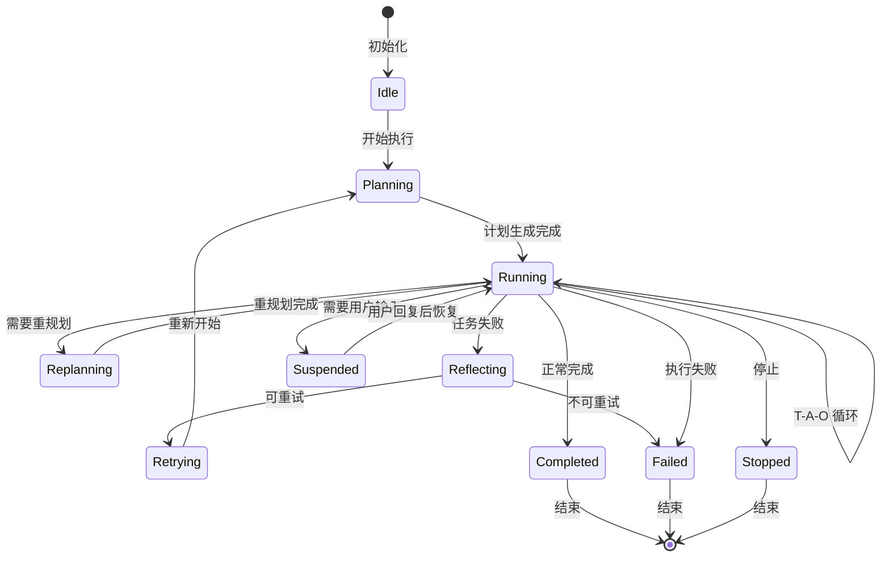
```mermaid
stateDiagram-v2
    [*] --> Idle: 初始化
    Idle --> Planning: 开始执行
    Planning --> Running: 计划生成完成
    Running --> Running: T-A-O 循环
    Running --> Replanning: 需要重规划
    Replanning --> Running: 重规划完成
    Running --> Reflecting: 任务失败
    Reflecting --> Retrying: 可重试
    Reflecting --> Failed: 不可重试
    Retrying --> Planning: 重新开始
    Running --> Suspended: 需要用户输入
    Suspended --> Running: 用户回复后恢复
    Running --> Completed: 正常完成
    Running --> Failed: 执行失败
    Running --> Stopped: 停止
    Completed --> [*]: 结束
    Failed --> [*]: 结束
    Stopped --> [*]: 结束
```

### 5.3 轨迹构建

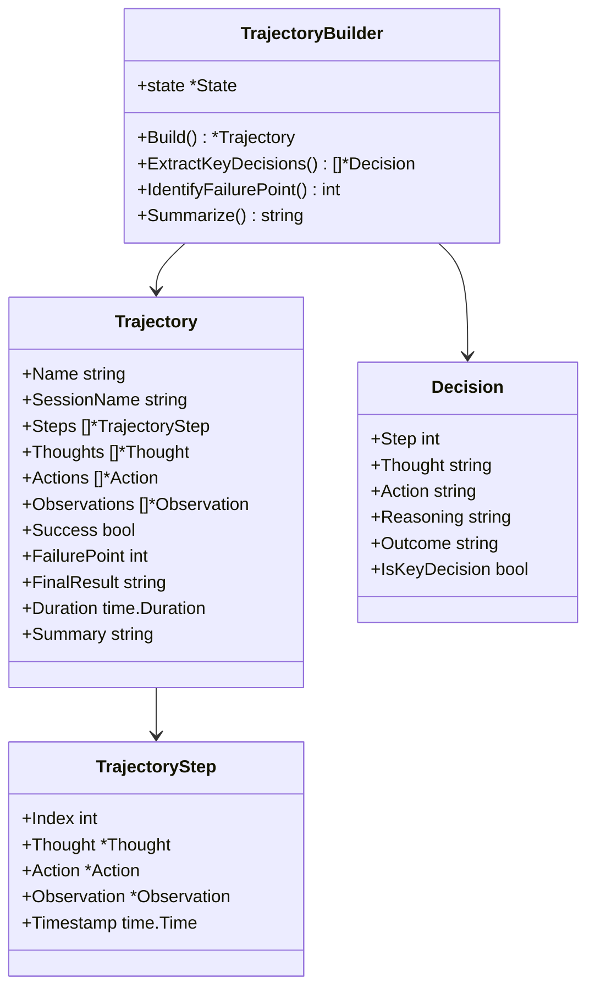
```mermaid
classDiagram
    class TrajectoryBuilder {
        +state *State
        +Build() *Trajectory
        +ExtractKeyDecisions() []*Decision
        +IdentifyFailurePoint() int
        +Summarize() string
    }
    
    class Trajectory {
        +Name string
        +SessionName string
        +Steps []*TrajectoryStep
        +Thoughts []*Thought
        +Actions []*Action
        +Observations []*Observation
        +Success bool
        +FailurePoint int
        +FinalResult string
        +Duration time.Duration
        +Summary string
    }
    
    class TrajectoryStep {
        +Index int
        +Thought *Thought
        +Action *Action
        +Observation *Observation
        +Timestamp time.Time
    }
    
    class Decision {
        +Step int
        +Thought string
        +Action string
        +Reasoning string
        +Outcome string
        +IsKeyDecision bool
    }
    
    TrajectoryBuilder --> Trajectory
    Trajectory --> TrajectoryStep
    TrajectoryBuilder --> Decision
```

## 6. 暂停-恢复机制设计

Reactor 支持在执行过程中随时暂停，等待用户输入后恢复执行。这是实现人机协作的关键机制。

### 6.1 暂停场景

| 场景       | 触发条件       | QuestionType  | 说明             |
| ---------- | -------------- | ------------- | ---------------- |
| 工具授权   | 敏感工具执行前 | Authorization | 请求用户授权执行 |
| 继续确认   | 关键步骤执行前 | Confirmation  | 确认是否继续     |
| 意图澄清   | 意图不明确时   | Clarification | 请求用户澄清     |
| 自定义输入 | 需要额外信息时 | CustomInput   | 请求用户提供信息 |

### 6.2 PendingQuestion 结构

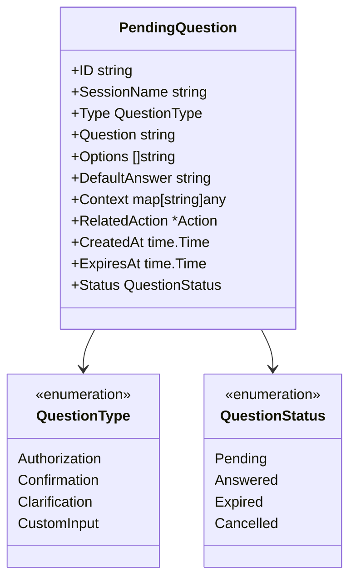
```mermaid
classDiagram
    class PendingQuestion {
        +ID string
        +SessionName string
        +Type QuestionType
        +Question string
        +Options []string
        +DefaultAnswer string
        +Context map[string]any
        +RelatedAction *Action
        +CreatedAt time.Time
        +ExpiresAt time.Time
        +Status QuestionStatus
    }
    
    class QuestionType {
        <<enumeration>>
        Authorization
        Confirmation
        Clarification
        CustomInput
    }
    
    class QuestionStatus {
        <<enumeration>>
        Pending
        Answered
        Expired
        Cancelled
    }
    
    PendingQuestion --> QuestionType
    PendingQuestion --> QuestionStatus
```

**字段说明**：

| 字段          | 类型           | 说明                     |
| ------------- | -------------- | ------------------------ |
| ID            | string         | 问题唯一标识             |
| SessionName   | string         | 关联的会话名称           |
| Type          | QuestionType   | 问题类型                 |
| Question      | string         | 问题内容                 |
| Options       | []string       | 可选答案列表             |
| DefaultAnswer | string         | 默认答案（超时时使用）   |
| Context       | map[string]any | 上下文信息               |
| RelatedAction | *Action        | 关联的行动（如工具调用） |
| ExpiresAt     | time.Time      | 过期时间                 |

### 6.3 暂停流程

```mermaid
sequenceDiagram
    participant Engine as 引擎
    participant Actor as 行动器
    participant Memory as 记忆模块
    participant User as 用户

    Engine->>Actor: Act(action, state)
    Actor->>Actor: 检查工具安全级别
    
    alt 需要授权
        Actor->>Actor: 创建 PendingQuestion
        Actor->>Memory: FreezeSession(state, question)
        Memory->>Memory: 序列化 State
        Memory->>Memory: 存储 FrozenSession
        Memory-->>Actor: 返回 QuestionID
        
        Actor-->>Engine: 返回 PendingResult
        Engine-->>User: 返回 PendingQuestion
        
        Note over User: 用户思考并回复...
        
        User->>Engine: Resume(sessionName, answer)
        Engine->>Memory: GetFrozenSession(sessionName)
        Memory-->>Engine: 返回 FrozenState
        Engine->>Engine: 反序列化 State
        Engine->>Engine: 注入用户答案
        Engine->>Actor: 继续执行
    else 无需授权
        Actor->>Actor: 直接执行
    end
```

### 6.4 恢复流程

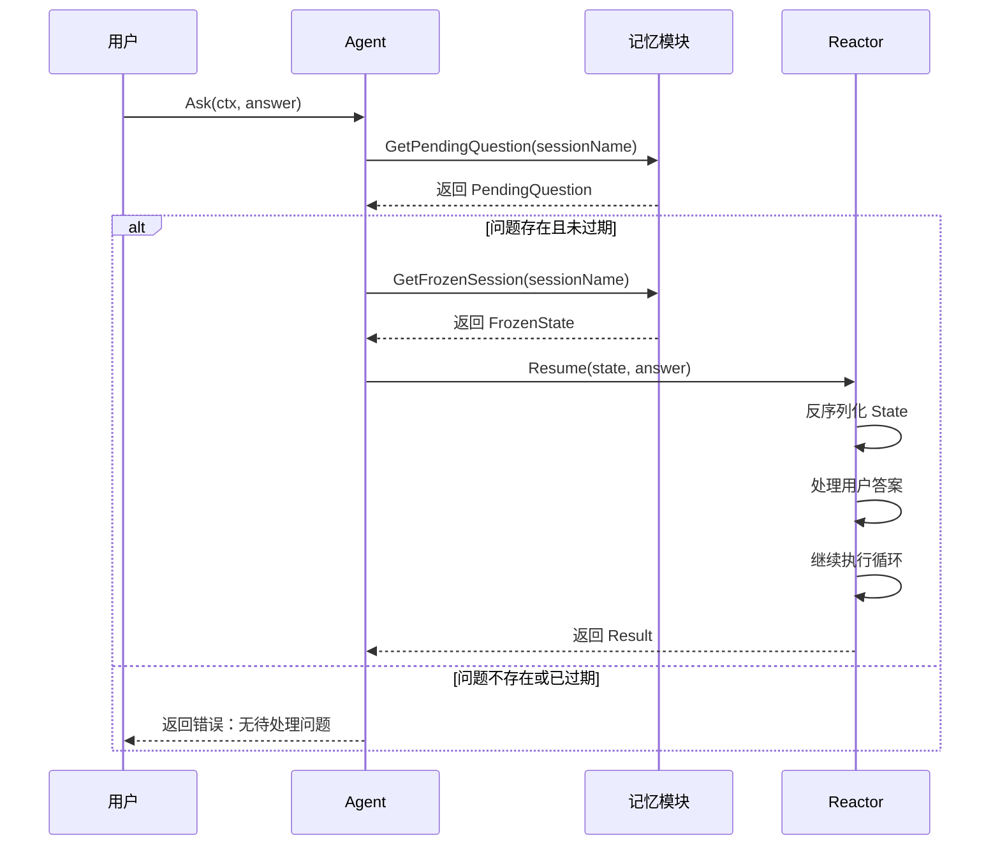
```mermaid
sequenceDiagram
    participant User as 用户
    participant Agent as Agent
    participant Memory as 记忆模块
    participant Reactor as Reactor

    User->>Agent: Ask(ctx, answer)
    Agent->>Memory: GetPendingQuestion(sessionName)
    Memory-->>Agent: 返回 PendingQuestion
    
    alt 问题存在且未过期
        Agent->>Memory: GetFrozenSession(sessionName)
        Memory-->>Agent: 返回 FrozenState
        
        Agent->>Reactor: Resume(state, answer)
        Reactor->>Reactor: 反序列化 State
        Reactor->>Reactor: 处理用户答案
        Reactor->>Reactor: 继续执行循环
        
        Reactor-->>Agent: 返回 Result
    else 问题不存在或已过期
        Agent-->>User: 返回错误：无待处理问题
    end
```

### 6.5 FrozenSession 存储

所有冻结的会话状态都保存到 Memory 中：

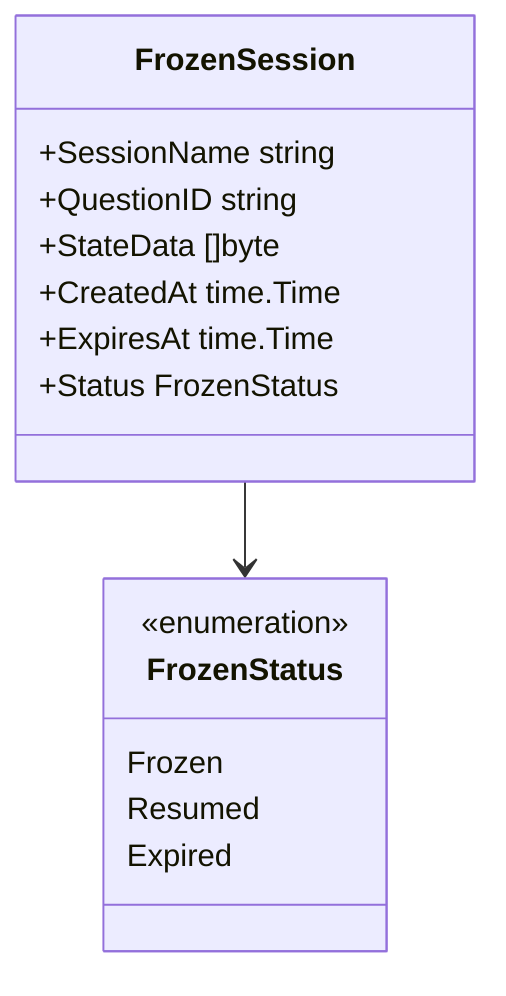
```mermaid
classDiagram
    class FrozenSession {
        +SessionName string
        +QuestionID string
        +StateData []byte
        +CreatedAt time.Time
        +ExpiresAt time.Time
        +Status FrozenStatus
    }
    
    class FrozenStatus {
        <<enumeration>>
        Frozen
        Resumed
        Expired
    }
    
    FrozenSession --> FrozenStatus
```

**存储原则**：

1. **一切保存于 Memory**：所有状态通过 Memory 存储和查询
2. **增量状态存储 (Incremental State Storage)**：完整序列化 State 如果涉及大量多模态数据或深层上下文，会导致性能瓶颈。实际上，Memory 会将大文本/文件流持久化在 `DocumentPath`，而在 State 冻结时，仅保留这些数据的引用（指针）及增量变化的部分，大幅度降低磁盘/图数据库 IO。
3. **关联 PendingQuestion**：FrozenSession 与 PendingQuestion 一一对应
4. **支持过期清理**：过期的冻结会话自动清理

### 6.6 使用示例

```go
result, err := agent.Ask(ctx, "请删除 temp 目录下的所有文件")

if result.Status == StatusPending {
    fmt.Printf("需要授权: %s\n", result.PendingQuestion.Question)
    fmt.Printf("选项: %v\n", result.PendingQuestion.Options)
    
    answer := getUserInput()
    
    result, err = agent.Resume(ctx, result.SessionName, answer)
}

fmt.Println(result.Answer)
```

## 7. 与 Memory 的协作

### 7.1 反思存储与检索

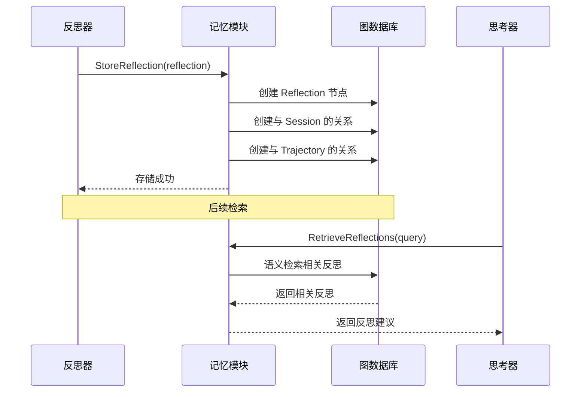
```mermaid
sequenceDiagram
    participant Reflector as 反思器
    participant Memory as 记忆模块
    participant GraphDB as 图数据库

    Reflector->>Memory: StoreReflection(reflection)
    Memory->>GraphDB: 创建 Reflection 节点
    Memory->>GraphDB: 创建与 Session 的关系
    Memory->>GraphDB: 创建与 Trajectory 的关系
    Memory-->>Reflector: 存储成功
    
    Note over Reflector,GraphDB: 后续检索
    
    participant Thinker as 思考器
    Thinker->>Memory: RetrieveReflections(query)
    Memory->>GraphDB: 语义检索相关反思
    GraphDB-->>Memory: 返回相关反思
    Memory-->>Thinker: 返回反思建议
```

### 7.2 计划存储与复用

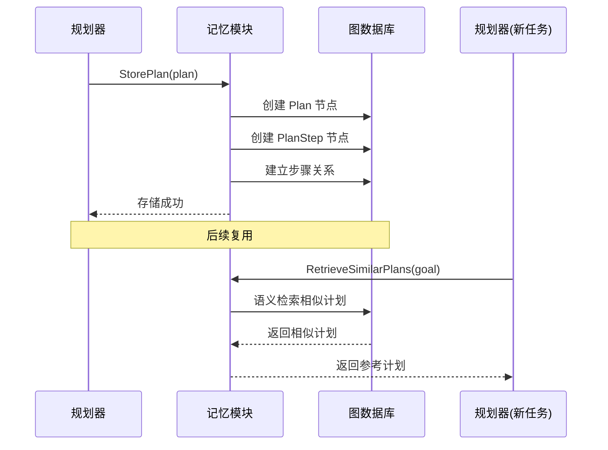
```mermaid
sequenceDiagram
    participant Planner as 规划器
    participant Memory as 记忆模块
    participant GraphDB as 图数据库

    Planner->>Memory: StorePlan(plan)
    Memory->>GraphDB: 创建 Plan 节点
    Memory->>GraphDB: 创建 PlanStep 节点
    Memory->>GraphDB: 建立步骤关系
    Memory-->>Planner: 存储成功
    
    Note over Planner,GraphDB: 后续复用
    
    participant NewPlanner as 规划器(新任务)
    NewPlanner->>Memory: RetrieveSimilarPlans(goal)
    Memory->>GraphDB: 语义检索相似计划
    GraphDB-->>Memory: 返回相似计划
    Memory-->>NewPlanner: 返回参考计划
```

## 8. PromptBuilder 支持

### 8.1 规划提示词

PromptBuilder 为规划器提供专门的提示词模板：

```mermaid
graph LR
    subgraph PlanPrompt[规划提示词]
        Goal[任务目标]
        Tools[可用工具]
        History[历史计划]
        Reflections[反思建议]
        Constraints[约束条件]
    end
    
    subgraph Output[输出格式]
        Steps[步骤列表]
        Expected[预期结果]
        Fallback[备选方案]
    end
    
    PlanPrompt --> LLM[LLM]
    LLM --> Output
```

### 8.2 反思提示词

PromptBuilder 为反思器提供专门的提示词模板：

```mermaid
graph LR
    subgraph ReflectionPrompt[反思提示词]
        Trajectory[执行轨迹]
        Failure[失败原因]
        Context[上下文信息]
        History[历史反思]
    end
    
    subgraph Output[输出格式]
        Analysis[失败分析]
        Heuristic[启发式建议]
        Suggestions[改进建议]
    end
    
    ReflectionPrompt --> LLM[LLM]
    LLM --> Output
```

## 9. 配置选项

### 9.1 Plan-and-Solve 配置

| 配置项          | 说明                 | 默认值 |
| --------------- | -------------------- | ------ |
| EnablePlanning  | 是否启用规划         | true   |
| MaxPlanSteps    | 最大计划步骤数       | 10     |
| EnableReplan    | 是否启用重规划       | true   |
| ReplanThreshold | 触发重规划的偏离阈值 | 0.5    |

### 9.2 Reflexion 配置

| 配置项             | 说明             | 默认值 |
| ------------------ | ---------------- | ------ |
| EnableReflection   | 是否启用反思     | true   |
| MaxRetries         | 最大重试次数     | 3      |
| ReflectionMinScore | 最小反思质量分数 | 0.7    |
| StoreReflections   | 是否存储反思     | true   |

## 10. 总结

Reactor 模块通过融入 Plan-and-Solve 和 Reflexion 两个演进范式，实现了从基础 ReAct 到高级智能体的升级：

**Plan-and-Solve 融入**：

1. **Planner 组件**: 在执行前生成全局计划
2. **计划状态管理**: 跟踪计划执行进度
3. **重规划机制**: 检测偏离并动态调整

**Reflexion 融入**：

1. **Reflector 组件**: 在失败后进行自我反思
2. **反思存储**: 将反思存入 Memory 供后续使用
3. **重试机制**: 注入反思建议后重新执行

**核心价值**：

1. **减少试错成本**: 通过规划避免盲目执行
2. **经验积累**: 通过反思实现长期学习
3. **避免死循环**: 通过终止器检测卡住状态
4. **持续改进**: 每次失败都转化为改进机会

这种设计使得 GoReAct 能够支持更复杂的任务场景，为构建具有规划和学习能力的智能体系统提供了坚实的技术基础。
