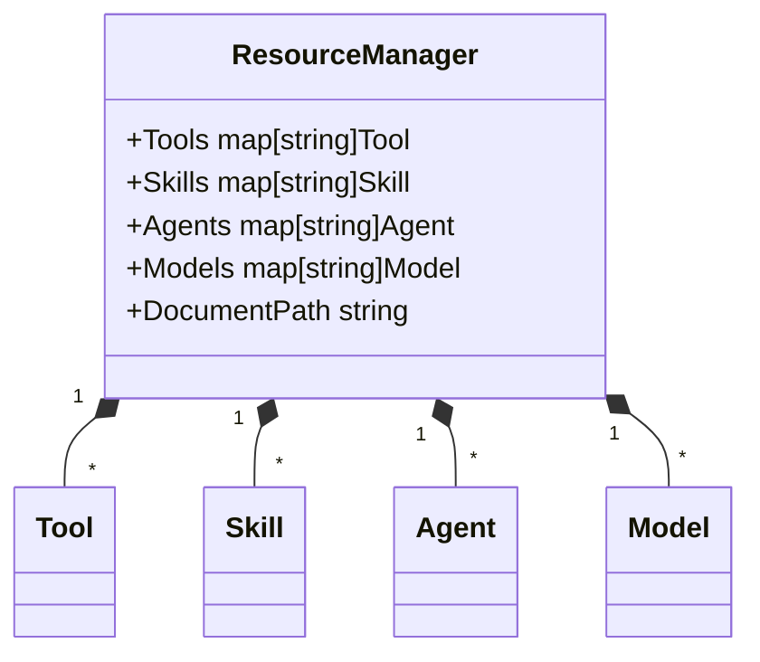
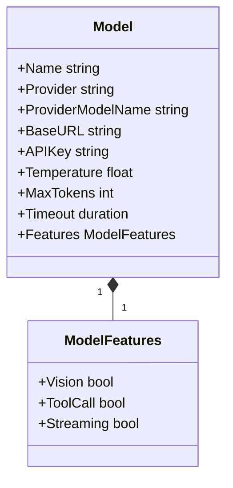
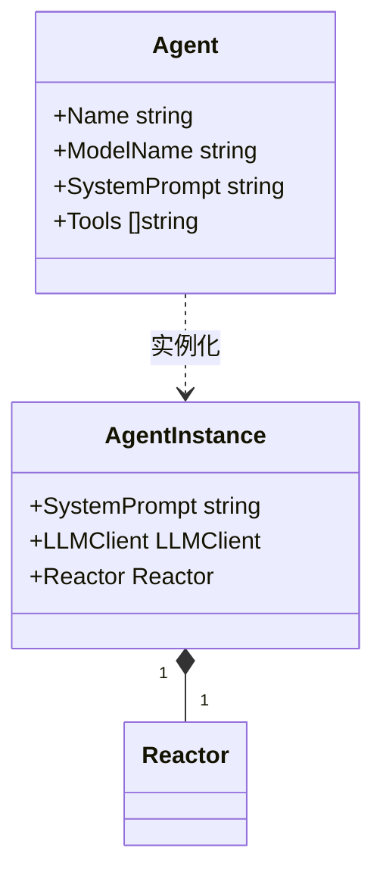
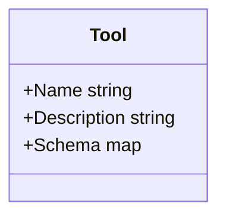
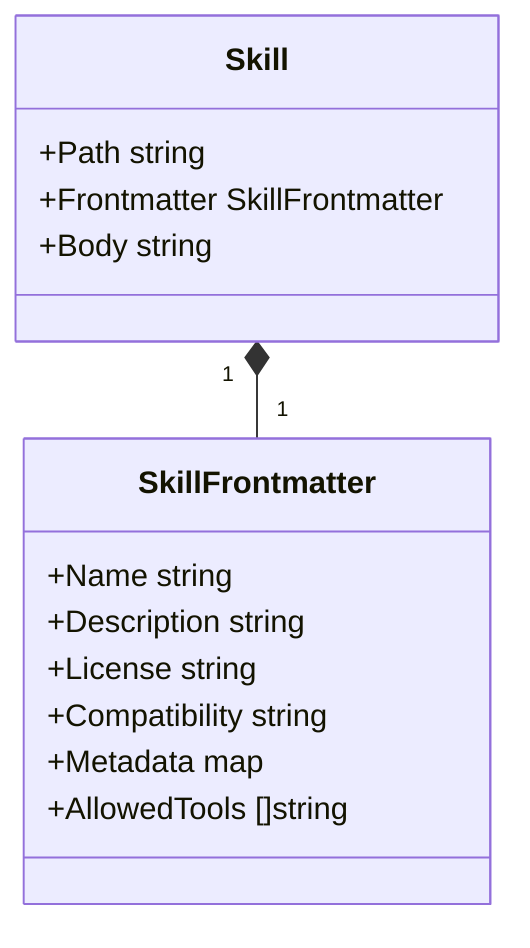
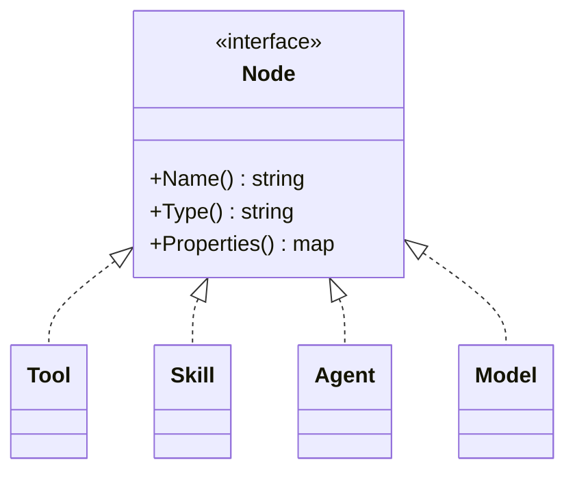
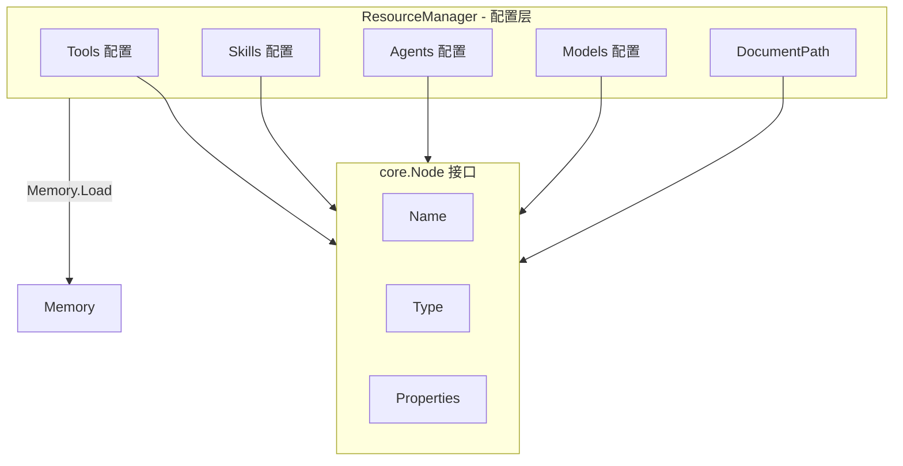
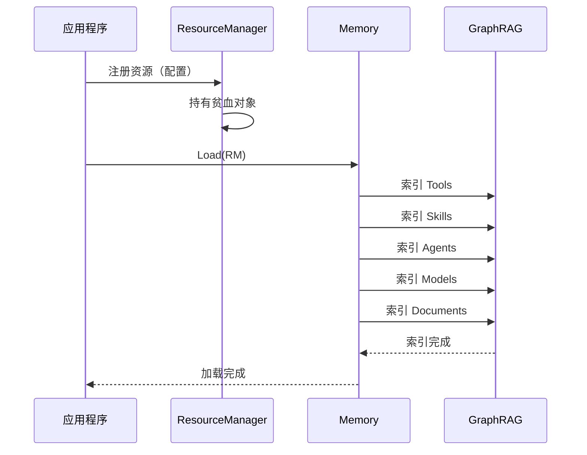

# 资源管理模块设计

## 1. 模块概述

ResourceManager 是静态资源的统一注册场所，持有贫血对象。它不负责资源发现、组合或优化，这些功能由 Memory 的语义检索实现。

> **核心概念**：`Agent` 和 `Model` 在其最原始的形态下是**数据（配置）实体**，它们非常适合被序列化为 YAML 或存储在数据库中。

### 1.1 核心职责

- **静态资源注册**: 作为 Tools、Skills、Agents、Models、Documents 的统一注册场所
- **贫血对象持有**: 只持有共享数据，不包含复杂逻辑

### 1.2 设计原则

- **贫血模型**: 所有资源对象都是贫血对象，只持有数据
- **Node 接口**: 每个资源实现 `core.Node` 接口，都是 GraphDB 中的节点
- **简化设计**: 开发人员无需关注 Memory 如何索引资源

## 2. 模块结构

### 2.1 ResourceManager 结构

ResourceManager 持有所有具名的资源配置，`DocumentPath` 是长期记忆的文件路径，也是 Agent 默认文件夹。客户端可以通过名称精确地获取资源对象。



**DocumentPath 说明**：

| 用途 | 说明 |
| ---- | ---- |
| 长期记忆文件路径 | GraphRAG 索引的知识库目录 |
| Agent 默认文件夹 | Agent 配置和资源文件的根目录 |

### 2.2 Model 配置

`Model` 结构体是具体 LLM 的配置定义：



**Model 配置包含**：

- **模型名称**：GoReAct 内部使用的唯一标识（如 my-gpt4、work-claude）
- **提供商模型名**：`ProviderModelName` 指提供商的模型标识（如 gpt-4、claude-3-opus）
- **基础路由**：`Provider` (如 openai, anthropic, ollama)、`BaseURL`
- **认证与参数**：`AuthToken`、 `APIKey`、`Temperature`、`MaxTokens`、`Timeout`
- **能力标识**：通过 `ModelFeatures` 明确标识该模型是否支持视觉、工具调用、流式输出等

### 2.3 Agent 配置

`Agent` 是对 `Reactor` 的业务级封装，是最终用户与框架交互的**唯一高级入口**：



**Agent 配置包含**：

- `Name`：Agent 名称
- `SystemPrompt`：角色与行为规程（SOP）
- `ModelName`：引用的模型名称

**Agent 实例的完整形态**：

1. **System Prompt**：角色与行为规程
2. **LLM Client**：通过 `ModelName` 从 `model.Manager` 处兑换来的真实大脑
3. **Reactor Engine**：内部私有的执行引擎

### 2.4 Tool 配置



### 2.5 Skill 配置

Skill 是目录结构，包含 SKILL.md 和可选的 scripts、references、assets：

```
skill-name/
├── SKILL.md          # 必需：元数据 + 指令
├── scripts/          # 可选：可执行代码
├── references/       # 可选：文档
└── assets/           # 可选：模板、资源
```



**SKILL.md 格式**：

```markdown
---
name: skill-name
description: 描述技能做什么以及何时使用
allowed-tools: read write bash
---

# 技能指令
...
```

### 2.6 Node 接口实现

所有资源类型都实现 `core.Node` 接口：



**说明**：
- Tool、Skill、Agent、Model 都没有 ID，通过 `name` 作为唯一标识
- Node 接口使用 `Name()` 作为唯一标识方法

### 2.7 整体关系图



## 3. 与 Memory 的交互

### 3.1 加载流程



## 4. 总结

ResourceManager 的设计极其简单：

1. **贫血对象**: 只持有数据，不包含复杂逻辑
2. **配置实体**: Agent 和 Model 作为配置可序列化为 YAML
3. **Node 接口**: 所有资源实现 `core.Node` 接口
4. **简化交互**: Memory 通过 `Load()` 方法一次性索引所有资源
5. **开发友好**: 开发人员无需关注 Memory 如何索引资源

这种设计极大地简化了整个系统，让资源管理变得清晰明了。
