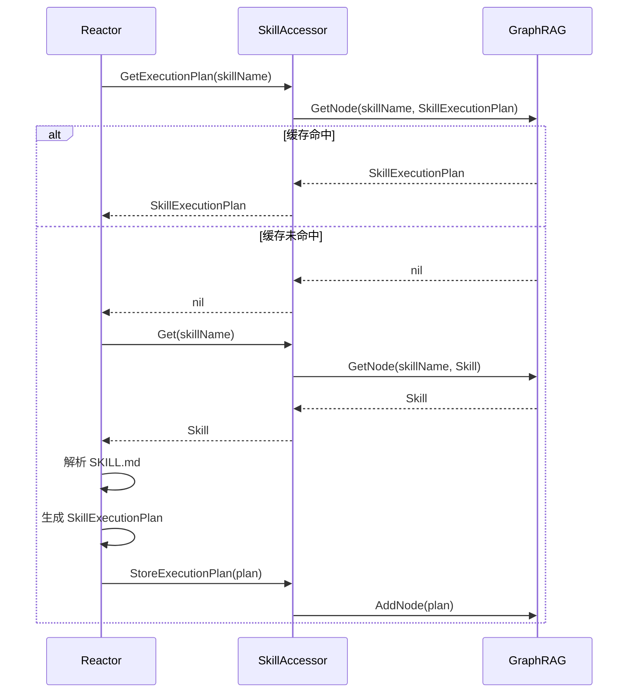
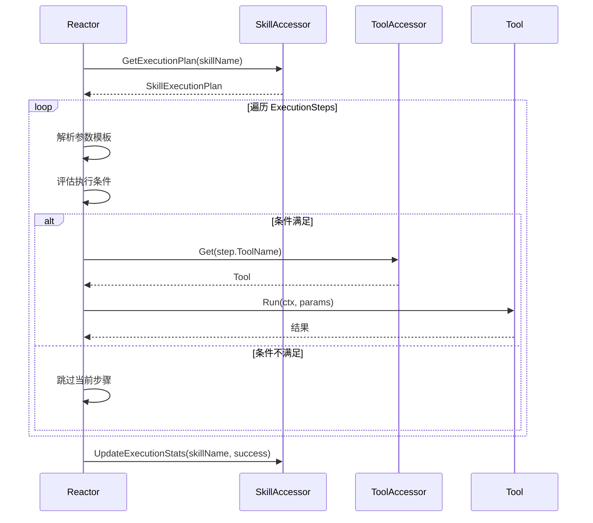
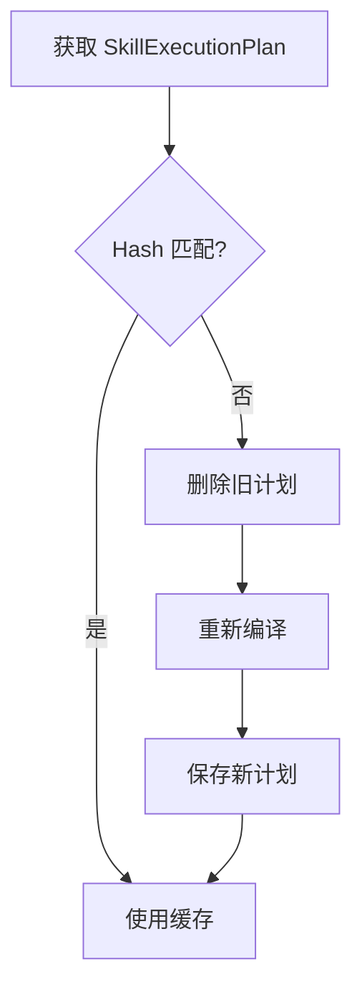

# Skill 编译缓存机制

本文档描述 Skill 的 JIT 编译与 SkillExecutionPlan 节点的生成机制。

> **相关文档**: [Memory 节点定义](memory-nodes.md) - SkillExecutionPlan 与 ExecutionStep 节点的详细定义

## 1. 编译缓存节点

Skill 的编译缓存涉及以下节点类型（详见 [Memory 节点定义](memory-nodes.md#2-编译缓存节点)）：

| 节点类型 | 说明 | 存储位置 |
|----------|------|----------|
| Skill | 静态资源节点 | Memory（通过 GraphRAG） |
| SkillExecutionPlan | 编译后的执行计划 | Memory（通过 GraphRAG） |
| ExecutionStep | 参数化执行步骤 | SkillExecutionPlan 的子结构 |

### 1.1 节点关系


## 2. JIT 编译思想

为了兼顾"人类可读性"与"机器执行效率"，GoReAct 对 Skill 采用 JIT（Just-In-Time）编译机制：

| 阶段 | 说明 | 执行者 |
|------|------|--------|
| 解释阶段 | Reactor 读取 SKILL.md | Reactor |
| 编译阶段 | 解析步骤，生成 SkillExecutionPlan | Reactor |
| 存储阶段 | 将 SkillExecutionPlan 存入 Memory | SkillAccessor |
| 执行阶段 | 直接执行参数化步骤 | Reactor |

### 2.1 设计优势

| 优势 | 说明 |
|------|------|
| 指令一致性 | 避免每次 LLM 解析 Markdown 带来的随机性 |
| 响应速度 | 省去复杂的 Prompt 生成和指令理解开销 |
| 可观测性 | 开发者可查看编译后的执行计划 |

## 3. 编译流程

### 3.1 流程图



### 3.2 编译器职责

Reactor 内部的编译器负责：

1. **解析 Frontmatter**：提取 name、description、allowed-tools 等
2. **解析 Body**：将 Markdown 步骤转换为 ExecutionStep 列表
3. **参数提取**：识别模板变量，生成 ParameterSpec
4. **Hash 计算**：计算 Skill 内容的 Hash 用于缓存失效检测

### 3.3 编译器接口

```go
type SkillCompiler interface {
    Compile(ctx context.Context, skill *Skill) (*SkillExecutionPlan, error)
}
```

## 4. 执行流程

### 4.1 流程图



### 4.2 执行器职责

Reactor 内部的执行器负责：

1. **参数解析**：使用 Go text/template 解析参数模板
2. **条件评估**：评估 ExecutionStep.Condition
3. **工具调用**：通过 ToolAccessor 获取并执行工具
4. **错误处理**：根据 OnError 策略处理失败
5. **统计更新**：更新 ExecutionCount 和 SuccessRate

## 5. 模板引擎

ExecutionStep 使用 Go 标准库 `text/template` 作为表达式引擎：

### 5.1 模板上下文

```go
type TemplateContext struct {
    Session *SessionState      // 当前会话状态
    Steps   []*StepResult      // 前序步骤结果
    Params  map[string]any     // 调用参数
    Runtime *RuntimeContext    // 运行时上下文
}
```

### 5.2 模板示例

```go
// 访问会话状态
"{{.Session.Name}}"

// 引用前序步骤结果
"{{.Steps[0].Result.Files[0]}}"

// 条件判断
"{{if .Steps[0].Success}}...{{end}}"

// 默认值
"{{.Params.Pattern | default \"**/*.go\"}}"
```

## 6. 缓存失效

### 6.1 失效条件

| 条件 | 检测方式 |
|------|----------|
| SKILL.md 内容变更 | Hash 不匹配 |
| 依赖文件变更 | scripts/references Hash 不匹配 |
| 模型版本不兼容 | 版本检查失败 |

### 6.2 失效处理



### 6.3 SkillAccessor 接口

```go
type SkillAccessor interface {
    // 基础操作
    Get(ctx context.Context, name string) (*Skill, error)
    List(ctx context.Context, opts ...ListOption) ([]*Skill, error)
    
    // 执行计划操作
    GetExecutionPlan(ctx context.Context, skillName string) (*SkillExecutionPlan, error)
    StoreExecutionPlan(ctx context.Context, plan *SkillExecutionPlan) error
    DeleteExecutionPlan(ctx context.Context, skillName string) error
    
    // 统计更新
    UpdateExecutionStats(ctx context.Context, skillName string, success bool, duration time.Duration) error
}
```

## 7. 相关文档

- [Memory 节点定义](memory-nodes.md) - SkillExecutionPlan 与 ExecutionStep 节点详细定义
- [Memory 接口设计](memory-interfaces.md) - SkillAccessor 接口详细定义
- [Skill 模块概述](skill-module.md) - 模块基础概念
- [Skill 资源管理](skill-resource.md) - 资源管理与访问器
