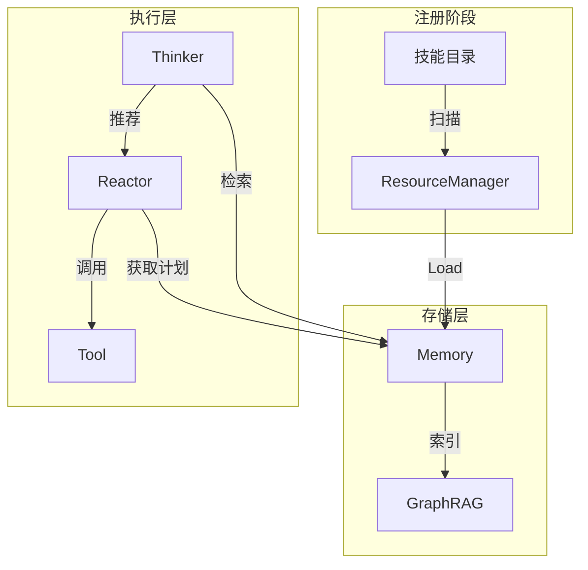
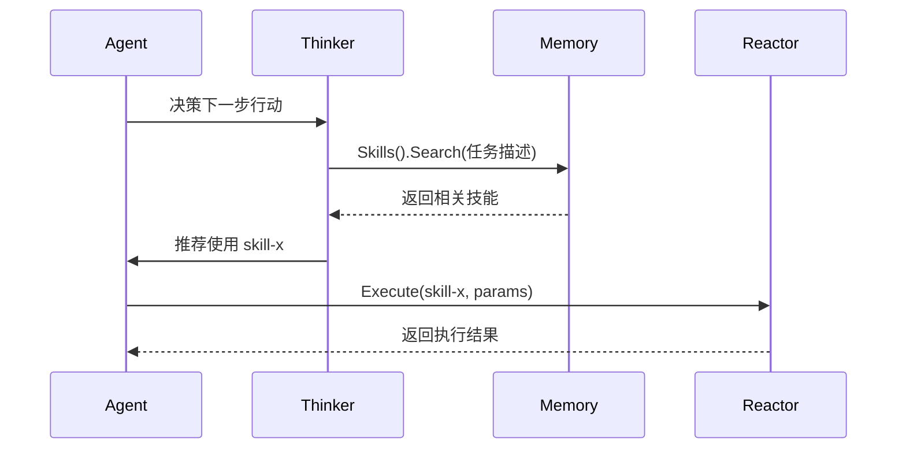
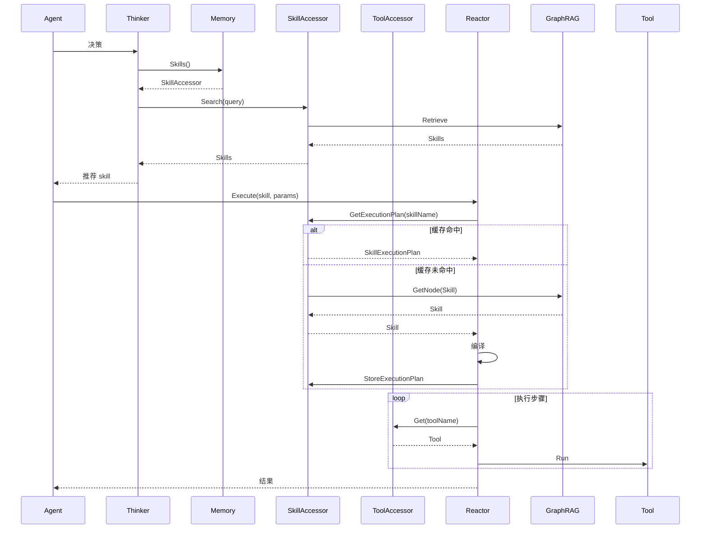

# Skill 示例与模块关系

本文档提供内置技能示例，并描述 Skill 模块与其他模块的关系。

## 1. 内置技能示例

### 1.1 代码审查技能

**目录结构**：

```
code-review/
├── SKILL.md
├── scripts/
│   └── analyze.py
├── references/
│   └── REFERENCE.md
└── assets/
    └── template.json
```

**SKILL.md**：

```markdown
---
name: code-review
description: 专业的代码审查技能，用于检查代码质量、性能问题、安全隐患和最佳实践
allowed-tools: read grep glob
---

# 代码审查技能

你是一位专业的代码审查专家。请对代码进行全面审查。

## 审查维度

1. **代码质量**：检查可读性、可维护性
2. **性能问题**：识别潜在的性能瓶颈
3. **安全隐患**：发现可能的安全漏洞
4. **最佳实践**：验证是否遵循编码规范

## 步骤

1. 使用 `glob` 定位目标文件
2. 使用 `read` 读取文件内容
3. 使用 `grep` 搜索特定模式
4. 分析并生成审查报告

## 输出格式

参见 [模板](assets/template.json)。
```

### 1.2 Git 操作技能

**目录结构**：

```
git-ops/
├── SKILL.md
├── scripts/
│   ├── commit.sh
│   └── branch.sh
└── references/
    └── WORKFLOW.md
```

**SKILL.md**：

```markdown
---
name: git-ops
description: Git 版本控制操作技能，支持分支管理、提交、合并等操作
allowed-tools: bash read write
---

# Git 操作技能

执行 Git 版本控制操作。

## 支持的操作

- 分支管理：创建、切换、删除分支
- 提交管理：暂存、提交、修改提交
- 合并操作：合并分支、解决冲突
- 远程操作：推送、拉取、同步

## 步骤

1. 检查当前 Git 状态
2. 执行指定操作
3. 验证操作结果
4. 报告操作状态
```

### 1.3 文档生成技能

**目录结构**：

```
doc-gen/
├── SKILL.md
├── scripts/
│   └── generate.py
├── references/
│   └── STYLE_GUIDE.md
└── assets/
    ├── api_template.md
    └── readme_template.md
```

**SKILL.md**：

```markdown
---
name: doc-gen
description: 文档生成技能，自动生成 API 文档、README 和使用指南
allowed-tools: read write glob
---

# 文档生成技能

根据代码自动生成文档。

## 支持的文档类型

- API 文档
- README 文件
- 使用指南
- 变更日志

## 步骤

1. 扫描目标代码文件
2. 解析代码注释和结构
3. 应用文档模板
4. 生成最终文档
```

## 2. 与其他模块的关系

### 2.1 模块交互总览



### 2.2 与 ResourceManager 的关系

| 操作 | 负责模块 | 说明 |
|------|----------|------|
| 技能目录扫描 | ResourceManager | 发现并注册技能目录 |
| 元数据解析 | ResourceManager | 解析 SKILL.md frontmatter |
| 贫血对象持有 | ResourceManager | 持有 Skill 实例 |

### 2.3 与 Memory 的关系

| 操作 | 负责模块 | 说明 |
|------|----------|------|
| 技能索引 | Memory.Load | 将 Skill 索引到 GraphRAG |
| 向量化存储 | GraphRAG | 对 description 进行向量化 |
| 执行计划存储 | SkillAccessor | 存储编译后的 SkillExecutionPlan |
| 语义检索 | SkillAccessor | 向量相似度搜索 |

### 2.4 与 Reactor 的关系

| 操作 | 负责模块 | 说明 |
|------|----------|------|
| 执行计划编译 | Reactor | 将 Skill 编译为 SkillExecutionPlan |
| 步骤执行 | Reactor | 按序执行参数化步骤 |
| 参数解析 | Reactor | 模板变量替换 |
| 条件评估 | Reactor | 评估执行条件 |

### 2.5 与 Tool 的关系

| 层级 | 职责 | 示例 |
|------|------|------|
| Tool | 原子操作 | Read, Write, Bash |
| Skill | 业务编排 | CodeReview, GitOps |
| SkillExecutionPlan | 编译后的执行序列 | 参数化步骤列表 |

**关系说明**：
- Skill 通过 `allowed-tools` 声明依赖的工具
- ExecutionStep 中的 `toolName` 引用具体工具
- Reactor 通过 ToolAccessor 获取并执行工具

### 2.6 与 Agent 的关系



## 3. 完整执行流程



## 4. 相关文档

- [Skill 模块概述](skill-module.md) - 模块基础概念
- [Skill 编译缓存机制](skill-compilation.md) - JIT 编译与执行计划
- [Skill 资源管理](skill-resource.md) - 资源管理与访问器
- [Memory 模块设计](memory-module.md) - Memory 架构
- [Reactor 模块设计](reactor-module.md) - 执行引擎
