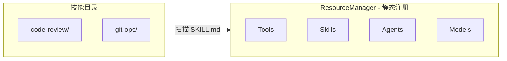
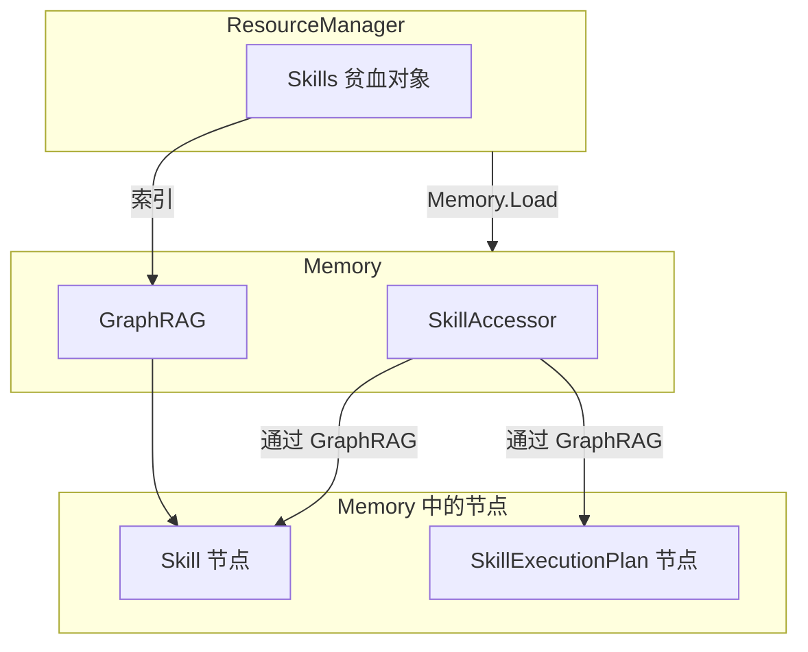
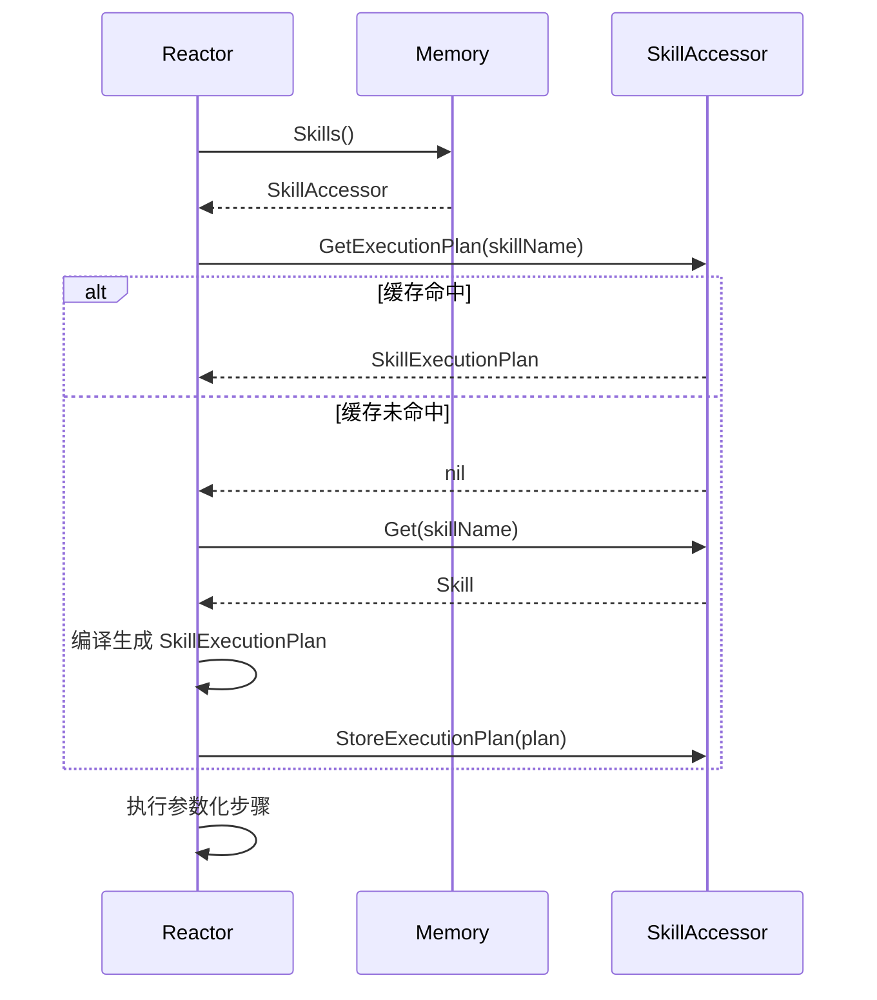

# Skill 模块设计

## 1. 模块概述

Skill（技能）是 GoReAct 框架的**可复用能力单元**。Skill 通过 Markdown 文件定义，包含指令、脚本和资源，使 Agent 能够快速获得专业能力。

### 1.1 设计哲学

- **声明式定义**: Skill 通过 SKILL.md 文件定义，不是代码接口
- **静态资源**: Skill 是 ResourceManager 管理的静态资源，是贫血对象
- **编译缓存**: 首次执行后编译为 SkillExecutionPlan 节点，存入 Memory

### 1.2 核心职责

| 职责     | 说明                                   |
| -------- | -------------------------------------- |
| 能力定义 | 通过 Markdown 定义技能的元数据和指令   |
| 资源组织 | 组织脚本、文档、模板等资源文件         |
| 编译缓存 | 首次执行后生成 SkillExecutionPlan 节点 |

### 1.3 Skill 不负责什么

| 不负责       | 由谁负责                |
| ------------ | ----------------------- |
| 技能注册     | ResourceManager         |
| 技能索引     | Memory（通过 GraphRAG） |
| 技能检索     | Memory.Skills()         |
| 技能执行     | Reactor                 |
| 执行计划编译 | Reactor                 |
| 执行计划存储 | Memory                  |

## 2. 与其他模块的关系

### 2.1 与 ResourceManager 的关系

Skill 是 ResourceManager 管理的静态资源之一：



**ResourceManager 职责**：
- 扫描技能目录，解析 SKILL.md
- 持有 Skill 的贫血对象实例
- 提供 `GetSkill(name)` 方法获取 Skill

### 2.2 与 Memory 的关系

Memory.Load 将 Skill 索引到 GraphRAG，后续通过 SkillAccessor 访问：



**Memory 职责**：
- `Memory.Load(rm)` 将 Skill 索引到 GraphRAG
- `Memory.Skills()` 返回 SkillAccessor
- SkillAccessor 通过 GraphRAG 操作 Skill 节点

### 2.3 与 Reactor 的关系

Reactor 负责编译和执行 Skill：



## 3. Skill 目录结构

### 3.1 标准结构

```
skill-name/
├── SKILL.md          # 必需：元数据 + 指令
├── scripts/          # 可选：可执行代码
│   ├── extract.py
│   └── transform.sh
├── references/       # 可选：文档
│   ├── REFERENCE.md
│   └── examples.md
└── assets/           # 可选：模板、资源
    ├── template.json
    └── schema.yaml
```

### 3.2 目录说明

| 目录        | 必需 | 说明                                   |
| ----------- | ---- | -------------------------------------- |
| SKILL.md    | 是   | 元数据 + 指令，核心文件                |
| scripts/    | 否   | 可执行代码（Python、Bash、JavaScript） |
| references/ | 否   | 详细文档、参考材料                     |
| assets/     | 否   | 模板、配置、数据文件                   |

## 4. SKILL.md 格式

### 4.1 文件结构

```markdown
---
name: skill-name
description: 描述技能做什么以及何时使用
license: MIT
compatibility: 需要 Python 3.8+
metadata:
  author: team
  version: 1.0.0
allowed-tools: read write bash
---

# 技能指令

这里是写给 Agent 的指令...

## 步骤说明

1. 第一步...
2. 第二步...

## 示例

输入：...
输出：...
```

### 4.2 Frontmatter 字段

| 字段          | 必需 | 约束                             | 说明                       |
| ------------- | ---- | -------------------------------- | -------------------------- |
| name          | 是   | 1-64字符，小写字母、数字、连字符 | 技能名称，必须与目录名一致 |
| description   | 是   | 1-1024字符                       | 描述技能做什么以及何时使用 |
| license       | 否   | 许可证名称或文件引用             | 技能的许可证               |
| compatibility | 否   | 1-500字符                        | 环境要求（产品、包、网络） |
| metadata      | 否   | 键值对                           | 额外元数据                 |
| allowed-tools | 否   | 空格分隔的工具列表               | 预批准的工具（实验性）     |

## 5. 模块文档索引

| 文档                                         | 内容                               |
| -------------------------------------------- | ---------------------------------- |
| [skill-compilation.md](skill-compilation.md) | JIT 编译与 SkillExecutionPlan 节点 |
| [skill-resource.md](skill-resource.md)       | 资源管理与 SkillAccessor 接口      |
| [skill-examples.md](skill-examples.md)       | 内置技能示例                       |

## 6. 相关文档

- [Memory 模块设计](memory-module.md) - Memory 架构与访问器模式
- [Memory 节点定义](memory-nodes.md) - Skill 节点与 SkillExecutionPlan 节点
- [Memory 接口设计](memory-interfaces.md) - SkillAccessor 接口定义
- [ResourceManager 模块](resource-management-module.md) - 静态资源注册
