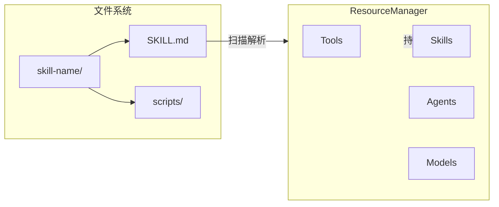
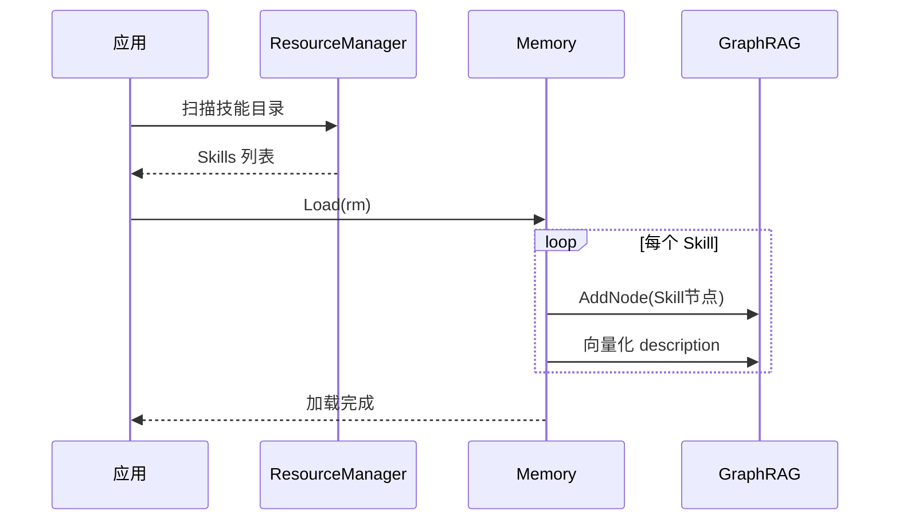
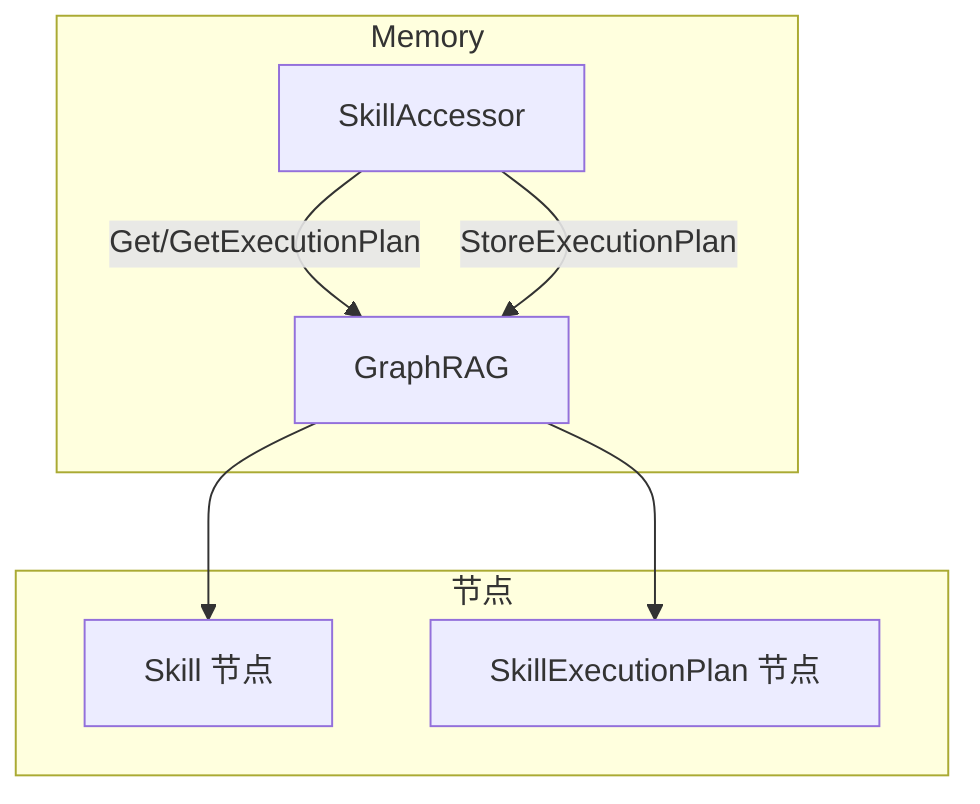
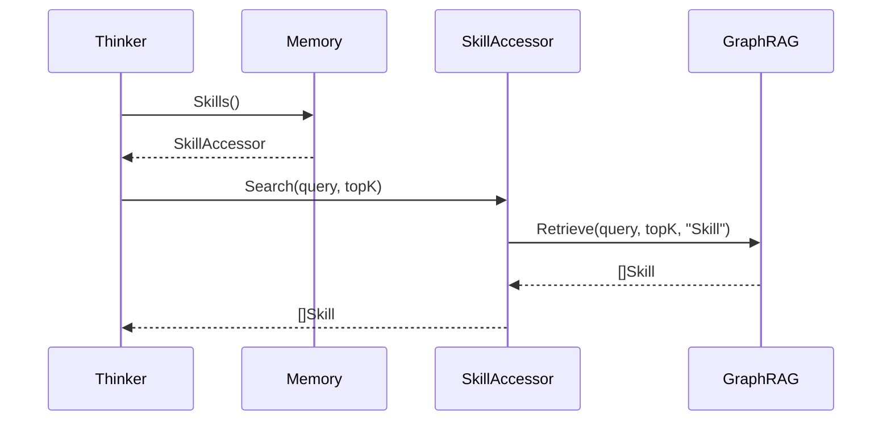

# Skill 资源管理

本文档描述 Skill 作为静态资源的管理方式，以及通过 SkillAccessor 访问的机制。

> **相关文档**: [Memory 接口设计](memory-interfaces.md) - SkillAccessor 接口详细定义

## 1. Skill 作为静态资源

### 1.1 资源性质

Skill 是 ResourceManager 管理的静态资源之一：

| 特性 | 说明 |
|------|------|
| 贫血对象 | 只持有数据，不包含业务逻辑 |
| 文件定义 | 通过 SKILL.md 文件定义 |
| 目录结构 | 包含 scripts、references、assets 等子目录 |

### 1.2 与 ResourceManager 的关系



**ResourceManager 职责**：
- 扫描技能目录
- 解析 SKILL.md 的 Frontmatter 和 Body
- 持有 Skill 贫血对象实例
- 提供 `GetSkill(name)` 方法

## 2. Memory.Load 过程

### 2.1 加载流程



### 2.2 索引内容

Memory.Load 将 Skill 索引到 GraphRAG 时：

| 内容 | 说明 |
|------|------|
| Skill 节点 | 包含 name、description、path 等属性 |
| 向量索引 | 对 description 进行向量化，支持语义检索 |

**注意**：SkillExecutionPlan 在首次执行时才生成，不在 Load 阶段创建。

## 3. SkillAccessor 接口

### 3.1 接口定义

SkillAccessor 是 Memory 的访问器之一，通过 GraphRAG 操作 Skill 相关节点：

```go
type SkillAccessor struct {
    BaseAccessor
}

func (a *SkillAccessor) Get(ctx context.Context, name string) (*Skill, error)
func (a *SkillAccessor) List(ctx context.Context, opts ...ListOption) ([]*Skill, error)

func (a *SkillAccessor) GetExecutionPlan(ctx context.Context, skillName string) (*SkillExecutionPlan, error)
func (a *SkillAccessor) StoreExecutionPlan(ctx context.Context, plan *SkillExecutionPlan) error
func (a *SkillAccessor) DeleteExecutionPlan(ctx context.Context, skillName string) error

func (a *SkillAccessor) UpdateExecutionStats(ctx context.Context, skillName string, success bool, duration time.Duration) error
```

### 3.2 访问器架构



### 3.3 使用示例

```go
// 获取 SkillAccessor
skills := memory.Skills()

// 获取 Skill
skill, err := skills.Get(ctx, "code-review")

// 列出所有 Skill
list, err := skills.List(ctx)

// 获取执行计划
plan, err := skills.GetExecutionPlan(ctx, "code-review")

// 存储执行计划
err := skills.StoreExecutionPlan(ctx, plan)

// 更新执行统计
err := skills.UpdateExecutionStats(ctx, "code-review", true, 150*time.Millisecond)
```

## 4. 语义检索

### 4.1 检索流程

Skill 的 description 在 Memory.Load 时被向量化，支持语义检索：



### 4.2 检索接口

```go
type SkillAccessor interface {
    // 语义检索
    Search(ctx context.Context, query string, topK int) ([]*Skill, error)
}
```

## 5. 与其他访问器的关系

### 5.1 与 ToolAccessor 的关系

Skill 通过 `allowed-tools` 声明依赖的工具：


执行时通过 ToolAccessor 获取工具：

```go
tools := memory.Tools()
tool, err := tools.Get(ctx, step.ToolName)
```

### 5.2 与 AgentAccessor 的关系

Agent 通过 `skills` 字段声明拥有的技能：


```go
agents := memory.Agents()
skills, err := agents.GetSkills(ctx, "assistant")
```

## 6. 相关文档

- [Memory 模块设计](memory-module.md) - Memory 架构与访问器模式
- [Memory 接口设计](memory-interfaces.md) - SkillAccessor 接口详细定义
- [Memory 节点定义](memory-nodes.md) - Skill 节点定义
- [ResourceManager 模块](resource-management-module.md) - 静态资源注册
