# 思考器模块设计

## 1. 模块概述

思考器（Thinker）是 ReAct 循环中的核心组件，负责在每一步执行前进行推理和决策。它接收当前状态，结合历史记忆和上下文，通过 LLM 生成下一步的思考内容，决定是执行行动还是给出最终答案。

### 1.1 核心职责

- **意图识别**：识别用户输入的真实意图，决定后续处理路径
- **推理决策**：分析当前状态，决定下一步行动
- **上下文构建**：整合历史记忆、反思建议、计划上下文
- **提示词构建**：构建结构化的推理提示词
- **响应解析**：解析 LLM 响应，提取 Thought 结构

### 1.2 设计原则

- **意图优先**：先识别意图，再决定处理方式
- **上下文感知**：充分利用 Memory 中的历史信息
- **反思驱动**：注入相关反思建议指导推理
- **计划对齐**：确保思考与当前计划步骤一致
- **可解释性**：生成清晰的推理链和决策依据

## 2. 意图识别设计

意图识别是 Think 过程的第一步，决定了后续的处理路径。

### 2.1 意图类型

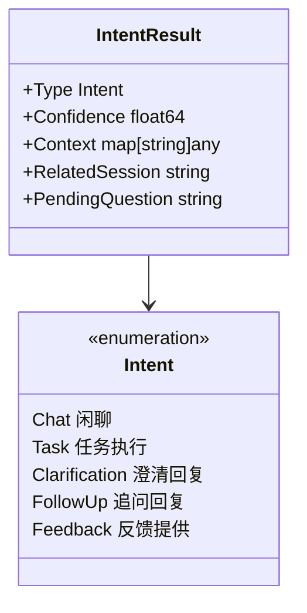
```mermaid
classDiagram
    class Intent {
        <<enumeration>>
        Chat 闲聊
        Task 任务执行
        Clarification 澄清回复
        FollowUp 追问回复
        Feedback 反馈提供
    }
    
    class IntentResult {
        +Type Intent
        +Confidence float64
        +Context map[string]any
        +RelatedSession string
        +PendingQuestion string
    }
    
    IntentResult --> Intent
```

| 意图类型      | 说明                        | 后续处理                               |
| ------------- | --------------------------- | -------------------------------------- |
| Chat          | 闲聊，无具体任务            | 直接生成对话响应，不进入 ReAct 循环    |
| Task          | 需要执行的任务              | 进入完整的 Plan-Think-Act-Observe 循环 |
| Clarification | 回答 Reactor 提出的澄清问题 | 提取答案，继续之前的执行流程           |
| FollowUp      | 对上一轮结果的追问          | 加载上下文，进入 ReAct 循环            |
| Feedback      | 对执行结果的反馈            | 更新记忆，可能触发重新执行             |

### 2.2 意图识别流程

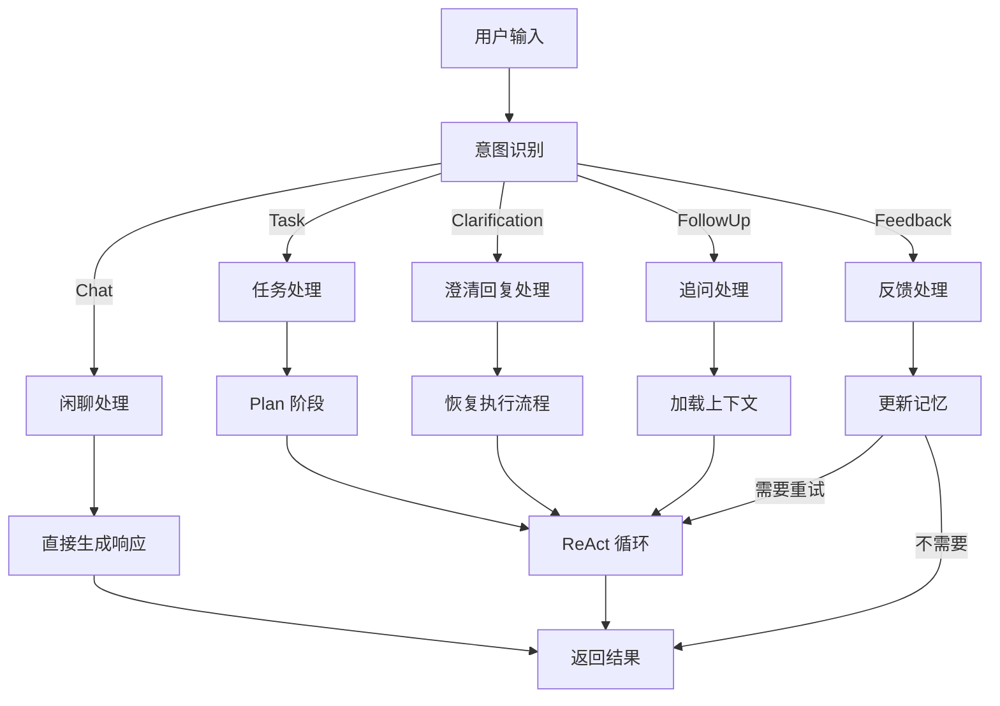
```mermaid
flowchart TB
    Input[用户输入] --> IntentRecognition[意图识别]
    
    IntentRecognition --> |Chat| ChatHandler[闲聊处理]
    IntentRecognition --> |Task| TaskHandler[任务处理]
    IntentRecognition --> |Clarification| ClarificationHandler[澄清回复处理]
    IntentRecognition --> |FollowUp| FollowUpHandler[追问处理]
    IntentRecognition --> |Feedback| FeedbackHandler[反馈处理]
    
    ChatHandler --> DirectResponse[直接生成响应]
    TaskHandler --> PlanPhase[Plan 阶段]
    ClarificationHandler --> ResumeExecution[恢复执行流程]
    FollowUpHandler --> LoadContext[加载上下文]
    FeedbackHandler --> UpdateMemory[更新记忆]
    
    DirectResponse --> Return[返回结果]
    PlanPhase --> ReActLoop[ReAct 循环]
    ResumeExecution --> ReActLoop
    LoadContext --> ReActLoop
    UpdateMemory --> |需要重试| ReActLoop
    UpdateMemory --> |不需要| Return
    ReActLoop --> Return
```

### 2.3 意图识别实现

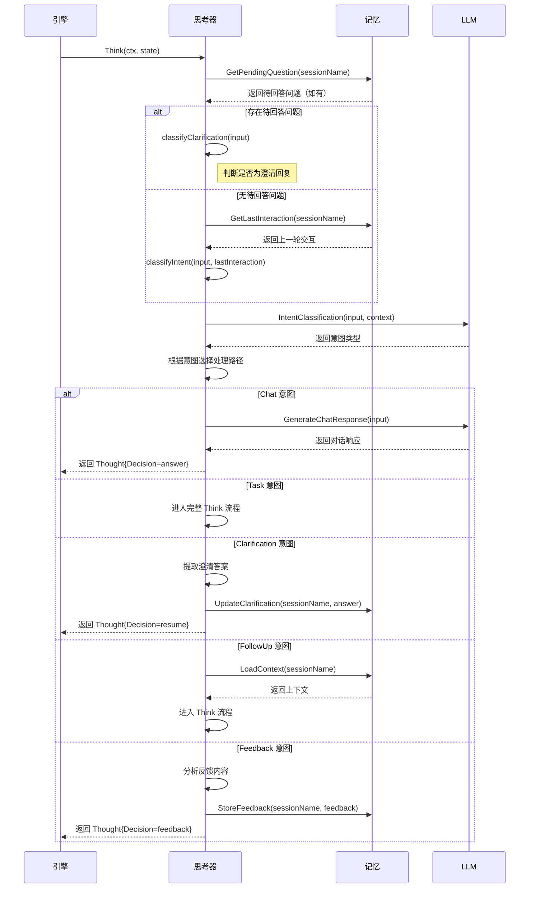
```mermaid
sequenceDiagram
    participant Engine as 引擎
    participant Thinker as 思考器
    participant Memory as 记忆
    participant LLM as LLM

    Engine->>Thinker: Think(ctx, state)
    
    Thinker->>Memory: GetPendingQuestion(sessionName)
    Memory-->>Thinker: 返回待回答问题（如有）
    
    alt 存在待回答问题
        Thinker->>Thinker: classifyClarification(input)
        Note right of Thinker: 判断是否为澄清回复
    else 无待回答问题
        Thinker->>Memory: GetLastInteraction(sessionName)
        Memory-->>Thinker: 返回上一轮交互
        
        Thinker->>Thinker: classifyIntent(input, lastInteraction)
    end
    
    Thinker->>LLM: IntentClassification(input, context)
    LLM-->>Thinker: 返回意图类型
    
    Thinker->>Thinker: 根据意图选择处理路径
    
    alt Chat 意图
        Thinker->>LLM: GenerateChatResponse(input)
        LLM-->>Thinker: 返回对话响应
        Thinker-->>Engine: 返回 Thought{Decision=answer}
    else Task 意图
        Thinker->>Thinker: 进入完整 Think 流程
    else Clarification 意图
        Thinker->>Thinker: 提取澄清答案
        Thinker->>Memory: UpdateClarification(sessionName, answer)
        Thinker-->>Engine: 返回 Thought{Decision=resume}
    else FollowUp 意图
        Thinker->>Memory: LoadContext(sessionName)
        Memory-->>Thinker: 返回上下文
        Thinker->>Thinker: 进入 Think 流程
    else Feedback 意图
        Thinker->>Thinker: 分析反馈内容
        Thinker->>Memory: StoreFeedback(sessionName, feedback)
        Thinker-->>Engine: 返回 Thought{Decision=feedback}
    end
```

### 2.4 意图识别提示词

```
你是一个意图识别引擎。请分析用户输入的真实意图。

## 用户输入
{{.Input}}

## 上下文
{{if .PendingQuestion}}
系统正在等待用户回答澄清问题：{{.PendingQuestion}}
{{end}}

{{if .LastInteraction}}
上一轮交互：
- 问题：{{.LastInteraction.Question}}
- 回答：{{.LastInteraction.Answer}}
{{end}}

## 意图类型
1. Chat - 闲聊，无具体任务需求
2. Task - 需要执行具体任务
3. Clarification - 回答系统提出的澄清问题
4. FollowUp - 对上一轮结果的追问或延续
5. Feedback - 对执行结果的反馈或评价

## 输出格式
请以 JSON 格式输出：
{
  "intent": "意图类型",
  "confidence": 0.0-1.0,
  "reasoning": "判断理由",
  "context": {
    "related_session": "关联的会话ID（如有）",
    "extracted_answer": "提取的答案（针对澄清回复）"
  }
}
```

### 2.5 意图识别失败处理

当意图识别失败或置信度过低时，需要采取降级策略：

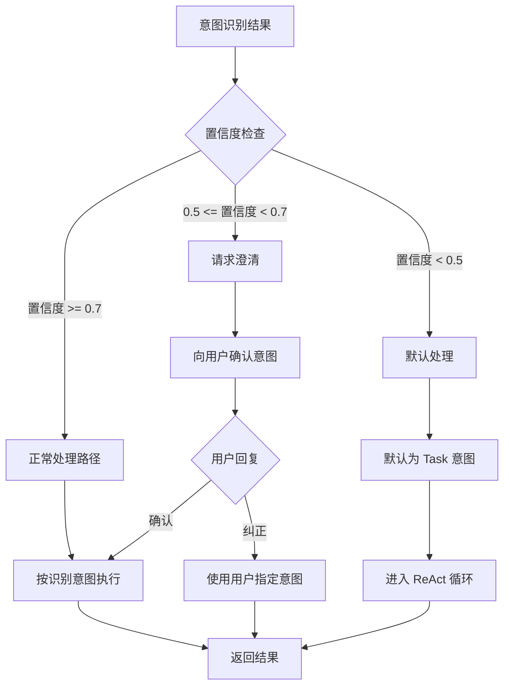
```mermaid
flowchart TB
    IntentResult[意图识别结果] --> CheckConfidence{置信度检查}
    
    CheckConfidence --> |置信度 >= 0.7| NormalPath[正常处理路径]
    CheckConfidence --> |0.5 <= 置信度 < 0.7| ClarifyPath[请求澄清]
    CheckConfidence --> |置信度 < 0.5| DefaultPath[默认处理]
    
    NormalPath --> ExecuteIntent[按识别意图执行]
    
    ClarifyPath --> AskUser[向用户确认意图]
    AskUser --> UserResponse{用户回复}
    UserResponse --> |确认| ExecuteIntent
    UserResponse --> |纠正| CorrectIntent[使用用户指定意图]
    
    DefaultPath --> DefaultTask[默认为 Task 意图]
    DefaultTask --> ReActLoop[进入 ReAct 循环]
    
    ExecuteIntent --> Result[返回结果]
    CorrectIntent --> Result
    ReActLoop --> Result
```

**降级策略配置**：

| 置信度范围    | 处理策略           | 说明                               |
| ------------- | ------------------ | ---------------------------------- |
| >= 0.7        | 直接执行           | 置信度足够高，按识别结果执行       |
| 0.5 - 0.7     | 请求澄清           | 置信度中等，向用户确认意图         |
| < 0.5         | 默认 Task          | 置信度过低，默认作为任务处理       |
| LLM 调用失败  | 默认 Task          | LLM 异常时，降级为任务处理         |
| 解析失败      | 默认 Task          | 响应解析失败时，降级为任务处理     |

**失败恢复机制**：

```go
type IntentFallbackStrategy struct {
    MinConfidence       float64  // 最低置信度阈值，默认 0.5
    ClarifyThreshold    float64  // 澄清请求阈值，默认 0.7
    DefaultIntent       Intent   // 默认意图，默认 Task
    MaxRetries          int      // 最大重试次数，默认 2
    EnableClarification bool     // 是否启用澄清请求，默认 true
}
```

### 2.6 意图识别准确性保障

为确保意图识别的准确性和一致性，需要采取以下措施：

**模型无关的提示词模板**：

```markdown
你是一个意图分类器。请分析用户输入并返回最匹配的意图类型。

## 输入分析
- 用户输入：{{.Input}}
- 上下文：{{.Context}}

## 意图类型定义
1. **Chat** - 闲聊、问候、一般性对话，无具体任务需求
2. **Task** - 需要执行具体操作或解决特定问题
3. **Clarification** - 回答系统提出的澄清问题
4. **FollowUp** - 对上一轮结果的追问或延续
5. **Feedback** - 对执行结果的反馈或评价

## 分类规则
- 如果输入包含明确的操作动词（如"帮我"、"请"、"执行"），倾向于 Task
- 如果输入是对问题的回答，倾向于 Clarification
- 如果输入以"继续"、"然后"开头，倾向于 FollowUp
- 如果输入表达满意/不满意，倾向于 Feedback
- 如果输入是问候或无明确目的，倾向于 Chat

## 输出格式（严格遵守）
```json
{
  "intent": "<意图类型>",
  "confidence": <0.0-1.0>,
  "reasoning": "<判断理由>"
}
```
```

**测试用例集**：

```go
var intentTestCases = []struct {
    Input    string
    Context  string
    Expected Intent
}{
    // Chat 意图测试
    {"你好", "", IntentChat},
    {"今天天气怎么样", "", IntentChat},
    {"你是谁", "", IntentChat},
    
    // Task 意图测试
    {"帮我分析这段代码", "", IntentTask},
    {"请删除 temp 目录", "", IntentTask},
    {"执行测试用例", "", IntentTask},
    
    // Clarification 意图测试
    {"是的，确认删除", "是否删除 temp 目录？", IntentClarification},
    {"文件名是 main.go", "请提供文件名", IntentClarification},
    
    // FollowUp 意图测试
    {"继续执行", "", IntentFollowUp},
    {"然后呢", "", IntentFollowUp},
    {"再详细一点", "", IntentFollowUp},
    
    // Feedback 意图测试
    {"这个结果不对", "", IntentFeedback},
    {"很好，正是我想要的", "", IntentFeedback},
    {"下次注意格式", "", IntentFeedback},
}
```

**准确率验证流程**：

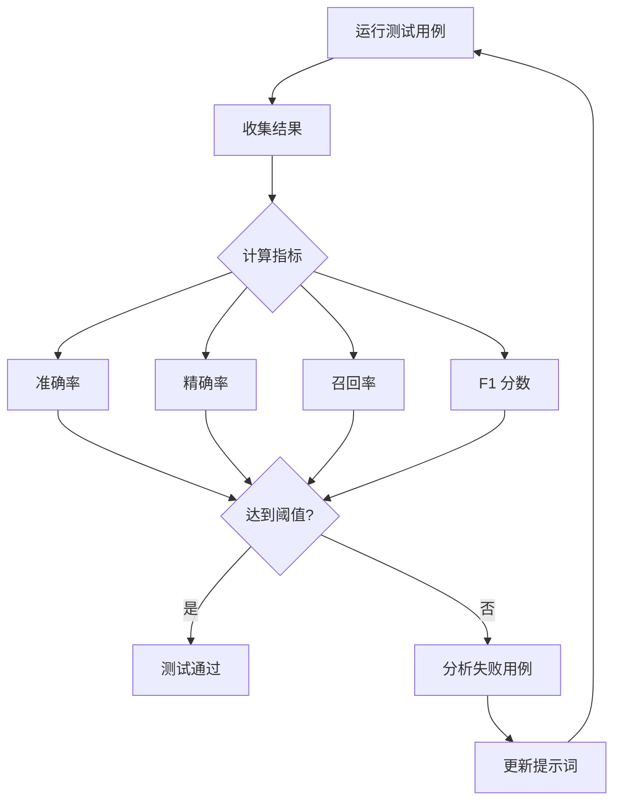
```mermaid
flowchart TB
    RunTests[运行测试用例] --> CollectResults[收集结果]
    CollectResults --> CalculateMetrics{计算指标}
    
    CalculateMetrics --> Accuracy[准确率]
    CalculateMetrics --> Precision[精确率]
    CalculateMetrics --> Recall[召回率]
    CalculateMetrics --> F1[F1 分数]
    
    Accuracy --> CheckThreshold{达到阈值?}
    Precision --> CheckThreshold
    Recall --> CheckThreshold
    F1 --> CheckThreshold
    
    CheckThreshold --> |是| Pass[测试通过]
    CheckThreshold --> |否| AnalyzeFailures[分析失败用例]
    
    AnalyzeFailures --> UpdatePrompt[更新提示词]
    UpdatePrompt --> RunTests
```

**准确率指标要求**：

| 指标     | 最低要求 | 推荐目标 |
| -------- | -------- | -------- |
| 准确率   | 85%      | 95%      |
| 精确率   | 80%      | 90%      |
| 召回率   | 80%      | 90%      |
| F1 分数  | 0.80     | 0.90     |

**多模型兼容性测试**：

```go
func TestIntentRecognitionMultiModel(t *testing.T) {
    models := []string{"gpt-4", "claude-3", "gemini-pro"}
    
    for _, model := range models {
        t.Run(model, func(t *testing.T) {
            recognizer := NewIntentRecognizer(model)
            
            for _, tc := range intentTestCases {
                result, err := recognizer.Classify(tc.Input, tc.Context)
                require.NoError(t, err)
                assert.Equal(t, tc.Expected, result.Type)
                assert.GreaterOrEqual(t, result.Confidence, 0.7)
            }
        })
    }
}
```

## 3. 接口设计

### 3.1 核心接口

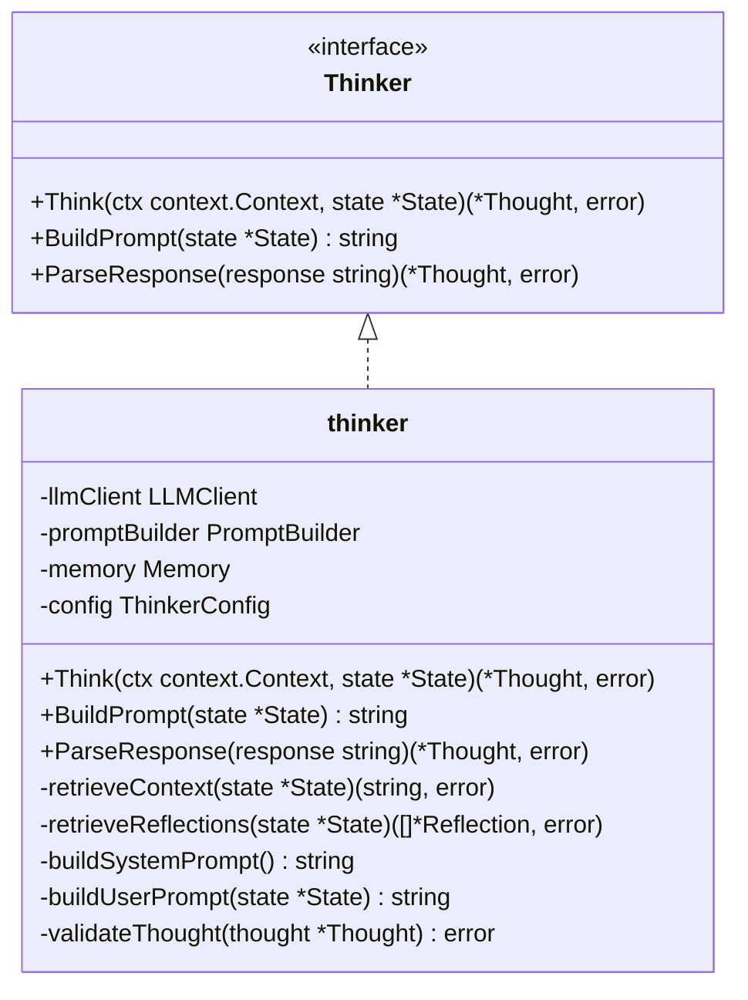
```mermaid
classDiagram
    class Thinker {
        <<interface>>
        +Think(ctx context.Context, state *State) (*Thought, error)
        +BuildPrompt(state *State) string
        +ParseResponse(response string) (*Thought, error)
    }
    
    class thinker {
        -llmClient LLMClient
        -promptBuilder PromptBuilder
        -memory Memory
        -config ThinkerConfig
        +Think(ctx context.Context, state *State) (*Thought, error)
        +BuildPrompt(state *State) string
        +ParseResponse(response string) (*Thought, error)
        -retrieveContext(state *State) (string, error)
        -retrieveReflections(state *State) ([]*Reflection, error)
        -buildSystemPrompt() string
        -buildUserPrompt(state *State) string
        -validateThought(thought *Thought) error
    }
    
    Thinker <|.. thinker
```

### 3.2 Thought 结构

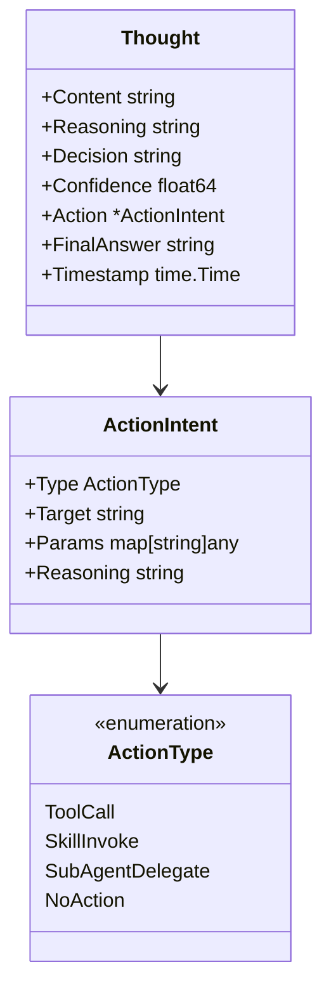
```mermaid
classDiagram
    class Thought {
        +Content string
        +Reasoning string
        +Decision string
        +Confidence float64
        +Action *ActionIntent
        +FinalAnswer string
        +Timestamp time.Time
    }
    
    class ActionIntent {
        +Type ActionType
        +Target string
        +Params map[string]any
        +Reasoning string
    }
    
    class ActionType {
        <<enumeration>>
        ToolCall
        SkillInvoke
        SubAgentDelegate
        NoAction
    }
    
    Thought --> ActionIntent
    ActionIntent --> ActionType
```

**Thought 字段说明**：

| 字段        | 类型          | 说明                          |
| ----------- | ------------- | ----------------------------- |
| Content     | string        | 思考内容的完整表述            |
| Reasoning   | string        | 推理过程和逻辑链              |
| Decision    | string        | 决策结论（执行行动/给出答案） |
| Confidence  | float64       | 决策置信度 (0.0-1.0)          |
| Action      | *ActionIntent | 如果决定行动，包含行动意图    |
| FinalAnswer | string        | 如果决定结束，包含最终答案    |
| Timestamp   | time.Time     | 思考时间戳                    |

### 3.3 ThinkerConfig 配置

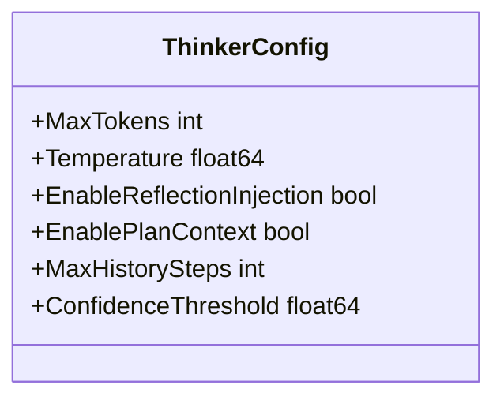
```mermaid
classDiagram
    class ThinkerConfig {
        +MaxTokens int
        +Temperature float64
        +EnableReflectionInjection bool
        +EnablePlanContext bool
        +MaxHistorySteps int
        +ConfidenceThreshold float64
    }
```

| 配置项                    | 说明               | 默认值 |
| ------------------------- | ------------------ | ------ |
| MaxTokens                 | 最大生成 Token 数  | 4096   |
| Temperature               | 生成温度           | 0.7    |
| EnableReflectionInjection | 是否注入反思建议   | true   |
| EnablePlanContext         | 是否包含计划上下文 | true   |
| MaxHistorySteps           | 最大历史步骤数     | 10     |
| ConfidenceThreshold       | 置信度阈值         | 0.8    |

## 4. 思考流程设计

### 4.1 完整思考流程

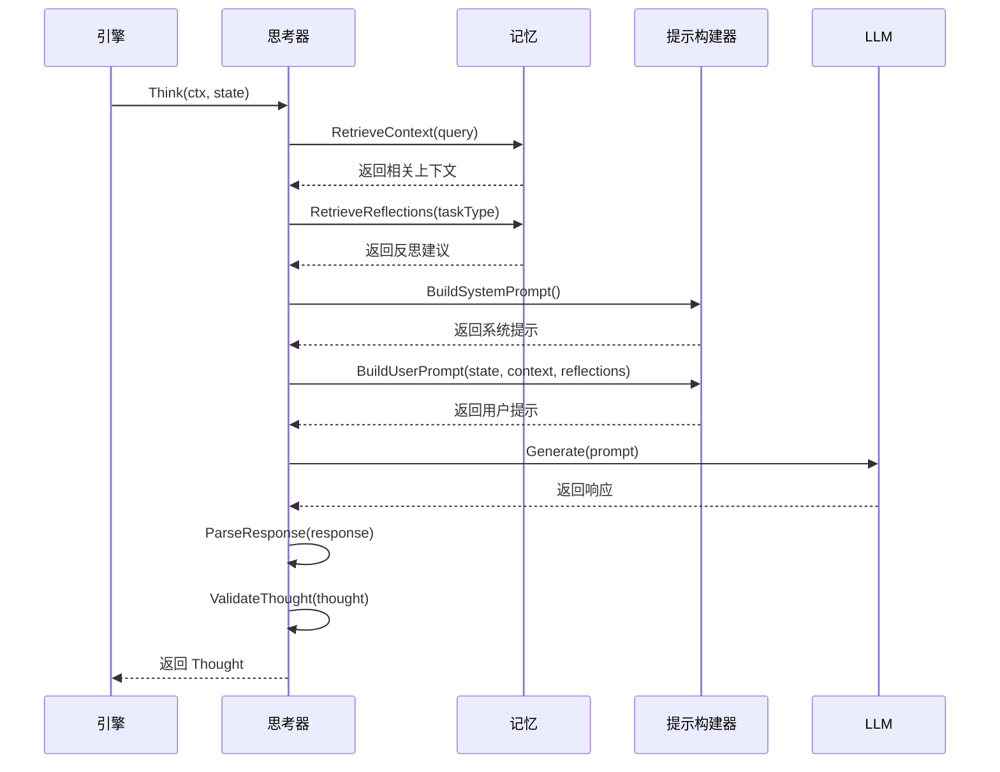
```mermaid
sequenceDiagram
    participant Engine as 引擎
    participant Thinker as 思考器
    participant Memory as 记忆
    participant PromptBuilder as 提示构建器
    participant LLM as LLM

    Engine->>Thinker: Think(ctx, state)
    
    Thinker->>Memory: RetrieveContext(query)
    Memory-->>Thinker: 返回相关上下文
    
    Thinker->>Memory: RetrieveReflections(taskType)
    Memory-->>Thinker: 返回反思建议
    
    Thinker->>PromptBuilder: BuildSystemPrompt()
    PromptBuilder-->>Thinker: 返回系统提示
    
    Thinker->>PromptBuilder: BuildUserPrompt(state, context, reflections)
    PromptBuilder-->>Thinker: 返回用户提示
    
    Thinker->>LLM: Generate(prompt)
    LLM-->>Thinker: 返回响应
    
    Thinker->>Thinker: ParseResponse(response)
    Thinker->>Thinker: ValidateThought(thought)
    
    Thinker-->>Engine: 返回 Thought
```

### 4.2 上下文检索策略

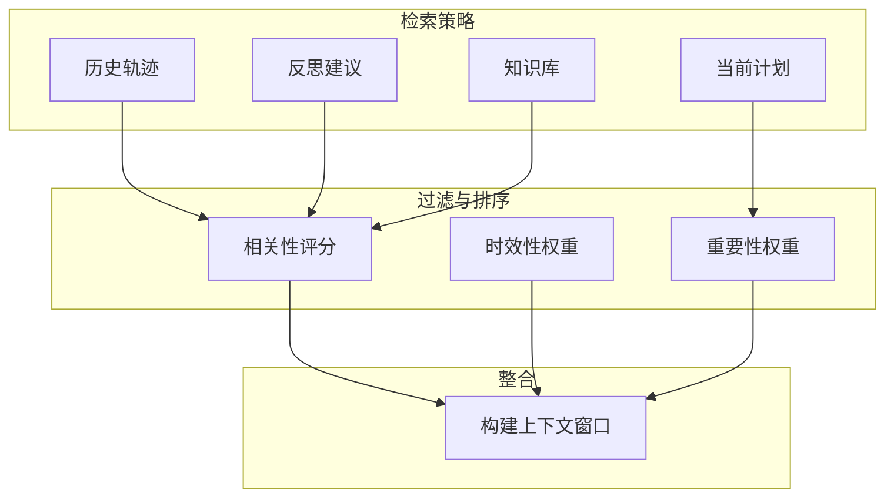
```mermaid
flowchart TB
    subgraph 检索策略
        History[历史轨迹]
        Reflections[反思建议]
        Plan[当前计划]
        Knowledge[知识库]
    end
    
    subgraph 过滤与排序
        Relevance[相关性评分]
        Recency[时效性权重]
        Importance[重要性权重]
    end
    
    subgraph 整合
        Context[构建上下文窗口]
    end
    
    History --> Relevance
    Reflections --> Relevance
    Plan --> Importance
    Knowledge --> Relevance
    
    Relevance --> Context
    Recency --> Context
    Importance --> Context
```

### 4.3 反思注入机制

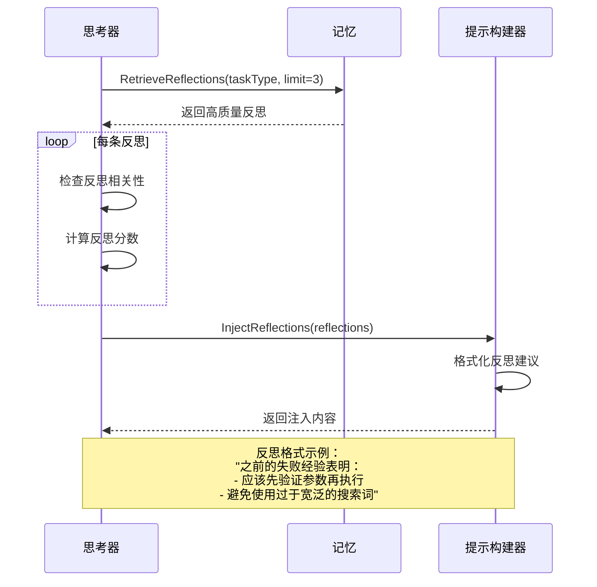
```mermaid
sequenceDiagram
    participant Thinker as 思考器
    participant Memory as 记忆
    participant PromptBuilder as 提示构建器

    Thinker->>Memory: RetrieveReflections(taskType, limit=3)
    Memory-->>Thinker: 返回高质量反思
    
    loop 每条反思
        Thinker->>Thinker: 检查反思相关性
        Thinker->>Thinker: 计算反思分数
    end
    
    Thinker->>PromptBuilder: InjectReflections(reflections)
    PromptBuilder->>PromptBuilder: 格式化反思建议
    PromptBuilder-->>Thinker: 返回注入内容
    
    Note over Thinker,PromptBuilder: 反思格式示例：<br/>"之前的失败经验表明：<br/>- 应该先验证参数再执行<br/>- 避免使用过于宽泛的搜索词"
```

## 5. 提示词构建

### 5.1 系统提示模板

```
你是一个智能推理引擎，负责分析当前状态并做出决策。

## 你的职责
1. 分析当前任务进度和历史执行结果
2. 决定下一步是执行行动还是给出最终答案
3. 如果需要行动，明确指定行动类型和参数

## 决策规则
- 如果任务已完成，给出最终答案
- 如果需要更多信息，选择合适的工具/技能
- 如果遇到困难，考虑是否需要调整策略
- 置信度低于阈值时，选择更保守的行动

## 输出格式
请以 JSON 格式输出你的思考：
{
  "content": "完整的思考内容",
  "reasoning": "推理过程",
  "decision": "act|answer",
  "confidence": 0.0-1.0,
  "action": {
    "type": "tool|skill|delegate",
    "target": "目标名称",
    "params": {},
    "reasoning": "选择此行动的原因"
  },
  "finalAnswer": "最终答案（如果 decision=answer）"
}
```

### 5.2 用户提示模板

```
## 当前任务
{{.Input}}

## 执行计划
当前步骤：{{.CurrentPlanStep}} / {{.TotalPlanSteps}}
步骤描述：{{.CurrentStepDescription}}
预期行动：{{.ExpectedAction}}

## 历史轨迹
{{range .HistorySteps}}
步骤 {{.Index}}:
- 思考：{{.Thought}}
- 行动：{{.Action}}
- 观察：{{.Observation}}
{{end}}

## 相关反思建议
{{range .Reflections}}
- {{.Heuristic}}
{{end}}

## 请做出决策
```

### 5.3 反向提示词注入

当需要抑制某些行为时，通过 PromptBuilder 注入反向提示：

```
## 行为约束
{{range .NegativePrompts}}
- {{.Content}}
{{end}}

## 示例
{{range .NegativePrompts}}
{{if .Examples}}
避免以下行为：
{{range .Examples}}
- {{.}}
{{end}}
{{end}}
{{end}}
```

## 6. 响应解析

### 6.1 解析流程

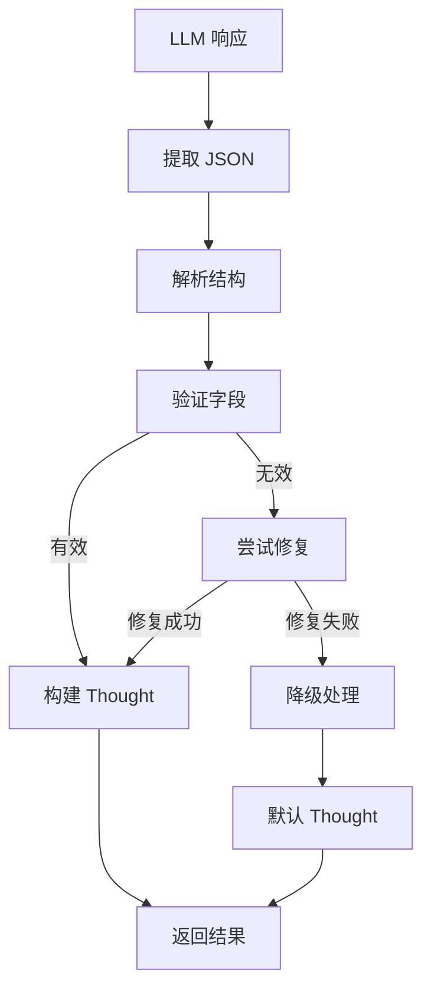
```mermaid
flowchart TB
    Response[LLM 响应] --> Extract[提取 JSON]
    Extract --> Parse[解析结构]
    Parse --> Validate[验证字段]
    
    Validate --> |有效| Build[构建 Thought]
    Validate --> |无效| Repair[尝试修复]
    
    Repair --> |修复成功| Build
    Repair --> |修复失败| Fallback[降级处理]
    
    Fallback --> Default[默认 Thought]
    
    Build --> Return[返回结果]
    Default --> Return
```

### 6.2 验证规则

| 字段        | 验证规则                    |
| ----------- | --------------------------- |
| Content     | 非空，长度 > 10             |
| Reasoning   | 非空，长度 > 20             |
| Decision    | 必须是 "act" 或 "answer"    |
| Confidence  | 范围 [0.0, 1.0]             |
| Action      | 当 decision="act" 时必填    |
| FinalAnswer | 当 decision="answer" 时必填 |

### 6.3 降级策略

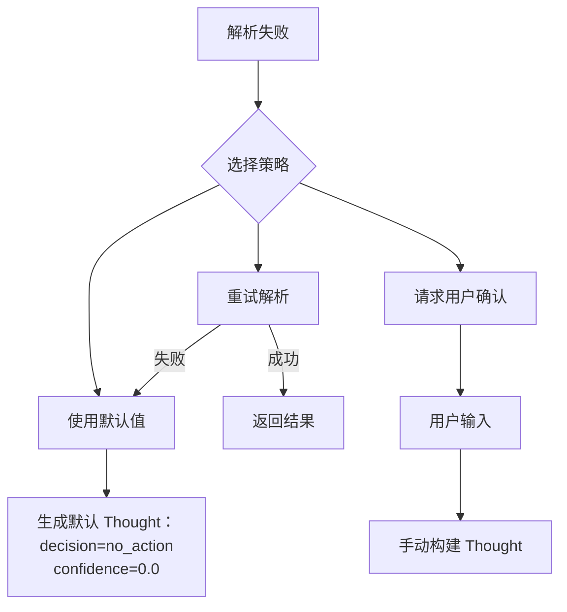
```mermaid
flowchart TB
    ParseFail[解析失败] --> Strategy{选择策略}
    
    Strategy --> Retry[重试解析]
    Strategy --> Default[使用默认值]
    Strategy --> AskUser[请求用户确认]
    
    Retry --> |成功| Success[返回结果]
    Retry --> |失败| Default
    
    Default --> DefaultThought[生成默认 Thought：<br/>decision=no_action<br/>confidence=0.0]
    
    AskUser --> UserInput[用户输入]
    UserInput --> ManualThought[手动构建 Thought]
```

## 7. 与其他模块的关系

### 7.1 与 Reactor 的关系

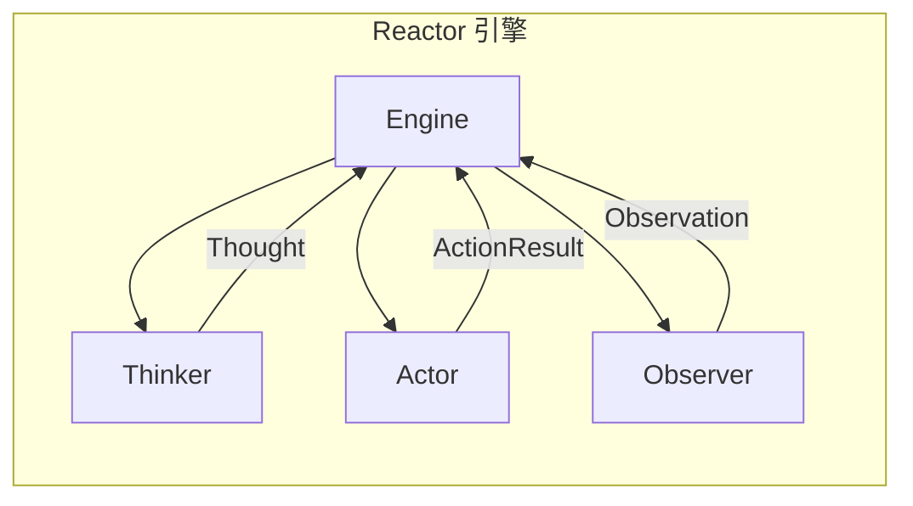
```mermaid
graph LR
    subgraph Reactor[Reactor 引擎]
        Engine[Engine]
        Thinker[Thinker]
        Actor[Actor]
        Observer[Observer]
    end
    
    Engine --> Thinker
    Thinker --> |Thought| Engine
    Engine --> Actor
    Actor --> |ActionResult| Engine
    Engine --> Observer
    Observer --> |Observation| Engine
```

### 7.2 与 Memory 的关系

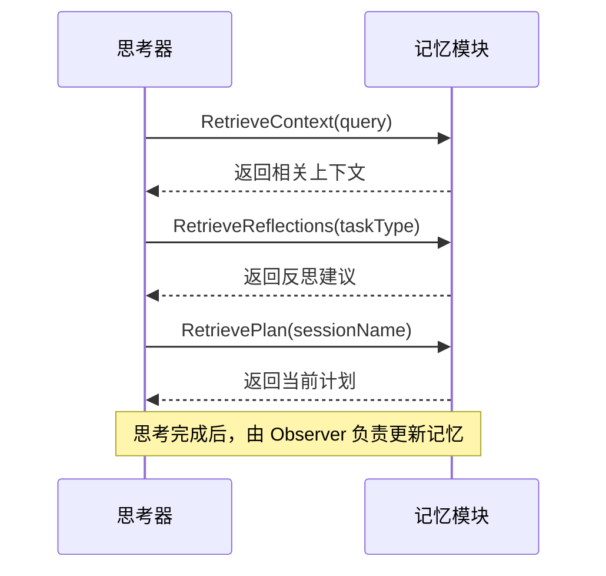
```mermaid
sequenceDiagram
    participant Thinker as 思考器
    participant Memory as 记忆模块

    Thinker->>Memory: RetrieveContext(query)
    Memory-->>Thinker: 返回相关上下文
    
    Thinker->>Memory: RetrieveReflections(taskType)
    Memory-->>Thinker: 返回反思建议
    
    Thinker->>Memory: RetrievePlan(sessionName)
    Memory-->>Thinker: 返回当前计划
    
    Note over Thinker,Memory: 思考完成后，由 Observer 负责更新记忆
```

### 7.3 与 PromptBuilder 的关系

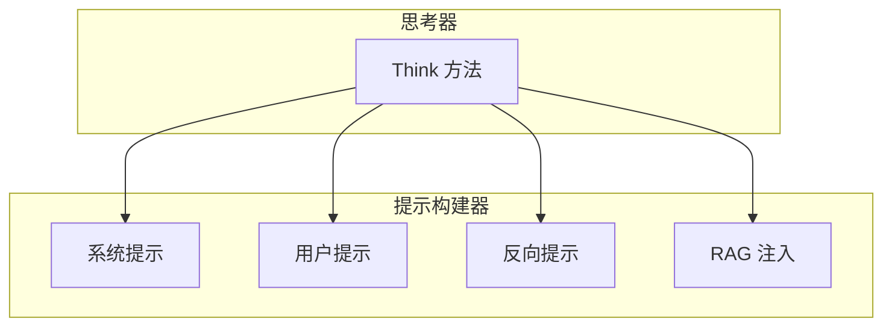
```mermaid
graph TB
    subgraph Thinker[思考器]
        Think[Think 方法]
    end
    
    subgraph PromptBuilder[提示构建器]
        SystemPrompt[系统提示]
        UserPrompt[用户提示]
        NegativePrompt[反向提示]
        RAGInjection[RAG 注入]
    end
    
    Think --> SystemPrompt
    Think --> UserPrompt
    Think --> NegativePrompt
    Think --> RAGInjection
```

## 8. 错误处理

### 8.1 错误类型

| 错误类型        | 说明           | 处理策略         |
| --------------- | -------------- | ---------------- |
| LLMTimeout      | LLM 调用超时   | 重试或降级       |
| LLMError        | LLM 返回错误   | 重试或降级       |
| ParseError      | 响应解析失败   | 修复或降级       |
| ValidationError | 验证失败       | 修复或降级       |
| ContextError    | 上下文检索失败 | 使用空上下文继续 |

### 8.2 重试机制

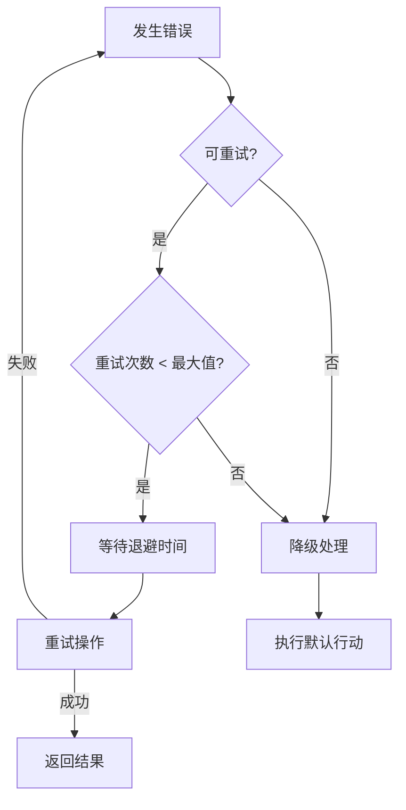
```mermaid
flowchart TB
    Error[发生错误] --> Check{可重试?}
    
    Check --> |是| RetryCount{重试次数 < 最大值?}
    Check --> |否| Fallback[降级处理]
    
    RetryCount --> |是| Wait[等待退避时间]
    RetryCount --> |否| Fallback
    
    Wait --> Retry[重试操作]
    Retry --> |成功| Success[返回结果]
    Retry --> |失败| Error
    
    Fallback --> DefaultAction[执行默认行动]
```

## 9. 监控与可观测性

### 9.1 关键指标

| 指标                       | 说明             |
| -------------------------- | ---------------- |
| think_duration_ms          | 思考耗时         |
| llm_tokens_used            | LLM Token 使用量 |
| context_retrieval_count    | 上下文检索次数   |
| reflection_injection_count | 反思注入次数     |
| parse_success_rate         | 解析成功率       |
| confidence_distribution    | 置信度分布       |

### 9.2 日志记录

```
[Thinker] session=session-001 step=5 action=think duration=1200ms tokens=1500 confidence=0.85 decision=act
[Thinker] session=session-001 step=5 context_items=3 reflections=2 plan_step=2/5
[Thinker] session=session-001 step=5 error=ParseError fallback=default
```

## 10. 总结

思考器是 ReAct 循环的"大脑"，负责：
- **意图识别**：识别用户输入的真实意图，决定后续处理路径
- 整合多源上下文（历史、反思、计划）
- 构建结构化提示词
- 解析和验证 LLM 响应
- 生成可执行的 Thought

通过意图识别、反思注入和计划对齐，思考器能够智能地处理不同类型的用户输入，从失败中学习，保持与全局计划的一致性。
