# Tool 模块设计

## 1. 模块概述

Tool（工具）是 GoReAct 框架的**基础行动单元**。Tool 是一种单一的、原子的执行方法（Action），类似于操作系统的 CLI 命令（如 `ls`, `grep`）或编程语言中的一个具体函数。

> **核心理念**：Tool 是资源，由 Memory 管理。

### 1.1 设计哲学

- **单一职责**: Tool 强调"不求多，只求实用"。工具是用来打地基的，负责最原子的操作（读写文件、执行 Bash、计算）。
- **职责边界**: 更高级的业务逻辑应该由 **Skill** 去编排。工具包始终保持职责单一，不涉及复杂的状态机决策。
- **安全分级**: 通过 SecurityLevel 声明工具的危险等级，支持 Actor 进行安全决策。
- **资源化**: Tool 是资源，由 ResourceManager 注册，由 Memory 索引和检索。

### 1.2 核心职责

- **工具抽象**: 定义统一的工具接口
- **安全分级**: 声明工具的安全等级
- **执行能力**: 提供原子的执行能力

### 1.3 Tool 不负责什么

| 不负责   | 由谁负责           |
| -------- | ------------------ |
| 工具注册 | ResourceManager    |
| 工具发现 | Memory（语义检索） |
| 工具查找 | Memory（精确查询） |
| 工具调度 | Reactor/Actor      |

## 2. Tool 接口设计

### 2.1 极简接口

任何能力，只要实现了以下极其简洁的接口，就可以成为引擎可调用的工具：

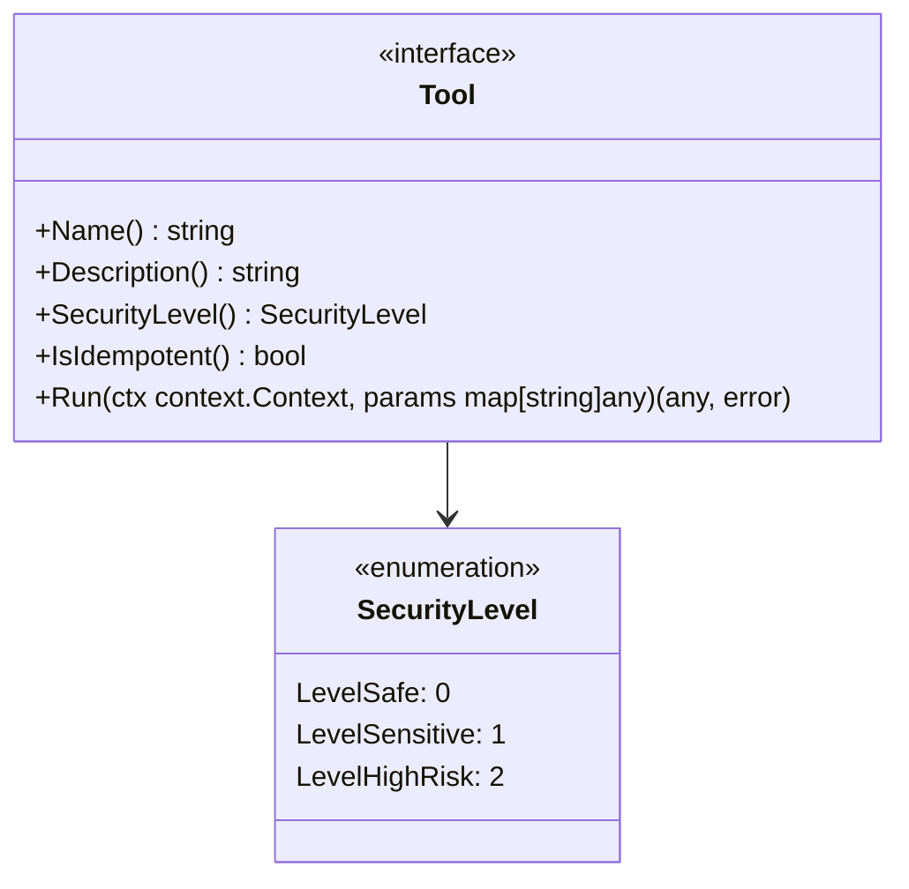

**接口说明**：

| 方法              | 说明                                           |
| ----------------- | ---------------------------------------------- |
| `Name()`          | 工具名称，用于精确查找                         |
| `Description()`   | 工具描述，写给大模型看的语义说明，用于语义检索 |
| `SecurityLevel()` | 安全等级，向 Actor 声明危险程度                |
| `IsIdempotent()`  | 声明该工具是否幂等，用于决定恢复（Resume）和重试策略 |
| `Run()`           | 执行工具，返回结果或错误                       |

### 2.2 幂等性（Idempotency）与执行安全

在 Agent 框架中，任务可能会因为权限审批（Authorization）、网络超时或逻辑异常而中断。为了确保任务恢复（Resume）和重试（Retry）时的安全性，引入了 `IsIdempotent() bool`。

*   **幂等工具 (Idempotent: true)**：多次执行效果与一次执行相同（如 `Read`, `Grep`, `Calculator`）。当系统从中断中恢复时，可以直接重新执行。
*   **非幂等工具 (Idempotent: false)**：多次执行会产生副作用（如 `Write` 追加内容, `Bash` 执行部署脚本）。当非幂等工具执行中断后恢复时，Actor 将拦截默认的直接重试，要求用户二次确认或由 Observer 预先检查环境状态，防止产生灾难性后果。

### 2.3 安全等级定义

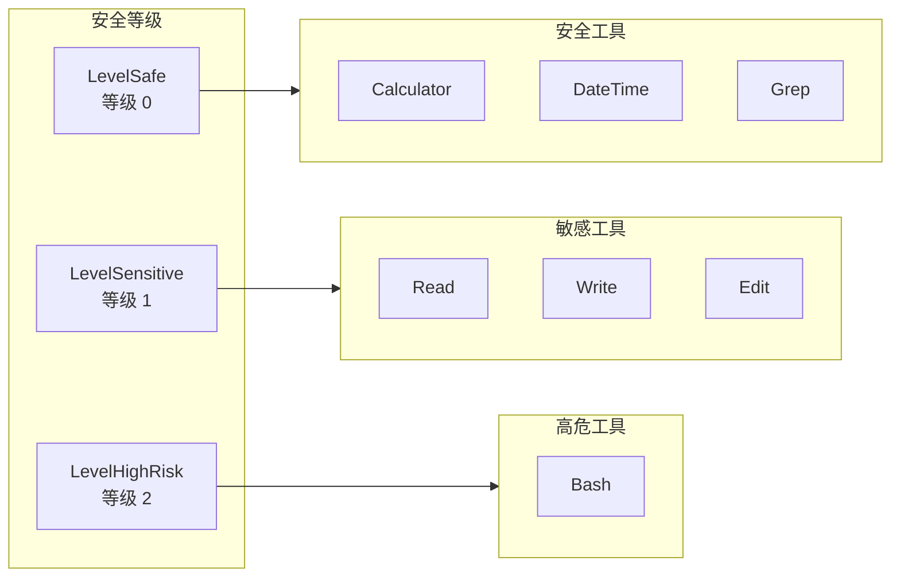

| 安全等级       | 值  | 说明                       | 典型工具                   |
| -------------- | --- | -------------------------- | -------------------------- |
| LevelSafe      | 0   | 纯查询、无副作用           | Calculator, DateTime, Grep |
| LevelSensitive | 1   | 敏感或有边界的写操作       | Read, Write, Edit          |
| LevelHighRisk  | 2   | 高危、不可预测的破坏性操作 | Bash                       |

### 2.4 执行授权与白名单模式 (Whitelist Mode)

为了在安全受控与执行效率之间取得平衡，GoReAct 引入了**白名单授权机制**。

#### 授权逻辑流
1.  **风险拦截**：当 Actor 准备执行 `LevelHighRisk` 甚至某些 `LevelSensitive` 工具时，默认会暂停执行循环，并向用户抛出一个 `PendingQuestion`（请求授权）。
2.  **用户决策**：用户可以选择：
    *   **一次性允许**：仅授权本次调用，下次调用同一工具仍需询问。
    *   **加入白名单 (Add to Whitelist)**：授权本次调用，并将该工具永久记入白名单。
    *   **拒绝**：终止本次调用。
3.  **白名单静默执行**：**一旦具备风险的工具被用户加入白名单，以后再触发该工具时，系统将自动通过安全校验，不会再暂停流程去询问用户**。

#### 白名单存储与范围
*   **全局持久化白名单**：白名单记录被持久化，跨会话（Session）长期有效。
*   这不仅防止了 Agent 首次自主执行危险命令导致的风险，也避免了在开发人员已经确认安全的长期自动化任务中，因频繁的人机交互而打断工作流。

#### 白名单管理

用户可以随时查看和撤回已授权的白名单条目：

```go
type WhitelistManager interface {
    // 查看当前白名单中所有已授权的工具
    List() []WhitelistEntry
    // 将工具从白名单中移除，后续调用将重新请求授权
    Revoke(toolName string) error
    // 清空所有白名单条目
    RevokeAll() error
}

type WhitelistEntry struct {
    ToolName    string    // 工具名称
    AuthorizedAt time.Time // 授权时间
    AuthorizedBy string   // 授权人/会话标识
}
```

**撤回后的行为**：工具从白名单移除后，下次该工具被 Actor 调用时将重新触发 `PendingQuestion`（请求授权），回到默认的安全校验流程。

## 3. Tool 作为资源

### 3.1 资源化设计

Tool 是一种资源，遵循 GoReAct 的资源管理模型：

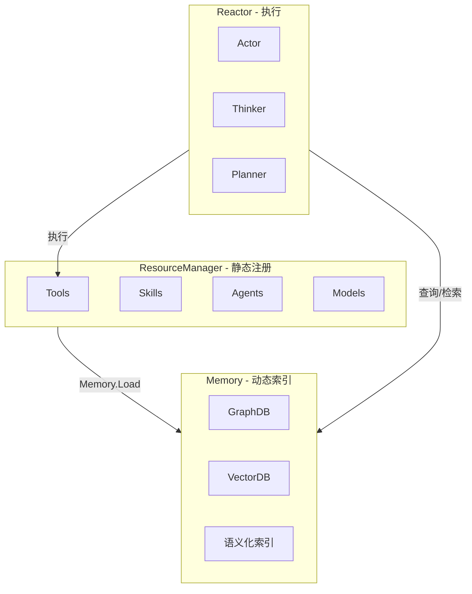

### 3.2 工具的生命周期

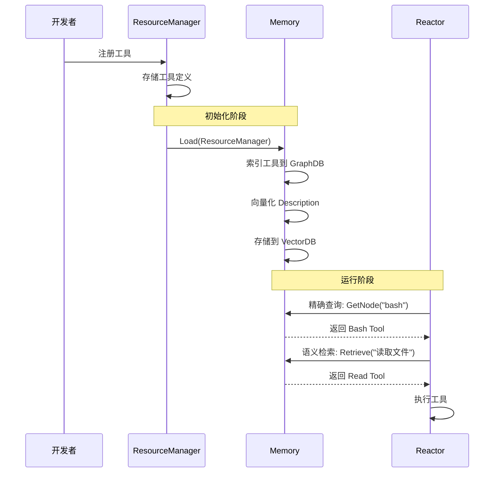

### 3.3 Tool 实现 Node 接口

Tool 作为资源，需要实现 `core.Node` 接口才能被 Memory 索引：

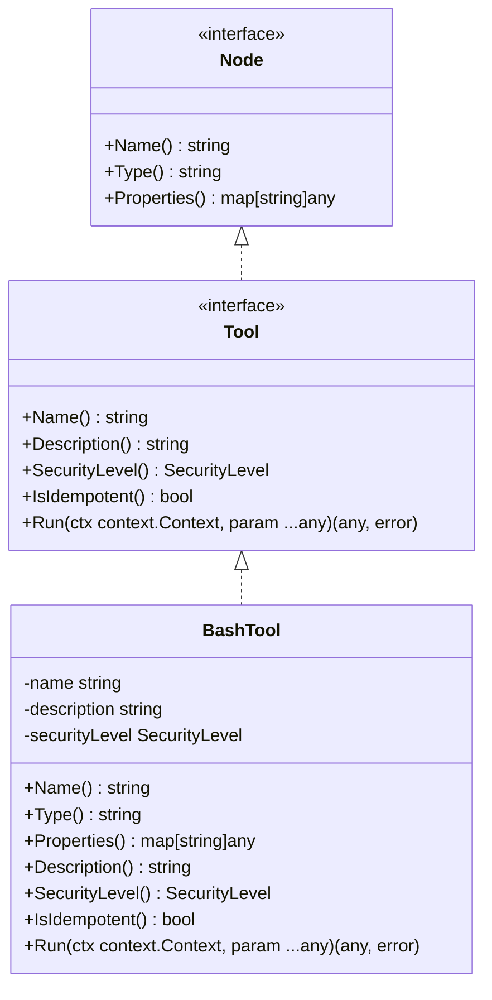

**说明**：
- Tool 没有 ID，通过 `name` 作为唯一标识
- Node 接口使用 `Name()` 作为唯一标识方法

## 4. 工具发现与检索

### 4.1 精确查找

通过工具名称精确查找：

```mermaid
sequenceDiagram
    participant Actor as Actor
    participant Memory as Memory
    participant GraphDB as GraphDB

    Actor->>Memory: GetNode("bash")
    Memory->>GraphDB: MATCH (n:Tool {name: "bash"})
    GraphDB-->>Memory: 返回 Bash Tool 节点
    Memory-->>Actor: 返回 Tool 实例
```

### 4.2 语义检索

通过意图语义检索相关工具：

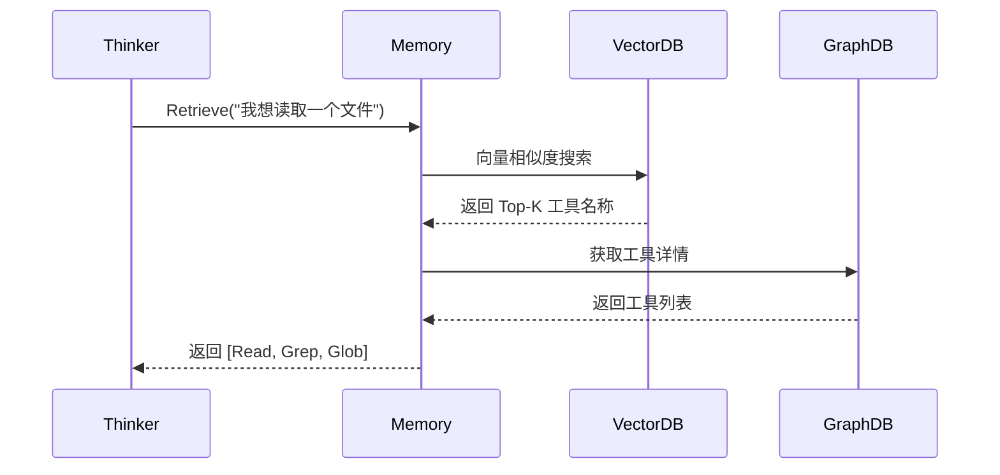

### 4.3 为什么不需要 ToolManager

| 功能           | ToolManager 方式       | Memory 方式                |
| -------------- | ---------------------- | -------------------------- |
| 注册工具       | ToolManager.Register() | ResourceManager.Register() |
| 精确查找       | map[name]Tool          | Memory.GetNode(name)       |
| 语义检索       | 需要额外实现           | Memory.Retrieve() 天然支持 |
| 工具索引       | 需要单独维护           | Memory 统一索引            |
| 与其他资源关联 | 需要额外实现           | Memory 图谱天然支持        |

**结论**：Memory 已经具备了工具管理所需的所有能力，ToolManager 是多余的抽象。

## 5. 内置工具集

### 5.1 设计原则

| 原则     | 说明                 | 示例                                                      |
| -------- | -------------------- | --------------------------------------------------------- |
| 职责单一 | 每个工具只做一件事   | 废弃大而全的 `filesystem`，拆分为 `Read`, `Write`, `Edit` |
| 降维合并 | 合并功能重叠的工具   | 废弃 `HTTP`, `Curl`, `Port`，统一由 `Bash` 完成           |
| 实用优先 | 只保留真正必要的工具 | 不提供 Git、Docker 等专用工具                             |

### 5.2 核心工具清单

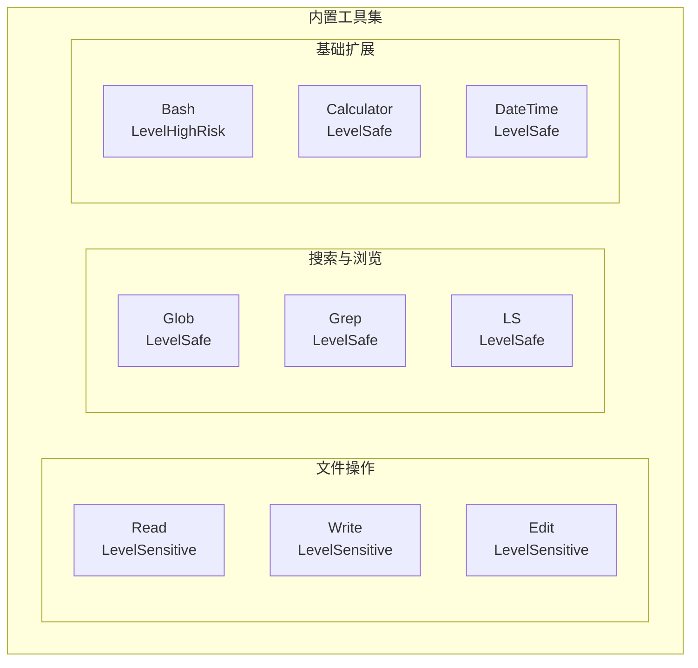

| 工具分类       | 工具名称   | 安全等级       | 核心能力                                   |
| -------------- | ---------- | -------------- | ------------------------------------------ |
| **文件操作**   | Read       | LevelSensitive | 读取文件，支持指定行范围与大小限制         |
|                | Write      | LevelSensitive | 写入或追加文件，自动处理目录创建           |
|                | Edit       | LevelSensitive | 极其强大的多位置精确编辑，专为代码重构设计 |
| **搜索与浏览** | Glob       | LevelSafe      | 高效的文件名匹配与枚举                     |
|                | Grep       | LevelSafe      | 正则文本搜索，带文件类型与行列定位         |
|                | LS         | LevelSafe      | 目录树状列表展示                           |
| **基础扩展**   | Bash       | LevelHighRisk  | 原生 Shell 命令执行引擎                    |
|                | Calculator | LevelSafe      | 基础数学计算                               |
|                | DateTime   | LevelSafe      | 时间获取与格式化                           |

### 5.3 为什么没有 Git、Docker 或 HTTP 工具？

这正是 GoReAct **"Skill 优先"** 理念的体现：

**最佳实践**：

- 使用内置的 `Bash` 工具作为通用底座
- 编写 `GitSkill` 或 `RestAPISkill`（Markdown 形式）
- 教导大模型如何使用 Bash 组合命令来完成高级操作

这不仅极大地缩减了框架维护成本，还赋予了 Agent 处理未知情况的强大适应力。

## 6. 与其他模块的关系

### 6.1 与 ResourceManager 的关系

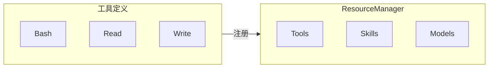

**关系说明**：

- ResourceManager 负责工具的静态注册
- 工具作为贫血对象存储在 ResourceManager 中

### 6.2 与 Memory 的关系

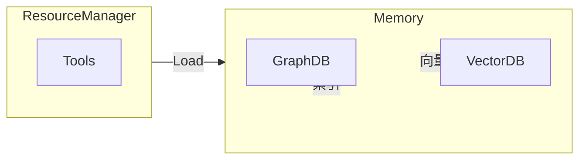

**关系说明**：

- `Memory.Load(ResourceManager)` 将工具索引到图谱和向量库
- `Memory` 提供精确查找和语义检索能力

### 6.3 与 Reactor 的关系

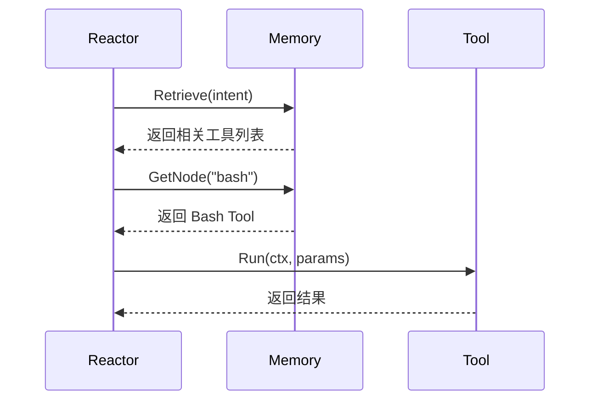

**关系说明**：

- `Reactor` 通过 `Memory` 发现和获取工具
- `Reactor` 直接调用工具的 `Run` 方法

### 6.4 与 Skill 的关系

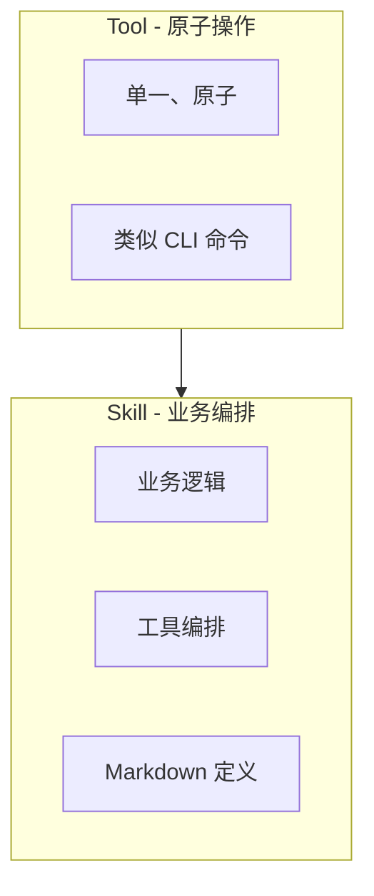

| 层级    | 职责     | 示例                       |
| ------- | -------- | -------------------------- |
| `Tool`  | 原子操作 | `Read`, `Write`, Bash`     |
| `Skill` | 业务编排 | `GitSkill`, `RestAPISkill` |

## 7. 总结

### 7.1 核心理念

1. **Tool 是资源**
   - Tool 由 ResourceManager 注册
   - Tool 由 Memory 索引和检索
   - 不需要单独的 ToolManager

2. **接口极简**
   - 只有 5 个方法：Name、Description、SecurityLevel、IsIdempotent、Run
   - 工具不关心如何被发现，只关心如何执行

3. **安全透明**
   - 通过 SecurityLevel 声明危险等级
   - Actor 根据安全等级做决策

4. **实用优先**
   - 内置工具精简
   - 高级功能由 Skill 编排

### 7.2 架构总览

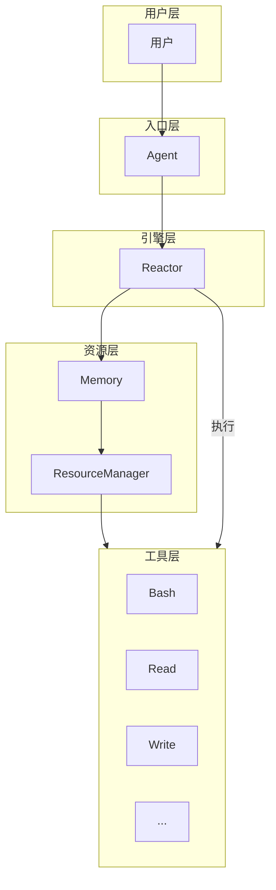

这种设计使得 Tool 模块保持极简，符合"不求多，只求实用"的理念，同时与 ResourceManager、Memory、Reactor 等模块职责清晰、边界分明。
