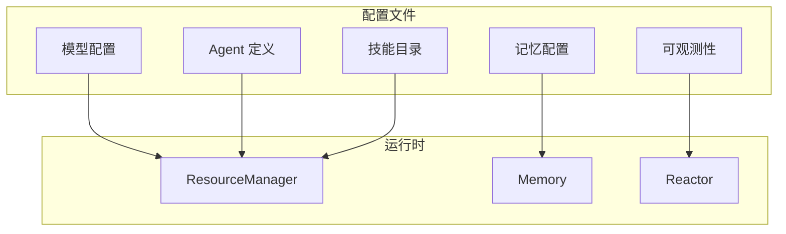

# 配置指南

GoReAct 通过 YAML 配置文件定义应用行为，无需编写代码即可定制你的智能体应用。

## 配置文件结构



```yaml
# 默认模型
model: gpt-4

# 模型配置
models:
  - name: gpt-4
    provider: openai
    
  - name: claude-3
    provider: anthropic

# Agent 定义
agents:
  - name: assistant
    domain: general
    description: 通用助手
    model: gpt-4

# 技能目录
skills_dir: ./skills

# 记忆配置
memory:
  graph_uri: ${GRAPH_DB_URI}

# 可观测性配置
observability:
  logging:
    level: info
    file: ./logs/app.log
```

## Agent 配置

### 基本配置

```yaml
agents:
  - name: my-agent           # Agent 名称（唯一标识）
    domain: my-domain        # 领域标识
    description: Agent 描述   # 能力描述，用于语义匹配
    model: gpt-4             # 使用的模型
```

### 完整配置

```yaml
agents:
  - name: code-reviewer
    domain: code-review
    description: |
      代码审查专家，擅长：
      - 安全漏洞检测
      - 代码质量评估
      - 性能问题分析
    model: gpt-4
    skills:
      - code-review
      - security-audit
    prompt_template: |
      你是一个专业的代码审查助手。
      请关注代码的安全性、可读性和性能。
    config:
      max_steps: 20
      timeout: 5m
      enable_reflection: true
      enable_planning: true
      max_retries: 3
```

### 配置项说明

| 配置项            | 类型     | 必需 | 说明                           |
| ----------------- | -------- | ---- | ------------------------------ |
| `name`            | string   | 是   | Agent 唯一标识                 |
| `domain`          | string   | 否   | 领域标识                       |
| `description`     | string   | 是   | 能力描述，用于任务匹配         |
| `model`           | string   | 否   | 使用的模型，默认使用全局 model |
| `skills`          | []string | 否   | 可用技能列表                   |
| `prompt_template` | string   | 否   | 提示词模板                     |
| `config`          | object   | 否   | 执行配置                       |

### config 配置项

| 配置项              | 类型     | 默认值 | 说明         |
| ------------------- | -------- | ------ | ------------ |
| `max_steps`         | int      | 10     | 最大执行步数 |
| `timeout`           | duration | 30s    | 执行超时时间 |
| `enable_reflection` | bool     | true   | 是否启用反思 |
| `enable_planning`   | bool     | true   | 是否启用规划 |
| `max_retries`       | int      | 3      | 最大重试次数 |

> **重要**：Agent 只引用 Skills，不直接引用 Tools。Tools 由 Skills 编排使用。

## 模型配置

> **命名约定**：YAML 配置文件使用 `snake_case` 命名风格（如 `provider_model_name`），Go 结构体使用 `PascalCase` 命名风格（如 `ProviderModelName`）。框架会自动进行命名转换。

### 配置多个模型

```yaml
models:
  - name: gpt-4
    provider: openai
    provider_model_name: gpt-4-turbo
    api_key: ${OPENAI_API_KEY}
    temperature: 0.7
    max_tokens: 4096
    timeout: 60s
    features:
      vision: false
      tool_call: true
      streaming: true
    
  - name: claude-3
    provider: anthropic
    provider_model_name: claude-3-opus-20240229
    api_key: ${ANTHROPIC_API_KEY}
    temperature: 0.7
    max_tokens: 4096
    
  - name: local-llama
    provider: ollama
    base_url: http://localhost:11434
    provider_model_name: llama2
```

### 模型配置项

| 配置项                | 说明                               |
| --------------------- | ---------------------------------- |
| `name`                | GoReAct 内部使用的模型引用名称     |
| `provider`            | 提供商：openai, anthropic, ollama  |
| `provider_model_name` | 提供商的模型标识（如 gpt-4-turbo） |
| `base_url`            | 自定义 API 端点（可选）            |
| `api_key`             | API 密钥（建议用环境变量）         |
| `temperature`         | 生成温度（0-2），默认 0.7          |
| `max_tokens`          | 最大生成 Token 数                  |
| `timeout`             | 请求超时时间                       |
| `features`            | 模型能力标识                       |

### features 配置项

| 配置项      | 说明             |
| ----------- | ---------------- |
| `vision`    | 是否支持图像输入 |
| `tool_call` | 是否支持工具调用 |
| `streaming` | 是否支持流式输出 |

### 使用环境变量

```yaml
models:
  - name: gpt-4
    provider: openai
    api_key: ${OPENAI_API_KEY}
```

## 技能配置

技能通过目录结构定义，在配置中指定技能目录：

```yaml
skills_dir: ./skills
```

技能目录结构：

```
skills/
├── code-review/
│   ├── SKILL.md
│   ├── scripts/
│   └── references/
└── debugging/
    └── SKILL.md
```

## 记忆配置

Memory 是 GoReAct 的核心记忆系统，支持多种存储后端和性能调优。

```yaml
memory:
  storage:
    type: gograph  # gograph | neo4j | postgresql
    gograph:
      data_path: ./data/memory
      enable_persistence: true
```

> 详细配置请参阅 [Memory 配置指南](memory.md)

## 可观测性配置

```yaml
observability:
  enabled: true
  
  logging:
    level: info              # 日志级别：debug, info, warn, error
    format: json             # 日志格式：json, text
    outputs:
      - type: file
        path: ./logs/app.log
        max_size: 100        # 单文件最大 MB
        max_backups: 5       # 保留文件数
        max_age: 30          # 保留天数
        compress: true       # 是否压缩
  
  token:
    enabled: true
    pricing:
      gpt-4:
        input_price: 0.03    # 每 1K tokens
        output_price: 0.06
        currency: USD
    export_path: ./logs/tokens.json
```

## 完整配置示例

```yaml
# 应用名称
app: my-ai-assistant

# 默认模型
model: gpt-4

# 模型配置
models:
  - name: gpt-4
    provider: openai
    api_key: ${OPENAI_API_KEY}
    
  - name: claude-3
    provider: anthropic
    api_key: ${ANTHROPIC_API_KEY}

# Agent 定义
agents:
  - name: assistant
    domain: general
    description: 通用助手，处理日常对话和简单任务
    model: gpt-4
    
  - name: researcher
    domain: research
    description: 信息研究员，擅长搜索和整理信息
    model: gpt-4
    skills:
      - web-search
      - information-extraction
      
  - name: coder
    domain: programming
    description: 编程专家，擅长代码编写和调试
    model: gpt-4
    skills:
      - code-review
      - debugging
    config:
      max_steps: 20
      enable_reflection: true
      
  - name: writer
    domain: writing
    description: 内容撰写专家，擅长写作和编辑
    model: claude-3
    skills:
      - article-writing
      - translation

# 技能目录
skills_dir: ./skills

# 记忆配置
memory:
  storage:
    type: gograph
    gograph:
      data_path: ./data/memory
      enable_persistence: true

# 可观测性配置
observability:
  enabled: true
  logging:
    level: info
    outputs:
      - type: file
        path: ./logs/app.log
  token:
    enabled: true
    pricing:
      gpt-4:
        input_price: 0.03
        output_price: 0.06
```

## 环境变量

推荐使用环境变量管理敏感信息：

| 变量                | 说明               |
| ------------------- | ------------------ |
| `OPENAI_API_KEY`    | OpenAI API 密钥    |
| `ANTHROPIC_API_KEY` | Anthropic API 密钥 |
| `NEO4J_PASSWORD`    | Neo4j 密码（可选） |

在配置文件中使用 `${VARIABLE_NAME}` 引用环境变量。

## 下一步

- [Memory 配置](memory.md) - 详细 Memory 配置指南
- [扩展：Tools](extending/tools.md) - 开发自定义工具
- [扩展：Skills](extending/skills.md) - 编写工作流程
- [可观测性](observability.md) - 配置监控和日志
