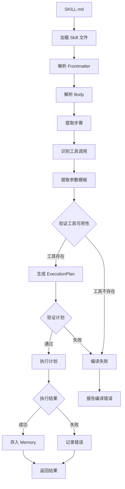
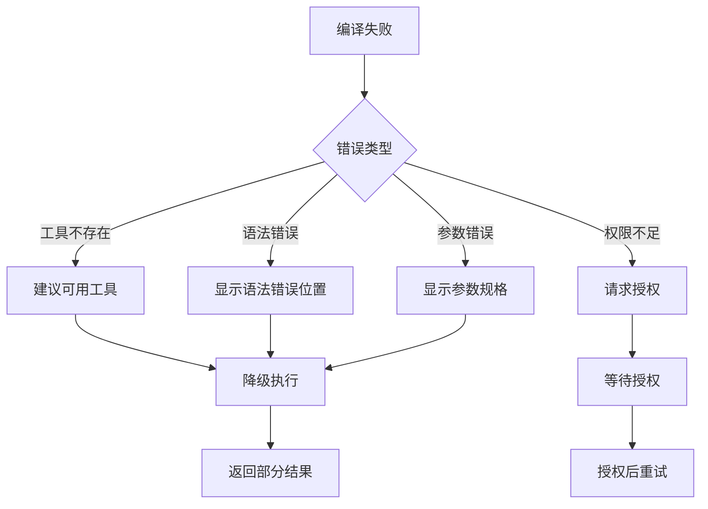

# 扩展：Skills

Skill 是 GoReAct 的工作流程定义。通过 Markdown 文件描述任务执行步骤，编排工具完成复杂任务。

## 什么是 Skill

Skill 是一个目录结构，包含：

```
skills/
└── my-skill/
    ├── SKILL.md           # 技能定义（必需）
    ├── scripts/           # 辅助脚本（可选）
    │   └── helper.sh
    └── references/        # 参考文档（可选）
        └── guide.md
```

## SKILL.md 结构

### 基本结构

```markdown
---
name: skill-name
description: 技能描述
allowed-tools: tool1 tool2
---

# 技能标题

## 目标

描述这个技能要完成什么任务。

## 步骤

1. 第一步做什么
2. 第二步做什么
3. ...

## 输出

描述期望的输出格式。
```

### Frontmatter 字段

| 字段 | 必需 | 说明 |
|------|------|------|
| `name` | 是 | 技能名称，用于 Agent 引用 |
| `description` | 是 | 技能描述，用于语义匹配 |
| `allowed-tools` | 否 | 允许使用的工具列表，空格分隔 |

## 第一个 Skill

创建 `skills/greeting/SKILL.md`：

```markdown
---
name: greeting
description: 友好的问候用户
allowed-tools: datetime
---

# 问候技能

## 目标

根据当前时间向用户发送适当的问候。

## 步骤

1. 使用 `datetime` 工具获取当前时间
2. 根据时间段选择问候语：
   - 早上（6-12点）：早上好
   - 下午（12-18点）：下午好
   - 晚上（18-24点）：晚上好
   - 深夜（0-6点）：夜深了
3. 返回问候语

## 输出

格式化的问候消息，包含当前时间。
```

## 进阶示例：代码审查

创建 `skills/code-review/SKILL.md`：

```markdown
---
name: code-review
description: 代码审查技能，检查代码质量、安全性和最佳实践
allowed-tools: read glob grep
---

# Code Review

## 目标

对指定目录或文件进行全面的代码审查，识别潜在问题并提供改进建议。

## 审查维度

1. **代码质量**
   - 可读性：命名规范、注释完整性
   - 可维护性：模块化、代码复用
   - 复杂度：圈复杂度、嵌套深度

2. **安全隐患**
   - 敏感信息泄露：硬编码密钥、密码
   - 输入验证：SQL 注入、XSS
   - 权限控制：越权访问

3. **性能问题**
   - 循环中的重复计算
   - 不必要的内存分配
   - 低效的数据结构

4. **最佳实践**
   - 错误处理是否完善
   - 日志记录是否合理
   - 测试覆盖是否充分

## 步骤

### 1. 定位目标文件

使用 `glob` 定位需要审查的文件：

```
glob "**/*.go"
glob "**/*.py"
glob "**/*.js"
```

### 2. 读取文件内容

使用 `read` 读取文件：

```
read path/to/file.go
```

### 3. 搜索特定模式

使用 `grep` 搜索问题模式：

```
# 搜索 TODO 和 FIXME
grep "TODO|FIXME" --type go

# 搜索可能的敏感信息
grep "password|secret|api_key" --type go

# 搜索错误处理缺失
grep "error.*return" --type go
```

### 4. 分析并生成报告

汇总发现的问题，按严重程度分类：
- 🔴 严重：必须修复
- 🟡 警告：建议修复
- 🔵 建议：可选优化

## 输出

结构化的代码审查报告：

```markdown
# 代码审查报告

## 概述
- 审查文件数：X
- 发现问题数：Y
- 严重问题：A
- 警告：B
- 建议：C

## 问题列表

### 🔴 严重

#### [文件名:行号] 问题描述
- 代码片段
- 修复建议

### 🟡 警告

...

### 🔵 建议

...

## 总结

总体评价和改进建议。
```
```

## 渐进式披露

Skill 支持渐进式披露，根据任务复杂度逐步展开内容：

```markdown
---
name: complex-task
description: 复杂任务处理
---

# 复杂任务

## 概述

简要描述任务目标。

## 基础步骤

适用于简单场景的步骤。

### 详细说明

展开说明每个步骤的具体操作。

## 高级步骤

适用于复杂场景的扩展步骤。

## 参考资料

- [参考文档 1](references/guide1.md)
- [参考文档 2](references/guide2.md)
```

## 工具编排

### 工具链

按顺序使用多个工具：

```markdown
## 步骤

1. 使用 `glob` 找到所有配置文件
2. 使用 `read` 读取配置内容
3. 使用 `grep` 搜索特定配置项
4. 分析配置是否正确
```

### 条件执行

根据结果决定下一步：

```markdown
## 步骤

1. 检查文件是否存在
   - 存在：读取并分析
   - 不存在：创建默认配置

2. 验证配置格式
   - 有效：继续执行
   - 无效：报告错误并提示修复
```

### 循环处理

处理多个相似对象：

```markdown
## 步骤

对于每个源文件：
1. 读取文件内容
2. 检查代码规范
3. 记录问题
4. 生成修复建议
```

## 最佳实践

### 1. 清晰的目标

```markdown
## 目标

审查 Go 代码的安全性和代码质量，输出结构化的审查报告。
```

### 2. 具体的步骤

```markdown
## 步骤

1. 使用 `glob "**/*.go"` 定位所有 Go 文件
2. 使用 `read` 读取每个文件的内容
3. 使用 `grep "password|secret"` 搜索敏感信息
4. 汇总问题并生成报告
```

### 3. 明确的输出

```markdown
## 输出

JSON 格式的审查结果：
{
  "files_reviewed": 10,
  "issues": [...],
  "summary": "..."
}
```

### 4. 合理的工具限制

```markdown
---
allowed-tools: read grep glob
---
```

只允许必要的工具，减少潜在风险。

## Skill 与 Agent 的关系

Agent 通过配置引用 Skill：

```yaml
agents:
  - name: code-reviewer
    domain: code-review
    description: 代码审查专家
    model: gpt-4
    skills:
      - code-review
      - security-audit
```

Agent 是配置单元，Skill 是能力定义。Agent 可以拥有多个 Skill，框架根据任务自动选择合适的 Skill 执行。

## 编译缓存机制

Skill 的执行分为两个阶段，类似 JIT 编译：

### 首次执行



**详细步骤说明**：

| 步骤             | 说明                                       | 失败处理               |
| ---------------- | ------------------------------------------ | ---------------------- |
| 加载 Skill 文件  | 读取 SKILL.md 及依赖文件                   | 返回文件不存在错误     |
| 解析 Frontmatter | 提取元数据（name, description, tools）     | 使用默认值             |
| 解析 Body        | 提取指令内容                               | 返回格式错误           |
| 提取步骤         | 识别编号列表中的步骤                       | 返回解析错误           |
| 识别工具调用     | 匹配工具名称和参数                         | 标记为未知工具         |
| 提取参数模板     | 解析 `{{.param}}` 模板语法                 | 使用字面值             |
| 验证工具可用性   | 检查工具是否已注册                         | 返回编译错误           |
| 生成计划         | 创建 SkillExecutionPlan 对象               | -                      |
| 执行计划         | 按步骤执行工具调用                         | 记录失败步骤           |
| 存入 Memory      | 缓存执行计划供后续复用                     | 不影响本次执行结果     |

**编译失败处理**：



**编译错误类型**：

| 错误类型       | 说明                       | 处理策略               |
| -------------- | -------------------------- | ---------------------- |
| ToolNotFound   | 引用的工具未注册           | 建议相似工具或跳过     |
| SyntaxError    | 模板语法错误               | 显示错误位置和修复建议 |
| InvalidParam   | 参数类型或格式错误         | 显示期望的参数规格     |
| PermissionDenied | 工具需要更高权限         | 请求用户授权           |
| DependencyError | 依赖文件缺失或损坏        | 提示缺失的依赖         |

1. Reactor 读取 SKILL.md 内容
2. 解析步骤，识别工具调用和参数
3. 生成参数化的 `SkillExecutionPlan`
4. 执行计划并返回结果
5. 将执行计划存入 Memory 供后续复用

### 后续执行


1. Reactor 从 Memory 获取已编译的执行计划
2. 绑定当前参数
3. 直接执行参数化节点
4. 返回结果

### 执行计划结构

```go
type SkillExecutionPlan struct {
    Name           string           // 计划名称
    SkillName      string           // 关联的 Skill 名称
    Steps          []ExecutionStep  // 参数化步骤
    Parameters     []ParameterSpec  // 参数规格
    CompiledAt     time.Time        // 编译时间
    ExecutionCount int              // 执行次数
    SuccessRate    float64          // 成功率
}

type ExecutionStep struct {
    Index           int              // 步骤序号
    ToolName        string           // 工具名称
    ParamsTemplate  map[string]any   // 参数模板（支持变量插值）
    Condition       string           // 执行条件（可选）
    ExpectedOutcome string           // 预期结果描述
    OnError         string           // 错误处理策略
}
```

### 缓存优势

| 优势 | 说明 |
|------|------|
| **性能提升** | 跳过解析步骤，直接执行 |
| **一致性** | 相同输入产生相同的执行路径 |
| **可追踪** | 记录执行次数和成功率 |
| **可优化** | 基于历史数据优化执行计划 |

## 内置技能

GoReAct 提供以下内置技能：

| 技能名称 | 描述 |
|----------|------|
| `file-operations` | 文件读写操作 |
| `code-analysis` | 代码静态分析 |
| `web-search` | 网络搜索 |

## 下一步

- [配置指南](../configuration.md) - 配置 Agent 使用 Skill
- [可观测性](../observability.md) - 监控 Skill 执行
