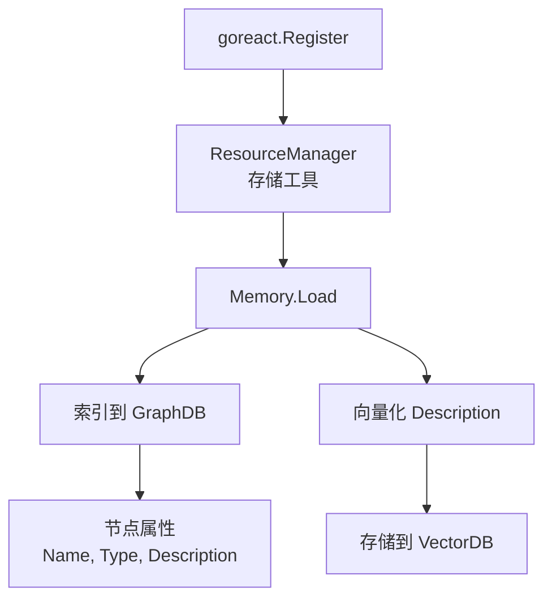

# 扩展：Tools

Tool 是 GoReAct 的主要扩展点。只需实现一个简单接口，注册后即可被 Skill 编排使用。

## 工具接口

GoReAct 的工具接口极其简单：

```go
type Tool interface {
    Name() string                              // 工具名称
    Description() string                       // 工具描述
    SecurityLevel() SecurityLevel              // 安全等级
    Run(ctx context.Context, param ...any) (any, error)
}
```

## 安全等级

工具通过安全等级声明其危险程度：

```go
type SecurityLevel int

const (
    LevelSafe      SecurityLevel = 0  // 安全：纯查询、无副作用
    LevelSensitive SecurityLevel = 1  // 敏感：有边界的写操作
    LevelHighRisk  SecurityLevel = 2  // 高危：不可预测的破坏性操作
)
```

| 安全等级         | 值  | 说明                       | 典型工具                   |
| ---------------- | --- | -------------------------- | -------------------------- |
| `LevelSafe`      | 0   | 纯查询、无副作用           | Calculator, DateTime, Grep |
| `LevelSensitive` | 1   | 敏感或有边界的写操作       | Read, Write, Edit          |
| `LevelHighRisk`  | 2   | 高危、不可预测的破坏性操作 | Bash                       |

## 创建你的第一个工具

### 最简示例

```go
package tools

import (
    "context"
    "time"
    
    "github.com/goreact/goreact"
)

type TimeTool struct{}

func (t *TimeTool) Name() string {
    return "datetime"
}

func (t *TimeTool) Description() string {
    return "获取当前时间"
}

func (t *TimeTool) SecurityLevel() goreact.SecurityLevel {
    return goreact.LevelSafe
}

func (t *TimeTool) Run(ctx context.Context, param ...any) (any, error) {
    return time.Now().Format("2006-01-02 15:04:05"), nil
}
```

### 带参数的工具

```go
package tools

import (
    "context"
    "fmt"
    
    "github.com/goreact/goreact"
)

type CalculatorTool struct{}

func (t *CalculatorTool) Name() string {
    return "calculator"
}

func (t *CalculatorTool) Description() string {
    return "执行基本数学计算，支持加减乘除"
}

func (t *CalculatorTool) SecurityLevel() goreact.SecurityLevel {
    return goreact.LevelSafe
}

func (t *CalculatorTool) Run(ctx context.Context, param ...any) (any, error) {
    if len(param) < 3 {
        return nil, fmt.Errorf("need 3 parameters: num1, operator, num2")
    }
    
    num1, ok1 := param[0].(float64)
    op, ok2 := param[1].(string)
    num2, ok3 := param[2].(float64)
    
    if !ok1 || !ok2 || !ok3 {
        return nil, fmt.Errorf("invalid parameter types")
    }
    
    var result float64
    switch op {
    case "+":
        result = num1 + num2
    case "-":
        result = num1 - num2
    case "*":
        result = num1 * num2
    case "/":
        if num2 == 0 {
            return nil, fmt.Errorf("division by zero")
        }
        result = num1 / num2
    default:
        return nil, fmt.Errorf("unknown operator: %s", op)
    }
    
    return map[string]any{
        "expression": fmt.Sprintf("%v %s %v", num1, op, num2),
        "result":     result,
    }, nil
}
```

## 注册工具

注册后工具即可被 Skill 编排使用：

```go
package main

import (
    "github.com/goreact/goreact"
    "my-app/tools"
)

func main() {
    goreact.Register(
        &tools.TimeTool{},
        &tools.CalculatorTool{},
    )
    goreact.Run("goreact.yaml")
}
```

### 注册流程



### 注册时机与可用性

| 注册时机         | 可用性           | 说明                                   |
| ---------------- | ---------------- | -------------------------------------- |
| `Run` 之前       | 立即可用         | 推荐方式，在启动时注册所有工具         |
| `Run` 之后       | 需要重新加载     | 动态注册后需要调用 `Memory.Reload()`   |
| 运行时动态注册   | 下次请求可用     | 新工具对新请求立即可用，不影响正在执行的任务 |

> **重要**：
> - `goreact.Register()` 必须在 `goreact.Run()` 之前调用
> - 注册后的工具会被自动索引到 Memory，支持精确查询和语义检索
> - 动态注册的工具需要调用 `Memory.Reload()` 才能被检索到

**推荐注册模式**：

```go
func main() {
    // 1. 注册所有工具（在 Run 之前）
    goreact.Register(
        &tools.TimeTool{},
        &tools.CalculatorTool{},
        &tools.WebSearchTool{apiKey: os.Getenv("SEARCH_API_KEY")},
    )
    
    // 2. 启动服务（阻塞）
    goreact.Run("goreact.yaml")
}
```

**动态注册模式**：

```go
// 运行时动态添加工具
func addToolDynamically(tool goreact.Tool) error {
    goreact.Register(tool)
    
    // 重新加载 Memory 索引
    memory := goreact.GetMemory()
    return memory.Reload()
}
```

### 查询方式

Reactor 执行时通过两种方式查找工具：

| 方式 | 方法 | 用途 |
|------|------|------|
| 精确查询 | `Memory.GetNode("tool_name")` | 已知工具名，直接获取 |
| 语义检索 | `Memory.Retrieve("描述", topK)` | 未知工具名，语义匹配 |

## 错误处理

返回清晰的错误信息：

```go
func (t *MyTool) Run(ctx context.Context, param ...any) (any, error) {
    if len(param) == 0 {
        return nil, fmt.Errorf("parameter is required")
    }
    
    query, ok := param[0].(string)
    if !ok || query == "" {
        return nil, fmt.Errorf("first parameter must be a non-empty string")
    }
    
    result, err := doSomething(query)
    if err != nil {
        return nil, fmt.Errorf("operation failed: %w", err)
    }
    
    return result, nil
}
```

## 完整示例：Web 搜索工具

```go
package tools

import (
    "context"
    "encoding/json"
    "fmt"
    "net/http"
    "net/url"
    "time"
    
    "github.com/goreact/goreact"
)

type WebSearchTool struct {
    apiKey  string
    baseURL string
}

func NewWebSearchTool(apiKey string) *WebSearchTool {
    return &WebSearchTool{
        apiKey:  apiKey,
        baseURL: "https://api.search.example.com",
    }
}

func (t *WebSearchTool) Name() string {
    return "web-search"
}

func (t *WebSearchTool) Description() string {
    return "搜索互联网获取信息，返回相关网页标题、链接和摘要"
}

func (t *WebSearchTool) SecurityLevel() goreact.SecurityLevel {
    return goreact.LevelSafe
}

func (t *WebSearchTool) Run(ctx context.Context, param ...any) (any, error) {
    if len(param) == 0 {
        return nil, fmt.Errorf("query parameter is required")
    }
    
    query, ok := param[0].(string)
    if !ok || query == "" {
        return nil, fmt.Errorf("query must be a non-empty string")
    }
    
    limit := 5
    if len(param) > 1 {
        if l, ok := param[1].(float64); ok {
            limit = int(l)
        }
    }

    ctx, cancel := context.WithTimeout(ctx, 10*time.Second)
    defer cancel()
    
    return t.search(ctx, query, limit)
}

func (t *WebSearchTool) search(ctx context.Context, query string, limit int) ([]SearchResult, error) {
    u, _ := url.Parse(t.baseURL + "/search")
    q := u.Query()
    q.Set("q", query)
    q.Set("limit", fmt.Sprintf("%d", limit))
    u.RawQuery = q.Encode()

    req, _ := http.NewRequestWithContext(ctx, "GET", u.String(), nil)
    req.Header.Set("Authorization", "Bearer "+t.apiKey)

    resp, err := http.DefaultClient.Do(req)
    if err != nil {
        return nil, err
    }
    defer resp.Body.Close()

    var results []SearchResult
    if err := json.NewDecoder(resp.Body).Decode(&results); err != nil {
        return nil, err
    }

    return results, nil
}

type SearchResult struct {
    Title   string `json:"title"`
    URL     string `json:"url"`
    Snippet string `json:"snippet"`
}
```

## 内置工具集

GoReAct 提供以下内置工具：

| 工具名称     | 安全等级       | 核心能力                           |
| ------------ | -------------- | ---------------------------------- |
| `read`       | LevelSensitive | 读取文件，支持指定行范围与大小限制 |
| `write`      | LevelSensitive | 写入或追加文件，自动处理目录创建   |
| `edit`       | LevelSensitive | 多位置精确编辑，专为代码重构设计   |
| `glob`       | LevelSafe      | 高效的文件名匹配与枚举             |
| `grep`       | LevelSafe      | 正则文本搜索，带文件类型与行列定位 |
| `ls`         | LevelSafe      | 目录树状列表展示                   |
| `bash`       | LevelHighRisk  | 原生 Shell 命令执行引擎            |
| `calculator` | LevelSafe      | 基础数学计算                       |
| `datetime`   | LevelSafe      | 时间获取与格式化                   |

## 最佳实践

### 1. 清晰的描述

```go
// 好的做法
func (t *WebSearchTool) Description() string {
    return "搜索互联网获取信息，返回相关网页标题、链接和摘要"
}

// 不好的做法
func (t *WebSearchTool) Description() string {
    return "搜索"
}
```

### 2. 正确的安全等级

```go
// 只读操作
func (t *ReadTool) SecurityLevel() goreact.SecurityLevel {
    return goreact.LevelSensitive  // 涉及文件系统访问
}

// 纯计算
func (t *CalculatorTool) SecurityLevel() goreact.SecurityLevel {
    return goreact.LevelSafe  // 无副作用
}

// 执行任意命令
func (t *BashTool) SecurityLevel() goreact.SecurityLevel {
    return goreact.LevelHighRisk  // 不可预测
}
```

### 3. 超时控制

```go
func (t *MyTool) Run(ctx context.Context, param ...any) (any, error) {
    ctx, cancel := context.WithTimeout(ctx, 10*time.Second)
    defer cancel()
    
    return t.doWork(ctx, param)
}
```

### 4. 结构化返回

```go
func (t *MyTool) Run(ctx context.Context, param ...any) (any, error) {
    result, err := t.doWork(ctx, param)
    if err != nil {
        return nil, err
    }
    
    return map[string]any{
        "success": true,
        "data":    result,
        "meta": map[string]any{
            "timestamp": time.Now(),
        },
    }, nil
}
```

## 下一步

- [扩展：Skills](skills.md) - 编写工作流程，编排工具
- [可观测性](../observability.md) - 监控工具执行
