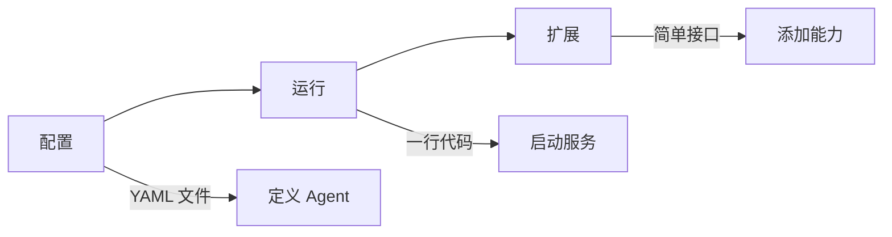

# GoReAct 使用指南

欢迎使用 GoReAct！这是一个开箱即用的多智能体编排框架，让你用最少的代码构建强大的 AI 应用。

## 为什么选择 GoReAct？

| 特性           | 说明                                 |
| -------------- | ------------------------------------ |
| **零代码启动** | 通过 YAML 配置即可运行，无需编写代码 |
| **一键扩展**   | 实现简单接口，注册即可使用           |
| **自动编排**   | 多 Agent 协作由框架自动处理          |
| **可观测性**   | 内置思考过程、执行状态、日志追踪     |

## 三步上手



### 第一步：初始化与环境配置

GoReAct 提倡**“配置优先来源于环境变量”**。

框架运行的必要前置条件是初始化依赖系统，尤其是 GraphRAG 所需的图数据库、向量数据库和文档知识库路径。这些配置通常作为环境变量提供：

```bash
export GOREACT_DB_PATH="./data"
export GOREACT_DOCUMENT_PATH="./docs" # 供 GraphRAG 自动索引永久记忆的目录
```

在代码中初始化框架运行时：

```go
package main

import (
    "github.com/DotNetAge/goreact"
)

func main() {
    // 框架会自动从环境变量读取必要的运行配置
    engine := goreact.NewEngine()
    
    // 或者通过传入配置结构体手动启动
    // engine := goreact.NewEngineWithConfig(config)
}
```

### 第二步：资源注册（由开发人员掌控）

在 GoReAct 中，Agent、Skills、Tools 和 Models 的管理被**预留给开发人员去组织**。`ResourceManager` 仅提供全局属性的持有，不强制你使用单一庞大的 `goreact.yaml`。

**推荐做法**：

1.  **Tools**：GoReAct 默认会自动注册所有内置的基础工具（如 Read, Write, Bash）。开发人员可以通过代码注册额外的自定义工具。
2.  **Skills**：通过配置文件指定一个或多个本地目录，框架会递归加载目录中的 Markdown 文件。
3.  **Agents & Models**：虽然可以直接在代码中注册，但推荐通过独立的 YAML 文件（如 `agents.yml`, `models.yml`）来解耦模型定义和业务逻辑，方便适配上层应用界面。

**示例代码**：

```go
// 注册额外的自定义工具
engine.RegisterTools(&MyTool{})

// 从独立配置文件加载模型与 Agents
engine.LoadModels("config/models.yml")
engine.LoadAgents("config/agents.yml")

// 从文件目录加载 Skills
engine.LoadSkillsFromDir("./skills")

// 启动服务
engine.Start()
```

### 第三步：扩展（可选）

需要自定义工具时，只需实现简单接口：

```go
type MyTool struct{}

func (t *MyTool) Name() string { return "my_tool" }
func (t *MyTool) Description() string { return "工具描述" }
func (t *MyTool) SecurityLevel() goreact.SecurityLevel { 
    return goreact.LevelSafe 
}
func (t *MyTool) Run(ctx context.Context, param ...any) (any, error) {
    return "结果", nil
}
```

注册即可使用：

```go
goreact.Register(&MyTool{})
```

## 指南导航

| 你想做什么     | 推荐阅读                            |
| -------------- | ----------------------------------- |
| 快速体验       | [快速开始](quick-start.md)          |
| 配置管理       | [配置指南](configuration.md)        |
| 核心交互开发   | [开发者 API](developer-api.md)      |
| 配置 Memory    | [Memory 配置](memory.md)            |
| 开发自定义工具 | [扩展：Tools](extending/tools.md)   |
| 编写工作流程   | [扩展：Skills](extending/skills.md) |
| 监控和调试     | [可观测性](observability.md)        |

## 核心概念

GoReAct 只有三个核心概念：

```
┌─────────────────────────────────────────────────┐
│                    GoReAct                       │
├─────────────────────────────────────────────────┤
│  Agent ──────► 智能体（YAML 配置）               │
│  Tool  ──────► 工具（实现接口 + 注册）           │
│  Skill ──────► 技能（Markdown 描述工作流程）     │
└─────────────────────────────────────────────────┘
```

### Agent - 智能体

Agent 是轻量级的配置单元，定义"我是谁、我用什么"：

```yaml
agents:
  - name: my-agent
    domain: code-review
    description: Agent 的能力描述
    model: gpt-4
    skills:
      - code-analysis
    prompt_template: |
      你是一个专业的代码审查助手。
    config:
      max_steps: 20
      timeout: 5m
      enable_reflection: true
      enable_planning: true
```

> **重要**：Agent 只引用 Skills，不直接引用 Tools。Tools 由 Skills 编排使用。

### Tool - 工具

Tool 是原子的执行单元，实现简单接口后注册：

```go
goreact.Register(&MyTool{})
```

### Skill - 技能

Skill 是可复用的工作流程，用 Markdown 描述，编排工具完成复杂任务：

```markdown
---
name: code-review
description: 代码审查技能
allowed-tools: read grep glob
---

# 代码审查技能

## 步骤

1. 使用 `glob` 定位目标文件
2. 使用 `read` 读取文件内容
3. 分析并生成审查报告
```

## 下一步

- [快速开始](quick-start.md) - 5 分钟上手 GoReAct
- [配置指南](configuration.md) - 了解所有配置选项
- [扩展：Tools](extending/tools.md) - 开发自定义工具
