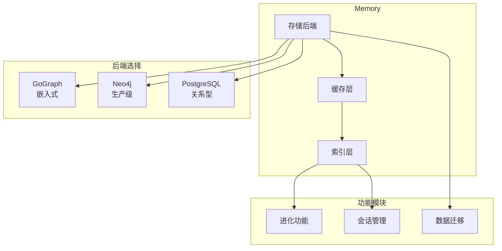
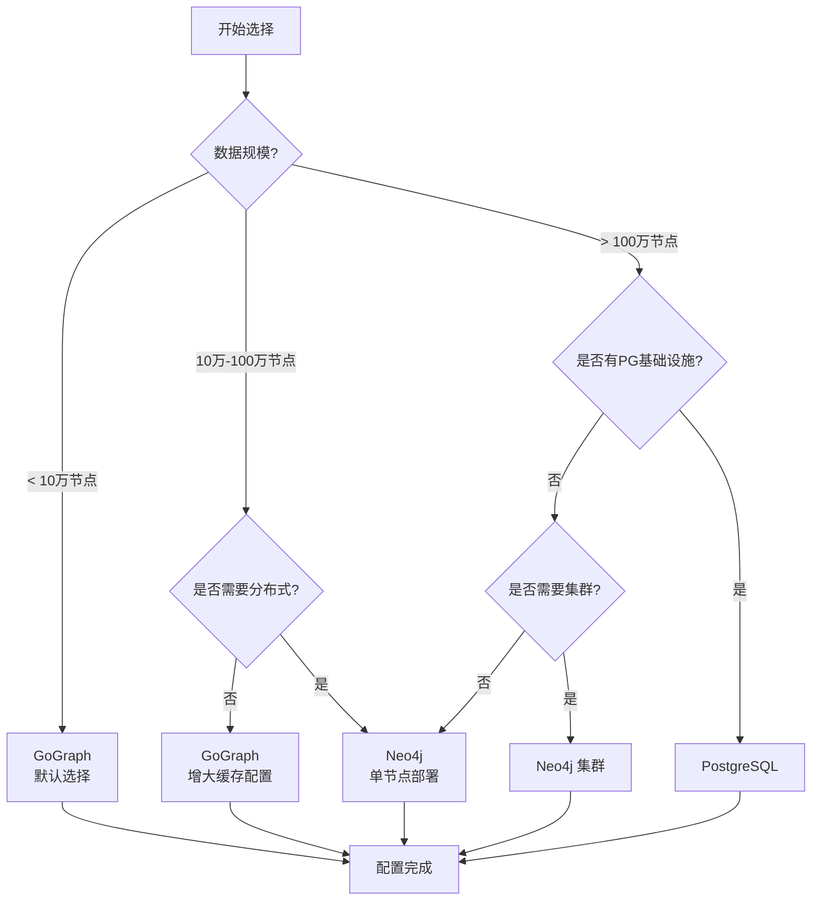
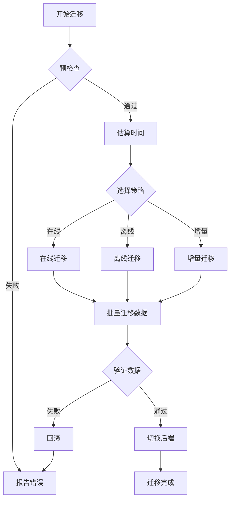
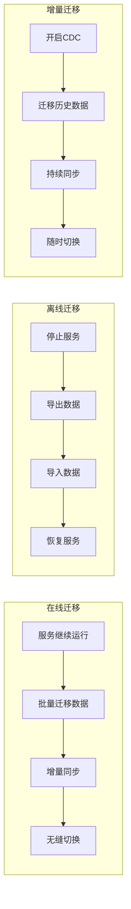
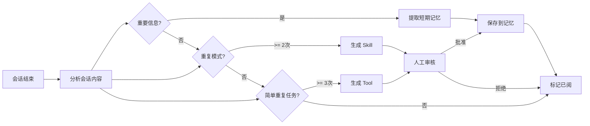
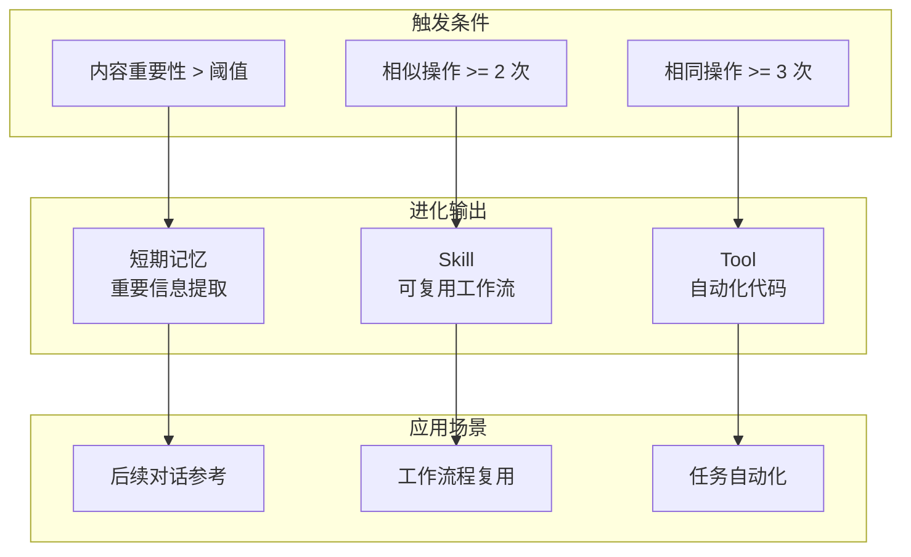
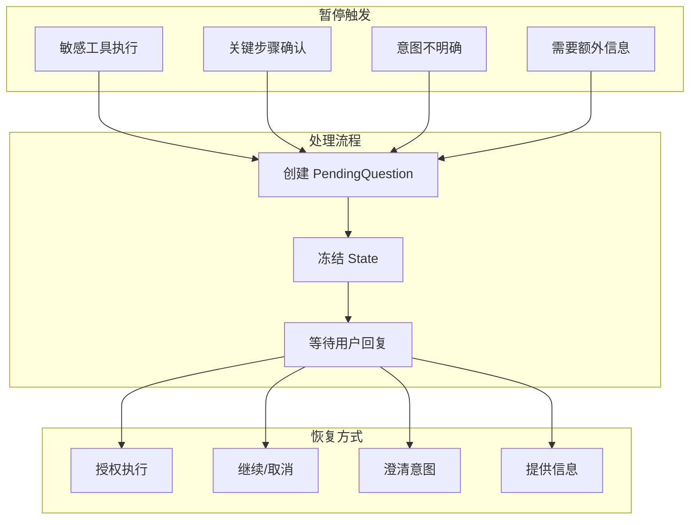

# Memory 配置指南

Memory 是 GoReAct 的核心记忆系统，负责存储和管理所有对话历史、知识图谱、会话状态等数据。本指南帮助你配置和优化 Memory 系统。

## 架构概览



## 存储后端选择

GoReAct 默认使用嵌入式 GoGraph 作为图数据库，开箱即用无需额外依赖。随着数据规模增长，可以无缝升级到更强大的存储后端。

### 后端对比

| 后端       | 适用场景             | 数据规模    | 部署复杂度 |
| ---------- | -------------------- | ----------- | ---------- |
| GoGraph    | 开发测试、中小型应用 | < 100万节点 | 零依赖     |
| Neo4j      | 大型生产环境         | > 100万节点 | 需独立部署 |
| PostgreSQL | 已有 PG 基础设施     | 中等规模    | 需独立部署 |

### 选择决策图



### 配置示例

**GoGraph（默认）**：

```yaml
memory:
  storage:
    type: gograph
    gograph:
      data_path: ./data/memory
      max_nodes: 1000000
      max_edges: 5000000
      enable_persistence: true
      sync_interval: 30s
      cache_size: 10000
```

**Neo4j**：

```yaml
memory:
  storage:
    type: neo4j
    neo4j:
      uri: bolt://localhost:7687
      username: neo4j
      password: ${NEO4J_PASSWORD}
      database: goreact
      max_connection_pool: 50
      connection_timeout: 30s
```

**PostgreSQL**：

```yaml
memory:
  storage:
    type: postgresql
    postgresql:
      host: localhost
      port: 5432
      database: goreact_memory
      username: postgres
      password: ${PG_PASSWORD}
      ssl_mode: disable
      max_connections: 20
```

## 性能调优

### 缓存配置

```yaml
memory:
  performance:
    cache:
      enable_node_cache: true
      enable_edge_cache: true
      enable_vector_cache: true
      node_cache_size: 50000
      edge_cache_size: 100000
      vector_cache_size: 10000
      cache_ttl: 1h
      eviction_policy: lru  # lru | lfu | fifo | ttl
```

### 索引配置

```yaml
memory:
  performance:
    index:
      auto_create_index: true
      index_fields:
        - name
        - type
        - created_at
      vector_index_dimension: 1536
      vector_index_metric: cosine
```

### 查询配置

```yaml
memory:
  performance:
    query:
      max_query_depth: 5
      default_limit: 100
      query_timeout: 30s
      enable_query_log: false
```

## 数据迁移

当应用数据规模增长，需要从 GoGraph 升级到 Neo4j 时，可以使用内置的迁移工具。

### 迁移策略

| 策略        | 说明                 | 停机时间 | 适用场景       |
| ----------- | -------------------- | -------- | -------------- |
| online      | 在线迁移，服务不中断 | 无       | 7x24 服务      |
| offline     | 离线迁移，需要停服   | 分钟级   | 可接受短暂停服 |
| incremental | 增量同步，可随时切换 | 无       | 大数据量迁移   |

### 迁移流程



### 三种迁移策略对比



### 迁移配置

```yaml
memory:
  migration:
    type: online
    source:
      type: gograph
      config:
        data_path: ./data/memory
    target:
      type: neo4j
      config:
        uri: bolt://neo4j:7687
        username: neo4j
        password: ${NEO4J_PASSWORD}
        database: goreact
    batch_size: 1000
    parallel_workers: 4
    validate_after_migration: true
    rollback_on_failure: true
```

### 迁移命令

```go
package main

import (
    "context"
    "github.com/goreact/goreact"
)

func main() {
    app := goreact.New("goreact.yaml")
    
    result, err := app.MigrateMemory(context.Background())
    if err != nil {
        panic(err)
    }
    
    fmt.Printf("迁移完成: %d 节点, %d 边\n", 
        result.MigratedNodes, result.MigratedEdges)
}
```

## 进化功能

进化功能让 Memory 能够从对话中自动学习和生成新资源。

### 会话结束条件

会话被认为结束的条件：

| 条件             | 说明                                       |
| ---------------- | ------------------------------------------ |
| 用户显式结束     | 用户发送 "结束"、"完成" 等指令             |
| 超时无交互       | 超过配置的空闲时间（默认 30 分钟）无新消息 |
| 任务完成确认     | Agent 返回最终结果并得到用户确认           |
| 会话被关闭       | 用户关闭会话或断开连接                     |
| 手动触发         | 调用 `EvolveSession()` 方法手动触发        |

### 进化执行模式

| 模式       | 配置值        | 说明                                       |
| ---------- | ------------- | ------------------------------------------ |
| 同步执行   | `sync`        | 会话结束后立即执行，阻塞返回               |
| 异步执行   | `async`       | 会话结束后异步执行，不阻塞返回             |
| 定时执行   | `scheduled`   | 按配置的时间间隔批量执行                   |
| 手动触发   | `manual`      | 仅在调用 `EvolveSession()` 时执行          |

**推荐配置**：生产环境使用 `async` 模式，避免影响用户体验。

### 进化失败处理

| 失败场景         | 处理策略                                   |
| ---------------- | ------------------------------------------ |
| LLM 调用失败     | 记录错误日志，标记会话为待重试             |
| 资源生成失败     | 跳过该资源，继续处理其他资源               |
| 审核超时         | 自动拒绝，保留原始会话数据                 |
| 存储失败         | 回滚事务，保留内存中的临时数据             |

> **重要**：进化失败不会影响会话的原始结果，所有进化操作都是独立的后台任务。

### 进化流程



### 进化输出类型



### 配置进化

```yaml
memory:
  evolution:
    enabled: true
    trigger: on_session_end  # on_session_end | manual | scheduled
    skill_threshold: 2       # 相似操作出现次数阈值
    tool_threshold: 3        # 生成 Tool 的阈值
    auto_approve: false      # 是否自动批准生成的资源
    document_path: ./skills  # Skill/Tool 保存路径
```

### 进化输出

进化功能会自动生成：

| 资源类型 | 触发条件          | 说明                   |
| -------- | ----------------- | ---------------------- |
| 短期记忆 | 内容重要性 > 阈值 | 提取重要信息供后续参考 |
| Skill    | 相似操作 >= 2 次  | 封装可复用的工作流程   |
| Tool     | 相同操作 >= 3 次  | 自动生成代码工具       |

### 审核生成的资源

```go
func reviewGeneratedResources() {
    app := goreact.New("goreact.yaml")
    
    pending, _ := app.ListPendingEvolution(context.Background())
    
    for _, session := range pending {
        result, _ := app.EvolveSession(context.Background(), session)
        
        if result.GeneratedSkill != nil {
            fmt.Printf("生成 Skill: %s\n", result.GeneratedSkill.Name)
            app.ReviewGeneratedSkill(ctx, result.GeneratedSkill.Name, true)
        }
        
        if result.GeneratedTool != nil {
            fmt.Printf("生成 Tool: %s\n", result.GeneratedTool.Name)
            app.ReviewGeneratedTool(ctx, result.GeneratedTool.Name, true)
        }
    }
}
```

## 暂停-恢复机制

当 Agent 需要用户输入时，会话会自动暂停并保存状态。

### 暂停-恢复流程

```mermaid
sequenceDiagram
    participant User as 用户
    participant Agent as Agent
    participant Actor as Actor
    participant Memory as Memory
    
    User->>Agent: Ask(删除 temp 目录)
    Agent->>Actor: 执行任务
    Actor->>Actor: 检测敏感操作
    
    Actor->>Memory: 冻结会话状态
    Memory-->>Actor: 返回 SessionName
    
    Actor-->>Agent: StatusPending
    Agent-->>User: 需要确认: 是否删除?
    
    User->>Agent: Resume(yes)
    Agent->>Memory: 获取冻结状态
    Memory-->>Agent: 恢复 State
    
    Agent->>Actor: 继续执行
    Actor-->>Agent: 执行完成
    Agent-->>User: 返回结果
```

### 暂停场景



### 查看暂停的任务

```go
func listSuspendedTasks() {
    app := goreact.New("goreact.yaml")
    
    tasks, _ := app.ListFrozenSessions(context.Background())
    
    for _, task := range tasks {
        fmt.Printf("任务: %s\n", task.SessionName)
        fmt.Printf("暂停原因: %s\n", task.Reason)
        fmt.Printf("待处理问题: %s\n", task.Question.Content)
    }
}
```

### 恢复任务

```go
func resumeTask(sessionName string, answer string) {
    app := goreact.New("goreact.yaml")
    
    err := app.AnswerQuestion(context.Background(), sessionName, answer)
    if err != nil {
        panic(err)
    }
    
    app.ResumeSession(context.Background(), sessionName)
}
```

### 配置过期清理

```yaml
memory:
  session:
    freeze_timeout: 24h      # 暂停会话超时时间
    auto_cleanup: true       # 自动清理过期会话
    cleanup_interval: 1h     # 清理间隔
```

## 会话管理

### 查看会话历史

```go
func viewSessionHistory(sessionName string) {
    app := goreact.New("goreact.yaml")
    
    history, _ := app.GetSessionHistory(context.Background(), sessionName)
    
    for _, item := range history.Items {
        fmt.Printf("[%s] %s: %s\n", 
            item.Timestamp, item.Role, item.Content)
    }
}
```

### 删除会话

```go
func deleteSession(sessionName string) {
    app := goreact.New("goreact.yaml")
    app.DeleteSession(context.Background(), sessionName)
}
```

## 短期记忆

短期记忆用于存储当前会话中的重要信息。

### 配置

```yaml
memory:
  short_term:
    enabled: true
    max_items: 100
    auto_extract: true
    importance_threshold: 0.7
```

### 手动添加

```go
func addShortTermMemory(sessionName string) {
    app := goreact.New("goreact.yaml")
    
    item := &goreact.MemoryItem{
        Type:        goreact.MemoryFact,
        Content:     "用户偏好使用中文交流",
        Importance:  0.8,
        Source:      "user_input",
    }
    
    app.AddShortTermMemoryItem(context.Background(), sessionName, item)
}
```

## 完整配置示例

```yaml
memory:
  storage:
    type: gograph
    gograph:
      data_path: ./data/memory
      max_nodes: 1000000
      max_edges: 5000000
      enable_persistence: true
      sync_interval: 30s
      cache_size: 10000
  
  performance:
    cache:
      enable_node_cache: true
      node_cache_size: 50000
      eviction_policy: lru
    query:
      max_query_depth: 5
      query_timeout: 30s
  
  evolution:
    enabled: true
    trigger: on_session_end
    skill_threshold: 2
    tool_threshold: 3
    auto_approve: false
    document_path: ./skills
  
  session:
    freeze_timeout: 24h
    auto_cleanup: true
    cleanup_interval: 1h
  
  short_term:
    enabled: true
    max_items: 100
    auto_extract: true
```

## 常见场景

### 场景一：开发测试

使用默认 GoGraph，无需额外配置：

```yaml
memory:
  storage:
    type: gograph
```

### 场景二：生产部署

使用 Neo4j 并启用性能优化：

```yaml
memory:
  storage:
    type: neo4j
    neo4j:
      uri: ${NEO4J_URI}
      username: neo4j
      password: ${NEO4J_PASSWORD}
      database: goreact
      max_connection_pool: 50
  
  performance:
    cache:
      enable_node_cache: true
      node_cache_size: 100000
    query:
      max_query_depth: 10
```

### 场景三：长期运行的 Agent

启用进化和自动清理：

```yaml
memory:
  evolution:
    enabled: true
    trigger: on_session_end
    auto_approve: false
  
  session:
    freeze_timeout: 72h
    auto_cleanup: true
  
  short_term:
    enabled: true
    max_items: 200
```

## 下一步

- [配置指南](configuration.md) - 完整配置选项
- [可观测性](observability.md) - 监控 Memory 状态
- [扩展：Skills](extending/skills.md) - 进化生成的 Skills
